# 6. Casos de prueba y pruebas de unidad

## DisciplineService.GetDisciplinesAsync

### Código

```csharp
public async Task<IEnumerable<DisciplineModel>> GetDisciplinesAsync()
{
    var disciplineEntityList = await _athleteRepository.GetDisciplinesAsync();
    var disciplines = _mapper.Map<IList<DisciplineModel>>(disciplineEntityList);
    return disciplines;
}
```

### Grafo

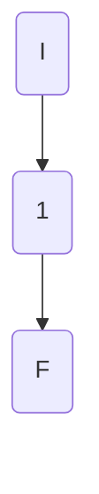

### Complejidad ciclo matica

Numero de regiones
$$
v(G) = R \\
v(G) = 1
$$

Numero de nodos y aristas
$$
v(G) = E - N + 2 \\
v(G) = 2 - 3 + 2
$$
  
Numero de decisiones
$$
v(G) = P + 1 \\
v(G) = 0 + 1
$$

### Casos de prueba

| | Camino   | Entrada   | TC | Salida  |
| --- | --- | --- | --- | --- |
| 1 | I-1-F | `athleteRepositoryMock.GetDisciplinesAsync()` return `Ilist<DisciplineEntity>(){new DisciplineEntity(){ Id = 1,Name = "100M"}, new DisciplineEntity(){Id = 2,Name = "200M"}}` | --- | `IList<DisciplineModel>(){new DisciplineModel(){ Id = 1,Name = "100M"}`, `new DisciplineModel(){Id = 2,Name = "200M"}}` |

TC1: Verificar que al recuperar las disciplinas de la bd `Ilist<DisciplineEntity>(){new DisciplineEntity(){ Id = 1,Name = "100M"}, new DisciplineEntity(){Id = 2,Name = "200M"}}` se recuperen correctamente (`IList<DisciplineModel>(){new DisciplineModel(){ Id = 1,Name = "100M"}, new DisciplineModel(){Id = 2,Name = "200M"}}`)

Camino 1

### Pruebas unitarias

```csharp
[Fact]
public async Task GetDisciplinesAsync_ReturnsListOfDisciplines()
{
	var config = new MapperConfiguration(cfg => cfg.AddProfile<AutomapperProfile>());
	var mapper = config.CreateMapper();
	var disciplineEntity100M = new DisciplineEntity()
	{
		Id = 1,
		Name = "100M"              
	};
	var disciplineEntity200M = new DisciplineEntity()
	{
		Id = 2,
		Name = "200M"               
	};
	var disciplinesEnumerable = new List<DisciplineEntity>() { disciplineEntity100M, disciplineEntity200M } as IEnumerable<DisciplineEntity>;
	var repositoryMock = new Mock<IAthleteRepository>();
	repositoryMock.Setup(r => r.GetDisciplinesAsync()).ReturnsAsync(disciplinesEnumerable);

	var disciplinesService = new DisciplineService(repositoryMock.Object, mapper);
	var disciplinesList = await disciplinesService.GetDisciplinesAsync();
	Assert.NotNull(disciplinesList);
	Assert.NotEmpty(disciplinesList);
	Assert.Equal(2,disciplinesList.Count());
	Assert.Equal("100M", disciplinesList.First().Name);
	Assert.Equal("200M", disciplinesList.Last().Name);
}
```

## DisciplineService.GetDisciplineAsync

### Código

```csharp
public async Task<DisciplineModel> GetDisciplineAsync(int disciplineId, bool showAthletes = false)
{
	var disciplineEntity = await _athleteRepository.GetDisciplineAsync(disciplineId,showAthletes); //1
	
	if (disciplineEntity == null) //2
		throw new NotFoundElementException($"discipline with id {disciplineId} does not exist"); //3
	return _mapper.Map<DisciplineModel>(disciplineEntity); //4
}
```

### Grafo

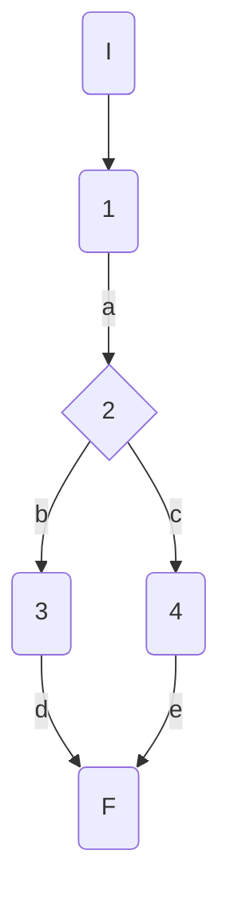

### Complejidad ciclo matica

Numero de regiones
$$
v(G) = R \\
v(G) = 2
$$

Numero de nodos y aristas
$$
v(G) = E - N + 2 \\
v(G) = 6 - 6 + 2
$$
  
Numero de decisiones
$$
v(G) = P + 1 \\
v(G) = 1 + 1
$$

### Casos de prueba


| | Camino   | Entrada   | TC | Salida  |
| --- | --- | --- | --- | --- |
| 1 | I-1a-2b-3d-F | `disciplineId` invalid  = 100| RepositoryMock returns null -> disciplineEntity = null | throw NotFoundElementException("discipline with id 100 does not exist") |
| 2 | I-1a-2c-4e-F | `disciplineId` valid  = 1|  RepositoryMock returns disicplineEntity -> disciplineEntity = {id=1, Name=100M} | return DisciplineModel({id=1, Name=100M}) |

TC1: Verificar que si se intenta recuperar datos de una disciplina con un id inválido 100 (inexistente en la bd) se devuelva la excepción NotFoundElementException con el mensaje "discipline with id 100 does not exist"

TC2: Verificar que si se intenta recuperar datos de una disciplina con un id válido 1, se devuelva la disciplina con los datos correspondientes al id 1: DisciplineModel({id=1, Name=100M})

Camino 1
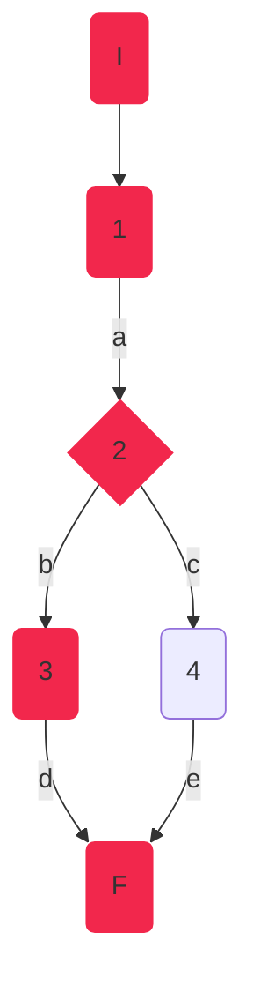
Camino 2
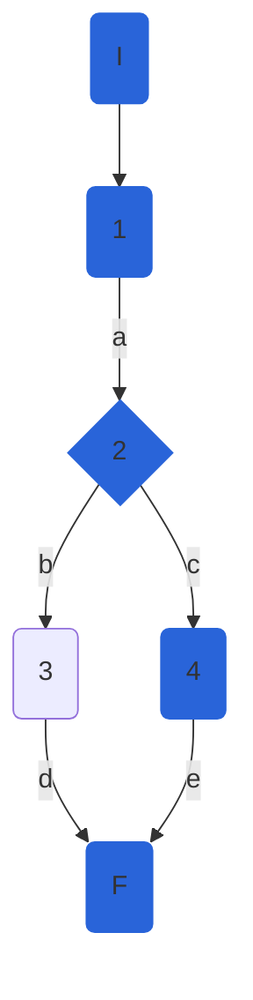
### Pruebas unitarias

```csharp
 //tc1
[Fact]
public void GetDisciplineAsync_InvalidId_ThrowsNotFoundElementException()
{
	var config = new MapperConfiguration(cfg => cfg.AddProfile<AutomapperProfile>());
	var mapper = config.CreateMapper();
	var repositoryMock = new Mock<IAthleteRepository>();
	repositoryMock.Setup(r => r.GetDisciplineAsync(100, false)).ReturnsAsync((DisciplineEntity)null);
	var disciplinesService = new DisciplineService(repositoryMock.Object, mapper);

	var exception = Assert.ThrowsAsync<NotFoundElementException>(async () => await disciplinesService.GetDisciplineAsync(100));
	Assert.Equal("discipline with id 100 does not exist", exception.Result.Message);

}
//tc2
[Fact]
public async Task GetDisciplineAsync_ValidId_ReturnsDisciplineCorrespondingToId()
{
	var config = new MapperConfiguration(cfg => cfg.AddProfile<AutomapperProfile>());
	var mapper = config.CreateMapper();
	var disciplineEntity100M = new DisciplineEntity()
	{
		Id = 1,
		Name = "100M"
	};           
	var repositoryMock = new Mock<IAthleteRepository>();
	repositoryMock.Setup(r => r.GetDisciplineAsync(1, false)).ReturnsAsync(disciplineEntity100M);
	var disciplinesService = new DisciplineService(repositoryMock.Object, mapper);
	var disciplineFromDB = await disciplinesService.GetDisciplineAsync(1);

	Assert.NotNull(disciplineFromDB);
	Assert.IsType<DisciplineModel>(disciplineFromDB);
	Assert.True(1 == disciplineFromDB.Id);
	Assert.True("100M" == disciplineFromDB.Name);
	Assert.Empty(disciplineFromDB.Athletes);
	Assert.Null(disciplineFromDB.Rules);
	Assert.Null(disciplineFromDB.CreationDate);
	Assert.Null(disciplineFromDB.FemaleWorldRecord);
	Assert.Null(disciplineFromDB.MaleWorldRecord);
}
```

## DisciplineService.DeleteDisciplineAsync

### Código Original

```csharp
public async Task DeleteDisciplineAsync(int disciplineId)
{
   await GetDisciplineAsync(disciplineId); //1
   await _athleteRepository.DeleteDisciplineAsync(disciplineId); //1
   var result = await _athleteRepository.SaveChangesAsync(); //1
	if (!result) //2
	{
		throw new Exception("Database Error"); //3
	}           
}
```
Se notó que el código original no devolvía nada. Era de tipo void, por lo tanto se refactorizó el código para poder probarlo correctamente:
#### Código Refactorizado:

```csharp
// SERVICIO
public async Task<bool> DeleteDisciplineAsync(int disciplineId)
{
	bool deleted = false;
	await GetDisciplineAsync(disciplineId);
	deleted = await _athleteRepository.DeleteDisciplineAsync(disciplineId);
	var result = await _athleteRepository.SaveChangesAsync();
	if (!result)
	{
		throw new Exception("Database Error");
	}
	return deleted;
	
}
```
### Grafo

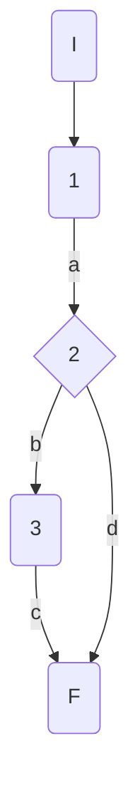

### Complejidad ciclo matica

Numero de regiones
$$
v(G) = R \\
v(G) = 2
$$

Numero de nodos y aristas
$$
v(G) = E - N + 2 \\
v(G) = 5 - 5 + 2
$$
  
Numero de decisiones
$$
v(G) = P + 1 \\
v(G) = 1 + 1
$$

### Casos de prueba


| | Camino   | Entrada   | TC | Salida  |
| --- | --- | --- | --- | --- |
| 1 | I-1a-2b-3c-F | `disciplineId` valid  = 1 | RepositoryMock.SaveChangesAsync returns false -> result=false  | throws exception("Database error") |
| 2 | I-1a-2d-F | `disciplineId` valid  = 1|  RepositoryMock returns true -> result = true | return  true|

TC1: Verificar que si ocurre un error en base de datos al eliminar una disciplina, se lance la excepción con mensaje "Database error"

TC2: Verificar que al eliminar una disciplina correctamente, se devuelva true como resultado

Camino 1
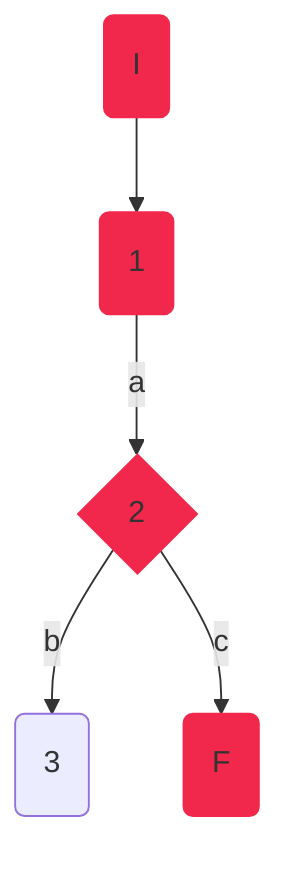
Camino 2
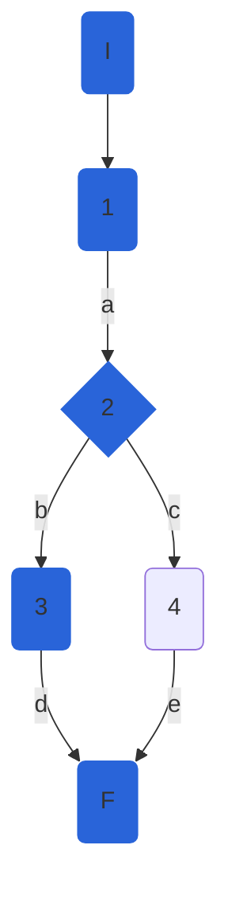
### Pruebas unitarias

```csharp
//tc1
[Fact]
public void DeleteDisciplineAsync_ValidId_ReuturnsDBException()
{
	var config = new MapperConfiguration(cfg => cfg.AddProfile<AutomapperProfile>());
	var mapper = config.CreateMapper();
	var disciplineEntity100M = new DisciplineEntity()
	{
		Id = 100,
		Name = "100M"
	};
	var repositoryMock = new Mock<IAthleteRepository>();
	
	repositoryMock.Setup(r => r.DeleteDisciplineAsync(100));
	repositoryMock.Setup(r => r.SaveChangesAsync()).ReturnsAsync(false);
	repositoryMock.Setup(r => r.GetDisciplineAsync(100, false)).ReturnsAsync(disciplineEntity100M);
	var disciplinesService = new DisciplineService(repositoryMock.Object, mapper);            

	var exception = Assert.ThrowsAsync<Exception>(async () => await disciplinesService.DeleteDisciplineAsync(100));
	Assert.Equal("Database Error", exception.Result.Message);
}
//tc2
[Fact]
public async Task DeleteDisciplineAsync_ValidId_DeletesDisicpline()
{
	var config = new MapperConfiguration(cfg => cfg.AddProfile<AutomapperProfile>());
	var mapper = config.CreateMapper();
	var disciplineEntity100M = new DisciplineEntity()
	{
		Id = 1,
		Name = "100M"
	};
	var repositoryMock = new Mock<IAthleteRepository>();
	repositoryMock.Setup(r => r.DeleteDisciplineAsync(1)).ReturnsAsync(true);
	repositoryMock.Setup(r => r.SaveChangesAsync()).ReturnsAsync(true);
	repositoryMock.Setup(r => r.GetDisciplineAsync(1, false)).ReturnsAsync(disciplineEntity100M);
	var disciplinesService = new DisciplineService(repositoryMock.Object, mapper);
	var result = await disciplinesService.DeleteDisciplineAsync(1);      
	Assert.True(result);
}
```

## DisciplineService.CreateDisciplineAsync

### Código

```csharp
public async Task<DisciplineModel> CreateDisciplineAsync(DisciplineModel discipline)
{
	var disciplineEntity = _mapper.Map<DisciplineEntity> //1(discipline);
	_athleteRepository.CreateDiscipline(disciplineEntity); //1
	var result = await _athleteRepository.SaveChangesAsync(); //1
	if (result) //2
	{
	   return  _mapper.Map<DisciplineModel>(disciplineEntity); //3
	}
	throw new Exception("Database Error"); //4
}
```

### Grafo


### Complejidad ciclo matica

Numero de regiones
$$
v(G) = R \\
v(G) = 2
$$

Numero de nodos y aristas
$$
v(G) = E - N + 2 \\
v(G) = 5 - 5 + 2
$$
  
Numero de decisiones
$$
v(G) = P + 1 \\
v(G) = 1 + 1
$$

### Casos de prueba


| | Camino   | Entrada   | TC | Salida  |
| --- | --- | --- | --- | --- |
| 1 | I-1a-2b-3c-F | `discipline` new DisciplineModel() { Name = "Long Jump"}; | RepositoryMock.SaveChangesAsync returns false -> result=false  | throws exception("Database error") |
| 2 | I-1a-2d-F | `discipline` new DisciplineModel() { Name = "Long Jump"};|  RepositoryMock returns true -> result = true | return  DisciplineModel() { Id=0, Name = "Long Jump"};|

TC1: verificar que si hay error de base de datos al crear una disciplina, se lance una excepción con el mensaje "Database error".

TC2: verificar que se cree una disciplina con {Name="Long Jump"}, se cree correctamente y se agregue un id : { Id=0, Name = "Long Jump"}

Camino 1

Camino 2

### Pruebas unitarias

```csharp
//tc1
[Fact]
public void CreateDisciplineAsync_ValidId_ReuturnsDBException()
{
	var config = new MapperConfiguration(cfg => cfg.AddProfile<AutomapperProfile>());
	var mapper = config.CreateMapper();
	var longJumpDisciplineEntity = new DisciplineEntity()
	{
		Name = "Long Jump"
	};
	var longJumpDisciplineModel = new DisciplineModel()
	{
		
		Name = "Long Jump"
	};
	var repositoryMock = new Mock<IAthleteRepository>();           
	repositoryMock.Setup(r => r.SaveChangesAsync()).ReturnsAsync(false);
	repositoryMock.Setup(r => r.CreateDiscipline(longJumpDisciplineEntity));
	var disciplinesService = new DisciplineService(repositoryMock.Object, mapper);

	var exception = Assert.ThrowsAsync<Exception>(async () => await disciplinesService.CreateDisciplineAsync(longJumpDisciplineModel));
	Assert.Equal("Database Error", exception.Result.Message);
}
//tc2
[Fact]
public async Task CreateDisciplineAsync_ValidId_CreatesDiscipline()
{
	var config = new MapperConfiguration(cfg => cfg.AddProfile<AutomapperProfile>());
	var mapper = config.CreateMapper();
	var longJumpDisciplineEntity = new DisciplineEntity()
	{
		Id = 0,
		Name = "Long Jump"
	};
	var longJumpDisciplineModel = new DisciplineModel()
	{
		Name = "Long Jump"
	};
	var repositoryMock = new Mock<IAthleteRepository>();
	repositoryMock.Setup(r => r.SaveChangesAsync()).ReturnsAsync(true);
	repositoryMock.Setup(r => r.CreateDiscipline(longJumpDisciplineEntity));
	var disciplinesService = new DisciplineService(repositoryMock.Object, mapper);
	var disciplineCreated = await disciplinesService.CreateDisciplineAsync(longJumpDisciplineModel);
	Assert.NotNull(disciplineCreated);
	Assert.Equal("Long Jump", disciplineCreated.Name);
	Assert.Equal(0, disciplineCreated.Id);
	Assert.Empty(disciplineCreated.Athletes);
	Assert.Null(disciplineCreated.Rules);
	Assert.Null(disciplineCreated.CreationDate);
	Assert.Null(disciplineCreated.FemaleWorldRecord);
	Assert.Null(disciplineCreated.MaleWorldRecord);
	
}
```

## DisciplineService.CheckPersonalBest
### Código

```csharp
public bool CheckPersonalBest(AthleteModel athlete, Decimal mark, string discipline)
    {
        Console.WriteLine(_markComparer);
        var f = _markComparer[discipline];
        bool personalBest = f(athlete.PersonalBest, mark);//1
        if (personalBest)//2
        {
            athlete.PersonalBest = mark;//3
        }
        return personalBest;//4
    }
  
```

### Grafo

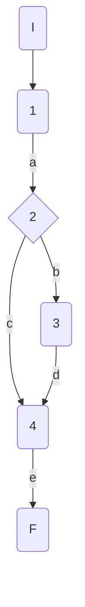

### Complejidad ciclo matica

Numero de regiones
$$
v(G) = R \\
v(G) = 2
$$

Numero de nodos y aristas
$$
v(G) = E - N + 2 \\
v(G) = 6 - 6 + 2
$$
  
Numero de decisiones
$$
v(G) = P + 1 \\
v(G) = 1 + 1
$$

### Casos de prueba

athlete, mark, discipline

| | Camino   | Entrada   | TC | Salida  |
| --- | --- | --- | --- | --- |
| 1 | I-1a-2c-4e-F | `athlete`= {Id=1,Nationality="USA", Name="Sydney Maclaughlin", Gender="f", Points=1000, PB=52.75m} `mark`=53.05m `discipline`="400MH"| personalBest = false| false|
| 2 | I-1a-2b-3d-4e-F | `athlete`={Id=1,Nationality="USA", Name="Sydney Maclaughlin", Gender="f", Points=1000, PB=52.75m}`mark`=51.79m `discipline`="400MH"| personalBest = true| true|

TC1: Verificar que si la atleta {Id=1,Nationality="USA", Name="Sydney Maclaughlin", Gender="f", Points=1000, PB=52.75m} tiene una marca = 53.05, sin superar su marca personal, devuelva false

TC2: Verificar que si la atleta {Id=1,Nationality="USA", Name="Sydney Maclaughlin", Gender="f", Points=1000, PB=52.75m} tiene una marca = 51.79, superando su mejor marca personal, devuelva true

Camino 1
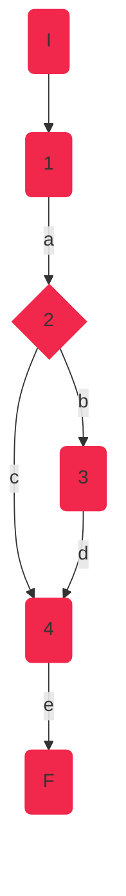
Camino 2
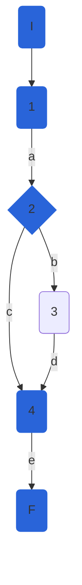

### Pruebas unitarias

```csharp
//tc1
[Fact]
public void CheckPersonalBest_NoPersonalBest()
{
	var config = new MapperConfiguration(cfg => cfg.AddProfile<AutomapperProfile>());
	var mapper = config.CreateMapper();
	var sydney = new AthleteModel()
	{
		Id=1,Nationality="USA", Name="Sydney Maclaughlin", Gender=Gender.F, Points=1000, PersonalBest=52.75m
	};
	var mark = 53.05m;
	string discipline = "400MH";
	var repositoryMock = new Mock<IAthleteRepository>();
	var disciplinesService = new DisciplineService(repositoryMock.Object, mapper);

	var result = disciplinesService.CheckPersonalBest(sydney,mark, discipline);
	Assert.False(result);            
}

//tc2
[Fact]
public void CheckPersonalBest_PersonalBest()
{
	var config = new MapperConfiguration(cfg => cfg.AddProfile<AutomapperProfile>());
	var mapper = config.CreateMapper();
	var sydney = new AthleteModel()
	{
		Id = 1,
		Nationality = "USA",
		Name = "Sydney Maclaughlin",
		Gender = Gender.F,
		Points = 1000,
		PersonalBest = 52.75m
	};
	var mark = 51.79m;
	string discipline = "400MH";
	var repositoryMock = new Mock<IAthleteRepository>();
	var disciplinesService = new DisciplineService(repositoryMock.Object, mapper);

	var result = disciplinesService.CheckPersonalBest(sydney, mark, discipline);
	Assert.True(result);
}
```

## DisciplineService.Mark

### Código

```csharp
public Decimal Mark(AthleteModel athlete)
{
	Decimal mark;//1
	if (athlete.SeasonBest != null)//2
	{
		mark = GetRandomMark(athlete.SeasonBest - 0.2m, athlete.SeasonBest + 0.2m);//3
	}
	else
	{
		mark = GetRandomMark(athlete.PersonalBest - 0.2m, athlete.PersonalBest + 0.5m);//4
	}
	return mark;//5
}
```

### Grafo

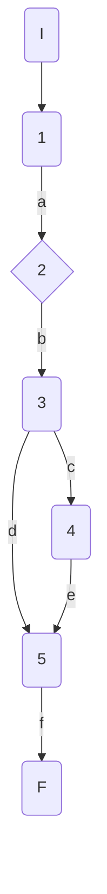

### Complejidad ciclo matica

Numero de regiones
$$
v(G) = R \\
v(G) = 2
$$

Numero de nodos y aristas
$$
v(G) = E - N + 2 \\
v(G) = 7 - 7 + 2
$$
  
Numero de decisiones
$$
v(G) = P + 1 \\
v(G) = 1 + 1
$$

### Casos de prueba

| | Camino   | Entrada   | TC | Salida  |
| --- | --- | --- | --- | --- |
| 1 | I-1a-2b-3h-4d-5f-6g-F | `athlete`={Id=1,Nationality="USA", Name="Sydney Maclaughlin", Gender="f", Points=1000, PersonalBest=52.75m, SeasonBest=52.75m} | athlete.SeasonBest!=null = false| {52.55-52.95}|
| 2 | I-1a-2c-4d-5f-6g-F | `athlete`={Id=1,Nationality="USA", Name="Sydney Maclaughlin", Gender="f", Points=1000, PersonalBest=52.75m, SeasonBest=null} | athlete.SeasonBest!=null -> true | {52.55-53.25}|

TC1: Verificar que si la atleta {Id=1,Nationality="USA", Name="Sydney Maclaughlin", Gender="f", Points=1000, PersonalBest=52.75m, SeasonBest=52.75m}, contiene marca de temporada, la marca devuelta esté en el rango 52.55-52.95

TC2: Verificar que si la atleta {Id=1,Nationality="USA", Name="Sydney Maclaughlin", Gender="f", Points=1000, PersonalBest=52.75m, SeasonBest=null}, NO TIENE marca de temporada, la marca devuelta esté en el rango 52.55-53.25

Camino 1
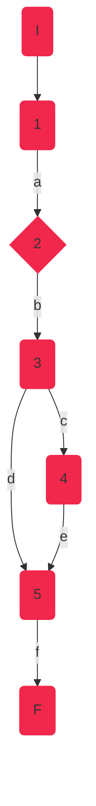
Camino 2
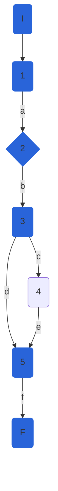
### Pruebas unitarias

```csharp
//tc1
[Fact]
public void Mark_ReturnsAthleteMark_SeasonBestIncluded()
{
	var config = new MapperConfiguration(cfg => cfg.AddProfile<AutomapperProfile>());
	var mapper = config.CreateMapper();
	var sydney = new AthleteModel()
	{
		Id = 1,
		Nationality = "USA",
		Name = "Sydney Maclaughlin",
		Gender = Gender.F,
		Points = 1000,
		PersonalBest = 52.75m,
		SeasonBest = 52.75m
	};
	var repositoryMock = new Mock<IAthleteRepository>();
	var disciplinesService = new DisciplineService(repositoryMock.Object, mapper);

	var result = disciplinesService.Mark(sydney);
	Assert.InRange(result, 52.55m, 52.94m);// Random.Next(inclusivo, exclusivo) - InRange(inclusivo, inclusivo)
}

//tc2
[Fact]
public void Mark_ReturnsAthleteMark_NoSeasonBest()
{
	var config = new MapperConfiguration(cfg => cfg.AddProfile<AutomapperProfile>());
	var mapper = config.CreateMapper();
	var sydney = new AthleteModel()
	{
		Id = 1,
		Nationality = "USA",
		Name = "Sydney Maclaughlin",
		Gender = Gender.F,
		Points = 1000,
		PersonalBest = 52.75m,
		SeasonBest = null
	};
	var repositoryMock = new Mock<IAthleteRepository>();
	var disciplinesService = new DisciplineService(repositoryMock.Object, mapper);

	var result = disciplinesService.Mark(sydney);
	Assert.InRange(result, 52.55m, 53.24m);
}
```

## DisciplineService.CheckSeasonBest

### Código

```csharp
public bool CheckSeasonBest(AthleteModel athlete, Decimal mark, string discipline)
{
	bool seasonBest = _markComparer[discipline](athlete.SeasonBest, mark);//1
	if (athlete.SeasonBest == null)//2
	{
		seasonBest = true;//3
	}
	if (seasonBest)//4
	{
		athlete.SeasonBest = mark;//5
	}
	return seasonBest;//6
}
  
```

### Grafo

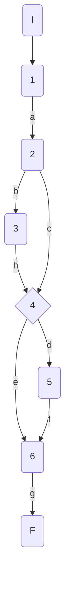

### Complejidad ciclo matica

Numero de regiones
$$
v(G) = R \\
v(G) = 3
$$

Numero de nodos y aristas
$$
v(G) = E - N + 2 \\
v(G) = 9 - 8 + 2
$$
  
Numero de decisiones
$$
v(G) = P + 1 \\
v(G) = 2 + 1
$$

### Casos de prueba

athlete, mark, discipline

| | Camino   | Entrada   | TC | Salida  |
| --- | --- | --- | --- | --- |
| 1 | I-1a-2b-3h-4d-5f-6g-F | `athlete`={Id=1,Nationality='USA', Name='Sydney Maclaughlin', Gender='f', Points=1000, PersonalBest=52.75, SeasonBest=null}`mark`=51.79 `discipline`='400MH'| athlete.SeasonBest=null -> seasonBest = true| true |
| 2 | I-1a-2c-4d-5f-6g-F | `athlete`={Id=1,Nationality='USA', Name='Sydney Maclaughlin', Gender='f', Points=1000, PersonalBest=52.75, SeasonBest=52}`mark`=51.79 `discipline`='400MH'| athlete.SeasonBest!=null -> seasonBet = true| true |
| 3 | I-1a-2c-4e-6g-F | `athlete`={Id=1,Nationality='USA', Name='Sydney Maclaughlin', Gender='f', Points=1000, PersonalBest=52.75, SeasonBest=52}`mark`=52.79 `discipline`='400MH'| athlete.SeasonBest!=null -> seasonBet = false| false |

TC1: Verificar que si la atleta {Id=1,Nationality='USA', Name='Sydney Maclaughlin', Gender='f', Points=1000, PersonalBest=52.75, SeasonBest=null}, inicialmente sin mejor marca de temporada, realiza una marca de 51.79 en la disciplina 400MH, devuelva true

TC2: Verificar que si la atleta {Id=1,Nationality='USA', Name='Sydney Maclaughlin', Gender='f', Points=1000, PersonalBest=52.75, SeasonBest=52}, con mejor marca de temporada 52, realiza una marca de 51.79 en la disciplina 400MH, mejor a su mejor marca de temporada previa, devuelva true

TC3: Verificar que si la atleta {Id=1,Nationality='USA', Name='Sydney Maclaughlin', Gender='f', Points=1000, PersonalBest=52.75, SeasonBest=52}, con mejor marca de temporada 52, realiza una marca de 52.79 en la disciplina 400MH, peor a su mejor marca de temporada previa, devuelva false

Camino 1
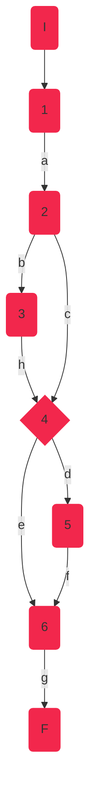
Camino 2
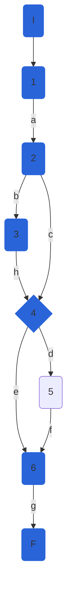
Camino 3
```mermaid
graph TD
    I(I):::c3 --> 1(1):::c3
    1 --a--> 2(2):::c3
    2 --b--> 3(3):::c3
    3 --h--> 4{4}:::c3
    2 --c--> 4{4}:::c3     
    4 --d--> 5(5):::c3
    4 --e--> 6(6) 
    5 --f--> 6(6):::c3
    6 --g--> F(F):::c3
classDef c3 fill:#B2A2FA, stroke:#B2A2FA;
```
### Pruebas unitarias

```csharp
//tc1
[Fact]
public void CheckSesasonBest_SeasonBestNull_ReturnsTrue()
{
	var config = new MapperConfiguration(cfg => cfg.AddProfile<AutomapperProfile>());
	var mapper = config.CreateMapper();
	var sydney = new AthleteModel()
	{
		Id = 1,
		Nationality = "USA",
		Name = "Sydney Maclaughlin",
		Gender = Gender.F,
		Points = 1000,
		PersonalBest = 52.75m,
		SeasonBest = null
	};
	var disciplineName = "400MH";
	var mark = 51.76m;
	var repositoryMock = new Mock<IAthleteRepository>();
	var disciplinesService = new DisciplineService(repositoryMock.Object, mapper);

	var result = disciplinesService.CheckSeasonBest(sydney,mark,disciplineName);
	Assert.True(result);
}
//tc2
[Fact]
public void CheckSesasonBest_SeasonBestImproved_ReturnsTrue()
{
	var config = new MapperConfiguration(cfg => cfg.AddProfile<AutomapperProfile>());
	var mapper = config.CreateMapper();
	var sydney = new AthleteModel()
	{
		Id = 1,
		Nationality = "USA",
		Name = "Sydney Maclaughlin",
		Gender = Gender.F,
		Points = 1000,
		PersonalBest = 52m,
		SeasonBest = 51.79m
	};
	var disciplineName = "400MH";
	var mark = 51.76m;
	var repositoryMock = new Mock<IAthleteRepository>();
	var disciplinesService = new DisciplineService(repositoryMock.Object, mapper);

	var result = disciplinesService.CheckSeasonBest(sydney, mark, disciplineName);
	Assert.True(result);
}

//tc3
[Fact]
public void CheckSesasonBest_SeasonBestNotImproved_ReturnsFalse()
{
	var config = new MapperConfiguration(cfg => cfg.AddProfile<AutomapperProfile>());
	var mapper = config.CreateMapper();
	var sydney = new AthleteModel()
	{
		Id = 1,
		Nationality = "USA",
		Name = "Sydney Maclaughlin",
		Gender = Gender.F,
		Points = 1000,
		PersonalBest = 52.75m,
		SeasonBest = 52m
	};
	var disciplineName = "400MH";
	var mark = 52.79m;
	var repositoryMock = new Mock<IAthleteRepository>();
	var disciplinesService = new DisciplineService(repositoryMock.Object, mapper);

	var result = disciplinesService.CheckSeasonBest(sydney, mark, disciplineName);
	Assert.False(result);
}
```

## DisciplineService.UpdateWorldRecord

### Código incial

```csharp
 async Task updateWorldRecord(int disciplineId,decimal worldRecord, string gender)
{
	if (gender.ToLower() == "f")//1
	{
		await _athleteRepository.UpdateDisciplineAsync(disciplineId, new DisciplineEntity()
		{
			FemaleWorldRecord = worldRecord
		});//2
	}
	else
	{
		await _athleteRepository.UpdateDisciplineAsync(disciplineId, new DisciplineEntity()
		{
			MaleWorldRecord = worldRecord
		});//3
	}
}
```
### NOTA: 
Este método no devolvía ningún valor, por lo tanto, para poder probarlo y garantizar que funcione correctamente, se convirtió este método a bool. Para poder realizar este cambio, se realizó el cambio correspondiente en el repositorio, ya que el resultado dependía del mismo y este también era de tipo void. Los cambios realizados se muestran a continuación:

### REPOSITORIO:
```csharp
public async Task<bool> UpdateDisciplineAsync(int disciplineId, DisciplineEntity discipline)
{
	//_dbContext.Entry(discipline).State = EntityState.Modified;
	bool updated = true;
	var disciplineToUpdate = await _dbContext.Disciplines.FirstOrDefaultAsync(d => d.Id == disciplineId);
	if (disciplineToUpdate == null) updated = false;
	
	disciplineToUpdate.Name = discipline.Name ?? disciplineToUpdate.Name;
	disciplineToUpdate.Rules = discipline.Rules ?? disciplineToUpdate.Rules;
	disciplineToUpdate.CreationDate = discipline.CreationDate ?? disciplineToUpdate.CreationDate;
	disciplineToUpdate.FemaleWorldRecord = discipline.FemaleWorldRecord ?? disciplineToUpdate.FemaleWorldRecord;
	disciplineToUpdate.MaleWorldRecord = discipline.MaleWorldRecord ?? disciplineToUpdate.MaleWorldRecord;
	 
	return updated;
   
}
    
```

### SERVICIO (MÉTODO CORREGIDO):
```csharp
async Task<bool> updateWorldRecord(int disciplineId,decimal worldRecord, string gender)
{
	bool updated = false;
	if (gender.ToLower() == "f")
	{
		updated = await _athleteRepository.UpdateDisciplineAsync(disciplineId, new DisciplineEntity()
		{
			FemaleWorldRecord = worldRecord
		});

	}
	else
	{
		updated = await _athleteRepository.UpdateDisciplineAsync(disciplineId, new DisciplineEntity()
		{
			MaleWorldRecord = worldRecord
		});
	}
	return updated;

}
    
```

### Grafo

```mermaid
graph TD
    I(I) --> 1(1)
    1 --a--> 2{2}
    2 --b--> F(F)
    2 --c--> 3(3)
    3 --d--> F(F)
```

### Complejidad ciclo matica

Numero de regiones
$$
v(G) = R \\
v(G) = 2
$$

Numero de nodos y aristas
$$
v(G) = E - N + 2 \\
v(G) = 5 - 5 + 2
$$
  
Numero de decisiones
$$
v(G) = P + 1 \\
v(G) = 1 + 1
$$

### Casos de prueba

| | Camino   | Entrada   | TC | Salida  |
| --- | --- | --- | --- | --- |
| 1 | I-1a-2c-3d-F | `disciplineId`=1 `worldRecord`=51.7 `gender`='f' | gender.ToLower() == "f" = true| true |
| 2 | I-1a-2b-F | `disciplineId`=1 `worldRecord`=51.7 `gender`='m' | gender.ToLower() == "f" = false| true |

TC1: Verificar que si se actualiza el record mundial de género femenino, y no se actualiza correctamente en la base de datos, devuelva false

TC2: Verificar que si se actualiza el record mundial de género masculino, y no se actualiza correctamente en la base de datos, devuelva false

Camino 1
```mermaid
graph TD
    I(I):::c1 --> 1(1):::c1 
    1 --a--> 2{2}:::c1 
    2 --b--> F(F)
    2 --c--> 3(3):::c1 
    3 --d--> F(F):::c1 
classDef c1 fill:#F2274C, stroke:#F2274C;
```
Camino 2
```mermaid
graph TD
    I(I):::c2 --> 1(1):::c2
    1 --a--> 2{2}:::c2
    2 --b--> F(F):::c2
    2 --c--> 3(3) 
    3 --d--> F(F) 
classDef c2 fill:#2964D9, stroke:#2964D9;
```
### Pruebas unitarias
Primero se realizaron 2 pruebas unitarias para esta parte:
```csharp
//tc1
[Fact]
public async Task UpdateWorldRecord_ReturnsTrue()
{
	var config = new MapperConfiguration(cfg => cfg.AddProfile<AutomapperProfile>());
	var mapper = config.CreateMapper();
	var disciplineId = 1;
	var worldRecord = 51.7m;
	var gender = "f";
	var repositoryMock = new Mock<IAthleteRepository>();
	var disciplinesService = new DisciplineService(repositoryMock.Object, mapper);

	var result = await disciplinesService.updateWorldRecord(disciplineId, worldRecord, gender);
	Assert.False(result);
}

//tc2
[Fact]
public async Task UpdateWorldRecord_ReturnsFalse()
{
	var config = new MapperConfiguration(cfg => cfg.AddProfile<AutomapperProfile>());
	var mapper = config.CreateMapper();
	var disciplineId = 1;
	var worldRecord = 51.7m;
	var gender = "m";
	var repositoryMock = new Mock<IAthleteRepository>();
	var disciplinesService = new DisciplineService(repositoryMock.Object, mapper);

	var result = await disciplinesService.updateWorldRecord(disciplineId, worldRecord, gender);
	Assert.False(result);
}
```
Sin embargo, después de investigar y descubrir el poder de XUnit, se combinaron estas pruebas utilizando el decorador "Theory" en vez de "Fact", que permite agregar entradas a los tests:
```csharp
[Theory]
[InlineData(1,51.7,"f")] //tc1
[InlineData(1, 51.7, "m")] //tc2    
public async Task UpdateWorldRecord_ReturnsTrue(int disciplineId, Decimal worldRecord, string gender)
{
	var config = new MapperConfiguration(cfg => cfg.AddProfile<AutomapperProfile>());
	var mapper = config.CreateMapper();
	var repositoryMock = new Mock<IAthleteRepository>();
	var disciplinesService = new DisciplineService(repositoryMock.Object, mapper);

	var result = await disciplinesService.updateWorldRecord(disciplineId, worldRecord, gender);
	Assert.False(result);
} 
```      

## DisciplineService.GetWorldRankingsAsync

### Código

```csharp
public async Task<IEnumerable<AthleteModel>> GetWorldRankingsAsync(int disciplineId, string gender = "all")
{
	
	if (!_allowedGenderValues.Contains(gender.ToLower())) //1
		throw new InvalidElementOperationException($"invalid gender value : {gender}. The allowed values for param are: {string.Join(',', _allowedGenderValues)}"); //2
	var discipline = await _athleteRepository.GetDisciplineAsync(disciplineId, true);
	var athletes = _mapper.Map < IList < AthleteModel >> (discipline.Athletes.ToList());
	athletes = athletes.OrderByDescending(a => a.Points).ToList(); //3
	if (gender != "all") //4
	{
		athletes =  athletes.Where(a => a.Gender.ToString() == gender).ToList(); //5
	}
	//var listAthletes = _mapper.Map<IList<AthleteModel>>(athletes);
	return athletes; //6
	
}
```

### Grafo

```mermaid
graph TD
    I(I) --> 1{1}
    1 --a--> 2(2)
    2 --b--> F(F)
    1 --c--> 3(3)
    3 --d--> 4{4}
    4 --e--> 5(5)
    5 --f--> 6(6)
    4 --g--> 6(6)
    6 --h--> F(F)
```

### Complejidad ciclo matica

Numero de regiones
$$
v(G) = R \\
v(G) = 3
$$

Numero de nodos y aristas
$$
v(G) = E - N + 2 \\
v(G) = 9 - 8 + 2
$$
  
Numero de decisiones
$$
v(G) = P + 1 \\
v(G) = 3 + 1
$$

### Casos de prueba


| | Camino   | Entrada   | TC | Salida  |
| --- | --- | --- | --- | --- |
| 1 | I-1a-2b-F | `disciplineId`=1 `gender`='k' | !allowed_genders.Contains(gender.to_lower()) = true | throws exception("throw new InvalidElementOperationException($"invalid gender value : k. The allowed values for param are: f,m,all") |
| 2 | I-1c-3d-4e-5f-6h-F | `disciplineId`=1 `gender`='f' | !allowed_genders.Contains(gender.to_lower()) = false ==> gender != "all" == true repositoryMock.GetDisciplineAsync returns {id=1, Name='400M', FemaleWorldRecord=7.52, Athletes = [{Id=1,Nationality='USA', Name='Sydney Maclaughlin', Gender='f', Points=1000}, {Id=2,Nationality='USA', Name='Allyson Felix', Gender='f', Points=1500}, , {Id=3,Nationality='Jamaica', Name='Usain Bolt', Gender='m'}]}| return [{Id=2,Nationality='USA', Name='Allyson Felix', Gender='f', Points=1500},{Id=1,Nationality='USA', Name='Sydney Maclaughlin', Gender='f', Points=1000}]|
| 3 | I-1c-3d-4g-6h-F | `disciplineId`=1 `gender`='all' | !allowed_genders.Contains(gender.to_lower()) = false ==> gender != "all" == false repositoryMock.GetDisciplineAsync returns {id=1, Name='400M', FemaleWorldRecord=7.52, Athletes = [{Id=1,Nationality='USA', Name='Sydney Maclaughlin', Gender='f', Points=1000}, {Id=2,Nationality='USA', Name='Allyson Felix', Gender='f', Points=1500}, , {Id=3,Nationality='Jamaica', Name='Usain Bolt', Gender='m', Points = 2000}]}| return [{Id=3,Nationality='Jamaica', Name='Usain Bolt', Gender='m', Points = 2000}, {Id=2,Nationality='USA', Name='Allyson Felix', Gender='f', Points=1500},{Id=1,Nationality='USA', Name='Sydney Maclaughlin', Gender='f', Points=1000}]|

TC1: Verificar que si el id de la disciplina es 1 y el género es k, se lance una excepción InvalidElementOperationException con el mensaje: "invalid gender value : k. The allowed values for param are: f,m,all"

TC2: Verificar que si el id de la disciplina es 1 y el género es f y la lista de atletas para la disciplina con id 1 es: `[{Id=1,Nationality='USA', Name='Sydney Maclaughlin', Gender='f', Points=1000}, {Id=2,Nationality='USA', Name='Allyson Felix', Gender='f', Points=1500}, , {Id=3,Nationality='Jamaica', Name='Usain Bolt', Gender='m'}]`, devuelva la lista filtrada por género f y ordenada por puntos: `[{Id=2,Nationality='USA', Name='Allyson Felix', Gender='f', Points=1500},{Id=1,Nationality='USA', Name='Sydney Maclaughlin', Gender='f', Points=1000}]`

TC3: Verificar que si el id de la disciplina es 1 y el género es all y la lista de atletas para la disciplina con id 1 es: `[{Id=1,Nationality='USA', Name='Sydney Maclaughlin', Gender='f', Points=1000}, {Id=2,Nationality='USA', Name='Allyson Felix', Gender='f', Points=1500}, , {Id=3,Nationality='Jamaica', Name='Usain Bolt', Gender='m', Points = 2000}]`, devuelve la lista de atletas ordenada por puntos de forma descendente:  `[{Id=3,Nationality='Jamaica', Name='Usain Bolt', Gender='m', Points = 2000}, {Id=2,Nationality='USA', Name='Allyson Felix', Gender='f', Points=1500},{Id=1,Nationality='USA', Name='Sydney Maclaughlin', Gender='f', Points=1000}]
`
Camino 1
```mermaid
graph TD
    I(I):::c1 --> 1{1}:::c1
    1 --a--> 2(2):::c1
    2 --b--> F(F):::c1
    1 --c--> 3(3)
    3 --d--> 4{4}
    4 --e--> 5(5)
    5 --f--> 6(6)
    4 --g--> 6(6)
    6 --h--> F(F)
classDef c1 fill:#F2274C, stroke:#F2274C;
```
Camino 2
```mermaid
graph TD
    I(I):::c2 --> 1{1}:::c2
    1 --a--> 2(2)
    2 --b--> F(F)
    1 --c--> 3(3):::c2
    3 --d--> 4{4}:::c2
    4 --e--> 5(5):::c2
    5 --f--> 6(6):::c2
    4 --g--> 6(6)
    6 --h--> F(F):::c2
classDef c2 fill:#2964D9, stroke:#2964D9;
```
Camino 3
```mermaid
graph TD
    I(I):::c3 --> 1{1}:::c3
    1 --a--> 2(2)
    2 --b--> F(F)
    1 --c--> 3(3):::c3
    3 --d--> 4{4}:::c3
    4 --e--> 5(5)
    5 --f--> 6(6):::c3
    4 --g--> 6(6)
    6 --h--> F(F):::c3
classDef c3 fill:#B2A2FA, stroke:#B2A2FA;
```
### Pruebas unitarias

```csharp
//tc1
[Fact]
public void GetWorldRankingAsync_InvalidGender_ReturnsInvalidElementOperationException()
{
	var config = new MapperConfiguration(cfg => cfg.AddProfile<AutomapperProfile>());
	var mapper = config.CreateMapper();
	var disciplineId = 1;
	var gender = "k";
	var repositoryMock = new Mock<IAthleteRepository>();
	//repositoryMock.Setup(d=>d.GetDisciplineAsync(1,true)).ReturnsAsync()
	var disciplinesService = new DisciplineService(repositoryMock.Object, mapper);

	var exception = Assert.ThrowsAsync<InvalidElementOperationException>(async () => await disciplinesService.GetWorldRankingsAsync(disciplineId, gender));
	Assert.Equal("invalid gender value : k. The allowed values for param are: f,m,all", exception.Result.Message);
}

//tc2
[Fact]
public async Task GetWorldRankingAsync_ReturnsDisciplineWorldRankings()
{
	var config = new MapperConfiguration(cfg => cfg.AddProfile<AutomapperProfile>());
	var mapper = config.CreateMapper();
	var disciplineId = 1;
	var gender = "f";
	var repositoryMock = new Mock<IAthleteRepository>();
	repositoryMock.Setup(d => d.GetDisciplineAsync(1, true)).ReturnsAsync(
		new DisciplineEntity()
		{
			Id = 1,
			Name = "400M",
			FemaleWorldRecord = 7.52m,
			Athletes = new List<AthleteEntity>(){
				new AthleteEntity(){ Id = 1,Nationality = "USA", Name = "Sydney Maclaughlin", Gender = Gender.F, Points = 1000},
				new AthleteEntity(){ Id = 2,Nationality = "USA", Name = "Allyson Felix", Gender = Gender.F, Points = 1500},
				new AthleteEntity(){ Id = 3,Nationality = "Jamaica", Name = "Usain Bolt", Gender = Gender.M}
			}
		});
	var disciplinesService = new DisciplineService(repositoryMock.Object, mapper);
	
	var worldRankings = await disciplinesService.GetWorldRankingsAsync(disciplineId, gender);
	Assert.NotNull(worldRankings);
	Assert.NotEmpty(worldRankings);
	Assert.Equal(2,worldRankings.Count());
	Assert.Contains(worldRankings, athlete => athlete.Id == 1);
	Assert.Contains(worldRankings, athlete => athlete.Id == 2);
	Assert.DoesNotContain(worldRankings, athlete => athlete.Id == 3);
	Assert.All(worldRankings, athlete => Assert.Equal(Gender.F,athlete.Gender));
	
}
//tc3
[Fact]
public async Task GetWorldRankingAsync_GenderAll_ReturnsDisciplineWorldRankings()
{
	var config = new MapperConfiguration(cfg => cfg.AddProfile<AutomapperProfile>());
	var mapper = config.CreateMapper();
	var disciplineId = 1;
	var gender = "all";
	var repositoryMock = new Mock<IAthleteRepository>();
	repositoryMock.Setup(d => d.GetDisciplineAsync(1, true)).ReturnsAsync(
		new DisciplineEntity()
		{
			Id = 1,
			Name = "400M",
			FemaleWorldRecord = 7.52m,
			Athletes = new List<AthleteEntity>(){
				new AthleteEntity(){ Id = 1,Nationality = "USA", Name = "Sydney Maclaughlin", Gender = Gender.F, Points = 1000},
				new AthleteEntity(){ Id = 2,Nationality = "USA", Name = "Allyson Felix", Gender = Gender.F, Points = 1500},
				new AthleteEntity(){ Id = 3,Nationality = "Jamaica", Name = "Usain Bolt", Gender = Gender.M, Points = 2000}
			}
		});
	var disciplinesService = new DisciplineService(repositoryMock.Object, mapper);

	var worldRankings = await disciplinesService.GetWorldRankingsAsync(disciplineId, gender);
	Assert.NotNull(worldRankings);
	Assert.NotEmpty(worldRankings);
	Assert.Equal(3, worldRankings.Count());
	Assert.Contains(worldRankings, athlete => athlete.Id == 1);
	Assert.Contains(worldRankings, athlete => athlete.Id == 2);
	Assert.Contains(worldRankings, athlete => athlete.Id == 3);
	Assert.Equal("Usain Bolt",worldRankings.First().Name);
	Assert.Equal("Sydney Maclaughlin", worldRankings.Last().Name);            
}
```

## DisciplineService.CheckWorldRecord

### Código

```csharp
bool checkWorldRecord(string gender,DisciplineModel discipline, RaceInfoModel competingResults,out decimal worldRecord)
{
	var bestMark = competingResults.GetHighestMark();//1
	if (_best3MarksFilter[discipline.Name])//2
	{
		bestMark = competingResults.GetLowestMark();//3
	}
	worldRecord = bestMark;//4
	if (gender.ToLower() == "f")//5
	{
		if (_best3MarksFilter[discipline.Name])//6
		{
			return discipline.FemaleWorldRecord > bestMark;//7
		}
		return discipline.FemaleWorldRecord < bestMark;//8
	}

	if (gender.ToLower() == "m")//9
	{
		if (_best3MarksFilter[discipline.Name])//10
		{
			return discipline.MaleWorldRecord > bestMark;//11
		}
		return discipline.MaleWorldRecord < bestMark;//12
	}
	return false;//13

}
```

### Grafo

```mermaid
graph TD
    I(I) --> 1(1)
    1 --a--> 2{2}
    2 --b--> 3(3)
    3 --p--> 4(4)
    2 --c--> 4(4)
    4 --d--> 5{5}
    5 --e--> 6{6}
    6 --f--> 7(7)
    7 --h--> F(F)
    6 --g--> 8(8)
    8 --i--> F(F)
    5 --f--> 9{9}
    9 --j--> 10{10}
    9 --k--> 13(13)
    10 --l--> 11(11)
    10 --m--> 12(12)
    11 --p--> F(F)
    12 --n--> F(F)
    13 --r--> F(F)
```

### Complejidad ciclo matica

Numero de regiones
$$
v(G) = R \\
v(G) = 6
$$

Numero de nodos y aristas
$$
v(G) = E - N + 2 \\
v(G) = 19 - 15 + 2
$$
  
Numero de decisiones
$$
v(G) = P + 1 \\
v(G) = 5 + 1
$$

### Casos de prueba

| | Camino   | Entrada   | TC | Salida  |
| --- | --- | --- | --- | --- |
| 1 | I-1a-2b-3p-4d-5e-6f-7h-F | `discipline`= {Id=1, Name="400MH", FemaleWorldRecord=51.9m}, `gender`="f", `competingResults = new List<RaceAthleteModel>(){ new RaceAthleteModel(){ Id = 1,Country = "USA", Name = "Sydney Maclaughlin", Mark=51.8m, PB=true, SB=true} ,new RaceAthleteModel(){ Id = 2,Country = "USA", Name = "Allyson Felix", Mark=52.98m, PB=false, SB=true}, new RaceAthleteModel(){ Id = 3,Country = "Netherlands", Name = "Femke Bol", Mark=53.8m, PB=false, SB=false}}` |` _best3MarksFilter["400MH"]==true -> true`, `gender.ToLower=="f"->true`, `_best3MarksFilter["400MH"]==true -> true` | `return 51.9>51.8 = true` |  
| 2 | I-1a-2b-3p-4d-5f-9j-10l-11p-F |  `discipline= {Id=1, Name="100M", MaleWorldRecord= 9.19m}`, `gender`="m", `competingResults = new List<RaceAthleteModel>(){                        new RaceAthleteModel(){ Id = 1,Country = "Jamaica", Name = "Usain Bolt", Mark=9.5m, PB=false, SB=true}, new RaceAthleteModel(){ Id = 2,Country = "Jamaica", Name = "Johann Blake", Mark=10.2m, PB=false, SB=true}, new RaceAthleteModel(){ Id = 3,Country = "Italy", Name = "Lamont Marcell Jacobs", Mark=9.9m, PB=true, SB=false}}` | `_best3MarksFilter["100M"]==true -> true, gender.ToLower=="f"->false,gender.ToLower=="m"->true, _best3MarksFilter["100M"]==true ->true` | `return 9.19>9.5 = false` | 
| 3 | I-1a-2c-4d-5e-6g-8i-F |  `discipline`= {Id=1, Name="Long Jump", FemaleWorldRecord = 7.52m}, `gender`="f", `competingResults new List<RaceAthleteModel>(){ new RaceAthleteModel(){ Id = 1,Country = "USA", Name = "Tara Davis", Mark=7.44m, PB=true, SB=true},new RaceAthleteModel(){ Id = 2,Country = "USA", Name = "Brittney Reese", Mark=7.35m, PB=false, SB=true},new RaceAthleteModel(){ Id = 3,Country = "Netherlands", Name = "Jackie Joyner-Kersee", Mark=7.28m, PB=false, SB=false}}` | `_best3MarksFilter["Long Jump"]==true -> false, gender.ToLower=="f"->false,gender.ToLower=="m"->true, _best3MarksFilter["100M"]==true -> false` | `return 7.52<7.44 = false` |  
| 4 | I-1a-2c-4d-5e-6g-8i-F |  `discipline`= {Id=1, Name="Long Jump", MaleWorldRecord="8.95"}, `gender`="m", `competingResults new List<RaceAthleteModel>(){  new RaceAthleteModel(){ Id = 1,Country = "Greece", Name = "Tentoglou Miltiadis", Mark=8.98m, PB=true, SB=true},new RaceAthleteModel(){ Id = 2,Country = "Cuba", Name = "Juan Miguel Echevarria", Mark=9.76m, PB=false, SB=true}, new RaceAthleteModel(){ Id = 3,Country = "Spain", Name = "Eusebio Cáceres", Mark=8.46m, PB=false, SB=false} } `| `_best3MarksFilter["Long Jump"]==true -> false, gender.ToLower=="f"->false,gender.ToLower=="m"->true, _best3MarksFilter["Long Jump"]==true -> false` | `return 7.95<8.98= true` |         
| 5 | I-1a-2d-4e-5f-9r-13r-F |  `discipline`= {Id=1, Name="Long Jump", MaleWorldRecord="m"}, `gender`="all", `competingResults new List<RaceAthleteModel>(){};` |`_best3MarksFilter["Long Jump"]==true -> false, gender.ToLower=="f"->false,gender.ToLower=="m"->false`| `return false` | 

TC1: Verificar que si los resultados de la competencia son: 
```csharp
new List<RaceAthleteModel>(){
    new RaceAthleteModel(){ Id = 1,Country = "USA", Name = "Sydney Maclaughlin", Mark=51.8m, PB=true, SB=true},
    new RaceAthleteModel(){ Id = 2,Country = "USA", Name = "Allyson Felix", Mark=52.98m, PB=false, SB=true},
    new RaceAthleteModel(){ Id = 3,Country = "Netherlands", Name = "Femke Bol", Mark=53.8m, PB=false, SB=false}
} 
```
para la disciplina  
```csharp
{Id=1, Name="400MH", FemaleWorldRecord=51.9m}
```
, con la mejor marca de 51.8 superando al record mundial femenino de 51.9, devuelva true.

TC2: Verificar que si los resultados de la competencia son: 
```csharp
new List<RaceAthleteModel>(){
    new RaceAthleteModel(){ Id = 1,Country = "Jamaica", Name = "Usain Bolt", Mark=9.5m, PB=false, SB=true},
    new RaceAthleteModel(){ Id = 2,Country = "Jamaica", Name = "Johann Blake", Mark=10.2m, PB=false, SB=true},
    new RaceAthleteModel(){ Id = 3,Country = "Italy", Name = "Lamont Marcell Jacobs", Mark=9.9m, PB=true, SB=false}
}
```
para la disciplina  
```csharp
{Id=1, Name="100M", MaleWorldRecord= 9.19m}
```
, con la mejor marca de 9.5 sin superar al record mundial masculino de 9.19, devuelva false.

TC3: Verificar que si los resultados de la competencia son: 
```csharp
new List<RaceAthleteModel>(){
    new RaceAthleteModel(){ Id = 1,Country = "USA", Name = "Tara Davis", Mark=7.44m, PB=true, SB=true},
    new RaceAthleteModel(){ Id = 2,Country = "USA", Name = "Brittney Reese", Mark=7.35m, PB=false, SB=true},
    new RaceAthleteModel(){ Id = 3,Country = "Netherlands", Name = "Jackie Joyner-Kersee", Mark=7.28m, PB=false, SB=false}
}

```
para la disciplina  
```csharp
{Id=1, Name="Long Jump", FemaleWorldRecord = 7.52m}
```
, con la mejor marca de 7.44, sin superar al record mundial femenino de 7.52, devuelva false.
TC4: Verificar que si los resultados de la competencia son: 
```csharp
new List<RaceAthleteModel>(){
    new RaceAthleteModel(){ Id = 1,Country = "Greece", Name = "Tentoglou Miltiadis", Mark=8.98m, PB=true, SB=true},
    new RaceAthleteModel(){ Id = 2,Country = "Cuba", Name = "Juan Miguel Echevarria", Mark=9.76m, PB=false, SB=true},
    new RaceAthleteModel(){ Id = 3,Country = "Spain", Name = "Eusebio Cáceres", Mark=8.46m, PB=false, SB=false}
} 
```
para la disciplina 
```csharp
{Id=1, Name="Long Jump", MaleWorldRecord="8.95"}
```
, con la mejor marca de 9.76, devuelva true

TC5: Verificar que si el género es all, la disciplina es 
```csharp
{Id=1, Name="400MH", FemaleWorldRecord=51.9m}
```
y los resultados de competencia están vacíos (`new List<RaceAthleteModel>()`), se devuelva false

Camino 1
```mermaid
graph TD
    I(I):::c1 --> 1(1):::c1
    1 --a--> 2{2}:::c1
    2 --b--> 3(3):::c1
    3 --p--> 4(4):::c1
    2 --c--> 4(4)
    4 --d--> 5{5}:::c1
    5 --e--> 6{6}:::c1
    6 --f--> 7(7):::c1
    7 --h--> F(F):::c1
    6 --g--> 8(8)
    8 --i--> F(F)
    5 --f--> 9{9}
    9 --j--> 10{10}
    9 --k--> 13(13)
    10 --l--> 11(11)
    10 --m--> 12(12)
    11 --p--> F(F)
    12 --n--> F(F)
    13 --r--> F(F)
classDef c1 fill:#F2274C, stroke:#F2274C;
```
Camino 2
```mermaid
graph TD
    I(I):::c2 --> 1(1):::c2 
    1 --a--> 2{2}:::c2 
    2 --b--> 3(3):::c2 
    3 --p--> 4(4):::c2 
    2 --c--> 4(4)
    4 --d--> 5{5}:::c2 
    5 --e--> 6{6}
    6 --f--> 7(7)
    7 --h--> F(F)
    6 --g--> 8(8)
    8 --i--> F(F)
    5 --f--> 9{9}:::c2 
    9 --j--> 10{10}:::c2 
    9 --k--> 13(13)
    10 --l--> 11(11):::c2 
    10 --m--> 12(12)
    11 --p--> F(F):::c2 
    12 --n--> F(F)
    13 --r--> F(F)
classDef c2 fill:#2964D9, stroke:#2964D9;
```
Camino 3
```mermaid
graph TD
    I(I):::c3  --> 1(1):::c3
    1 --a--> 2{2}:::c3
    2 --b--> 3(3)
    3 --p--> 4(4):::c3
    2 --c--> 4(4)
    4 --d--> 5{5}:::c3
    5 --e--> 6{6}:::c3
    6 --f--> 7(7)
    7 --h--> F(F)
    6 --g--> 8(8):::c3
    8 --i--> F(F):::c3
    5 --f--> 9{9}
    9 --j--> 10{10}
    9 --k--> 13(13)
    10 --l--> 11(11)
    10 --m--> 12(12)
    11 --p--> F(F)
    12 --n--> F(F)
    13 --r--> F(F)
classDef c3 fill:#ffc200, stroke:#ffc200;
```
Camino 4
```mermaid
graph TD
    I(I):::c4 --> 1(1):::c4
    1 --a--> 2{2}:::c4
    2 --b--> 3(3)
    3 --p--> 4(4)
    2 --c--> 4(4):::c4
    4 --d--> 5{5}:::c4
    5 --e--> 6{6}
    6 --f--> 7(7)
    7 --h--> F(F)
    6 --g--> 8(8)
    8 --i--> F(F)
    5 --f--> 9{9}:::c4
    9 --j--> 10{10}:::c4
    9 --k--> 13(13)
    10 --l--> 11(11)
    10 --m--> 12(12):::c4
    11 --p--> F(F)
    12 --n--> F(F):::c4
    13 --r--> F(F)
classDef c4 fill: #df80ff, stroke:#2964D9;
```
Camino 5
```mermaid
graph TD
    I(I):::c5 --> 1(1):::c5
    1 --a--> 2{2}:::c5
    2 --b--> 3(3)
    3 --p--> 4(4)
    2 --c--> 4(4):::c5
    4 --d--> 5{5}:::c5
    5 --e--> 6{6}
    6 --f--> 7(7)
    7 --h--> F(F)
    6 --g--> 8(8)
    8 --i--> F(F)
    5 --f--> 9{9}:::c5
    9 --j--> 10{10}
    9 --k--> 13(13):::c5
    10 --l--> 11(11)
    10 --m--> 12(12)
    11 --p--> F(F)
    12 --n--> F(F)
    13 --r--> F(F):::c5
classDef c5 fill:#2964A9, stroke:#2964D9;
```
### Pruebas unitarias

```csharp
//CheckWorldRecord
//tc1
[Fact]
public void CheckWorldRecord_400MHW_ReturnsTrue()
{
	var config = new MapperConfiguration(cfg => cfg.AddProfile<AutomapperProfile>());
	var mapper = config.CreateMapper();
	var discipline = new DisciplineModel() { Id = 1, Name = "400MH", FemaleWorldRecord = 51.9m };
	var gender = "f";
	var competingResults = new RaceInfoModel(new List<RaceAthleteModel>(){
				new RaceAthleteModel(){ Id = 1,Country = "USA", Name = "Sydney Maclaughlin", Mark=51.8m, PB=true, SB=true},
				new RaceAthleteModel(){ Id = 2,Country = "USA", Name = "Allyson Felix", Mark=52.98m, PB=false, SB=true},
				new RaceAthleteModel(){ Id = 3,Country = "Netherlands", Name = "Femke Bol", Mark=53.8m, PB=false, SB=false} }
				);
	var repositoryMock = new Mock<IAthleteRepository>();
	var disciplinesService = new DisciplineService(repositoryMock.Object, mapper);
	var worldRecord = -1m;
	var result = disciplinesService.checkWorldRecord(gender, discipline, competingResults, out worldRecord);

	Assert.True(result);
	Assert.NotEqual(-1, worldRecord);
	Assert.Equal(51.8m, worldRecord);            
}

//tc2
[Fact]
public void CheckWorldRecord_100MM_ReturnsFalse()
{
	var config = new MapperConfiguration(cfg => cfg.AddProfile<AutomapperProfile>());
	var mapper = config.CreateMapper();
	var discipline = new DisciplineModel() { Id = 1, Name = "100M", MaleWorldRecord = 9.19m };
	var gender = "m";
	var competingResults = new RaceInfoModel(new List<RaceAthleteModel>(){
				new RaceAthleteModel(){ Id = 1,Country = "Jamaica", Name = "Usain Bolt", Mark=9.5m, PB=false, SB=true},
				new RaceAthleteModel(){ Id = 2,Country = "Jamaica", Name = "Johann Blake", Mark=10.2m, PB=false, SB=true},
				new RaceAthleteModel(){ Id = 3,Country = "Italy", Name = "Lamont Marcell Jacobs", Mark=9.9m, PB=true, SB=false}
			});
	var repositoryMock = new Mock<IAthleteRepository>();
	var disciplinesService = new DisciplineService(repositoryMock.Object, mapper);
	var bestMark = -1m;
	var result = disciplinesService.checkWorldRecord(gender, discipline, competingResults, out bestMark);

	Assert.False(result);
	Assert.NotEqual(-1, bestMark);
	Assert.Equal(9.5m, bestMark);
}

//tc3
[Fact]
public void CheckWorldRecord_LongJumpW_ReturnsFalse()
{
	var config = new MapperConfiguration(cfg => cfg.AddProfile<AutomapperProfile>());
	var mapper = config.CreateMapper();
	var discipline = new DisciplineModel() { Id = 1, Name = "Long Jump", FemaleWorldRecord = 7.52m };
	var gender = "f";
	var competingResults = new RaceInfoModel(new List<RaceAthleteModel>(){
				new RaceAthleteModel(){ Id = 1,Country = "USA", Name = "Tara Davis", Mark=7.44m, PB=true, SB=true},
				new RaceAthleteModel(){ Id = 2,Country = "USA", Name = "Brittney Reese", Mark=7.35m, PB=false, SB=true},
				new RaceAthleteModel(){ Id = 3,Country = "Netherlands", Name = "Jackie Joyner-Kersee", Mark=7.28m, PB=false, SB=false}
			});
	var repositoryMock = new Mock<IAthleteRepository>();
	var disciplinesService = new DisciplineService(repositoryMock.Object, mapper);
	var bestMark = -1m;
	var result = disciplinesService.checkWorldRecord(gender, discipline, competingResults, out bestMark);

	Assert.False(result);
	Assert.NotEqual(-1, bestMark);
	Assert.Equal(7.44m, bestMark);
}

//tc4
[Fact]
public void CheckWorldRecord_LongJumpM_ReturnsFalse()
{
	var config = new MapperConfiguration(cfg => cfg.AddProfile<AutomapperProfile>());
	var mapper = config.CreateMapper();
	var discipline = new DisciplineModel() { Id = 1, Name = "Long Jump", MaleWorldRecord = 8.95m };
	var gender = "m";
	var competingResults = new RaceInfoModel(new List<RaceAthleteModel>(){
				new RaceAthleteModel(){ Id = 1,Country = "Greece", Name = "Tentoglou Miltiadis", Mark=8.98m, PB=true, SB=true},
				new RaceAthleteModel(){ Id = 2,Country = "Cuba", Name = "Juan Miguel Echevarria", Mark=8.76m, PB=false, SB=true},
				new RaceAthleteModel(){ Id = 3,Country = "Spain", Name = "Eusebio Cáceres", Mark=8.46m, PB=false, SB=false}
			});
	var repositoryMock = new Mock<IAthleteRepository>();
	var disciplinesService = new DisciplineService(repositoryMock.Object, mapper);
	var bestMark = -1m;
	var result = disciplinesService.checkWorldRecord(gender, discipline, competingResults, out bestMark);

	Assert.True(result);
	Assert.NotEqual(-1, bestMark);
	Assert.Equal(8.98m, bestMark);
}

//tc4
[Fact]
public void CheckWorldRecord_InvalidGender_ReturnsFalse()
{
	var config = new MapperConfiguration(cfg => cfg.AddProfile<AutomapperProfile>());
	var mapper = config.CreateMapper();
	var discipline = new DisciplineModel() { Id = 1, Name = "Long Jump", MaleWorldRecord = 8.95m };
	var gender = "all";
	var competingResults = new RaceInfoModel(new List<RaceAthleteModel>(){
				new RaceAthleteModel(){ Id = 1,Country = "Greece", Name = "Tentoglou Miltiadis", Mark=8.98m, PB=true, SB=true},
				new RaceAthleteModel(){ Id = 2,Country = "Cuba", Name = "Juan Miguel Echevarria", Mark=8.76m, PB=false, SB=true},
				new RaceAthleteModel(){ Id = 3,Country = "Spain", Name = "Eusebio Cáceres", Mark=8.46m, PB=false, SB=false}
			});
	var repositoryMock = new Mock<IAthleteRepository>();
	var disciplinesService = new DisciplineService(repositoryMock.Object, mapper);
	var bestMark = -1m;
	var result = disciplinesService.checkWorldRecord(gender, discipline, competingResults, out bestMark);

	Assert.False(result);            
}
```


## DisciplineService.UpdateDisciplineAsync

### Código

```csharp
public async Task<DisciplineModel> UpdateDisciplineAsync(int disciplineId, DisciplineModel discipline)
{
	await GetDisciplineAsync(disciplineId);
	var disciplineEntity = _mapper.Map<DisciplineEntity>(discipline);           
	await _athleteRepository.UpdateDisciplineAsync(disciplineId, disciplineEntity);

	var result = await _athleteRepository.SaveChangesAsync();//1
	if (result)//2
	{
		disciplineEntity.Id = disciplineId;
		return _mapper.Map<DisciplineModel>(disciplineEntity);//3
	}
	throw new Exception("Database Error");//4
}
```

### Grafo

```mermaid
graph TD
    I(I) --> 1(1)
    1 --a--> 2{2}
    2 --b--> 3(3)
    3 --c--> F(F)
    2 --d--> 4(4)
    4 --e--> F(F)
```

### Complejidad ciclo matica

Numero de regiones
$$
v(G) = R \\
v(G) = 2
$$

Numero de nodos y aristas
$$
v(G) = E - N + 2 \\
v(G) = 6 - 6 + 2
$$
  
Numero de decisiones
$$
v(G) = P + 1 \\
v(G) = 1 + 1
$$

### Casos de prueba


| | Camino   | Entrada   | TC | Salida  |
| --- | --- | --- | --- | --- |
| 1 | I-1a-2b-3c-F | `disciplineId`=1 `discipline` new DisciplineModel() { Id = 1, Name = "Triple Jump", MaleWorldRecord = 15.95m }; | RepositoryMock.UpdateDisciplineAsync(1,discipline)->returns true, RepositoryMock.GetDiscipline(1) -> returns { Id = 1, Name = "Long Jump", MaleWorldRecord = 8.95m }, RepositoryMock.SaveChangesAsync returns true -> result=true  | new DisciplineModel() { Id = 1, Name = "Triple Jump", MaleWorldRecord = 15.95m } |
| 2 | I-1a-2b-4e-F | `disciplineId`=1 `discipline` new DisciplineModel() { Id = 1, Name = "Triple Jump", MaleWorldRecord = 15.95m }; | RepositoryMock.UpdateDisciplineAsync(1,discipline)->returns true, RepositoryMock.GetDiscipline(1) -> returns { Id = 1, Name = "Long Jump", MaleWorldRecord = 8.95m }, RepositoryMock.SaveChangesAsync returns false -> result=false  | throws Exception("Database Error") |

TC1: verificar que si hay error de base de datos al crear una disciplina, se lance una excepción con el mensaje "Database error".

TC2: verificar que se cree una disciplina con {Name="Long Jump"}, se cree correctamente y se agregue un id : { Id=0, Name = "Long Jump"}

Camino 1
```mermaid
graph TD
    I(I):::c1 --> 1(1):::c1
    1 --a--> 2{2}:::c1
    2 --b--> 3(3):::c1
    3 --c--> F(F):::c1
    2 --d--> 4(4)
    4 --e--> F(F)
classDef c1 fill:#F2274C, stroke:#F2274C;
```
Camino 2
```mermaid
graph TD
    I(I):::c2 --> 1(1):::c2
    1 --a--> 2{2}:::c2
    2 --b--> 3(3)
    3 --c--> F(F)
    2 --d--> 4(4):::c2
    4 --e--> F(F):::c2
classDef c2 fill:#2964D9, stroke:#2964D9;
```
### Pruebas unitarias

```csharp
//DisciplineService.UpdateDisciplineAsync
//tc1
[Fact]
public async Task UpdateDisciplineAsync_ReturnsTrue()
{
	var config = new MapperConfiguration(cfg => cfg.AddProfile<AutomapperProfile>());
	var mapper = config.CreateMapper();
	var disciplineId = 1;
	var disciplineEntityBeforeChanges = new DisciplineEntity() { Id = 1, Name = "Long Jump", MaleWorldRecord = 8.95m };
	var disciplineEntity = new DisciplineEntity() { Id = 1, Name = "Triple Jump", MaleWorldRecord = 15.95m };
	var disciplineModel = new DisciplineModel() { Id = 1, Name = "Triple Jump", MaleWorldRecord = 15.95m };
	var repositoryMock = new Mock<IAthleteRepository>();
	repositoryMock.Setup(r => r.UpdateDisciplineAsync(1, disciplineEntity)).ReturnsAsync(true);
	repositoryMock.Setup(r => r.SaveChangesAsync()).ReturnsAsync(true);
	repositoryMock.Setup(r => r.GetDisciplineAsync(1, false)).ReturnsAsync(disciplineEntityBeforeChanges);

	var disciplinesService = new DisciplineService(repositoryMock.Object, mapper);
	var updatedDiscipline = await disciplinesService.UpdateDisciplineAsync(disciplineId, disciplineModel);

	Assert.NotNull(updatedDiscipline);
	Assert.Equal("Triple Jump", updatedDiscipline.Name);
	Assert.Equal(15.95m, updatedDiscipline.MaleWorldRecord);
}
//tc2
[Fact]
public void UpdateDisciplineAsync_FailSaveChangesInRepository_ThrowsException()
{
	var config = new MapperConfiguration(cfg => cfg.AddProfile<AutomapperProfile>());
	var mapper = config.CreateMapper();
	var disciplineId = 1;
	var disciplineEntityBeforeChanges = new DisciplineEntity() { Id = 1, Name = "Long Jump", MaleWorldRecord = 8.95m };
	var disciplineEntity = new DisciplineEntity() { Id = 1, Name = "Triple Jump", MaleWorldRecord = 8.95m };
	var disciplineModel = new DisciplineModel() { Id = 1, Name = "Triple Jump", MaleWorldRecord = 8.95m };
	var repositoryMock = new Mock<IAthleteRepository>();
	repositoryMock.Setup(r => r.UpdateDisciplineAsync(1, disciplineEntity)).ReturnsAsync(true);
	repositoryMock.Setup(r => r.SaveChangesAsync()).ReturnsAsync(false);
	repositoryMock.Setup(r => r.GetDisciplineAsync(1, false)).ReturnsAsync(disciplineEntityBeforeChanges);

	var disciplinesService = new DisciplineService(repositoryMock.Object, mapper);            
	var exception = Assert.ThrowsAsync<Exception>(async () => await disciplinesService.UpdateDisciplineAsync(disciplineId, disciplineModel));
	Assert.Equal("Database Error", exception.Result.Message);
}
```

## DisciplineService.UpdateDisciplineAsync

### Código

```csharp
public async Task<DisciplineModel> UpdateDisciplineAsync(int disciplineId, DisciplineModel discipline)
{
	await GetDisciplineAsync(disciplineId);
	var disciplineEntity = _mapper.Map<DisciplineEntity>(discipline);           
	await _athleteRepository.UpdateDisciplineAsync(disciplineId, disciplineEntity);

	var result = await _athleteRepository.SaveChangesAsync();//1
	if (result)//2
	{
		disciplineEntity.Id = disciplineId;
		return _mapper.Map<DisciplineModel>(disciplineEntity);//3
	}
	throw new Exception("Database Error");//4
}
```

### Grafo

```mermaid
graph TD
    I(I) --> 1(1)
    1 --a--> 2{2}
    2 --b--> 3(3)
    3 --c--> F(F)
    2 --d--> 4(4)
    4 --e--> F(F)
```

### Complejidad ciclo matica

Numero de regiones
$$
v(G) = R \\
v(G) = 2
$$

Numero de nodos y aristas
$$
v(G) = E - N + 2 \\
v(G) = 6 - 6 + 2
$$
  
Numero de decisiones
$$
v(G) = P + 1 \\
v(G) = 1 + 1
$$

### Casos de prueba


| | Camino   | Entrada   | TC | Salida  |
| --- | --- | --- | --- | --- |
| 1 | I-1a-2b-3c-F | `disciplineId`=1 `discipline` new DisciplineModel() { Id = 1, Name = "Triple Jump", MaleWorldRecord = 15.95m }; | RepositoryMock.UpdateDisciplineAsync(1,discipline)->returns true, RepositoryMock.GetDiscipline(1) -> returns { Id = 1, Name = "Long Jump", MaleWorldRecord = 8.95m }, RepositoryMock.SaveChangesAsync returns true -> result=true  | new DisciplineModel() { Id = 1, Name = "Triple Jump", MaleWorldRecord = 15.95m } |
| 2 | I-1a-2b-4e-F | `disciplineId`=1 `discipline` new DisciplineModel() { Id = 1, Name = "Triple Jump", MaleWorldRecord = 15.95m }; | RepositoryMock.UpdateDisciplineAsync(1,discipline)->returns true, RepositoryMock.GetDiscipline(1) -> returns { Id = 1, Name = "Long Jump", MaleWorldRecord = 8.95m }, RepositoryMock.SaveChangesAsync returns false -> result=false  | throws Exception("Database Error") |

TC1: verificar que si hay error de base de datos al crear una disciplina, se lance una excepción con el mensaje "Database error".

TC2: verificar que se cree una disciplina con {Name="Long Jump"}, se cree correctamente y se agregue un id : { Id=0, Name = "Long Jump"}

Camino 1
```mermaid
graph TD
    I(I):::c1 --> 1(1):::c1
    1 --a--> 2{2}:::c1
    2 --b--> 3(3):::c1
    3 --c--> F(F):::c1
    2 --d--> 4(4)
    4 --e--> F(F)
classDef c1 fill:#F2274C, stroke:#F2274C;
```
Camino 2
```mermaid
graph TD
    I(I):::c2 --> 1(1):::c2
    1 --a--> 2{2}:::c2
    2 --b--> 3(3)
    3 --c--> F(F)
    2 --d--> 4(4):::c2
    4 --e--> F(F):::c2
classDef c2 fill:#2964D9, stroke:#2964D9;
```
### Pruebas unitarias

```csharp
//DisciplineService.UpdateDisciplineAsync
//tc1
[Fact]
public async Task UpdateDisciplineAsync_ReturnsTrue()
{
	var config = new MapperConfiguration(cfg => cfg.AddProfile<AutomapperProfile>());
	var mapper = config.CreateMapper();
	var disciplineId = 1;
	var disciplineEntityBeforeChanges = new DisciplineEntity() { Id = 1, Name = "Long Jump", MaleWorldRecord = 8.95m };
	var disciplineEntity = new DisciplineEntity() { Id = 1, Name = "Triple Jump", MaleWorldRecord = 15.95m };
	var disciplineModel = new DisciplineModel() { Id = 1, Name = "Triple Jump", MaleWorldRecord = 15.95m };
	var repositoryMock = new Mock<IAthleteRepository>();
	repositoryMock.Setup(r => r.UpdateDisciplineAsync(1, disciplineEntity)).ReturnsAsync(true);
	repositoryMock.Setup(r => r.SaveChangesAsync()).ReturnsAsync(true);
	repositoryMock.Setup(r => r.GetDisciplineAsync(1, false)).ReturnsAsync(disciplineEntityBeforeChanges);

	var disciplinesService = new DisciplineService(repositoryMock.Object, mapper);
	var updatedDiscipline = await disciplinesService.UpdateDisciplineAsync(disciplineId, disciplineModel);

	Assert.NotNull(updatedDiscipline);
	Assert.Equal("Triple Jump", updatedDiscipline.Name);
	Assert.Equal(15.95m, updatedDiscipline.MaleWorldRecord);
}
//tc2
[Fact]
public void UpdateDisciplineAsync_FailSaveChangesInRepository_ThrowsException()
{
	var config = new MapperConfiguration(cfg => cfg.AddProfile<AutomapperProfile>());
	var mapper = config.CreateMapper();
	var disciplineId = 1;
	var disciplineEntityBeforeChanges = new DisciplineEntity() { Id = 1, Name = "Long Jump", MaleWorldRecord = 8.95m };
	var disciplineEntity = new DisciplineEntity() { Id = 1, Name = "Triple Jump", MaleWorldRecord = 8.95m };
	var disciplineModel = new DisciplineModel() { Id = 1, Name = "Triple Jump", MaleWorldRecord = 8.95m };
	var repositoryMock = new Mock<IAthleteRepository>();
	repositoryMock.Setup(r => r.UpdateDisciplineAsync(1, disciplineEntity)).ReturnsAsync(true);
	repositoryMock.Setup(r => r.SaveChangesAsync()).ReturnsAsync(false);
	repositoryMock.Setup(r => r.GetDisciplineAsync(1, false)).ReturnsAsync(disciplineEntityBeforeChanges);

	var disciplinesService = new DisciplineService(repositoryMock.Object, mapper);            
	var exception = Assert.ThrowsAsync<Exception>(async () => await disciplinesService.UpdateDisciplineAsync(disciplineId, disciplineModel));
	Assert.Equal("Database Error", exception.Result.Message);
}
```


## DisciplineService.RaceAsync
 
### Código
 
```csharp
public async Task<RaceInfoModel> RaceAsync(int disciplineId,string gender = null, string podium = "false")
        {
            var competingResults = new RaceInfoModel();//1
            if (gender == null)//2
            {
                throw new IncompleteRequestException("Unable to complete request. Please specify gender as param");//3
            }
            var discipline = await GetDisciplineAsync(disciplineId);
            var disciplineName = discipline.Name;
            var athletesListEntity = await _athleteRepository.GetAthletesAsync(disciplineId);//4
            if (athletesListEntity.ToList().Count==0)//5
                 throw new NoAthletesToRaceException($"There are no athletes in discipline to perform race");//6
            var athletes = _mapper.Map<IList<AthleteModel>>(athletesListEntity);            
            var racingAthletes = athletes.Where(a => a.Gender.ToString() == gender && a.IsActive==true);//7
            if (racingAthletes.ToList().Count == 0) //8
                throw new NoAthletesToRaceException($"There are no athletes in discipline with gender {gender} which are active to perform race");//9
            await GetAthletesResults(racingAthletes, competingResults, disciplineName, disciplineId);
 
            decimal worldRecord = -1;
            competingResults.WorldRecord = checkWorldRecord(gender, discipline, competingResults,out worldRecord);//10
            if (_best3MarksFilter[disciplineName])//11
            {
                competingResults.AthletesRaceInfo = competingResults.AthletesRaceInfo.OrderBy(a => a.Mark).ToList();//12
            }
            else
            {
                competingResults.AthletesRaceInfo = competingResults.AthletesRaceInfo.OrderByDescending(a => a.Mark).ToList();//13
            }
            if (podium == "true")//14
            {
                if (_best3MarksFilter[disciplineName])//15
                {
                    competingResults.AthletesRaceInfo = competingResults.AthletesRaceInfo.OrderBy(a => a.Mark).Take(3).ToList();//16
                }
                else
                {
                    competingResults.AthletesRaceInfo = competingResults.AthletesRaceInfo.OrderByDescending(a => a.Mark).Take(3).ToList();//17
                }
               
            }          
            if (competingResults.WorldRecord) //18
                await updateWorldRecord(disciplineId, worldRecord, gender);//19
            var result = await _athleteRepository.SaveChangesAsync();//20
            if (!result)//21
            {
                throw new Exception("Database Error");//22
            }
            return competingResults;//23
 
        }
```
 
### Grafo
 
```mermaid
graph TD
    I(I) --> 1(1)
    1 --a--> 2{2}
    2 --b--> 3(3)
    2 --c--> 4(4)
    3 --d--> F(F)
    4 --e--> 5{5}
    5 --f--> 6(6)
    5 --g--> 7(7)
    6 --h--> F(F)
    7 --i--> 8{8}
    8 --j--> 9(9)
    9 --D--> F(F)
    8 --k--> 10(10)
    10 --E--> 11{11}
    11 --l--> 12(12)
    11 --m--> 13(13)
    12 --n--> 14(14)
    13 --p--> 14(14)
    14 --q--> 15{15}
    15 --r--> 16(16)
    15 --s--> 17(17)
    16 --t--> 18{18}
    17 --u--> 18{18}
    18 --v--> 19(19)
    18 --w--> 20(20)
    20 --y--> 21{21}
    21 --z--> 22(22)
    21 --A--> 23(23)
    19 --D--> 20(20)
    22 --B--> F(F)
    23 --C--> F(F)
   
```
 
### Complejidad ciclo matica
 
Numero de regiones
$$
v(G) = R \\
v(G) = 8
$$
 
Numero de nodos y aristas
$$
v(G) = E - N + 2 \\
v(G) = 31 - 25 + 2
$$
 
Numero de decisiones
$$
v(G) = P + 1 \\
v(G) = 7 + 1
$$
 
### Casos de prueba
 
| | Camino   | Entrada   | TC | Salida  |
| --- | --- | --- | --- | --- |
| 1 | I-1a-2c-4e-5g-7i-8k-10E-11l-12h-14q-15r-16t-18v-19D-20y-21z-22B-F | `disciplineId`=1 `gender`=m `podium`=true `athleteRepository.GetAthletesAsync(disciplineId)`=[{Id=1, Name="Usain Bolt", gender="m", isActive=true, SeasonBest=9.37, PersonalBest=9.37}] , `athleteRepository.GetDisciplineAsync(1)`={Id=1, Name="100M", MaleWorldRecord=9.58}, `athleteRepository.SaveChangesAsync()`=false|
 gender==null -> false , athletesListEntity.ToList().Count==0 -> false, racingAthletes.ToList().Count==0 -> false, _best3MarksFilter["Long Jump"] = false, podium -> true, _best3MarksFilter["100M"] = true, competingResults.WorldRecord=false, !result = true | throw new Exception("Database Error") |
 
| 2 | I-1a-2c-4e-5g-7i-8k-10E-11l-12h-14q-15r-16t-18v-19D-20y-21A-23C-F | `disciplineId`=1 `gender`=f `podium`=true `athleteRepository.GetAthletesAsync(disciplineId)`=[{Id=1, Name="Usain Bolt", gender="m", isActive=true, SeasonBest=9.37, PersonalBest=9.37}] , `athleteRepository.GetDisciplineAsync(1)`={Id=1, Name="100M", MaleWorldRecord=9.58}, `athleteRepository.SaveChangesAsync()`=true|
 gender==null -> false , athletesListEntity.ToList().Count==0 -> false, racingAthletes.ToList().Count==0 -> false, _best3MarksFilter["Long Jump"] = false, podium -> true, _best3MarksFilter["100M"] = true, competingResults.WorldRecord=true, !result = false | competingResults |
 
| 3 | I-1a-2c-4e-5g-7i-8k-10E-11l-12h-14q-15r-16t-18w-20y-21z-22B-F | `disciplineId`=1 `gender`=m `podium`=true `athleteRepository.GetAthletesAsync(disciplineId)'=[{Id=1, Name="Usain Bolt", gender="m", isActive=true, SeasonBest=10.00, PersonalBest=9.58}] , `athleteRepository.GetDisciplineAsync(1)={Id=1, Name="100M", MaleWorldRecord=9.58}, `athleteRepository.SaveChangesAsync()`=false|
 gender==null -> false , athletesListEntity.ToList().Count==0 -> false, racingAthletes.ToList().Count==0 -> false, _best3MarksFilter["100M"] = false, podium -> true, _best3MarksFilter["100M"] = true, competingResults.WorldRecord=false, !result = true | throw new Exception("Database Error") |
 
| 4 | I-1a-2c-4e-5g-7i-8k-10E-11l-12n-14q-15s-17u-18w-20y-21z-22B-F IMPOSIBLE
 
| 5 | I-1a-2c-4e-5g-7i-8k-10E-11m-13p-14q-15r-16t-18w-20y-21z-22B-F | `disciplineId`=1 `gender`=m `podium`=true `athleteRepository.GetAthletesAsync(disciplineId)`=[{Id=1, Name="Usain Bolt", gender="m", isActive=true, SeasonBest=8.00, PersonalBest=8.00}] , `athleteRepository.GetDisciplineAsync(1)`={Id=1, Name="Long Jump", MaleWorldRecord=8.9}, `athleteRepository.SaveChangesAsync()`=false|
 gender==null -> false , athletesListEntity.ToList().Count==0 -> false, racingAthletes.ToList().Count==0 -> false, _best3MarksFilter["Long Jump"] = false, podium -> true, _best3MarksFilter["Long Jump"] = true, competingResults.WorldRecord=false, !result = true | throw new Exception("Database Error") |
 
| 6 | I-1a-2c-4e-5g-7i-8j-9D-F | `disciplineId`=1 `gender`=f `podium`=false `athleteRepository.GetAthletesAsync(disciplineId)`=[{Id=1, Name="Usain Bolt", gender="m", isActive=false}]`|
 gender==null -> false , athletesListEntity.ToList().Count==0 -> false, racingAthletes.ToList().Count==0 -> true | throw new NoAthletesToRaceException($"There are no athletes in discipline to perform race") |
 
| 7 | I-1a-2c-4e-5f-6h-F | `disciplineId`=1 `gender`=f `podium`=false `athleteRepository.GetAthletesAsync(disciplineId)'=[]|
 gender==null -> false , athletesListEntity.ToList().Count==0 -> true | throw new NoAthletesToRaceException($"There are no athletes in discipline with gender f which are active to perform race") |
 
| 8 |  I-1a-2b-3d-F | `disciplineId`=1 `gender`=null `podium`=false |
 gender==null -> true | throw new IncompleteRequestException("Unable to complete request. Please specify gender as param") |
 
TC1: Verificar que si disciplineId=1, gender="m", podium=true, el repositorio devuelve [{Id=1, Name="Usain Bolt", gender="m", isActive=true, SeasonBest=9.37, PersonalBest=9.37}] como atletas de la disciplina, y la disciplina recuperada del repositorio es {Id=1, Name="Long Jump", MaleWorldRecord=8.9}, y se guardan INCORRECTAMENTE los cambios en la bd, entonces se lanza una excepción genérica con el mensaje "Database Error"
 
TC2: Verificar que si disciplineId=1, gender="f", podium=true, el repositorio devuelve [{Id=1, Name="Usain Bolt", gender="m", isActive=true, SeasonBest=9.37, PersonalBest=9.37}] como atletas de la disciplina, la disciplina recuperada del repositorio es {Id=1, Name="100M", MaleWorldRecord=9.58} y se guardan correctamente los cambios en la bd, entonces se devuelven resultados de competencia.
 
TC3: Verificar que si disciplineId=1, gender="m", podium=true, el repositorio devuelve [{Id=1, Name="Usain Bolt", gender="m", isActive=true, SeasonBest=10.00, PersonalBest=9.58}] como atletas de la disciplina, y la disciplina recuperada del repositorio es {Id=1, Name="100M", MaleWorldRecord=9.58}, y se guardan INCORRECTAMENTE los cambios en la bd, entonces se lanza una excepción genérica con el mensaje "Database Error"
 
TC5: Verificar que si disciplineId=1, gender="m", podium=true, el repositorio devuelve [{Id=1, Name="Usain Bolt", gender="m", isActive=true, SeasonBest=9.37, PersonalBest=9.37}] como atletas de la disciplina, y la disciplina recuperada del repositorio es {Id=1, Name="Long Jump", MaleWorldRecord=8.9},, y se guardan INCORRECTAMENTE los cambios en la bd, entonces se lanza una excepción genérica con el mensaje "Database Error"
 
TC6: Verificar que si disciplineId=1, gender="f", podium=false, el repositorio devuelve [{Id=1, Name="Usain Bolt", gender="m", isActive=false}] como atletas de la disciplina, entonces se lanza una excepción de tipo NoAthletesToRaceException con el mensaje "There are no athletes in discipline to perform race"
 
TC7: Verificar que si disciplineId=1, gender="f", podium=false, el repositorio devuelve una lista vacía ([]) como atletas de la disciplina, entonces se lanza una excepción de tipo NoAthletesToRaceException con el mensaje "There are no athletes in discipline with gender f which are active to perform race"
 
TC8: Verificar que si disciplineId=1, gender=null, podium=false, entonces se lanza una excepción de tipo IncompleteRequestException con el mensaje "Unable to complete request. Please specify gender as param"
 
Camino 1
```mermaid
graph TD
    I(I):::c1 --> 1(1):::c1
    1 --a--> 2{2}:::c1
    2 --b--> 3(3)
    2 --c--> 4(4):::c1
    3 --d--> F(F)
    4 --e--> 5{5}:::c1
    5 --f--> 6(6)
    5 --g--> 7(7):::c1
    6 --h--> F(F)
    7 --i--> 8{8}:::c1
    8 --j--> 9(9)
    9 --D--> F(F)
    8 --k--> 10(10):::c1
    10 --E--> 11{11}:::c1
    11 --l--> 12(12):::c1
    11 --m--> 13(13)
    12 --n--> 14(14):::c1
    13 --p--> 14(14)
    14 --q--> 15{15}:::c1
    15 --r--> 16(16):::c1
    15 --s--> 17(17)
    16 --t--> 18{18}:::c1
    17 --u--> 18{18}
    18 --v--> 19(19):::c1
    18 --w--> 20(20)
    20 --y--> 21{21}:::c1
    21 --z--> 22(22):::c1
    21 --A--> 23(23)
    19 --D--> 20(20):::c1
    22 --B--> F(F):::c1
    23 --C--> F(F)
classDef c1 fill:#F2274C, stroke:#F2274C;
```
Camino 2
```mermaid
graph TD
    I(I):::c2 --> 1(1):::c2
    1 --a--> 2{2}:::c2
    2 --b--> 3(3)
    2 --c--> 4(4):::c2
    3 --d--> F(F)
    4 --e--> 5{5}:::c2
    5 --f--> 6(6)
    5 --g--> 7(7):::c2
    6 --h--> F(F)
    7 --i--> 8{8}:::c2
    8 --j--> 9(9)
    9 --D--> F(F)
    8 --k--> 10(10):::c2
    10 --E--> 11{11}:::c2
    11 --l--> 12(12):::c2
    11 --m--> 13(13)
    12 --n--> 14(14):::c2
    13 --p--> 14(14)
    14 --q--> 15{15}:::c2
    15 --r--> 16(16):::c2
    15 --s--> 17(17)
    16 --t--> 18{18}:::c2
    17 --u--> 18{18}
    18 --v--> 19(19):::c2
    18 --w--> 20(20)
    20 --y--> 21{21}:::c2
    21 --z--> 22(22):::c2
    21 --A--> 23(23)
    19 --D--> 20(20):::c2
    22 --B--> F(F)
    23 --C--> F(F):::c2
classDef c2 fill:#2964D9, stroke:#2964D9;
```
Camino 3
```mermaid
graph TD
    I(I):::c3 --> 1(1):::c3
    1 --a--> 2{2}:::c3
    2 --b--> 3(3)
    2 --c--> 4(4):::c3
    3 --d--> F(F)
    4 --e--> 5{5}:::c3
    5 --f--> 6(6)
    5 --g--> 7(7):::c3
    6 --h--> F(F)
    7 --i--> 8{8}:::c3
    8 --j--> 9(9)
    9 --D--> F(F)
    8 --k--> 10(10):::c3
    10 --E--> 11{11}:::c3
    11 --l--> 12(12):::c3
    11 --m--> 13(13)
    12 --n--> 14(14):::c3
    13 --p--> 14(14)
    14 --q--> 15{15}:::c3
    15 --r--> 16(16):::c3
    15 --s--> 17(17)
    16 --t--> 18{18}:::c3
    17 --u--> 18{18}
    18 --v--> 19(19):::c3
    18 --w--> 20(20)
    20 --y--> 21{21}:::c3
    21 --z--> 22(22):::c3
    21 --A--> 23(23)
    19 --D--> 20(20):::c3
    22 --B--> F(F):::c3
    23 --C--> F(F)
classDef c3 fill:#2964D9, stroke:#2964D9;
```
Camino 4
```mermaid
graph TD
    I(I):::c4 --> 1(1):::c4
    1 --a--> 2{2}:::c4
    2 --b--> 3(3)
    2 --c--> 4(4):::c4
    3 --d--> F(F)
    4 --e--> 5{5}:::c4
    5 --f--> 6(6)
    5 --g--> 7(7):::c4
    6 --h--> F(F)
    7 --i--> 8{8}:::c4
    8 --j--> 9(9)
    9 --D--> F(F)
    8 --k--> 10(10):::c4
    10 --E--> 11{11}:::c4
    11 --l--> 12(12):::c4
    11 --m--> 13(13)
    12 --n--> 14(14):::c4
    13 --p--> 14(14)
    14 --q--> 15{15}:::c4
    15 --r--> 16(16)
    15 --s--> 17(17):::c4
    16 --t--> 18{18}
    17 --u--> 18{18}:::c4
    18 --v--> 19(19)
    18 --w--> 20(20):::c4
    20 --y--> 21{21}:::c4
    21 --z--> 22(22):::c4
    21 --A--> 23(23)
    19 --D--> 20(20)
    22 --B--> F(F):::c4
    23 --C--> F(F)
classDef c4 fill:#2964D9, stroke:#2964D9;
```
Camino 5
```mermaid
graph TD
    I(I):::c5 --> 1(1):::c5
    1 --a--> 2{2}:::c5
    2 --b--> 3(3)
    2 --c--> 4(4):::c5
    3 --d--> F(F)
    4 --e--> 5{5}:::c5
    5 --f--> 6(6)
    5 --g--> 7(7):::c5
    6 --h--> F(F)
    7 --i--> 8{8}:::c5
    8 --j--> 9(9)
    9 --D--> F(F)
    8 --k--> 10(10):::c5
    10 --E--> 11{11}:::c5
    11 --l--> 12(12)
    11 --m--> 13(13):::c5
    12 --n--> 14(14)
    13 --p--> 14(14):::c5
    14 --q--> 15{15}:::c5
    15 --r--> 16(16):::c5
    15 --s--> 17(17)
    16 --t--> 18{18}:::c5
    17 --u--> 18{18}
    18 --v--> 19(19)
    18 --w--> 20(20):::c5
    20 --y--> 21{21}:::c5
    21 --z--> 22(22):::c5
    21 --A--> 23(23)
    19 --D--> 20(20)
    22 --B--> F(F):::c5
    23 --C--> F(F)
classDef c5 fill:#2964D9, stroke:#2964D9;
```
Camino 6
```mermaid
graph TD
    I(I):::c6 --> 1(1):::c6
    1 --a--> 2{2}:::c6
    2 --b--> 3(3)
    2 --c--> 4(4):::c6
    3 --d--> F(F)
    4 --e--> 5{5}:::c6
    5 --f--> 6(6)
    5 --g--> 7(7):::c6
    6 --h--> F(F)
    7 --i--> 8{8}:::c6
    8 --j--> 9(9):::c6
    9 --D--> F(F):::c6
    8 --k--> 10(10)
    10 --E--> 11{11}
    11 --l--> 12(12)
    11 --m--> 13(13)
    12 --n--> 14(14)
    13 --p--> 14(14)
    14 --q--> 15{15}
    15 --r--> 16(16)
    15 --s--> 17(17)
    16 --t--> 18{18}
    17 --u--> 18{18}
    18 --v--> 19(19)
    18 --w--> 20(20)
    20 --y--> 21{21}
    21 --z--> 22(22)
    21 --A--> 23(23)
    19 --D--> 20(20)
    22 --B--> F(F)
    23 --C--> F(F)
classDef c6 fill:#2964D9, stroke:#2964D9;
```
Camino 7
```mermaid
graph TD
    I(I):::c7 --> 1(1):::c7
    1 --a--> 2{2}:::c7
    2 --b--> 3(3)
    2 --c--> 4(4):::c7
    3 --d--> F(F)
    4 --e--> 5{5}:::c7
    5 --f--> 6(6):::c7
    5 --g--> 7(7)
    6 --h--> F(F):::c7
    7 --i--> 8{8}
    8 --j--> 9(9)
    9 --D--> F(F)
    8 --k--> 10(10)
    10 --E--> 11{11}
    11 --l--> 12(12)
    11 --m--> 13(13)
    12 --n--> 14(14)
    13 --p--> 14(14)
    14 --q--> 15{15}
    15 --r--> 16(16)
    15 --s--> 17(17)
    16 --t--> 18{18}
    17 --u--> 18{18}
    18 --v--> 19(19)
    18 --w--> 20(20)
    20 --y--> 21{21}
    21 --z--> 22(22)
    21 --A--> 23(23)
    19 --D--> 20(20)
    22 --B--> F(F)
    23 --C--> F(F)
classDef c7 fill:#2964D9, stroke:#2964D9;
```
Camino 8
```mermaid
graph TD
    I(I):::c8 --> 1(1):::c8
    1 --a--> 2{2}:::c8
    2 --b--> 3(3):::c8
    2 --c--> 4(4)
    3 --d--> F(F):::c8
    4 --e--> 5{5}
    5 --f--> 6(6)
    5 --g--> 7(7)
    6 --h--> F(F)
    7 --i--> 8{8}
    8 --j--> 9(9)
    9 --D--> F(F)
    8 --k--> 10(10)
    10 --E--> 11{11}
    11 --l--> 12(12)
    11 --m--> 13(13)
    12 --n--> 14(14)
    13 --p--> 14(14)
    14 --q--> 15{15}
    15 --r--> 16(16)
    15 --s--> 17(17)
    16 --t--> 18{18}
    17 --u--> 18{18}
    18 --v--> 19(19)
    18 --w--> 20(20)
    20 --y--> 21{21}
    21 --z--> 22(22)
    21 --A--> 23(23)
    19 --D--> 20(20)
    22 --B--> F(F)
    23 --C--> F(F)
classDef c8 fill:#2964D9, stroke:#2964D9;
```
 
### Pruebas unitarias
 
```csharp
//tc1
        [Fact]
        public void RaceAsync_ThrowsDBErrorException()
        {
            var config = new MapperConfiguration(cfg => cfg.AddProfile<AutomapperProfile>());
            var mapper = config.CreateMapper();
            var disciplineId = 1;
            var gender = "M";
            var podium = "true";
            var disciplineEntity = new DisciplineEntity() { Id = 1, Name = "100M", MaleWorldRecord = 9.58m };
            var disciplineModel = new DisciplineModel() { Id = 1, Name = "Triple Jump", MaleWorldRecord = 8.95m };
            var repositoryMock = new Mock<IAthleteRepository>();
            repositoryMock.Setup(r => r.UpdateDisciplineAsync(1, disciplineEntity)).ReturnsAsync(true);
            repositoryMock.Setup(r => r.SaveChangesAsync()).ReturnsAsync(false);
            repositoryMock.Setup(r => r.GetAthletesAsync(1)).ReturnsAsync(new List<AthleteEntity>() {
                new AthleteEntity(){ Id = 1, Name = "Usain Bolt", Gender = Gender.M, IsActive = true, SeasonBest = 9.37m, PersonalBest = 9.37m
                } });
            repositoryMock.Setup(r => r.GetDisciplineAsync(1, false)).ReturnsAsync(disciplineEntity);
           
            var disciplinesService = new DisciplineService(repositoryMock.Object, mapper);
            var exception = Assert.ThrowsAsync<Exception>(async () => await disciplinesService.RaceAsync(disciplineId,gender,podium));
            Assert.Equal("Database Error", exception.Result.Message);
        }
 
        //tc2
        [Fact]
        public async Task RaceAsync_ReturnsCompetingResults_WorldRecord()
        {
            var config = new MapperConfiguration(cfg => cfg.AddProfile<AutomapperProfile>());
            var mapper = config.CreateMapper();
            var disciplineId = 1;
            var gender = "M";
            var podium = "true";
            var disciplineEntity = new DisciplineEntity() { Id = 1, Name = "100M", MaleWorldRecord = 9.58m };
            var repositoryMock = new Mock<IAthleteRepository>();
            repositoryMock.Setup(r => r.UpdateDisciplineAsync(1, disciplineEntity)).ReturnsAsync(true);
            repositoryMock.Setup(r => r.SaveChangesAsync()).ReturnsAsync(true);
            repositoryMock.Setup(r => r.GetAthletesAsync(1)).ReturnsAsync(new List<AthleteEntity>() {
                new AthleteEntity(){ Id = 1, Name = "Usain Bolt", Gender = Gender.M, IsActive = true, SeasonBest = 9.37m, PersonalBest = 9.37m
                } });
            repositoryMock.Setup(r => r.GetDisciplineAsync(1, false)).ReturnsAsync(disciplineEntity);
 
            var disciplinesService = new DisciplineService(repositoryMock.Object, mapper);
            var competingResults = await disciplinesService.RaceAsync(disciplineId, gender, podium);
            Assert.NotNull(competingResults);
            Assert.Single(competingResults.AthletesRaceInfo);
            Assert.Contains(competingResults.AthletesRaceInfo, athlete => athlete.Id == 1);
            Assert.Contains(competingResults.AthletesRaceInfo, athlete => athlete.Name == "Usain Bolt");
            Assert.True(competingResults.WorldRecord);        
        }
        //tc3
        [Fact]
        public void RaceAsync_ThrowsDBException_NoWorldRecord()
        {
            var config = new MapperConfiguration(cfg => cfg.AddProfile<AutomapperProfile>());
            var mapper = config.CreateMapper();
            var disciplineId = 1;
            var gender = "M";
            var podium = "true";
            var disciplineEntity = new DisciplineEntity() { Id = 1, Name = "100M", MaleWorldRecord = 9.58m };
            var repositoryMock = new Mock<IAthleteRepository>();
            repositoryMock.Setup(r => r.UpdateDisciplineAsync(1, disciplineEntity)).ReturnsAsync(true);
            repositoryMock.Setup(r => r.SaveChangesAsync()).ReturnsAsync(false);
            repositoryMock.Setup(r => r.GetAthletesAsync(1)).ReturnsAsync(new List<AthleteEntity>() {
                new AthleteEntity(){ Id = 1, Name = "Usain Bolt", Gender = Gender.M, IsActive = true, SeasonBest = 9.98m, PersonalBest = 9.58m
                } });
            repositoryMock.Setup(r => r.GetDisciplineAsync(1, false)).ReturnsAsync(disciplineEntity);
 
            var disciplinesService = new DisciplineService(repositoryMock.Object, mapper);
            var exception = Assert.ThrowsAsync<Exception>(async () => await disciplinesService.RaceAsync(disciplineId, gender, podium));
            Assert.Equal("Database Error", exception.Result.Message);
        }
        //tc5
        [Fact]
        public void RaceAsync_ReturnsCompetingResults_NoWorldRecord()
        {
            var config = new MapperConfiguration(cfg => cfg.AddProfile<AutomapperProfile>());
            var mapper = config.CreateMapper();
            var disciplineId = 1;
            var gender = "M";
            var podium = "true";
            var disciplineEntity = new DisciplineEntity() { Id = 1, Name = "Long Jump", MaleWorldRecord = 8.9m };
            var repositoryMock = new Mock<IAthleteRepository>();
            repositoryMock.Setup(r => r.UpdateDisciplineAsync(1, disciplineEntity)).ReturnsAsync(true);
            repositoryMock.Setup(r => r.SaveChangesAsync()).ReturnsAsync(false);
            repositoryMock.Setup(r => r.GetAthletesAsync(1)).ReturnsAsync(new List<AthleteEntity>() {
                new AthleteEntity(){ Id = 1, Name = "Usain Bolt", Gender = Gender.M, IsActive = true, SeasonBest = 8m, PersonalBest = 8m
                } });
            repositoryMock.Setup(r => r.GetDisciplineAsync(1, false)).ReturnsAsync(disciplineEntity);
 
            var disciplinesService = new DisciplineService(repositoryMock.Object, mapper);
            var exception = Assert.ThrowsAsync<Exception>(async () => await disciplinesService.RaceAsync(disciplineId, gender, podium));
            Assert.Equal("Database Error", exception.Result.Message);
        }
        //tc6
        [Fact]
        public void RaceAsync_NoAthletesToRaceException()
        {
            var config = new MapperConfiguration(cfg => cfg.AddProfile<AutomapperProfile>());
            var mapper = config.CreateMapper();
            var disciplineId = 1;
            var gender = "M";
            var podium = "true";
            var disciplineEntity = new DisciplineEntity() { Id = 1, Name = "100M", MaleWorldRecord = 9.58m };
            var repositoryMock = new Mock<IAthleteRepository>();
            repositoryMock.Setup(r => r.UpdateDisciplineAsync(1, disciplineEntity)).ReturnsAsync(true);
            repositoryMock.Setup(r => r.SaveChangesAsync()).ReturnsAsync(false);
            repositoryMock.Setup(r => r.GetAthletesAsync(1)).ReturnsAsync(new List<AthleteEntity>());
            repositoryMock.Setup(r => r.GetDisciplineAsync(1, false)).ReturnsAsync(disciplineEntity);
 
            var disciplinesService = new DisciplineService(repositoryMock.Object, mapper);
            var exception = Assert.ThrowsAsync<NoAthletesToRaceException>(async () => await disciplinesService.RaceAsync(disciplineId, gender, podium));
            Assert.Equal("There are no athletes in discipline to perform race", exception.Result.Message);
        }
        //tc7
        [Fact]
        public void RaceAsync_NoAthletesWithGenderToRaceException()
        {
            var config = new MapperConfiguration(cfg => cfg.AddProfile<AutomapperProfile>());
            var mapper = config.CreateMapper();
            var disciplineId = 1;
            var gender = "M";
            var podium = "true";
            var disciplineEntity = new DisciplineEntity() { Id = 1, Name = "100M", MaleWorldRecord = 9.58m };
            var repositoryMock = new Mock<IAthleteRepository>();
            repositoryMock.Setup(r => r.UpdateDisciplineAsync(1, disciplineEntity)).ReturnsAsync(true);
            repositoryMock.Setup(r => r.SaveChangesAsync()).ReturnsAsync(true);
            repositoryMock.Setup(r => r.GetAthletesAsync(1)).ReturnsAsync(new List<AthleteEntity>() {
                new AthleteEntity(){ Id = 1, Name = "Usain Bolt", Gender = Gender.M, IsActive = false, SeasonBest = 9.98m, PersonalBest = 9.58m
                } });
            repositoryMock.Setup(r => r.GetDisciplineAsync(1, false)).ReturnsAsync(disciplineEntity);
 
            var disciplinesService = new DisciplineService(repositoryMock.Object, mapper);
            var exception = Assert.ThrowsAsync<NoAthletesToRaceException>(async () => await disciplinesService.RaceAsync(disciplineId, gender, podium));
            Assert.Equal("There are no athletes in discipline with gender M which are active to perform race", exception.Result.Message);
        }
        //tc8
        [Fact]
        public void RaceAsync_InvalidGender_ReturnsIncompleteRequestException()
        {
            var config = new MapperConfiguration(cfg => cfg.AddProfile<AutomapperProfile>());
            var mapper = config.CreateMapper();
            var disciplineId = 1;
            var repositoryMock = new Mock<IAthleteRepository>();
       
            var disciplinesService = new DisciplineService(repositoryMock.Object, mapper);
            var exception = Assert.ThrowsAsync<IncompleteRequestException>(async () => await disciplinesService.RaceAsync(disciplineId));
            Assert.Equal("Unable to complete request. Please specify gender as param", exception.Result.Message);
        }
```


## AthletesController.CreateAthleteAsync

### Código

```csharp
[HttpPost]
public async Task<ActionResult<AthleteModel>> CreateAthleteAsync([FromBody] AthleteModel athlete,int disciplineId)
{
    try
    {
        if (!ModelState.IsValid)//1
            return BadRequest(ModelState);//2

        athlete.ImagePath = athlete.ImagePath ?? "Resources\\Images\\genericAthlete.jpg";//3
        var newAthlete = await _athleteService.CreateAthleteAsync(athlete, disciplineId);//4
        return Created($"/api/disicplines/{disciplineId}/athletes/{newAthlete.Id}", newAthlete);//5
    }
    catch (NotFoundElementException ex)//6
    {
        return NotFound(ex.Message);//7
    }
    catch (Exception)//8
    {
        return StatusCode(StatusCodes.Status500InternalServerError, "Something happened.");//9
    }
}
```

### Grafo

```mermaid
graph TD
    I(I) --> 1(1)
    1 --> 2(2)
    2 --> F(F)
    1 --> 3(3)
    3 --> 4(4)
    4 --> 5(5)
    4 --> 6(6)
    5 --> F
    6 --> 7(7)
    7 --> F
    6 --> 8(8)
    8 --> 9(9)
    9 --> F
```

### Complejidad ciclo matica

Numero de regiones
$$ v(G) = R $$
$$v(G) = 4 $$

Numero de nodos y aristas
$$ v(G) = E - N + 2 $$
$$ v(G) = 13 - 11 + 2 $$
$$ v(G) = 4 $$
  
Numero de decisiones
$$ v(G) = P + 1 $$
$$ v(G) = 3 + 1$$
$$ v(G) = 4 $$

### Casos de prueba

| | Camino   | Entrada   | TC | Salida  |
| --- | --- | --- | --- | --- |
| 1 | I 1 3 4 6 8 9 F |  athlete (Model) valido, se recibe una excepcion no esperada | `_athleteService.CreateAthleteAsync(athlete, disciplineId);` lanza una `Exception` (general), `disciplineId = <any>`, `athleteModel` valido | `StatusCode:500` |
| 2 | I 1 3 4 6 7 F | athlete (Model) valido, se recibe una excepcion `NotFound` | `_athleteService.CreateAthleteAsync(athlete, disciplineId);` lanza una `NotFound`, `disciplineId = <any>`, `athleteModel` valido | `StatusCode:404` |
| 3 | I 1 3 4 5 F | athlete (Model) valido y disciplineId existe | `disciplineId = 1`, `athleteModel` valido | `StatusCode:201` |
| 4 | I 1 2 F | athlete (Model) no valido | `disciplineId = 1`, `athleteModel` no valido | `StatusCode:400` |

1. Verificar que si
	```csharp
	var athlete = new AthleteModel()
	{
		Id = 1,
		BirthDate = DateTime.Now,
		DisciplineId = 1,
		Gender = Gender.M,
		Name = "Pepe",
		NumberOfCompetitions = 1,
		PersonalBest = 125,
		SeasonBest = 150,
		Nationality = "Boliviano"
	}
	```
	 (valido) y `_athleteService.CreateAthleteAsync(...)` lanza una `Exception("Something happened.")`, entonces `CreateAthleteAsync`  devuelve el **Status Code 500**.
2. Verificar que si
	```csharp
	var athlete = new AthleteModel()
	{
		Id = 1,
		BirthDate = DateTime.Now,
		DisciplineId = 1,
		Gender = Gender.M,
		Name = "Pepe",
		NumberOfCompetitions = 1,
		PersonalBest = 125,
		SeasonBest = 150,
		Nationality = "Boliviano"
	}
	```
	y `_athleteService.CreateAthleteAsync(...)` lanza una excepción `NotFoundElementException($"Athlete with id 1 does not exist in discipline 87")`, entonces `CreateAthleteAsync`  devuelve el **Status Code 404**.
3. Verificar que si
	```csharp
	var athlete = new AthleteModel()
	{
		Id = 1,
		BirthDate = DateTime.Now,
		DisciplineId = 1,
		Gender = Gender.M,
		Name = "Pepe",
		NumberOfCompetitions = 1,
		PersonalBest = 125,
		SeasonBest = 150,
		Nationality = "Boliviano"
	}
	```
	entonces `CreateAthleteAsync`  devuelve una respuesta con **Status Code 201** y devuelve un `AthleteModel` con los mismos datos del modelo de entrada.
4. Verificar que si
	```csharp
	var athlete = new AthleteModel()
	{
		Name = null,
		BirthDate = DateTime.Now,
		NumberOfCompetitions = 1,
		PersonalBest = 125,
		SeasonBest = 150,
		Nationality = "Boliviano"
	};
	```
	entonces `CreateAthleteAsync`  devuelve un **Status Code 400**.

Camino 1
```mermaid
graph TD
    I(I):::c1 --> 1(1)
    1:::c1 --> 2(2)
    2 --> F(F)
    1 --> 3(3)
    3:::c1 --> 4(4)
    4:::c1 --> 5(5)
    4 --> 6(6)
    5 --> F
    6:::c1 --> 7(7)
    7 --> F
    6 --> 8(8)
    8:::c1 --> 9(9)
    9:::c1 --> F:::c1
    classDef c1 fill:#F2274C, stroke:#F2274C;
```

Camino 2
```mermaid
graph TD
    I(I):::c1 --> 1(1)
    1:::c1 --> 2(2)
    2 --> F(F)
    1 --> 3(3)
    3:::c1 --> 4(4)
    4:::c1 --> 5(5)
    4 --> 6(6)
    5 --> F
    6:::c1 --> 7(7)
    7:::c1 --> F
    6 --> 8(8)
    8 --> 9(9)
    9 --> F:::c1
    classDef c1 fill:#2964D9, stroke:#2964D9;
```

Camino 3
```mermaid
graph TD
    I(I):::c1 --> 1(1)
    1:::c1 --> 2(2)
    2 --> F(F)
    1 --> 3(3)
    3:::c1 --> 4(4)
    4:::c1 --> 5(5)
    4 --> 6(6)
    5:::c1 --> F
    6 --> 7(7)
    7 --> F
    6 --> 8(8)
    8 --> 9(9)
    9 --> F:::c1
classDef c1 fill:#B2A2FA, stroke:#B2A2FA;
```

Camino 3
```mermaid
graph TD
    I(I):::c1 --> 1(1)
    1:::c1 --> 2(2)
    2:::c1 --> F(F)
    1 --> 3(3)
    3 --> 4(4)
    4 --> 5(5)
    4 --> 6(6)
    5 --> F
    6 --> 7(7)
    7 --> F
    6 --> 8(8)
    8 --> 9(9)
    9 --> F:::c1
classDef c1 fill:#B2A2FA, stroke:#B2A2FA;
```

### Pruebas unitarias

```csharp
//CreateAthleteAsync
//tc1
[Fact]
public async Task CreateAthleteAsync_ReturnsStatusCode500()
{
	int disciplineId = 1;
	var serviceMock = new Mock<IAthleteService>();
	var athlete = new AthleteModel()
	{
		Id = 1,
		BirthDate = DateTime.Now,
		DisciplineId = disciplineId,
		Gender = Gender.M,
		Name = "Pepe",
		NumberOfCompetitions = 1,
		PersonalBest = 125,
		SeasonBest = 150,
		Nationality = "Boliviano"
	};

	serviceMock.Setup(serv => serv.CreateAthleteAsync(It.IsAny<AthleteModel>(), It.IsAny<int>()))
		.Throws(new Exception("Something happened."));

	var fileService = new FileService();
	var athletesController = new AthletesController(serviceMock.Object, fileService);

	var response = await athletesController.CreateAthleteAsync(athlete,disciplineId);
	var athleteActual = ((ObjectResult)response.Result).Value;
	var actualStatusCode = ((ObjectResult) response.Result).StatusCode;

	Assert.Equal(500, actualStatusCode);
	Assert.Equal("Something happened.", athleteActual);
}

//tc2
[Fact]
public async Task CreateAthleteAsync_ReturnsStatusCode404()
{
	int disciplineId = 87;
	var serviceMock = new Mock<IAthleteService>();
	var athlete = new AthleteModel()
	{
		Id = 1,
		BirthDate = DateTime.Now,
		DisciplineId = disciplineId,
		Gender = Gender.M,
		Name = "Pepe",
		NumberOfCompetitions = 1,
		PersonalBest = 125,
		SeasonBest = 150,
		Nationality = "Boliviano"
	};

	serviceMock.Setup(serv => serv.CreateAthleteAsync(It.IsAny<AthleteModel>(), It.IsAny<int>()))
		.Throws(new NotFoundElementException($"Athlete with id {athlete.Id} does not exist in discipline {disciplineId}"));

	var fileService = new FileService();
	var athletesController = new AthletesController(serviceMock.Object, fileService);

	var response = await athletesController.CreateAthleteAsync(athlete, disciplineId);
	var athleteActual = ((ObjectResult)response.Result).Value;
	var actualStatusCode = ((ObjectResult)response.Result).StatusCode;
	
	Assert.Equal(404, actualStatusCode);
	Assert.Equal("Athlete with id 1 does not exist in discipline 87", athleteActual);
}
//tc3
[Fact]
public async Task CreateAthleteAsync_ReturnsStatusCode201()
{
	int disciplineId = 1;
	var serviceMock = new Mock<IAthleteService>();
	var athlete = new AthleteModel()
	{
		Id = 1,
		BirthDate = DateTime.Now,
		DisciplineId = disciplineId,
		Gender = Gender.M,
		Name = "Pepe",
		NumberOfCompetitions = 1,
		PersonalBest = 125,
		SeasonBest = 150,
		Nationality = "Boliviano"
	};

	serviceMock.Setup(serv => serv.CreateAthleteAsync(It.IsAny<AthleteModel>(), It.IsAny<int>())).ReturnsAsync(athlete);

	var fileService = new FileService();
	var athletesController = new AthletesController(serviceMock.Object, fileService);

	var response = await athletesController.CreateAthleteAsync(athlete, disciplineId);
	var athleteActual = ((ObjectResult)response.Result).Value;
	var actualStatusCode = ((ObjectResult)response.Result).StatusCode;

	Assert.Equal(201, actualStatusCode);
	Assert.Equal(athlete, athleteActual);
}
//tc4
//Failing, BUG Identified Model.IsValid not working
//TO DO: try to fix the bug 
//[Fact]
//public async Task CreateAthleteAsync_ReturnsStatusCode400()
//{
//    int disciplineId = 1;
//    var serviceMock = new Mock<IAthleteService>();
//    var athlete = new AthleteModel()//no name set
//    {
//        Name = null,
//        BirthDate = DateTime.Now,
//        NumberOfCompetitions = 1,
//        PersonalBest = 125,
//        SeasonBest = 150,
//        Nationality = "Boliviano"
//    };

//    serviceMock.Setup(serv => serv.CreateAthleteAsync(It.IsAny<AthleteModel>(), It.IsAny<int>())).ReturnsAsync(athlete);

//    var fileService = new FileService();
//    var athletesController = new AthletesController(serviceMock.Object, fileService);

//    var response = await athletesController.CreateAthleteAsync(athlete, disciplineId);
//    var athleteActual = ((ObjectResult)response.Result).Value;
//    var actualStatusCode = ((ObjectResult)response.Result).StatusCode;

//    Assert.Equal(400, actualStatusCode);
//    Assert.IsType<BadRequestObjectResult>(response.Result);
//}
```

### Peculiaridades 
El test case 4 nos permitió identificar un `BUG 🪲` en el cual aunque campos del `AthleteModel` eran especificados como `[Required]`, al momento de validar el modelo, al ser estos campos `null` indica que el modelo es valido, lo cual es un comportamiento no esperado.


## AthletesController.DeleteAthleteAsync

### Código

```csharp
[HttpDelete("{athleteId:int}")]
public async Task<ActionResult> DeleteAthleteAsync(int athleteId,int disciplineId)
{
	try
	{
		await _athleteService.DeleteAthleteAsync(athleteId, disciplineId);//1
		return Ok();//2
	}
	catch (NotFoundElementException ex)//3
	{
		return NotFound(ex.Message);//4
	}
	catch (Exception)//5
	{
		return StatusCode(StatusCodes.Status500InternalServerError, "Something happened.");//6
	}
}
```

### Grafo

```mermaid
graph TD
    I(I) --> 1
    1(1) --> 2
    1(1) --> 3
    2(2) --> F(F)
    3(3) --> 4
    3(3) --> 5
    4(4) --> F
    5(5) --> 6
    6(6) --> F
```

### Complejidad ciclo matica

Numero de regiones
$$ v(G) = R $$
$$v(G) = 3 $$

Numero de nodos y aristas
$$ v(G) = E - N + 2 $$
$$ v(G) = 9 - 8 + 2 $$
$$ v(G) = 3 $$
  
Numero de decisiones
$$ v(G) = P + 1 $$
$$ v(G) = 2 + 1$$
$$ v(G) = 3 $$

### Casos de prueba

| | Camino   | Entrada   | TC | Salida  |
| --- | --- | --- | --- | --- |
| 1 | I 1 3 5 6 F |  `athleteId` cualquiera, `disciplineId` cualquiera, throw `Exception`  | `athleteId=<any>` `disciplineId=<any>`, throw `Exception` | `StatusCode:500` |
| 2 | I 1 3 4 F |  `athleteId` no existe, `disciplineId` existe , throw `NotFoundElementException` | `athleteId=87` `disciplineId=1` | `StatusCode:404` |
| 3 | I 1 2 F |  `athleteId` existe, `disciplineId` existe  | `athleteId = 1`, `disciplineId = 1`| `StatusCode:200` |

1. Verificar que si `_athleteService.DeleteAthleteAsync(...)` lanza una `Exception("Something happened.")`, entonces `DeleteAthleteAsync`  devuelve el **Status Code 500**.
2. Verificar que si `_athleteService.DeleteAthleteAsync(...)` lanza una excepción `NotFoundElementException($"Athlete with id 87 does not exist in discipline 1")`, entonces `CreateAthleteAsync`  devuelve el **Status Code 404**.
3. Verificar que si `disciplineId = 1`, `athleteId = 1`  (ambos existen) entonces `CreateAthleteAsync`  devuelve una respuesta con **Status Code 200**.

Camino 1
```mermaid
graph TD
    I(I):::c1 --> 1:::c1
    1(1) --> 2
    1(1) --> 3:::c1
    2(2) --> F(F):::c1
    3(3) --> 4
    3(3) --> 5:::c1
    4(4) --> F
    5(5) --> 6:::c1
    6(6) --> F
    classDef c1 fill:#F2274C, stroke:#F2274C;
```

Camino 2
```mermaid
graph TD
    I(I):::c1 --> 1:::c1
    1(1) --> 2
    1(1) --> 3:::c1
    2(2) --> F(F):::c1
    3(3) --> 4:::c1
    3(3) --> 5
    4(4) --> F
    5(5) --> 6
    6(6) --> F
    classDef c1 fill:#2964D9, stroke:#2964D9;
```

Camino 3
```mermaid
graph TD
    I(I):::c1 --> 1:::c1
    1(1) --> 2:::c1
    1(1) --> 3
    2(2) --> F(F):::c1
    3(3) --> 4
    3(3) --> 5
    4(4) --> F
    5(5) --> 6
    6(6) --> F
classDef c1 fill:#B2A2FA, stroke:#B2A2FA;
```
### Pruebas unitarias

```csharp
//DeleteAthleteAsync
//tc1
[Fact]
public async Task DeleteAthleteAsync_ReturnsStatusCode500()
{
	int disciplineId = 1;
	int athleteId = 1;
	var serviceMock = new Mock<IAthleteService>();

	serviceMock.Setup(serv => serv.DeleteAthleteAsync(athleteId,disciplineId))
		.Throws(new Exception("Something happened"));

	var fileService = new FileService();
	var athletesController = new AthletesController(serviceMock.Object, fileService);

	var response = await athletesController.DeleteAthleteAsync(athleteId, disciplineId);
	var actualStatusCode = ((ObjectResult)response).StatusCode;

	Assert.Equal(500, actualStatusCode);
}
//tc2
[Fact]
public async Task DeleteAthleteAsync_ReturnsStatusCode404()
{
	int disciplineId = 1;
	int athleteId = 87;
	var serviceMock = new Mock<IAthleteService>();

	serviceMock.Setup(serv => serv.DeleteAthleteAsync(athleteId, disciplineId))
		.Throws(new NotFoundElementException($"Athlete with id {athleteId} does not exist in discipline {disciplineId}"));

	var fileService = new FileService();
	var athletesController = new AthletesController(serviceMock.Object, fileService);

	var response = await athletesController.DeleteAthleteAsync(athleteId, disciplineId);
	var actualStatusCode = ((ObjectResult)response).StatusCode;

	Assert.Equal(404, actualStatusCode);
}
//tc3
[Fact]
public async Task DeleteAthleteAsync_ReturnsStatusCode200()
{
	int disciplineId = 1;
	int athleteId = 1;
	var serviceMock = new Mock<IAthleteService>();

	serviceMock.Setup(serv => serv.DeleteAthleteAsync(athleteId, disciplineId));

	var fileService = new FileService();
	var athletesController = new AthletesController(serviceMock.Object, fileService);

	var response = await athletesController.DeleteAthleteAsync(athleteId, disciplineId);
	var actualStatusCode = ((OkResult)response).StatusCode;

	Assert.Equal(200, actualStatusCode);
}
```


## AthletesController.GetAthletesAsync

### Código

```csharp
[HttpGet]
public async Task<ActionResult<IEnumerable<ShortAthleteModel>>> GetAthletesAsync(int disciplineId)
{
    try
    {
        var athletes = await _athleteService.GetAthletesAsync(disciplineId);//1
        return Ok(athletes);//2
    }
    catch (NotFoundElementException ex)//3
    {
        return NotFound(ex.Message);//4
    }
    catch (Exception)//5
    {
        return StatusCode(StatusCodes.Status500InternalServerError, "Something happened.");//6
    }
}
```

### Grafo

```mermaid
graph TD
    I(I) --> 1(1)
    1 --> 2(2)
    1 --> 3(3)
    3 --> 4(4)
    3 --> 5(5)
    5 --> 6(6)
    2 --> F(F)
    4 --> F(F)
    6 --> F(F)
```

### Complejidad ciclo matica

Numero de regiones
$$
v(G) = R \\
v(G) = 3
$$

Numero de nodos y aristas
$$
v(G) = E - N + 2 \\
v(G) = 9 - 8 + 2
$$
  
Numero de decisiones
$$
v(G) = P + 1 \\
v(G) = 2 + 1
$$

### Casos de prueba

| | Camino   | Entrada   | TC | Salida  |
| --- | --- | --- | --- | --- |
| 1 | I 1 3 5 6 F | `disciplineId` valid or invalid (throw not expected exception) | `disciplineId = 87` | `Status Code: 500` |
| 2 | I 1 3 4 F | `disciplineId` invalid  | `disciplineId = 87` | `Status Code: 404` |
| 3 | I 1 2 F | `disciplineId` valid  | `disciplineId = 1` | `Status Code: 200` `[{},{},...]` |

Camino 1
```mermaid
graph TD
    I(I):::c1 --> 1{1}
    1 --> 2(2)
    1:::c1 --> 3{3}
    3:::c1 --> 4(4)
    3 --> 5(5)
    5:::c1 --> 6(6)
    2 --> F(F)
    4 --> F(F)
    6:::c1 --> F(F):::c1
classDef c1 fill:#F2274C, stroke:#F2274C;
```

Camino 2
```mermaid
graph TD
    I(I):::c2 --> 1{1}
    1 --> 2(2)
    1:::c2 --> 3{3}
    3:::c2 --> 4(4)
    3 --> 5(5)
    5 --> 6(6)
    2 --> F(F)
    4:::c2 --> F(F)
    6 --> F(F):::c2
classDef c2 fill:#2964D9, stroke:#2964D9;
```

Camino 3
```mermaid
graph TD
    I(I):::c3 --> 1{1}
    1 --> 2(2)
    1:::c3 --> 3{3}
    3 --> 4(4)
    3 --> 5(5)
    5 --> 6(6)
    2:::c3 --> F(F)
    4 --> F(F)
    6 --> F(F):::c3
classDef c3 fill:#B2A2FA, stroke:#B2A2FA;
```

### Pruebas unitarias

```csharp
//GetAthletesAsync
//tc1
[Fact]
public async Task GetAthletesAsync_ReturnsStatusCode500()
{
    int disciplineId = 87;
    var serviceMock = new Mock<IAthleteService>();

    serviceMock.Setup(serv => serv.GetAthletesAsync(disciplineId))
        .Throws(new Exception("Something happened"));

    var fileService = new FileService();
    var athletesController = new AthletesController(serviceMock.Object, fileService);

    var response = await athletesController.GetAthletesAsync(disciplineId);
    var athletesList = response.Value as List<ShortAthleteModel>;
    var actualStatusCode = ((ObjectResult)response.Result).StatusCode;

    Assert.Equal(500, actualStatusCode);
}
//tc2
[Fact]
public async Task GetAthletesAsync_ReturnsStatusCode404()
{
    int athleteId = 95;
    int disciplineId = 87;
    var serviceMock = new Mock<IAthleteService>();

    serviceMock.Setup(serv => serv.GetAthletesAsync(disciplineId))
        .Throws(new NotFoundElementException($"Athlete with id {athleteId} does not exist in discipline {disciplineId}"));

    var fileService = new FileService();
    var athletesController = new AthletesController(serviceMock.Object, fileService);

    var response = await athletesController.GetAthletesAsync(disciplineId);
    var athletesList = response.Value as List<ShortAthleteModel>;
    var actualStatusCode = ((NotFoundObjectResult) response.Result).StatusCode;

    Assert.Equal(404, actualStatusCode);
}
//tc3
[Fact]
public async Task GetAthletesAsync_ReturnsListOfAthletes()
{
    int disciplinedId = 1;
    int statusCodeExpected = 200;
    var athleteModel = new ShortAthleteModel()
    {
        Id = 95,
        Name = "Juan",
        Nationality = "Boliviano",
        NumberOfCompetitions = 1,
        DisciplineId = disciplinedId,
        Gender = Gender.M,
        PersonalBest = 125,
        SeasonBest = 125,
    };
    var athletesEnumerable = new List<ShortAthleteModel>() { athleteModel } as IEnumerable<ShortAthleteModel>;
    var serviceMock = new Mock<IAthleteService>();

    serviceMock.Setup(serv => serv.GetAthletesAsync(disciplinedId)).ReturnsAsync(athletesEnumerable);

    var fileService = new FileService();
    var athletesController = new AthletesController(serviceMock.Object,fileService);

    var response = await athletesController.GetAthletesAsync(disciplinedId);
    var athletesList = response.Value as List<ShortAthleteModel>;
    var actualStatusCode = ((OkObjectResult) response.Result).StatusCode;

    Assert.Equal(statusCodeExpected,actualStatusCode);
}
```## AthletesController.GetAthletesAsync

### Código

```csharp
[HttpGet]
public async Task<ActionResult<IEnumerable<ShortAthleteModel>>> GetAthletesAsync(int disciplineId)
{
    try
    {
        var athletes = await _athleteService.GetAthletesAsync(disciplineId);//1
        return Ok(athletes);//2
    }
    catch (NotFoundElementException ex)//3
    {
        return NotFound(ex.Message);//4
    }
    catch (Exception)//5
    {
        return StatusCode(StatusCodes.Status500InternalServerError, "Something happened.");//6
    }
}
```

### Grafo

```mermaid
graph TD
    I(I) --> 1(1)
    1 --> 2(2)
    1 --> 3(3)
    3 --> 4(4)
    3 --> 5(5)
    5 --> 6(6)
    2 --> F(F)
    4 --> F(F)
    6 --> F(F)
```

### Complejidad ciclo matica

Numero de regiones
$$
v(G) = R \\
v(G) = 3
$$

Numero de nodos y aristas
$$
v(G) = E - N + 2 \\
v(G) = 9 - 8 + 2
$$
  
Numero de decisiones
$$
v(G) = P + 1 \\
v(G) = 2 + 1
$$

### Casos de prueba

| | Camino   | Entrada   | TC | Salida  |
| --- | --- | --- | --- | --- |
| 1 | I 1 3 5 6 F | `disciplineId` valid or invalid (throw not expected exception) | `disciplineId = 87` | `Status Code: 500` |
| 2 | I 1 3 4 F | `disciplineId` invalid  | `disciplineId = 87` | `Status Code: 404` |
| 3 | I 1 2 F | `disciplineId` valid  | `disciplineId = 1` | `Status Code: 200` `[{},{},...]` |

Camino 1
```mermaid
graph TD
    I(I):::c1 --> 1{1}
    1 --> 2(2)
    1:::c1 --> 3{3}
    3:::c1 --> 4(4)
    3 --> 5(5)
    5:::c1 --> 6(6)
    2 --> F(F)
    4 --> F(F)
    6:::c1 --> F(F):::c1
classDef c1 fill:#F2274C, stroke:#F2274C;
```

Camino 2
```mermaid
graph TD
    I(I):::c2 --> 1{1}
    1 --> 2(2)
    1:::c2 --> 3{3}
    3:::c2 --> 4(4)
    3 --> 5(5)
    5 --> 6(6)
    2 --> F(F)
    4:::c2 --> F(F)
    6 --> F(F):::c2
classDef c2 fill:#2964D9, stroke:#2964D9;
```

Camino 3
```mermaid
graph TD
    I(I):::c3 --> 1{1}
    1 --> 2(2)
    1:::c3 --> 3{3}
    3 --> 4(4)
    3 --> 5(5)
    5 --> 6(6)
    2:::c3 --> F(F)
    4 --> F(F)
    6 --> F(F):::c3
classDef c3 fill:#B2A2FA, stroke:#B2A2FA;
```

### Pruebas unitarias

```csharp
//GetAthletesAsync
//tc1
[Fact]
public async Task GetAthletesAsync_ReturnsStatusCode500()
{
    int disciplineId = 87;
    var serviceMock = new Mock<IAthleteService>();

    serviceMock.Setup(serv => serv.GetAthletesAsync(disciplineId))
        .Throws(new Exception("Something happened"));

    var fileService = new FileService();
    var athletesController = new AthletesController(serviceMock.Object, fileService);

    var response = await athletesController.GetAthletesAsync(disciplineId);
    var athletesList = response.Value as List<ShortAthleteModel>;
    var actualStatusCode = ((ObjectResult)response.Result).StatusCode;

    Assert.Equal(500, actualStatusCode);
}
//tc2
[Fact]
public async Task GetAthletesAsync_ReturnsStatusCode404()
{
    int athleteId = 95;
    int disciplineId = 87;
    var serviceMock = new Mock<IAthleteService>();

    serviceMock.Setup(serv => serv.GetAthletesAsync(disciplineId))
        .Throws(new NotFoundElementException($"Athlete with id {athleteId} does not exist in discipline {disciplineId}"));

    var fileService = new FileService();
    var athletesController = new AthletesController(serviceMock.Object, fileService);

    var response = await athletesController.GetAthletesAsync(disciplineId);
    var athletesList = response.Value as List<ShortAthleteModel>;
    var actualStatusCode = ((NotFoundObjectResult) response.Result).StatusCode;

    Assert.Equal(404, actualStatusCode);
}
//tc3
[Fact]
public async Task GetAthletesAsync_ReturnsListOfAthletes()
{
    int disciplinedId = 1;
    int statusCodeExpected = 200;
    var athleteModel = new ShortAthleteModel()
    {
        Id = 95,
        Name = "Juan",
        Nationality = "Boliviano",
        NumberOfCompetitions = 1,
        DisciplineId = disciplinedId,
        Gender = Gender.M,
        PersonalBest = 125,
        SeasonBest = 125,
    };
    var athletesEnumerable = new List<ShortAthleteModel>() { athleteModel } as IEnumerable<ShortAthleteModel>;
    var serviceMock = new Mock<IAthleteService>();

    serviceMock.Setup(serv => serv.GetAthletesAsync(disciplinedId)).ReturnsAsync(athletesEnumerable);

    var fileService = new FileService();
    var athletesController = new AthletesController(serviceMock.Object,fileService);

    var response = await athletesController.GetAthletesAsync(disciplinedId);
    var athletesList = response.Value as List<ShortAthleteModel>;
    var actualStatusCode = ((OkObjectResult) response.Result).StatusCode;

    Assert.Equal(statusCodeExpected,actualStatusCode);
}
```


## AthleteService.CreateAthleteAsync

### Código

```csharp
public async Task<AthleteModel> CreateAthleteAsync(AthleteModel athlete, int disciplineId)
{
	//1
	await GetDisciplineAsync(disciplineId);
	athlete.DisciplineId = disciplineId;
	var athleteEntity = _mapper.Map<AthleteEntity>(athlete);
	 _athleteRepository.CreateAthlete(athleteEntity, disciplineId);
	var result = await _athleteRepository.SaveChangesAsync();
	
	if (result)//2
	{
		return map(_mapper.Map<AthleteModel>(athleteEntity));//3
	}
	throw new Exception("Database Error");//4
}
```

### Grafo

```mermaid
graph TD
    I(I) --> 1
    1(1) --> 2
    2(2) --> 3
    2(2) --> 4
    3(3) --> F
    4(4) --> F
```

### Complejidad ciclo matica

Numero de regiones
$$ v(G) = R $$
$$v(G) = 2 $$

Numero de nodos y aristas
$$ v(G) = E - N + 2 $$
$$ v(G) = 6 - 6 + 2 $$
$$ v(G) = 2 $$
  
Numero de decisiones
$$ v(G) = P + 1 $$
$$ v(G) = 1 + 1$$
$$ v(G) = 2 $$

### Casos de prueba

| | Camino   | Entrada   | TC | Salida  |
| --- | --- | --- | --- | --- |
| 1 | I 1 2 3 4 F |  `_athleteRepository.SaveChangesAsync();` retorna `result = false`  | `result = false` | `throw new Exception("Database Error");` |
| 2 | I 1 2 5 F |  `_athleteRepository.SaveChangesAsync();` retorna `result = true`  | `result = true` | `new AthleteModel = {Id...}` |

1. Verificar que si `_athleteRepository.SaveChangesAsync();` retorna `result = false`, entonces `CreateAthleteAsync`  lanza una excepción `throw new Exception("Database Error");`.
2. Verificar que si `_athleteRepository.SaveChangesAsync();` retorna `result = true` (con `athleteId=1`, `disciplineId=1`) y athlete:
	```csharp
	{
		Id = 1,
		DisciplineId = 1,
		Name = "Juan",
		Nationality = "Boliviano",
		NumberOfCompetitions = 1,
		Gender = Gender.M,
		PersonalBest = 125,
		SeasonBest = 125,
	}
	```
	entonces `CreateAthleteAsync` retornara 
	```csharp
	AthleteModel(){
		Id = 1,
		DisciplineId = 1,
		Name = "Juan",
		Nationality = "Boliviano",
		NumberOfCompetitions = 1,
		Gender = Gender.M,
		PersonalBest = 125,
		SeasonBest = 125,
	}
	```

Camino 1
```mermaid
graph TD
    I(I):::c1 --> 1
    1(1):::c1 --> 2
    2(2):::c1 --> 3
    2(2) --> 4
    3(3):::c1 --> F:::c1
    4(4) --> F
    classDef c1 fill:#F2274C, stroke:#F2274C;
```

Camino 2
```mermaid
graph TD
    I(I):::c1 --> 1
    1(1):::c1 --> 2
    2(2):::c1 --> 3
    2(2) --> 4
    3(3) --> F:::c1
    4(4):::c1 --> F
    classDef c1 fill:#2964D9, stroke:#2964D9;
```
### Pruebas unitarias

```csharp
//CreateAthleteAsync
[Theory]
[InlineData(false)]//tc1
[InlineData(true)]//tc2
public async Task CreateAthleteAsync_UpdateDb(bool dbUpdateResult)
{
	int athleteId = 1;
	int disciplineId = 1;
	var disciplineEntity100M = new DisciplineEntity()
	{
		Id = disciplineId,
		Name = "100M"
	};
	var config = new MapperConfiguration(cfg => cfg.AddProfile<AutomapperProfile>());
	var mapper = config.CreateMapper();
	var athleteModel = new AthleteModel()
	{
		Id = athleteId,
		Name = "Juan",
		DisciplineId = disciplineId,
		Nationality = "Boliviano",
		NumberOfCompetitions = 1,
		Gender = Gender.M,
		PersonalBest = 125,
		SeasonBest = 125,
	};

	var athleteEntity = new AthleteEntity()
	{
		Id = athleteId,
		Name = "Juan",
		Nationality = "Boliviano",
		NumberOfCompetitions = 1,
		Gender = Gender.M,
		PersonalBest = 125,
		SeasonBest = 125,
	};


	var repositoryMock = new Mock<IAthleteRepository>();
	repositoryMock.Setup(r => r.GetDisciplineAsync(disciplineId, false)).ReturnsAsync(disciplineEntity100M);
	repositoryMock.Setup(r => r.CreateAthlete(athleteEntity, disciplineId));
	repositoryMock.Setup(r => r.SaveChangesAsync()).ReturnsAsync(dbUpdateResult);

	var athleteService = new AthleteService(repositoryMock.Object, mapper);

	if (!dbUpdateResult)
	{
		//tc1
		Exception exception = await Assert.ThrowsAsync<Exception>(
		() => athleteService.CreateAthleteAsync( athleteModel, disciplineId));
		Assert.Equal("Database Error", exception.Message);
	}
	if (dbUpdateResult)
	{
		//tc2
		var athleteModelActual = await athleteService.CreateAthleteAsync( athleteModel, disciplineId);
		Assert.Equal(athleteModel, athleteModelActual);
	}
}
```


## AthleteService.DeleteAthleteAsync

### Código
Código original
```csharp
public async Task DeleteAthleteAsync(int athleteId, int disciplineId)
{
	await GetAthleteAsync(athleteId, disciplineId);
	await _athleteRepository.DeleteAthleteAsync(athleteId,disciplineId);
	var result = await _athleteRepository.SaveChangesAsync();
	if (!result)
	{
		throw new Exception("Database Error");
	}
}
```
Correccion
```csharp
public async Task<bool> DeleteAthleteAsync(int athleteId, int disciplineId)
{
	//1
	await GetAthleteAsync(athleteId, disciplineId);
	await _athleteRepository.DeleteAthleteAsync(athleteId,disciplineId);
	var result = await _athleteRepository.SaveChangesAsync();

	if (!result)//2
	{
		throw new Exception("Database Error");//3
	}
	return result;//4
	
}
```
### Grafo

```mermaid
graph TD
    I(I) --> 1
    1(1) --> 2
    2(2) --> 3
    2(2) --> 4
    3(3) --> F
    4(4) --> F
```

### Complejidad ciclo matica

Numero de regiones
$$ v(G) = R $$
$$v(G) = 2 $$

Numero de nodos y aristas
$$ v(G) = E - N + 2 $$
$$ v(G) = 6 - 6 + 2 $$
$$ v(G) = 2 $$
  
Numero de decisiones
$$ v(G) = P + 1 $$
$$ v(G) = 1 + 1$$
$$ v(G) = 2 $$

### Casos de prueba
| | Camino   | Entrada   | TC | Salida  |
| --- | --- | --- | --- | --- |
| 1 | I 1 2 3 4 F |  `_athleteRepository.SaveChangesAsync();` retorna `result = false`  | `result = false` | `throw new Exception("Database Error");` |
| 2 | I 1 2 5 F |  `_athleteRepository.SaveChangesAsync();` retorna `result = true`  | `result = true` | `true` |

1. Verificar que si `_athleteRepository.SaveChangesAsync();` retorna `result = false`, entonces `DeleteAthleteAsync`  lanza una excepción `throw new Exception("Database Error");`.
2. Verificar que si `_athleteRepository.SaveChangesAsync();` retorna `result = true` (con `athleteId=1`, `disciplineId=1`) entonces `DeleteAthleteAsync` retornara `true`
	
Camino 1
```mermaid
graph TD
    I(I):::c1 --> 1
    1(1):::c1 --> 2
    2(2):::c1 --> 3
    2(2) --> 4
    3(3):::c1 --> F:::c1
    4(4) --> F
    classDef c1 fill:#F2274C, stroke:#F2274C;
```

Camino 2
```mermaid
graph TD
    I(I):::c1 --> 1
    1(1):::c1 --> 2
    2(2):::c1 --> 3
    2(2) --> 4
    3(3) --> F:::c1
    4(4):::c1 --> F
    classDef c1 fill:#2964D9, stroke:#2964D9;
```

### Pruebas unitarias

```csharp
//DeleteAthleteAsync
[Theory]
[InlineData(false)]//tc1
[InlineData(true)]//tc2
public async Task DeleteAthleteAsync_UpdateDb(bool dbUpdateResult)
{
	int athleteId = 1;
	int disciplineId = 1;
	var disciplineEntity100M = new DisciplineEntity()
	{
		Id = disciplineId,
		Name = "100M"
	};
	var config = new MapperConfiguration(cfg => cfg.AddProfile<AutomapperProfile>());
	var mapper = config.CreateMapper();

	var athleteEntity = new AthleteEntity()
	{
		Id = athleteId,
		Name = "Juan",
		Nationality = "Boliviano",
		NumberOfCompetitions = 1,
		Gender = Gender.M,
		PersonalBest = 125,
		SeasonBest = 125,
	};


	var repositoryMock = new Mock<IAthleteRepository>();
	repositoryMock.Setup(r => r.DeleteAthleteAsync(athleteId,disciplineId));
	repositoryMock.Setup(r => r.GetDisciplineAsync(disciplineId, false)).ReturnsAsync(disciplineEntity100M);
	repositoryMock.Setup(r => r.GetAthleteAsync(athleteId,disciplineId)).ReturnsAsync(athleteEntity);
	repositoryMock.Setup(r => r.SaveChangesAsync()).ReturnsAsync(dbUpdateResult);

	var athleteService = new AthleteService(repositoryMock.Object, mapper);

	if (!dbUpdateResult)
	{
		//tc1
		Exception exception = await Assert.ThrowsAsync<Exception>(
		() => athleteService.DeleteAthleteAsync(athleteId, disciplineId));
		Assert.Equal("Database Error", exception.Message);
	}
	if (dbUpdateResult)
	{
		//tc2
		bool athleteDeleted = await athleteService.DeleteAthleteAsync(athleteId, disciplineId);
		Assert.True(athleteDeleted);
	}
}
```


## AthleteService.GetAthleteAsync

### Código

```csharp
public async Task<AthleteModel> GetAthleteAsync(int athleteId, int disciplineId)
{
	//1
	await GetDisciplineAsync(disciplineId);
	var athleteEntity = await _athleteRepository.GetAthleteAsync(athleteId, disciplineId);
	if (athleteEntity == null)//2
		throw new NotFoundElementException($"Athlete with id {athleteId} does not exist in discipline {disciplineId}");//3

	//4
	var athleteModel = _mapper.Map<AthleteModel>(athleteEntity);
	athleteModel.DisciplineId = disciplineId;
	return athleteModel;
}
```

### Grafo

```mermaid
graph TD
    I(I) --> 1
    1(1) --> 2
    2(2) --> 3
    2(2) --> 4
    3(3) --> F
    4(4) --> F
```

### Complejidad ciclo matica

Numero de regiones
$$ v(G) = R $$
$$v(G) = 2 $$

Numero de nodos y aristas
$$ v(G) = E - N + 2 $$
$$ v(G) = 6 - 6 + 2 $$
$$ v(G) = 2 $$
  
Numero de decisiones
$$ v(G) = P + 1 $$
$$ v(G) = 1 + 1$$
$$ v(G) = 2 $$

### Casos de prueba

| | Camino   | Entrada   | TC | Salida  |
| --- | --- | --- | --- | --- |
| 1 | I 1 2 3 F |  `athleteId` no existe  | `athleteId=87` | throw `NotFoundElementException` |
| 2 | I 1 2 4 F |  `athleteId` existe | `athleteId=1` | `{Id=1, Name="Some Name", ...}`  |

1. Verificar que si `athleteId=87`, `disciplineId=1` se lanza una excepción `NotFoundElementException` con mensaje `Athlete with id 87 does not exist in discipline 1`
2. Verificar que si `athleteId=1`, `disciplineId=1` se retorna un `AthleteModel` con `{Id=1, DisciplineId=1, ...}`

Camino 1
```mermaid
graph TD
    I(I):::c1 --> 1
    1(1):::c1 --> 2
    2(2):::c1 --> 3
    2(2) --> 4
    3(3):::c1 --> F:::c1
    4(4) --> F
    classDef c1 fill:#F2274C, stroke:#F2274C;
```

Camino 2
```mermaid
graph TD
    I(I):::c1 --> 1
    1(1):::c1 --> 2
    2(2):::c1 --> 3
    2(2) --> 4
    3(3) --> F:::c1
    4(4):::c1 --> F
    classDef c1 fill:#2964D9, stroke:#2964D9;
```

### Pruebas unitarias

```csharp
//GetAthleteAsync
//tc1
[Fact]
public async Task GetAthleteAsync_AthleteIdNotExist_ThrowsNotFoundElementException()
{
	int athleteId = 87;
	int disciplineId = 1;
	var disciplineEntity100M = new DisciplineEntity()
	{
		Id = 1,
		Name = "100M"
	};
	var config = new MapperConfiguration(cfg => cfg.AddProfile<AutomapperProfile>());
	var mapper = config.CreateMapper();
	

	var repositoryMock = new Mock<IAthleteRepository>();
	repositoryMock.Setup(r => r.GetDisciplineAsync(disciplineId, false)).ReturnsAsync(disciplineEntity100M);
	repositoryMock.Setup(r => r.GetAthleteAsync(athleteId,disciplineId));

	var athleteService = new AthleteService(repositoryMock.Object, mapper);

	NotFoundElementException exception = await Assert.ThrowsAsync<NotFoundElementException>(
		() => athleteService.GetAthleteAsync(athleteId, disciplineId));
	Assert.Equal($"Athlete with id {athleteId} does not exist in discipline {disciplineId}", exception.Message);
}
//tc2
[Fact]
public async Task GetAthleteAsync_AthleteIdExist_ReturnsAthleteModel()
{
	int athleteId = 1;
	int disciplineId = 1;
	var disciplineEntity100M = new DisciplineEntity()
	{
		Id = disciplineId,
		Name = "100M"
	};
	var athleteEntity = new AthleteEntity()
	{
		Id = athleteId,
		Name = "Juan",
		Nationality = "Boliviano",
		NumberOfCompetitions = 1,
		Gender = Gender.M,
		PersonalBest = 125,
		SeasonBest = 125,
	};
	var athleteExpected = new AthleteModel()
	{
		Id = athleteId,
		DisciplineId = disciplineId,
		Name = "Juan",
		Nationality = "Boliviano",
		NumberOfCompetitions = 1,
		Gender = Gender.M,
		PersonalBest = 125,
		SeasonBest = 125,
	};

	var config = new MapperConfiguration(cfg => cfg.AddProfile<AutomapperProfile>());
	var mapper = config.CreateMapper();


	var repositoryMock = new Mock<IAthleteRepository>();
	repositoryMock.Setup(r => r.GetDisciplineAsync(disciplineId, false)).ReturnsAsync(disciplineEntity100M);
	repositoryMock.Setup(r => r.GetAthleteAsync(athleteId, disciplineId)).ReturnsAsync(athleteEntity);

	var athleteService = new AthleteService(repositoryMock.Object, mapper);

	var athleteActual = await athleteService.GetAthleteAsync(athleteId, disciplineId);
	Assert.Equal(athleteExpected,athleteActual);
	Assert.True(athleteExpected.Equals(athleteActual));
}
```
### Peculiaridades
Para la prueba del segundo tc, para controlar que todos los campos sean iguales se sobrecargo `Equals` en la `class AthleteModel`
```csharp
public override bool Equals(object obj)
{
	if (!(obj is AthleteModel))
	{
		return false;
	}

	AthleteModel other = (AthleteModel)obj;
	return this.Id == other.Id &&
		this.Name == other.Name &&
		this.Nationality == other.Nationality &&
		this.IsActive == other.IsActive &&
		this.NumberOfCompetitions == other.NumberOfCompetitions &&
		this.DisciplineId == other.DisciplineId &&
		this.Gender == other.Gender &&
		this.PersonalBest == other.PersonalBest &&
		this.SeasonBest == other.SeasonBest &&
		this.Points == other.Points &&
		this.ImagePath == other.ImagePath;
}
```
esto permite a `Assert.Equals` hacer la comparación entre los dos objetos y no solo a nivel de memoria. Esto permite comparar mas fácilmente los objetos. Además que permite definir según nuestro criterio lo que es la igualdad de los dos objetos.

## AthleteService.GetDisciplineAsync

### Código

```csharp
private async Task<DisciplineEntity> GetDisciplineAsync(int disciplineId)
{
	var discipline = await _athleteRepository.GetDisciplineAsync(disciplineId,false);//1
	if (discipline == null)//2
		throw new NotFoundElementException($"Discipline with id {disciplineId} was not found");//3
	return discipline;//4
}
```

### Grafo

```mermaid
graph TD
    I(I) --> 1
    1(1) --> 2
    2(2) --> 3
    2(2) --> 4
    3(3) --> F
    4(4) --> F
```

### Complejidad ciclo matica

Numero de regiones
$$ v(G) = R $$
$$v(G) = 2 $$

Numero de nodos y aristas
$$ v(G) = E - N + 2 $$
$$ v(G) = 6 - 6 + 2 $$
$$ v(G) = 2 $$
  
Numero de decisiones
$$ v(G) = P + 1 $$
$$ v(G) = 1 + 1$$
$$ v(G) = 2 $$

### Casos de prueba

| | Camino   | Entrada   | TC | Salida  |
| --- | --- | --- | --- | --- |
| 1 | I 1 2 3 F |  `disciplineId` no existe  | `disciplineId=87` | throw `NotFoundElementException` |
| 2 | I 1 2 4 F |  `disciplineId` existe | `disciplineId=1` | `{Id=1, Name="Some Name", ...}`  |

1. Verificar que si `disciplineId=87` se lanza una excepción `NotFoundElementException` con mensaje `"Discipline with id 87 was not found"`
2. Verificar que si `disciplineId=1` retorna `DisciplineEntity` con `{Id=1, Name = "Some Name", ...}`

Camino 1
```mermaid
graph TD
    I(I):::c1 --> 1
    1(1):::c1 --> 2
    2(2):::c1 --> 3
    2(2) --> 4
    3(3):::c1 --> F:::c1
    4(4) --> F
    classDef c1 fill:#F2274C, stroke:#F2274C;
```

Camino 2
```mermaid
graph TD
    I(I):::c1 --> 1
    1(1):::c1 --> 2
    2(2):::c1 --> 3
    2(2) --> 4
    3(3) --> F:::c1
    4(4):::c1 --> F
    classDef c1 fill:#2964D9, stroke:#2964D9;
```

### Pruebas unitarias

```csharp
//CreateAthleteAsync
[Theory]
[InlineData(87)]//tc1
[InlineData(1)]//tc2
public async Task GetDisciplineAsync(int disciplineId)
{
	int athleteId = 1;
	var disciplineEntity100M = new DisciplineEntity()
	{
		Id = disciplineId,
		Name = "100M"
	};
	var config = new MapperConfiguration(cfg => cfg.AddProfile<AutomapperProfile>());
	var mapper = config.CreateMapper();
	

	var repositoryMock = new Mock<IAthleteRepository>();

	bool disciplineIdExist = disciplineId == 1;

	if (!disciplineIdExist)
	{
		repositoryMock.Setup(r => r.GetDisciplineAsync(disciplineId, false));
		var athleteService = new AthleteService(repositoryMock.Object, mapper);
		//tc1
		NotFoundElementException exception = await Assert.ThrowsAsync<NotFoundElementException>(
		() => athleteService.GetDisciplineAsync(disciplineId));
		Assert.Equal($"Discipline with id {disciplineId} was not found", exception.Message);
	}
	if (disciplineIdExist)
	{
		repositoryMock.Setup(r => r.GetDisciplineAsync(disciplineId, false)).ReturnsAsync(disciplineEntity100M);
		var athleteService = new AthleteService(repositoryMock.Object, mapper);
		//tc2
		var disciplineActual = await athleteService.GetDisciplineAsync(disciplineId);
		Assert.Equal(disciplineEntity100M, disciplineActual);
	}
}
```


## AthleteService.UpdateAthleteAsync

### Código

```csharp
public async Task<AthleteModel> UpdateAthleteAsync(int athleteId, AthleteModel athlete, int disciplineId)
{
	//1
	var discipline = await GetDisciplineAsync(disciplineId);
	await GetAthleteAsync(athleteId, disciplineId);
	var athleteEntity = _mapper.Map<AthleteEntity>(athlete);
	await _athleteRepository.UpdateAthleteAsync(athleteId, athleteEntity, disciplineId);
	var result = await _athleteRepository.SaveChangesAsync();
	if (result)//2
	{
		athleteEntity.Discipline = discipline;//3
		return _mapper.Map<AthleteModel>(athleteEntity);//4
	}
	throw new Exception("Database Error");//5
	
}
```

### Grafo

```mermaid
graph TD
    I(I) --> 1
    1(1) --> 2
    2(2) --> 3
    2(2) --> 5
    3(3) --> 4
    5(5) --> F(F)
    4(4) --> F
```

### Complejidad ciclo matica

Numero de regiones
$$ v(G) = R $$
$$v(G) = 2 $$

Numero de nodos y aristas
$$ v(G) = E - N + 2 $$
$$ v(G) = 7 - 7 + 2 $$
$$ v(G) = 2 $$
  
Numero de decisiones
$$ v(G) = P + 1 $$
$$ v(G) = 1 + 1$$
$$ v(G) = 2 $$

### Casos de prueba

| | Camino   | Entrada   | TC | Salida  |
| --- | --- | --- | --- | --- |
| 1 | I 1 2 3 4 F |  `_athleteRepository.SaveChangesAsync();` retorna `result = false`  | `result = false` | `throw new Exception("Database Error");` |
| 2 | I 1 2 5 F |  `_athleteRepository.SaveChangesAsync();` retorna `result = true`  | `result = true` | ` AthleteModel = {Id...}` |

1. Verificar que si `_athleteRepository.SaveChangesAsync();` retorna `result = false`, entonces `UpdateAthleteAsync`  lanza una excepción `throw new Exception("Database Error");`.
2. Verificar que si `_athleteRepository.SaveChangesAsync();` retorna `result = true` (con `athleteId=1`, `disciplineId=1`) y athlete:
	```csharp
	{
		Id = 1,
		DisciplineId = 1,
		Name = "Juan",
		Nationality = "Boliviano",
		NumberOfCompetitions = 1,
		Gender = Gender.M,
		PersonalBest = 125,
		SeasonBest = 125,
	}
	```
	entonces `UpdateAthleteAsync` retornara 
	```csharp
	AthleteModel(){
		Id = 1,
		DisciplineId = 1,
		Name = "Juan",
		Nationality = "Boliviano",
		NumberOfCompetitions = 1,
		Gender = Gender.M,
		PersonalBest = 125,
		SeasonBest = 125,
	}
	```
	
Camino 1
```mermaid
graph TD
    I(I):::c1 --> 1
    1(1):::c1 --> 2
    2(2):::c1 --> 3
    2(2) --> 5
    3(3):::c1 --> 4
    5(5) --> F(F)
    4(4):::c1 --> F:::c1
    classDef c1 fill:#F2274C, stroke:#F2274C;
```

Camino 2
```mermaid
graph TD
    I(I):::c1 --> 1
    1(1):::c1 --> 2
    2(2):::c1 --> 3
    2(2) --> 5
    3(3) --> 4
    5(5):::c1 --> F(F)
    4(4) --> F:::c1
    classDef c1 fill:#2964D9, stroke:#2964D9;
```
### Pruebas unitarias

```csharp
//UpdateAthleteAsync
[Theory]
[InlineData(false)]//tc1
[InlineData(true)]//tc2
public async Task UpdateAthleteAsync_UpdateDb(bool dbUpdateResult)
{
	int athleteId = 1;
	int disciplineId = 1;
	var disciplineEntity100M = new DisciplineEntity()
	{
		Id = disciplineId,
		Name = "100M"
	};
	var config = new MapperConfiguration(cfg => cfg.AddProfile<AutomapperProfile>());
	var mapper = config.CreateMapper();
	var athleteModel = new AthleteModel()
	{
		Id = athleteId,
		Name = "Juan",
		DisciplineId = disciplineId,
		Nationality = "Boliviano",
		NumberOfCompetitions = 1,
		Gender = Gender.M,
		PersonalBest = 125,
		SeasonBest = 125,
	};

	var athleteEntity = new AthleteEntity()
	{
		Id = athleteId,
		Name = "Juan",
		Nationality = "Boliviano",
		NumberOfCompetitions = 1,
		Gender = Gender.M,
		PersonalBest = 125,
		SeasonBest = 125,
	};

	
	var repositoryMock = new Mock<IAthleteRepository>();
	repositoryMock.Setup(r => r.GetDisciplineAsync(disciplineId, false)).ReturnsAsync(disciplineEntity100M);
	repositoryMock.Setup(r => r.GetAthleteAsync(athleteId, disciplineId)).ReturnsAsync(athleteEntity);
	repositoryMock.Setup(r => r.UpdateAthleteAsync(athleteId, athleteEntity, disciplineId));
	repositoryMock.Setup(r => r.SaveChangesAsync()).ReturnsAsync(dbUpdateResult);

	var athleteService = new AthleteService(repositoryMock.Object, mapper);
	
	if (!dbUpdateResult)
	{
		//tc
		Exception exception = await Assert.ThrowsAsync<Exception>(
		() => athleteService.UpdateAthleteAsync(athleteId, athleteModel, disciplineId));
		Assert.Equal("Database Error", exception.Message);
	}
	if (dbUpdateResult)
	{
		var athleteModelActual = await athleteService.UpdateAthleteAsync(athleteId, athleteModel, disciplineId);
		Assert.Equal(athleteModel, athleteModelActual);
	}
}
```


## AthleteService.GetAthletesAsync

### Código

```csharp
public async Task<IEnumerable<ShortAthleteModel>> GetAthletesAsync(int disciplineId)
{
    await GetDisciplineAsync(disciplineId);//1

    //2
    var athletesListEntity = await _athleteRepository.GetAthletesAsync(disciplineId);
    var athletes = _mapper.Map<IList<ShortAthleteModel>>(athletesListEntity);
    
    foreach(var athlete in athletes)//3
    {
        athlete.DisciplineId = disciplineId;//4
    }

    return athletes;//5
}
```

### Grafo

```mermaid
graph TD
    I(I) --> 1(1)
    1 --> 2(2)
    1 --> F
    2 --> 3(3)
    3 --> 4(4)
    4 --> 3
    3 --> 5(5)
    5 --> F(F)
```

### Complejidad ciclo matica

Numero de regiones
$$
v(G) = R \\
v(G) = 3
$$

Numero de nodos y aristas
$$
v(G) = E - N + 2 \\
v(G) = 8 - 7 + 2
v(G) = 3
$$
  
Numero de decisiones
$$
v(G) = P + 1 \\
v(G) = 2 + 1
v(G) = 3
$$

### Casos de prueba

| | Camino   | Entrada   | TC | Salida  |
| --- | --- | --- | --- | --- |
| 1 | I 1 2 3 4 3 5 F | `disciplineId` existe y existen atletas registrados en esa disciplina | `disciplineId = 1` | `[{atObj1,athObj2}]` |
| 2 | I 1 2 3 5 F | `disciplineId` existe pero no existen atletas registrados en esa disciplina | `disciplineId = 2` | `[]` |
| 3 | I 1 F | `disciplineId` no existe | `disciplineId = 87` | `throw NotFoundElementException($"Discipline with id {disciplineId} was not found")` |

1. Verificar que cuando el `disciplineId=1` el tamaño de la lista retornada es `1`
2. Verificar que cuando el `disciplineId=2` el tamaño de la lista retornada es `0` (empty)
3. Verificar que cuando el `disciplineId=87` se lanza una excepcion de `NotFoundElementException` con el mensaje `Discipline with id 87 was not found`

Camino 1
```mermaid
graph TD
    I(I):::c1 --> 1(1)
    1:::c1 --> 2(2)
    1 --> F
    2:::c1 --> 3(3)
    3:::c1 --> 4(4)
    4:::c1 --> 3
    3 --> 5(5)
    5:::c1 --> F(F):::c1
    classDef c1 fill:#F2274C, stroke:#F2274C;
```

Camino 2
```mermaid
graph TD
    I(I):::c1 --> 1(1)
    1:::c1 --> 2(2)
    1 --> F
    2:::c1 --> 3(3)
    3:::c1 --> 4(4)
    4 --> 3
    3 --> 5(5)
    5:::c1 --> F(F):::c1
classDef c1 fill:#2964D9, stroke:#2964D9;
```

Camino 3
```mermaid
graph TD
    I(I):::c1 --> 1(1)
    1:::c1 --> 2(2)
    1 --> F
    2 --> 3(3)
    3 --> 4(4)
    4 --> 3
    3 --> 5(5)
    5 --> F(F):::c1
classDef c1 fill:#B2A2FA, stroke:#B2A2FA;
```

### Peculiaridad

Al realizar las pruebas para este metodo se observo que con el test case 1 se lograba el 100% de statement coverage del metodo. Sin embargo, solo con ese tc no se esta probando los paths "ocultos" del tc2 y tc3

### Pruebas unitarias

```csharp
//GetAthletesAsync
//tc1
[Fact]
public async Task GetAthletesAsync_DisciplineIdValidAndExistAthletes_ReturnsListOfAthletes()
{
    int disciplineId = 1;

    var config = new MapperConfiguration(cfg => cfg.AddProfile<AutomapperProfile>());
    var mapper = config.CreateMapper();
    var athleteModel = new AthleteEntity()
    {
        Id = 95,
        Name = "Juan",
        Nationality = "Boliviano",
        NumberOfCompetitions = 1,
        Gender = Gender.M,
        PersonalBest = 125,
        SeasonBest = 125,
    };
    var disciplineEntity100M = new DisciplineEntity()
    {
        Id = 1,
        Name = "100M"
    };

    var athletesEntityEnumerable = new List<AthleteEntity>() { athleteModel } as IEnumerable<AthleteEntity>;
    var repositoryMock = new Mock<IAthleteRepository>();
    repositoryMock.Setup(r => r.GetDisciplineAsync(disciplineId, false)).ReturnsAsync(disciplineEntity100M);
    repositoryMock.Setup(r => r.GetAthletesAsync(disciplineId)).ReturnsAsync(athletesEntityEnumerable);

    var athleteService = new AthleteService(repositoryMock.Object, mapper);
    var athletesList = await athleteService.GetAthletesAsync(disciplineId);

    int expectedListSize = 1;

    Assert.Equal(expectedListSize, athletesList.Count());
}

//tc2
[Fact]
public async Task GetAthletesAsync_DisciplineIdValidAndNotExistAthletes_ReturnsEmptyList()
{
    int disciplineId = 2;

    var config = new MapperConfiguration(cfg => cfg.AddProfile<AutomapperProfile>());
    var mapper = config.CreateMapper();
    var disciplineEntity100M = new DisciplineEntity()
    {
        Id = 1,
        Name = "100M"
    };
    var athletesEntityEnumerable = new List<AthleteEntity>() as IEnumerable<AthleteEntity>;
    
    var repositoryMock = new Mock<IAthleteRepository>();
    repositoryMock.Setup(r => r.GetDisciplineAsync(disciplineId, false)).ReturnsAsync(disciplineEntity100M);
    repositoryMock.Setup(r => r.GetAthletesAsync(disciplineId)).ReturnsAsync(athletesEntityEnumerable);

    var athleteService = new AthleteService(repositoryMock.Object, mapper);
    var athletesList = await athleteService.GetAthletesAsync(disciplineId);

    Assert.Empty(athletesList);
}

//tc3
[Fact]
public async Task GetAthletesAsync_DisciplineIdNotExist_ThrowsNotFoundElementException()
{
    int disciplineId = 87;

    var config = new MapperConfiguration(cfg => cfg.AddProfile<AutomapperProfile>());
    var mapper = config.CreateMapper();
    var disciplineEntity100M = new DisciplineEntity()
    {
        Id = 1,
        Name = "100M"
    };
    var athletesEntityEnumerable = new List<AthleteEntity>() as IEnumerable<AthleteEntity>;

    var repositoryMock = new Mock<IAthleteRepository>();
    repositoryMock.Setup(r => r.GetDisciplineAsync(disciplineId, false)).ThrowsAsync(new NotFoundElementException($"Discipline with id {disciplineId} was not found"));
    repositoryMock.Setup(r => r.GetAthletesAsync(disciplineId)).ReturnsAsync(athletesEntityEnumerable);

    var athleteService = new AthleteService(repositoryMock.Object, mapper);


    NotFoundElementException exception = await Assert.ThrowsAsync<NotFoundElementException>(() => athleteService.GetAthletesAsync(disciplineId));
    Assert.Equal("Discipline with id 87 was not found", exception.Message);
}
```

AuthController.LoginAsync.Mark

## AuthController.LoginAsync

### Código

```csharp
      public async Task<ActionResult<UserManagerResponse>> LoginAsync([FromBody] LoginViewModel model)
        {
            if (ModelState.IsValid)
            {
                var result = await userService.LoginUserAsync(model);

                if (result.IsSuccess)
                {
                    return Ok(result);
                }

                return BadRequest(result);
            }

            return BadRequest("Some properties are not valid");
        }
```

### Grafo

```mermaid
graph TD
    I(I) --> 1(1)
    1 --a--> 2(2)
    1 --b--> 6(6)
    2 --c--> 3(3)
    3 --d--> 4(4)
    3 --e--> 5(5)
    4 --f--> F(F)
    5 --g--> F(F)
    6 --h--> F(F)
```

### Complejidad ciclo matica

Numero de regiones

$$
v(G) = R \\
v(G) = 3
$$

Numero de nodos y aristas

$$
v(G) = E - N + 2 \\
v(G) = 9 - 8 + 2
$$

Numero de decisiones

$$
v(G) = P + 1 \\
v(G) = 2 + 1
$$

### Casos de prueba

|     | Camino          | Entrada                                                          | TC                                                   | Salida                                             |
| --- | --------------- | ---------------------------------------------------------------- | ---------------------------------------------------- | -------------------------------------------------- |
| 1   | I-1a-2c-3d-4f-F | `user`={Email="testmail@gmail.com", Password="Secret12345"}      | ModelState.IsValid->True and result.IsSuccess->True  | return Status Code:200                             |
| 2   | I-1a-2c-3e-5g-F | `user`={Email="testmail@gmail.com", Password="thisIsNotThePass"} | ModelState.IsValid->True and result.IsSuccess->False | return Bad Request: "Invalid password"             |
| 3   | I-1b-6h-F       | `user`={Email="notAnEmail", Password="a"}                        | ModelState.IsValid->False                            | return Bad Request:"Some properties are not valid" |

TC1: El usuario se loguea correctamente \
TC2: El usuario no se loguea porque su contraseña es incorrecta \
TC3: El usuario no se loguea debido a que los datos que ingreso no son adecuados para el modelo

Camino 1

```mermaid
graph TD
    I(I):::c1 --> 1(1):::c1
    1 --a--> 2(2):::c1
    1 --b--> 6(6)
    2 --c--> 3(3):::c1
    3 --d--> 4(4):::c1
    3 --e--> 5(5)
    4 --f--> F(F):::c1
    5 --g--> F(F)
    6 --h--> F(F)
classDef c1 fill:#F2274C, stroke:#F2274C;
```

Camino 2

```mermaid
graph TD
    I(I):::c2 --> 1(1):::c2
    1 --a--> 2(2):::c2
    1 --b--> 6(6)
    2 --c--> 3(3):::c2
    3 --d--> 4(4)
    3 --e--> 5(5):::c2
    4 --f--> F(F)
    5 --g--> F(F):::c2
    6 --h--> F(F)
classDef c2 fill:#2964D9, stroke:#2964D9;
```

Camino 3

```mermaid
graph TD
    I(I):::c3 --> 1(1):::c3
    1 --a--> 2(2)
    1 --b--> 6(6):::c3
    2 --c--> 3(3)
    3 --d--> 4(4)
    3 --e--> 5(5)
    4 --f--> F(F)
    5 --g--> F(F)
    6 --h--> F(F):::c3
classDef c3 fill:#D66E1E, stroke:#D66E1E;
```

### Pruebas unitarias

```csharp
//CreatRoleAsync
        //tc1
        [Fact]
        public async Task CreateRole_ReturnsStatusCode200()
        {
            //ARRANGE
            var roleModel = new CreateRoleViewModel()
            {
                Name = "Admin",
                NormalizedName = "ADMIN",
            };
            var userResponseModel = new UserManagerResponse()
            {
                Token = "Role created successfully!",
                IsSuccess = true,
            };
            var serviceMock = new Mock<IUserService>();
            serviceMock.Setup(r => r.CreateRoleAsync(roleModel)).ReturnsAsync(userResponseModel);

            //ACT
            var authController = new AuthController(serviceMock.Object);
            var response = await authController.CreateRolenAsync(roleModel);
            var status = response.Result as OkObjectResult;
            var userResponse = status.Value as UserManagerResponse;

            //ASSERT
            Assert.True(userResponse.IsSuccess);
        }

        //tc2
        [Fact]
        public async Task CreateRole_ReturnsBadRequestResultNotSuccess()
        {
            //ARRANGE
            var roleModel = new CreateRoleViewModel()
            {
                Name = "NoRole",
                NormalizedName = "notNorMal",
            };
            var userResponseModel = new UserManagerResponse()
            {
                Token = "Role did not create",
                IsSuccess = false,
            };
            var serviceMock = new Mock<IUserService>();
            serviceMock.Setup(r => r.CreateRoleAsync(roleModel)).ReturnsAsync(userResponseModel);

            //ACT
            var authController = new AuthController(serviceMock.Object);
            var response = await authController.CreateRolenAsync(roleModel);
            var status = response.Result as BadRequestObjectResult;
            var userResponse = status.Value as UserManagerResponse;

            //ASSERT
            Assert.False(userResponse.IsSuccess);
        }

        //tc3
        [Fact]
        public async Task CreateRole_ReturnsBadRequestInvalidModel()
        {
            //ARRANGE
            var roleModel = new CreateRoleViewModel()
            {
                Name = null,
                NormalizedName = null,
            };
            var serviceMock = new Mock<IUserService>();

            //ACT
            var authController = new AuthController(serviceMock.Object);
            authController.ModelState.AddModelError("test", "modelNotValid");
            var response = await authController.CreateRolenAsync(roleModel);
            var actualStatusCode = ((BadRequestObjectResult)response.Result).StatusCode;

            //ASSERT
            Assert.Equal(400, actualStatusCode);
        }
```

AuthController.RegisterAsync.Mark

## AuthController.RegisterAsync

### Código

```csharp
        public async Task<ActionResult> RegisterAsync([FromBody] RegisterViewModel model)
        {
            if (ModelState.IsValid) //1
            {
                var result = await userService.RegisterUserAsync(model); //2

                if (result.IsSuccess)//3
                    return Ok(result); //4

                return BadRequest(result);//5
            }

            return BadRequest("Some properties are not valid"); // 6
        }
```

### Grafo

```mermaid
graph TD
    I(I) --> 1(1)
    1 --a--> 2(2)
    1 --b--> 6(6)
    2 --c--> 3(3)
    3 --d--> 4(4)
    3 --e--> 5(5)
    4 --f--> F(F)
    5 --g--> F(F)
    6 --h--> F(F)
```

### Complejidad ciclo matica

Numero de regiones

$$
v(G) = R \\
v(G) = 3
$$

Numero de nodos y aristas

$$
v(G) = E - N + 2 \\
v(G) = 9 - 8 + 2
$$

Numero de decisiones

$$
v(G) = P + 1 \\
v(G) = 2 + 1
$$

### Casos de prueba

|     | Camino          | Entrada                                                                                           | TC                                                   | Salida                                                            |
| --- | --------------- | ------------------------------------------------------------------------------------------------- | ---------------------------------------------------- | ----------------------------------------------------------------- |
| 1   | I-1a-2c-3d-4f-F | `user`={Email="testmail@gmail.com", Password="SecretPass1234", ConfirmPassword="SecretPass1234"}  | ModelState.IsValid->True and result.IsSuccess->True  | return Status Code:200                                            |
| 2   | I-1a-2c-3e-5g-F | `user`={Email="testmail@gmail.com", Password="SecretPass1234", ConfirmPassword="AnotherPass1234"} | ModelState.IsValid->True and result.IsSuccess->False | return Bad Request: "Confirm password doesn't match the password" |
| 3   | I-1b-6h-F       | `user`={Email="nem", Password="nope", ConfirmPassword="n"}                                        | ModelState.IsValid->False                            | return Bad Request:"Some properties are not valid"                |

TC1: El usuario se logra registrar correctamente \
TC2: El usuario no se registra debido a un error generico en el servicio \
TC3: El usuario no se registra debido a que los datos que ingreso no son adecuados para el modelo

Camino 1

```mermaid
graph TD
    I(I):::c1 --> 1(1):::c1
    1 --a--> 2(2):::c1
    1 --b--> 6(6)
    2 --c--> 3(3):::c1
    3 --d--> 4(4):::c1
    3 --e--> 5(5)
    4 --f--> F(F):::c1
    5 --g--> F(F)
    6 --h--> F(F)
classDef c1 fill:#F2274C, stroke:#F2274C;
```

Camino 2

```mermaid
graph TD
    I(I):::c2 --> 1(1):::c2
    1 --a--> 2(2):::c2
    1 --b--> 6(6)
    2 --c--> 3(3):::c2
    3 --d--> 4(4)
    3 --e--> 5(5):::c2
    4 --f--> F(F)
    5 --g--> F(F):::c2
    6 --h--> F(F)
classDef c2 fill:#2964D9, stroke:#2964D9;
```

Camino 3

```mermaid
graph TD
    I(I):::c3 --> 1(1):::c3
    1 --a--> 2(2)
    1 --b--> 6(6):::c3
    2 --c--> 3(3)
    3 --d--> 4(4)
    3 --e--> 5(5)
    4 --f--> F(F)
    5 --g--> F(F)
    6 --h--> F(F):::c3
classDef c3 fill:#D66E1E, stroke:#D66E1E;
```

### Pruebas unitarias

```csharp
//RegisterAsync
        //tc1
        [Fact]
        public async Task RegisterUser_ReturnsStatusCode200()
        {
            //ARRANGE
            var registerModel = new RegisterViewModel()
            {
                Email = "testmail@gmail.com",
                Password = "SecretPass1234",
                ConfirmPassword = "SecretPass1234"
            };
            var userResponseModel = new UserManagerResponse()
            {
                Token = "User created successfully!",
                IsSuccess = true,
            };
            var registerServiceMock = new Mock<IUserService>();
            registerServiceMock.Setup(r => r.RegisterUserAsync(registerModel)).ReturnsAsync(userResponseModel);

            //ACT
            var registerController = new AuthController(registerServiceMock.Object);
            var response = await registerController.RegisterAsync(registerModel);
            var status = response.Result as OkObjectResult;
            var userResponse = status.Value as UserManagerResponse;

            //ASSERT
            Assert.True(userResponse.IsSuccess);
        }

        //tc2
        [Fact]
        public async Task RegisterUser_ReturnsBadRequestDifferentPasswords()
        {
            //ARRANGE
            var registerModel = new RegisterViewModel()
            {
                Email = "testmail@gmail.com",
                Password = "SecretPass1234",
                ConfirmPassword = "AnotherPass1234"
            };
            var userResponseModel = new UserManagerResponse()
            {
                Token = "Confirm password doesn't match the password!",
                IsSuccess = false,
            };
            var registerServiceMock = new Mock<IUserService>();
            registerServiceMock.Setup(r => r.RegisterUserAsync(registerModel)).ReturnsAsync(userResponseModel);

            //ACT
            var registerController = new AuthController(registerServiceMock.Object);
            var response = await registerController.RegisterAsync(registerModel);
            var status = response.Result as BadRequestObjectResult;
            var userResponse = status.Value as UserManagerResponse;

            //ASSERT
            Assert.False(userResponse.IsSuccess);
        }

        //tc3
        [Fact]
        public async Task RegisterUser_ReturnsBadRequestInvalidModel()
        {
            //ARRANGE
            var registerModel = new RegisterViewModel()
            {
                Email = "nem",
                Password = "nope",
                ConfirmPassword = "n"
            };
            var registerServiceMock = new Mock<IUserService>();

            //ACT
            var registerController = new AuthController(registerServiceMock.Object);
            registerController.ModelState.AddModelError("test", "modelNotValid");
            var response = await registerController.RegisterAsync(registerModel);
            var actualStatusCode = ((BadRequestObjectResult)response.Result).StatusCode;

            //ASSERT
            Assert.Equal(400, actualStatusCode);
        }
```

AuthController.CreateRolenAsync.Mark

## AuthController.CreateRolenAsync

### Código

```csharp
        public async Task<ActionResult<UserManagerResponse>> CreateRolenAsync([FromBody] CreateRoleViewModel model)
        {
            if (ModelState.IsValid)//1
            {
                var result = await userService.CreateRoleAsync(model);//2

                if (result.IsSuccess)//3
                {
                    return Ok(result);//4
                }

                return BadRequest(result);//5
            }
            return BadRequest("Some properties are not valid");//6
        }
```

### Grafo

```mermaid
graph TD
    I(I) --> 1(1)
    1 --a--> 2(2)
    1 --b--> 6(6)
    2 --c--> 3(3)
    3 --d--> 4(4)
    3 --e--> 5(5)
    4 --f--> F(F)
    5 --g--> F(F)
    6 --h--> F(F)
```

### Complejidad ciclo matica

Numero de regiones

$$
v(G) = R \\
v(G) = 3
$$

Numero de nodos y aristas

$$
v(G) = E - N + 2 \\
v(G) = 9 - 8 + 2
$$

Numero de decisiones

$$
v(G) = P + 1 \\
v(G) = 2 + 1
$$

### Casos de prueba

|     | Camino          | Entrada                                            | TC                                                   | Salida                                             |
| --- | --------------- | -------------------------------------------------- | ---------------------------------------------------- | -------------------------------------------------- |
| 1   | I-1a-2c-3d-4f-F | `role`={Name="Admin", NormalizedName="ADMIN"}      | ModelState.IsValid->True and result.IsSuccess->True  | return Status Code:200                             |
| 2   | I-1a-2c-3e-5g-F | `role`={Name="NoRole", NormalizedName="notNorMal"} | ModelState.IsValid->True and result.IsSuccess->False | return Bad Request: "Role did not create"          |
| 3   | I-1b-6h-F       | `role`={Name=null, NormalizedName=null}            | ModelState.IsValid->False                            | return Bad Request:"Some properties are not valid" |

TC1: Se crea un nuevo rol correctamente \
TC2: No se crea un rol debido a un error generico en el servicio \
TC3: No se crea un rol debido a que los datos que ingreso no son adecuados para el modelo

Camino 1

```mermaid
graph TD
    I(I):::c1 --> 1(1):::c1
    1 --a--> 2(2):::c1
    1 --b--> 6(6)
    2 --c--> 3(3):::c1
    3 --d--> 4(4):::c1
    3 --e--> 5(5)
    4 --f--> F(F):::c1
    5 --g--> F(F)
    6 --h--> F(F)
classDef c1 fill:#F2274C, stroke:#F2274C;
```

Camino 2

```mermaid
graph TD
    I(I):::c2 --> 1(1):::c2
    1 --a--> 2(2):::c2
    1 --b--> 6(6)
    2 --c--> 3(3):::c2
    3 --d--> 4(4)
    3 --e--> 5(5):::c2
    4 --f--> F(F)
    5 --g--> F(F):::c2
    6 --h--> F(F)
classDef c2 fill:#2964D9, stroke:#2964D9;
```

Camino 3

```mermaid
graph TD
    I(I):::c3 --> 1(1):::c3
    1 --a--> 2(2)
    1 --b--> 6(6):::c3
    2 --c--> 3(3)
    3 --d--> 4(4)
    3 --e--> 5(5)
    4 --f--> F(F)
    5 --g--> F(F)
    6 --h--> F(F):::c3
classDef c3 fill:#D66E1E, stroke:#D66E1E;
```

### Pruebas unitarias

```csharp
//CreatRoleAsync
        //tc1
        [Fact]
        public async Task CreateRole_ReturnsStatusCode200()
        {
            //ARRANGE
            var roleModel = new CreateRoleViewModel()
            {
                Name = "Admin",
                NormalizedName = "ADMIN",
            };
            var userResponseModel = new UserManagerResponse()
            {
                Token = "Role created successfully!",
                IsSuccess = true,
            };
            var serviceMock = new Mock<IUserService>();
            serviceMock.Setup(r => r.CreateRoleAsync(roleModel)).ReturnsAsync(userResponseModel);

            //ACT
            var authController = new AuthController(serviceMock.Object);
            var response = await authController.CreateRolenAsync(roleModel);
            var status = response.Result as OkObjectResult;
            var userResponse = status.Value as UserManagerResponse;

            //ASSERT
            Assert.True(userResponse.IsSuccess);
        }

        //tc2
        [Fact]
        public async Task CreateRole_ReturnsBadRequestResultNotSuccess()
        {
            //ARRANGE
            var roleModel = new CreateRoleViewModel()
            {
                Name = "NoRole",
                NormalizedName = "notNorMal",
            };
            var userResponseModel = new UserManagerResponse()
            {
                Token = "Role did not create",
                IsSuccess = false,
            };
            var serviceMock = new Mock<IUserService>();
            serviceMock.Setup(r => r.CreateRoleAsync(roleModel)).ReturnsAsync(userResponseModel);

            //ACT
            var authController = new AuthController(serviceMock.Object);
            var response = await authController.CreateRolenAsync(roleModel);
            var status = response.Result as BadRequestObjectResult;
            var userResponse = status.Value as UserManagerResponse;

            //ASSERT
            Assert.False(userResponse.IsSuccess);
        }

        //tc3
        [Fact]
        public async Task CreateRole_ReturnsBadRequestInvalidModel()
        {
            //ARRANGE
            var roleModel = new CreateRoleViewModel()
            {
                Name = null,
                NormalizedName = null,
            };
            var serviceMock = new Mock<IUserService>();

            //ACT
            var authController = new AuthController(serviceMock.Object);
            authController.ModelState.AddModelError("test", "modelNotValid");
            var response = await authController.CreateRolenAsync(roleModel);
            var actualStatusCode = ((BadRequestObjectResult)response.Result).StatusCode;

            //ASSERT
            Assert.Equal(400, actualStatusCode);
        }
```

AuthController.CreateUserRolenAsync.Mark

## AuthController.CreateUserRolenAsync

### Código

```csharp
        public async Task<ActionResult<UserManagerResponse>> CreateUserRolenAsync([FromBody] CreateUserRoleViewModel model)
        {
            if (ModelState.IsValid) //1
            {
                var result = await userService.CreateUserRoleAsync(model);//2

                if (result.IsSuccess)//3
                {
                    return Ok(result);//4
                }

                return BadRequest(result);//5
            }
            return BadRequest("Some properties are not valid");//6
        }
```

### Grafo

```mermaid
graph TD
    I(I) --> 1(1)
    1 --a--> 2(2)
    1 --b--> 6(6)
    2 --c--> 3(3)
    3 --d--> 4(4)
    3 --e--> 5(5)
    4 --f--> F(F)
    5 --g--> F(F)
    6 --h--> F(F)
```

### Complejidad ciclo matica

Numero de regiones

$$
v(G) = R \\
v(G) = 3
$$

Numero de nodos y aristas

$$
v(G) = E - N + 2 \\
v(G) = 9 - 8 + 2
$$

Numero de decisiones

$$
v(G) = P + 1 \\
v(G) = 2 + 1
$$

### Casos de prueba

|     | Camino          | Entrada                                                                             | TC                                                   | Salida                                             |
| --- | --------------- | ----------------------------------------------------------------------------------- | ---------------------------------------------------- | -------------------------------------------------- |
| 1   | I-1a-2c-3d-4f-F | `userRole`={UserId="a391ce2932cd-19ca392f32c2", RoleId="ff3c465ocei1-35963lsto3is"} | ModelState.IsValid->True and result.IsSuccess->True  | return Status Code:200                             |
| 2   | I-1a-2c-3e-5g-F | `userRole`={UserId="a391ce2932cd-19ca392f32c2", RoleId="3"}                         | ModelState.IsValid->True and result.IsSuccess->False | return Bad Request: "Role does not exist"          |
| 3   | I-1b-6h-F       | `userRole`={UserId=null, RoleId=null}                                               | ModelState.IsValid->False                            | return Bad Request:"Some properties are not valid" |

TC1: Se asigno un rol a un usuario correctamente \
TC2: No se logro encontrar un rol para asignar al usuario \
TC3: El modelo de Asignacion de rol que se encontro tiene campos con valor nulo

Camino 1

```mermaid
graph TD
    I(I):::c1 --> 1(1):::c1
    1 --a--> 2(2):::c1
    1 --b--> 6(6)
    2 --c--> 3(3):::c1
    3 --d--> 4(4):::c1
    3 --e--> 5(5)
    4 --f--> F(F):::c1
    5 --g--> F(F)
    6 --h--> F(F)
classDef c1 fill:#F2274C, stroke:#F2274C;
```

Camino 2

```mermaid
graph TD
    I(I):::c2 --> 1(1):::c2
    1 --a--> 2(2):::c2
    1 --b--> 6(6)
    2 --c--> 3(3):::c2
    3 --d--> 4(4)
    3 --e--> 5(5):::c2
    4 --f--> F(F)
    5 --g--> F(F):::c2
    6 --h--> F(F)
classDef c2 fill:#2964D9, stroke:#2964D9;
```

Camino 3

```mermaid
graph TD
    I(I):::c3 --> 1(1):::c3
    1 --a--> 2(2)
    1 --b--> 6(6):::c3
    2 --c--> 3(3)
    3 --d--> 4(4)
    3 --e--> 5(5)
    4 --f--> F(F)
    5 --g--> F(F)
    6 --h--> F(F):::c3
classDef c3 fill:#D66E1E, stroke:#D66E1E;
```

### Pruebas unitarias

```csharp
//CreatUserRoleAsync
        //tc1
        [Fact]
        public async Task CreateUserRole_ReturnsStatusCode200()
        {
            //ARRANGE
            var roleModel = new CreateUserRoleViewModel()
            {
                UserId = "a391ce2932cd-19ca392f32c2",
                RoleId = "ff3c465ocei1-35963lsto3is",
            };
            var userResponseModel = new UserManagerResponse()
            {
                Token = "Role assigned",
                IsSuccess = true
            };
            var serviceMock = new Mock<IUserService>();
            serviceMock.Setup(r => r.CreateUserRoleAsync(roleModel)).ReturnsAsync(userResponseModel);

            //ACT
            var authController = new AuthController(serviceMock.Object);
            var response = await authController.CreateUserRolenAsync(roleModel);
            var status = response.Result as OkObjectResult;
            var userResponse = status.Value as UserManagerResponse;

            //ASSERT
            Assert.True(userResponse.IsSuccess);
        }

        //tc2
        [Fact]
        public async Task CreateUserRole_ReturnsBadRequestResultNotSuccess()
        {
            //ARRANGE
            var roleModel = new CreateUserRoleViewModel()
            {
                UserId = "a391ce2932cd-19ca392f32c2",
                RoleId = "3",
            };
            var userResponseModel = new UserManagerResponse()
            {
                Token = "Role does not exist",
                IsSuccess = false
            };
            var serviceMock = new Mock<IUserService>();
            serviceMock.Setup(r => r.CreateUserRoleAsync(roleModel)).ReturnsAsync(userResponseModel);

            //ACT
            var authController = new AuthController(serviceMock.Object);
            var response = await authController.CreateUserRolenAsync(roleModel);
            var status = response.Result as BadRequestObjectResult;
            var userResponse = status.Value as UserManagerResponse;

            //ASSERT
            Assert.False(userResponse.IsSuccess);
        }

        //tc3
        [Fact]
        public async Task CreateUserRole_ReturnsBadRequestInvalidModel()
        {
            //ARRANGE
            var roleModel = new CreateUserRoleViewModel()
            {
                UserId = null,
                RoleId = null
            };
            var serviceMock = new Mock<IUserService>();

            //ACT
            var authController = new AuthController(serviceMock.Object);
            authController.ModelState.AddModelError("test", "modelNotValid");
            var response = await authController.CreateUserRolenAsync(roleModel);
            var actualStatusCode = ((BadRequestObjectResult)response.Result).StatusCode;

            //ASSERT
            Assert.Equal(400, actualStatusCode);
        }
```

### User Service

UserService.LoginUserAsync.Mark

## UserService.LoginUserAsync

### Código

```csharp
public async Task<UserManagerResponse> LoginUserAsync(LoginViewModel model)
        {
            var user = await userManager.FindByEmailAsync(model.Email); // 1

            if (user == null)// 2
            {
                return new UserManagerResponse// 3
                {
                    Token = "There is no user with that Email address",
                    IsSuccess = false,
                };
            }

            var result = await userManager.CheckPasswordAsync(user, model.Password);// 4

            if (!result)// 5
                return new UserManagerResponse// 6
                {
                    Token = "Invalid password",
                    IsSuccess = false,
                };

            var roles = await userManager.GetRolesAsync(user);// 7
            var claims = new List<Claim>()
            {
                new Claim("Email", model.Email),
                new Claim(ClaimTypes.NameIdentifier, user.Id),
            };

            foreach (var role in roles) // 8
            {
                claims.Add(new Claim(ClaimTypes.Role, role));// 9
            }


            var key = new SymmetricSecurityKey(Encoding.UTF8.GetBytes(configuration["AuthSettings:Key"]));// 10

            var token = new JwtSecurityToken(
                issuer: configuration["AuthSettings:Issuer"],
                audience: configuration["AuthSettings:Audience"],
                claims: claims,
                expires: DateTime.Now.AddHours(2),
                signingCredentials: new SigningCredentials(key, SecurityAlgorithms.HmacSha256));

            string tokenAsString = new JwtSecurityTokenHandler().WriteToken(token);

            return new UserManagerResponse
            {
                Token = tokenAsString,
                IsSuccess = true,
                ExpireDate = token.ValidTo
            };
        }
```

### Grafo

```mermaid
graph TD
    I(I) --> 1(1)
    1 --a--> 2(2)
    2 --b--> 3(3)
    2 --c--> 4(4)
    4 --d--> 5(5)
    5 --e--> 6(6)
    5 --f--> 7(7)
    7 --g--> 8(8)
    8 --h--> 9(9)
    8 --i--> 10(10)
    9 --j--> 8(8)
    10 --k--> F(F)
    3 --l--> F(F)
    6 --m--> F(F)
```

### Complejidad ciclo matica

Numero de regiones

$$
v(G) = R \\
v(G) = 4
$$

Numero de nodos y aristas

$$
v(G) = E - N + 2 \\
v(G) = 14 - 12 + 2 \\
v(G) = 4
$$

Numero de decisiones

$$
v(G) = P + 1 \\
v(G) = 3 + 1
v(G) = 4
$$

### Casos de prueba

|     | Camino                          | Entrada                                                          | TC                                                         | Salida                                                          |
| --- | ------------------------------- | ---------------------------------------------------------------- | ---------------------------------------------------------- | --------------------------------------------------------------- |
| 1   | I-1a-2b-3l-F                    | `user`={Email="testmail@gmail.com", Password="Secret1234"}       | user ==null ->True                                         | return UserResponse: "There is no user with that Email address" |
| 2   | I-1a-2c-4d-5e-6m-F              | `user`={Email="testmail@gmail.com", Password="thisIsNotThePass"} | user ==null ->False and !result->True                      | return UserResponse: "Invalid password"                         |
| 3   | I-1a-2c-4d-5f-7g-8h-9j-8i-10k-F | `user`={Email="correctMail@gmail.com", Password="Secret1234"}    | user ==null ->False and !result->False and roles.size()>=1 | return UserResponse; IsSuccess=true                             |
| 4   | I-1a-2c-4d-5f-7g-8i-10k-F       | `user`={Email="correctMail@gmail.com", Password="Secret1234"}    | user ==null ->False and !result->False and roles.size()==0 | return UserResponse; IsSuccess=true                             |

TC1: El usuario intenta logearse pero el sistema no encuentra un usuario con esa direccion de correo electronico \
TC2: El usuario intenta logearse pero la contaseña no es la correcta. \
TC3: El login se hizo exitosamente \
TC4: El login se hizo exitosamente sin asignarle ningun rol al usuario

Camino 1

```mermaid
graph TD
    I(I):::c1 --> 1(1):::c1
    1 --a--> 2(2):::c1
    2 --b--> 3(3):::c1
    2 --c--> 4(4)
    4 --d--> 5(5)
    5 --e--> 6(6)
    5 --f--> 7(7)
    7 --g--> 8(8)
    8 --h--> 9(9)
    8 --i--> 10(10)
    9 --j--> 8(8)
    10 --k--> F(F)
    3 --l--> F(F):::c1
    6 --m--> F(F)
classDef c1 fill:#F2274C, stroke:#F2274C;
```

Camino 2

```mermaid
graph TD
    I(I):::c2 --> 1(1):::c2
    1 --a--> 2(2):::c2
    2 --b--> 3(3)
    2 --c--> 4(4):::c2
    4 --d--> 5(5):::c2
    5 --e--> 6(6):::c2
    5 --f--> 7(7)
    7 --g--> 8(8)
    8 --h--> 9(9)
    8 --i--> 10(10)
    9 --j--> 8(8)
    10 --k--> F(F)
    3 --l--> F(F)
    6 --m--> F(F):::c2
classDef c2 fill:#2964D9, stroke:#2964D9;
```

Camino 3

```mermaid
graph TD
    I(I):::c3 --> 1(1):::c3
    1 --a--> 2(2):::c3
    2 --b--> 3(3)
    2 --c--> 4(4):::c3
    4 --d--> 5(5):::c3
    5 --e--> 6(6)
    5 --f--> 7(7):::c3
    7 --g--> 8(8):::c3
    8 --h--> 9(9):::c3
    8 --i--> 10(10):::c3
    9 --j--> 8(8):::c3
    10 --k--> F(F):::c3
    3 --l--> F(F)
    6 --m--> F(F)
classDef c3 fill:#D66E1E, stroke:#D66E1E;
```

Camino 4

```mermaid
graph TD
    I(I):::c4 --> 1(1):::c4
    1 --a--> 2(2):::c4
    2 --b--> 3(3)
    2 --c--> 4(4):::c4
    4 --d--> 5(5):::c4
    5 --e--> 6(6)
    5 --f--> 7(7):::c4
    7 --g--> 8(8):::c4
    8 --h--> 9(9)
    8 --i--> 10(10):::c4
    9 --j--> 8(8)
    10 --k--> F(F):::c4
    3 --l--> F(F)
    6 --m--> F(F)
classDef c4 fill:#12B520, stroke:#12B520;
```

### Pruebas unitarias

```csharp
//LoginUserAsync
        //tc1
        [Fact]
        public async Task LoginUser_DoesntFoundUserWithEmail()
        {
            //ARRANGE
            var loginModel = new LoginViewModel()
            {
                Email = "testmail@gmai.com",
                Password = "Secret1234",
            };

            var userManagerMock = new Mock<UserManager<IdentityUser>>(Mock.Of<IUserStore<IdentityUser>>(), null, null, null, null, null, null, null, null);
            var roleManagerMock = new Mock<RoleManager<IdentityRole>>(Mock.Of<IRoleStore<IdentityRole>>(), null, null, null, null);
            var configurationMock = new Mock<IConfiguration>();

            userManagerMock.Setup(r => r.FindByEmailAsync(loginModel.Email)).ReturnsAsync((IdentityUser)null);

            //ACT
            var userService = new UserService(userManagerMock.Object, roleManagerMock.Object, configurationMock.Object);
            var response = await userService.LoginUserAsync(loginModel);

            //ASSERT
            Assert.Equal("There is no user with that Email address", response.Token);
        }

        //tc2
        [Fact]
        public async Task LoginUser_UserInvalidPassword()
        {
            //ARRANGE
            var loginModel = new LoginViewModel()
            {
                Email = "testmail@gmai.com",
                Password = "thisIsNotThePass",
            };
            var identityUser = new IdentityUser()
            {
                Id = "12",
                UserName = "TestName",
                Email = "testmail@gmai.com",
                PasswordHash = "hasAFAS2341HES",
            };
            var userManagerMock = new Mock<UserManager<IdentityUser>>(Mock.Of<IUserStore<IdentityUser>>(), null, null, null, null, null, null, null, null);
            var roleManagerMock = new Mock<RoleManager<IdentityRole>>(Mock.Of<IRoleStore<IdentityRole>>(), null, null, null, null);
            var configurationMock = new Mock<IConfiguration>();

            userManagerMock.Setup(r => r.FindByEmailAsync(loginModel.Email)).ReturnsAsync(identityUser);
            userManagerMock.Setup(r => r.CheckPasswordAsync(identityUser, loginModel.Password)).ReturnsAsync(false);

            //ACT
            var userService = new UserService(userManagerMock.Object, roleManagerMock.Object, configurationMock.Object);
            var response = await userService.LoginUserAsync(loginModel);

            //ASSERT
            Assert.Equal("Invalid password", response.Token);
        }

        //tc3
        [Fact]
        public async Task LoginUser_LoginIsSuccesfulWithRoles()
        {
            //ARRANGE
            var loginModel = new LoginViewModel()
            {
                Email = "correctMail@gmail.com",
                Password = "Secret1234",
            };
            var identityUser = new IdentityUser()
            {
                Id = "12",
                UserName = "TestName",
                Email = "correctMail@gmail.com",
                PasswordHash = "hasAFAS2341HES",
            };
            var roles = new List<String>();
            roles.Add("Admin");
            roles.Add("User");
            var userManagerMock = new Mock<UserManager<IdentityUser>>(Mock.Of<IUserStore<IdentityUser>>(), null, null, null, null, null, null, null, null);
            var roleManagerMock = new Mock<RoleManager<IdentityRole>>(Mock.Of<IRoleStore<IdentityRole>>(), null, null, null, null);
            var configurationMock = new Mock<IConfiguration>();

            userManagerMock.Setup(r => r.FindByEmailAsync(loginModel.Email)).ReturnsAsync(identityUser);
            userManagerMock.Setup(r => r.CheckPasswordAsync(identityUser, loginModel.Password)).ReturnsAsync(true);
            userManagerMock.Setup(r => r.GetRolesAsync(identityUser)).ReturnsAsync(roles);
            configurationMock.Setup(r => r["AuthSettings:Key"]).Returns("SuperSecretKeyEncryptor");

            //ACT
            var userService = new UserService(userManagerMock.Object, roleManagerMock.Object, configurationMock.Object);
            var response = await userService.LoginUserAsync(loginModel);

            //ASSERT
            Assert.True(response.IsSuccess);
        }

        //tc4
        [Fact]
        public async Task LoginUser_LoginIsSuccesfulWithoutRoles()
        {
            //ARRANGE
            var loginModel = new LoginViewModel()
            {
                Email = "correctMail@gmail.com",
                Password = "Secret1234",
            };
            var identityUser = new IdentityUser()
            {
                Id = "12",
                UserName = "TestName",
                Email = "correctMail@gmail.com",
                PasswordHash = "hasAFAS2341HES",
            };
            var roles = new List<String>();
            var userManagerMock = new Mock<UserManager<IdentityUser>>(Mock.Of<IUserStore<IdentityUser>>(), null, null, null, null, null, null, null, null);
            var roleManagerMock = new Mock<RoleManager<IdentityRole>>(Mock.Of<IRoleStore<IdentityRole>>(), null, null, null, null);
            var configurationMock = new Mock<IConfiguration>();

            userManagerMock.Setup(r => r.FindByEmailAsync(loginModel.Email)).ReturnsAsync(identityUser);
            userManagerMock.Setup(r => r.CheckPasswordAsync(identityUser, loginModel.Password)).ReturnsAsync(true);
            userManagerMock.Setup(r => r.GetRolesAsync(identityUser)).ReturnsAsync(roles);
            configurationMock.Setup(r => r["AuthSettings:Key"]).Returns("SuperSecretKeyEncryptor");

            //ACT
            var userService = new UserService(userManagerMock.Object, roleManagerMock.Object, configurationMock.Object);
            var response = await userService.LoginUserAsync(loginModel);

            //ASSERT
            Assert.True(response.IsSuccess);
        }
```

UserService.RegisterUserAsync.Mark

## UserService.RegisterUserAsync

### Código

```csharp
 public async Task<UserManagerResponse> RegisterUserAsync(RegisterViewModel model)
        {
            if (model == null) // 1
            {
                throw new NullReferenceException("model is null"); // 2
            }

            if (model.Password != model.ConfirmPassword)//3
                return new UserManagerResponse//4
                {
                    Token = "Confirm password doesn't match the password",
                    IsSuccess = false,
                };

            var identityUser = new IdentityUser// 5
            {
                Email = model.Email,
                UserName = model.Email
            };

            var result = await userManager.CreateAsync(identityUser, model.Password);

            if (result.Succeeded)// 6
            {
                return new UserManagerResponse// 7
                {
                    Token = "User created successfully!",
                    IsSuccess = true,
                };
            }

            return new UserManagerResponse// 8
            {
                Token = "User did not create",
                IsSuccess = false,
                Errors = result.Errors.Select(e => e.Description)
            };
        }
```

### Grafo

```mermaid
graph TD
    I(I) --> 1(1)
    1 --a--> 2(2)
    1 --b--> 3(3)
    3 --c--> 4(4)
    3 --d--> 5(5)
    5 --e--> 6(6)
    6 --f--> 7(7)
    6 --g--> 8(8)
    7 --h--> F(F)
    8 --i--> F(F)
    4 --j--> F(F)
    2 --k--> F(F)
```

### Complejidad ciclo matica

Numero de regiones

$$
v(G) = R \\
v(G) = 4
$$

Numero de nodos y aristas

$$
v(G) = E - N + 2 \\
v(G) = 12 - 10 + 2
v(G) = 4
$$

Numero de decisiones

$$
v(G) = P + 1 \\
v(G) = 3 + 1
v(G) = 4
$$

### Casos de prueba

|     | Camino             | Entrada                                                                                          | TC                                                                                                 | Salida                                                                     |
| --- | ------------------ | ------------------------------------------------------------------------------------------------ | -------------------------------------------------------------------------------------------------- | -------------------------------------------------------------------------- |
| 1   | I-1a-2k-F          | `user`=null                                                                                      | model==null->True                                                                                  | throw NullReferenceException("model is null")                              |
| 2   | I-1b-3c-4j-F       | `user`={Email="testmail@gmail.com", Password="SecretPass1234", ConfirmPassword="NoPass1234"}     | model==null->False and (model.Password != model.ConfirmPassword)->True                             | return UserManagerResponse: ""Confirm password doesn't match the password" |
| 3   | I-1b-3d-5e-6f-7h-F | `user`={Email="testmail@gmail.com", Password="SecretPass1234", ConfirmPassword="SecretPass1234"} | model==null->False and (model.Password != model.ConfirmPassword)->False and result.Succeded->True  | return UserManagerResponse: "User created successfully!"                   |
| 4   | I-1b-3d-5e-6h-8i-F | `user`={Email="testmail@gmail.com", Password="SecretPass1234", ConfirmPassword="SecretPass1234"} | model==null->False and (model.Password != model.ConfirmPassword)->False and result.Succeded->False | return UserManagerResponse: "User did not create"                          |

TC1: No se registro un usuario debido a que este era nulo \
TC2: No se registro un usuario debido a que las contraseñas no coincidian \
TC3: El usuario se ha registrado exitosamente \
TC4: El usuario no se registro por un error en el userManager

Camino 1

```mermaid
graph TD
    I(I):::c1 --> 1(1):::c1
    1 --a--> 2(2):::c1
    1 --b--> 3(3)
    3 --c--> 4(4)
    3 --d--> 5(5)
    5 --e--> 6(6)
    6 --f--> 7(7)
    6 --g--> 8(8)
    7 --h--> F(F)
    8 --i--> F(F)
    4 --j--> F(F)
    2 --k--> F(F):::c1
classDef c1 fill:#F2274C, stroke:#F2274C;
```

Camino 2

```mermaid
graph TD
    I(I):::c2 --> 1(1):::c2
    1 --a--> 2(2)
    1 --b--> 3(3):::c2
    3 --c--> 4(4):::c2
    3 --d--> 5(5)
    5 --e--> 6(6)
    6 --f--> 7(7)
    6 --g--> 8(8)
    7 --h--> F(F)
    8 --i--> F(F)
    4 --j--> F(F):::c2
    2 --k--> F(F)
classDef c2 fill:#2964D9, stroke:#2964D9;
```

Camino 3

```mermaid
graph TD
    I(I):::c3 --> 1(1):::c3
    1 --a--> 2(2)
    1 --b--> 3(3):::c3
    3 --c--> 4(4)
    3 --d--> 5(5):::c3
    5 --e--> 6(6):::c3
    6 --f--> 7(7):::c3
    6 --g--> 8(8)
    7 --h--> F(F):::c3
    8 --i--> F(F)
    4 --j--> F(F)
    2 --k--> F(F)
classDef c3 fill:#D66E1E, stroke:#D66E1E;
```

Camino 4

```mermaid
graph TD
   I(I):::c4 --> 1(1):::c4
    1 --a--> 2(2)
    1 --b--> 3(3):::c4
    3 --c--> 4(4)
    3 --d--> 5(5):::c4
    5 --e--> 6(6):::c4
    6 --f--> 7(7)
    6 --g--> 8(8):::c4
    7 --h--> F(F)
    8 --i--> F(F):::c4
    4 --j--> F(F)
    2 --k--> F(F)
classDef c4 fill:#12B520, stroke:#12B520;
```

### Pruebas unitarias

```csharp
//RegisterUserAsync
        //tc1
        [Fact]
        public async Task RegisterUser_UserIsNull()
        {
            //ARRANGE
            var registerModel = (RegisterViewModel)null;

            var userManagerMock = new Mock<UserManager<IdentityUser>>(Mock.Of<IUserStore<IdentityUser>>(), null, null, null, null, null, null, null, null);
            var roleManagerMock = new Mock<RoleManager<IdentityRole>>(Mock.Of<IRoleStore<IdentityRole>>(), null, null, null, null);
            var configurationMock = new Mock<IConfiguration>();


            //ACT
            var userService = new UserService(userManagerMock.Object, roleManagerMock.Object, configurationMock.Object);
            var exception = Assert.ThrowsAsync<NullReferenceException>(async () => await userService.RegisterUserAsync(registerModel));

            //ASSERT
            Assert.Equal("model is null", exception.Result.Message);
        }

        //tc2
        [Fact]
        public async Task RegisterUser_UserPasswordsDontMatch()
        {
            //ARRANGE
            var registerModel = new RegisterViewModel()
            {
                Email="testmail@gmail.com",
                Password="SecretPass1234",
                ConfirmPassword="NoPass1234"
            };

            var userManagerMock = new Mock<UserManager<IdentityUser>>(Mock.Of<IUserStore<IdentityUser>>(), null, null, null, null, null, null, null, null);
            var roleManagerMock = new Mock<RoleManager<IdentityRole>>(Mock.Of<IRoleStore<IdentityRole>>(), null, null, null, null);
            var configurationMock = new Mock<IConfiguration>();


            //ACT
            var userService = new UserService(userManagerMock.Object, roleManagerMock.Object, configurationMock.Object);
            var response = await userService.RegisterUserAsync(registerModel);

            //ASSERT
            Assert.Equal("Confirm password doesn't match the password", response.Token);
            Assert.False(response.IsSuccess);
        }

        //tc3
        [Fact]
        public async Task RegisterUser_UserRegisterSuccesful()
        {
            //ARRANGE
            var registerModel = new RegisterViewModel()
            {
                Email = "testmail@gmail.com",
                Password = "SecretPass1234",
                ConfirmPassword = "SecretPass1234"
            };

            var userManagerMock = new Mock<UserManager<IdentityUser>>(Mock.Of<IUserStore<IdentityUser>>(), null, null, null, null, null, null, null, null);
            var roleManagerMock = new Mock<RoleManager<IdentityRole>>(Mock.Of<IRoleStore<IdentityRole>>(), null, null, null, null);
            var configurationMock = new Mock<IConfiguration>();

            userManagerMock.Setup(x => x.CreateAsync(It.IsAny<IdentityUser>(), It.IsAny<string>())).ReturnsAsync(IdentityResult.Success);

            //ACT
            var userService = new UserService(userManagerMock.Object, roleManagerMock.Object, configurationMock.Object);
            var response = await userService.RegisterUserAsync(registerModel);

            //ASSERT
            Assert.Equal("User created successfully!", response.Token);
            Assert.True(response.IsSuccess);
        }

        //tc4
        [Fact]
        public async Task RegisterUser_UserRegisterFailed()
        {
            //ARRANGE
            var registerModel = new RegisterViewModel()
            {
                Email = "testmail@gmail.com",
                Password = "SecretPass1234",
                ConfirmPassword = "SecretPass1234"
            };
            var errors = new IdentityError[] {
                new IdentityError() { Description="Error 1" },
                new IdentityError() { Description="Error 2" }
            };
            var stringErrors = new String[] { "Error 1", "Error 2" };

            var userManagerMock = new Mock<UserManager<IdentityUser>>(Mock.Of<IUserStore<IdentityUser>>(), null, null, null, null, null, null, null, null);
            var roleManagerMock = new Mock<RoleManager<IdentityRole>>(Mock.Of<IRoleStore<IdentityRole>>(), null, null, null, null);
            var configurationMock = new Mock<IConfiguration>();

            userManagerMock.Setup(x => x.CreateAsync(It.IsAny<IdentityUser>(), It.IsAny<string>())).ReturnsAsync(IdentityResult.Failed(errors));

            //ACT
            var userService = new UserService(userManagerMock.Object, roleManagerMock.Object, configurationMock.Object);
            var response = await userService.RegisterUserAsync(registerModel);

            //ASSERT
            Assert.Equal("User did not create", response.Token);
            Assert.False(response.IsSuccess);
            Assert.Equal(stringErrors, response.Errors);
        }
```

UserService.CreateRoleAsync.Mark

## UserService.CreateRoleAsync

### Código

```csharp
public async Task<UserManagerResponse> CreateRoleAsync(CreateRoleViewModel model)
        {

            var identityRole = new IdentityRole() // 1
            {
                Name = model.Name,
                NormalizedName = model.NormalizedName
            };

            var result = await roleManager.CreateAsync(identityRole);

            if (result.Succeeded) // 2
            {
                return new UserManagerResponse //3
                {
                    Token = "Role created successfully!",
                    IsSuccess = true,
                };
            }

            return new UserManagerResponse //4
            {
                Token = "Role did not create",
                IsSuccess = false,
                Errors = result.Errors.Select(e => e.Description)
            };
        }
```

### Grafo

```mermaid
graph TD
    I(I) --> 1(1)
    1 --a--> 2(2)
    2 --b--> 3(3)
    2 --c--> 4(4)
    4 --d--> F(F)
    3 --e--> F(F)
```

### Complejidad ciclo matica

Numero de regiones

$$
v(G) = R \\
v(G) = 2 \\
$$

Numero de nodos y aristas

$$
v(G) = E - N + 2 \\
v(G) = 6 - 6 + 2 \\
v(G) = 2
$$

Numero de decisiones

$$
v(G) = P + 1 \\
v(G) = 1 + 1 \\
v(G) = 2
$$

### Casos de prueba

|     | Camino       | Entrada                                       | TC                      | Salida                                            |
| --- | ------------ | --------------------------------------------- | ----------------------- | ------------------------------------------------- |
| 1   | I-1a-2b-3e-F | `role`={Name="Admin", NormalizedName="ADMIN"} | result.Succeeded->True  | return UserResponse: "Role created successfully!" |
| 2   | I-1a-2c-4d-F | `role`={Name="NoRole", NormalizedName="NR"}   | result.Succeeded->False | return UserResponse: ""Role did not create"       |

TC1: Se crea el rol de manera exitosa \
TC2:No se crea el rol debido a un error en el manager

Camino 1

```mermaid
graph TD
    I(I):::c1 --> 1(1):::c1
    1 --a--> 2(2):::c1
    2 --b--> 3(3):::c1
    2 --c--> 4(4)
    4 --d--> F(F)
    3 --e--> F(F):::c1
classDef c1 fill:#F2274C, stroke:#F2274C;
```

Camino 2

```mermaid
graph TD
    I(I):::c2 --> 1(1):::c2
    1 --a--> 2(2):::c2
    2 --b--> 3(3)
    2 --c--> 4(4):::c2
    4 --d--> F(F):::c2
    3 --e--> F(F)
classDef c2 fill:#2964D9, stroke:#2964D9;
```

### Pruebas unitarias

```csharp
//CreateRoleAsync
        //tc1
        [Fact]
        public async Task CreateRole_RoleCreated()
        {
            //ARRANGE
            var roleModel = new CreateRoleViewModel()
            {
                Name = "Admin",
                NormalizedName = "ADMIN"
            };

            var userManagerMock = new Mock<UserManager<IdentityUser>>(Mock.Of<IUserStore<IdentityUser>>(), null, null, null, null, null, null, null, null);
            var roleManagerMock = new Mock<RoleManager<IdentityRole>>(Mock.Of<IRoleStore<IdentityRole>>(), null, null, null, null);
            var configurationMock = new Mock<IConfiguration>();

            roleManagerMock.Setup(x => x.CreateAsync(It.IsAny<IdentityRole>())).ReturnsAsync(IdentityResult.Success);

            //ACT
            var userService = new UserService(userManagerMock.Object, roleManagerMock.Object, configurationMock.Object);
            var response = await userService.CreateRoleAsync(roleModel);

            //ASSERT
            Assert.Equal("Role created successfully!", response.Token);
            Assert.True(response.IsSuccess);
        }

        //tc2
        [Fact]
        public async Task CreateRole_RoleFailedToCreate()
        {
            //ARRANGE
            var roleModel = new CreateRoleViewModel()
            {
                Name = "NoRole",
                NormalizedName = "NR"
            };
            var errors = new IdentityError[] {
                new IdentityError() { Description="Error 1" },
                new IdentityError() { Description="Error 2" }
            };
            var stringErrors = new String[] { "Error 1", "Error 2" };

            var userManagerMock = new Mock<UserManager<IdentityUser>>(Mock.Of<IUserStore<IdentityUser>>(), null, null, null, null, null, null, null, null);
            var roleManagerMock = new Mock<RoleManager<IdentityRole>>(Mock.Of<IRoleStore<IdentityRole>>(), null, null, null, null);
            var configurationMock = new Mock<IConfiguration>();


            roleManagerMock.Setup(x => x.CreateAsync(It.IsAny<IdentityRole>())).ReturnsAsync(IdentityResult.Failed(errors));

            //ACT
            var userService = new UserService(userManagerMock.Object, roleManagerMock.Object, configurationMock.Object);
            var response = await userService.CreateRoleAsync(roleModel);

            //ASSERT
            Assert.Equal("Role did not create", response.Token);
            Assert.False(response.IsSuccess);
            Assert.Equal(stringErrors, response.Errors);
        }
```

UserService.CreateUserRoleAsync.Mark

## UserService.CreateUserRoleAsync

### Código

```csharp
public async Task<UserManagerResponse> CreateUserRoleAsync(CreateUserRoleViewModel model)
        {
            var role = await roleManager.FindByIdAsync(model.RoleId);// 1
            if (role == null)// 2
            {
                return new UserManagerResponse // 3
                {
                    Token = "Role does not exist",
                    IsSuccess = false
                };
            }

            var user = await userManager.FindByIdAsync(model.UserId);// 4
            if (user== null)// 5
            {
                return new UserManagerResponse // 6
                {
                    Token = "user does not exist",
                    IsSuccess = false
                };
            }

            if (await userManager.IsInRoleAsync(user, role.Name))// 7
            {
                return new UserManagerResponse// 8
                {
                    Token = "user has role already",
                    IsSuccess = false
                };
            }

            var result = await userManager.AddToRoleAsync(user, role.Name);// 9

            if (result.Succeeded)// 10
            {
                return new UserManagerResponse// 11
                {
                    Token = "Role assigned",
                    IsSuccess = true
                };
            }

            return new UserManagerResponse//12
            {
                Token = "something went wrong",
                IsSuccess = false
            };
        }
```

### Grafo

```mermaid
graph TD
    I(I) --> 1(1)
    1 --a--> 2(2)
    2 --b--> 3(3)
    2 --c--> 4(4)
    4 --d--> 5(5)
    5 --e--> 6(6)
    5 --f--> 7(7)
    7 --g--> 8(8)
    7 --h--> 9(9)
    9 --i--> 10(10)
    10 --j--> 11(11)
    10 --k--> 12(12)
    11 --l--> F(F)
    12 --m--> F(F)
    3 --n--> F(F)
    6 --"o"--> F(F)
    8 --p--> F(F)
```

### Complejidad ciclo matica

Numero de regiones

$$
v(G) = R \\
v(G) = 5
$$

Numero de nodos y aristas

$$
v(G) = E - N + 2 \\
v(G) = 17 - 14 + 2
v(G) = 5
$$

Numero de decisiones

$$
v(G) = P + 1 \\
v(G) = 4 + 1
v(G) = 5
$$

### Casos de prueba

|     | Camino                        | Entrada                                                                             | TC                                               | Salida                                              |
| --- | ----------------------------- | ----------------------------------------------------------------------------------- | ------------------------------------------------ | --------------------------------------------------- |
| 1   | I-1a-2b-3n-F                  | `userRole`={UserId="a391ce2932cd-19ca392f32c2", RoleId="doesnt-exist"}              | role==null->true                                 | return UserManagerResponse: "Role does not exist"   |
| 2   | I-1a-2c-4d-5e-6o-F            | `userRole`={UserId="doesnt-exist", RoleId="4131sdfas ei1-734ddacs3s"}               | role==null->false and user==null->true           | return UserManagerResponse: "user does not exist"   |
| 3   | I-1a-2c-4d-5f-7g-8p-F         | `userRole`={UserId="a391ce2932cd-19ca392f32c2", RoleId="4131sdfasei1-734ddacs3s"}   | userManager.IsInRoleAsync(user, role.Name)->True | return UserManagerResponse: "user has role already" |
| 4   | I-1a-2c-4d-5f-7h-9i-10j-11l-F | `userRole`={UserId="a391ce2932cd-19ca392f32c2", RoleId="ff3c465ocei1-35963lsto3is"} | result.Succeeded->True                           | return UserManagerResponse: "Role assigned"         |
| 5   | I-1a-2c-4d-5f-7h-9i-10k-12m-F | `userRole`={UserId="a391ce2932cd-19ca392f32c2", RoleId="ff3c465ocei1-35963lsto3is"} | result.Succeeded->False                          | return UserManagerResponse: "something went wrong"  |

TC1: No se encontro el rol que se queria asignar al usuario \
TC2: No se encontro el usuario para asignarle un rol \
TC3: El usuario ya tenia un rol asignado \
TC4: El rol fue exitosamente asignado \
TC5: No se pudo asignar el rol por un problema en el manager

Camino 1

```mermaid
graph TD
    I(I):::c1 --> 1(1):::c1
    1 --a--> 2(2):::c1
    2 --b--> 3(3):::c1
    2 --c--> 4(4)
    4 --d--> 5(5)
    5 --e--> 6(6)
    5 --f--> 7(7)
    7 --g--> 8(8)
    7 --h--> 9(9)
    9 --i--> 10(10)
    10 --j--> 11(11)
    10 --k--> 12(12)
    11 --l--> F(F)
    12 --m--> F(F)
    3 --n--> F(F):::c1
    6 --"o"--> F(F)
    8 --p--> F(F)
classDef c1 fill:#F2274C, stroke:#F2274C;
```

Camino 2

```mermaid
graph TD
    I(I):::c2 --> 1(1):::c2
    1 --a--> 2(2):::c2
    2 --b--> 3(3)
    2 --c--> 4(4):::c2
    4 --d--> 5(5):::c2
    5 --e--> 6(6):::c2
    5 --f--> 7(7)
    7 --g--> 8(8)
    7 --h--> 9(9)
    9 --i--> 10(10)
    10 --j--> 11(11)
    10 --k--> 12(12)
    11 --l--> F(F)
    12 --m--> F(F)
    3 --n--> F(F)
    6 --"o"--> F(F):::c2
    8 --p--> F(F)
classDef c2 fill:#2964D9, stroke:#2964D9;
```

Camino 3

```mermaid
graph TD
    I(I):::c3 --> 1(1):::c3
    1 --a--> 2(2)
    2 --b--> 3(3)
    2 --c--> 4(4):::c3
    4 --d--> 5(5):::c3
    5 --e--> 6(6)
    5 --f--> 7(7):::c3
    7 --g--> 8(8):::c3
    7 --h--> 9(9)
    9 --i--> 10(10)
    10 --j--> 11(11)
    10 --k--> 12(12)
    11 --l--> F(F)
    12 --m--> F(F)
    3 --n--> F(F)
    6 --"o"--> F(F)
    8 --p--> F(F):::c3
classDef c3 fill:#D66E1E, stroke:#D66E1E;
```

Camino 4

```mermaid
graph TD
    I(I):::c4 --> 1(1):::c4
    1 --a--> 2(2)
    2 --b--> 3(3)
    2 --c--> 4(4):::c4
    4 --d--> 5(5):::c4
    5 --e--> 6(6)
    5 --f--> 7(7):::c4
    7 --g--> 8(8)
    7 --h--> 9(9):::c4
    9 --i--> 10(10):::c4
    10 --j--> 11(11):::c4
    10 --k--> 12(12)
    11 --l--> F(F):::c4
    12 --m--> F(F)
    3 --n--> F(F)
    6 --"o"--> F(F)
    8 --p--> F(F)
classDef c4 fill:#32A852, stroke:#32A852;
```

Camino 5

```mermaid
graph TD
    I(I):::c5 --> 1(1):::c5
    1 --a--> 2(2):::c5
    2 --b--> 3(3)
    2 --c--> 4(4):::c5
    4 --d--> 5(5):::c5
    5 --e--> 6(6)
    5 --f--> 7(7):::c5
    7 --g--> 8(8)
    7 --h--> 9(9):::c5
    9 --i--> 10(10):::c5
    10 --j--> 11(11)
    10 --k--> 12(12):::c5
    11 --l--> F(F)
    12 --m--> F(F):::c5
    3 --n--> F(F)
    6 --"o"--> F(F)
    8 --p--> F(F)
classDef c5 fill:#0C1EEB, stroke:#0C1EEB;
```

### Pruebas unitarias

```csharp
/CreateUserRoleAsync
        //tc1
        [Fact]
        public async Task CreateUserRole_RoleDoesntExist()
        {
            //ARRANGE
            var userRoleModel = new CreateUserRoleViewModel()
            {
                UserId = "a391ce2932cd-19ca392f32c2",
                RoleId = "doesnt-exist"
            };

            var userManagerMock = new Mock<UserManager<IdentityUser>>(Mock.Of<IUserStore<IdentityUser>>(), null, null, null, null, null, null, null, null);
            var roleManagerMock = new Mock<RoleManager<IdentityRole>>(Mock.Of<IRoleStore<IdentityRole>>(), null, null, null, null);
            var configurationMock = new Mock<IConfiguration>();

            roleManagerMock.Setup(x => x.FindByIdAsync(It.IsAny<String>())).ReturnsAsync((IdentityRole)null);

            //ACT
            var userService = new UserService(userManagerMock.Object, roleManagerMock.Object, configurationMock.Object);
            var response = await userService.CreateUserRoleAsync(userRoleModel);

            //ASSERT
            Assert.Equal("Role does not exist", response.Token);
            Assert.False(response.IsSuccess);
        }

        //tc2
        [Fact]
        public async Task CreateUserRole_UserDoesntExist()
        {
            //ARRANGE
            var userRoleModel = new CreateUserRoleViewModel()
            {
                UserId = "doesnt-exist",
                RoleId = "4131sdfas ei1-734ddacs3s"
            };

            var userManagerMock = new Mock<UserManager<IdentityUser>>(Mock.Of<IUserStore<IdentityUser>>(), null, null, null, null, null, null, null, null);
            var roleManagerMock = new Mock<RoleManager<IdentityRole>>(Mock.Of<IRoleStore<IdentityRole>>(), null, null, null, null);
            var configurationMock = new Mock<IConfiguration>();

            roleManagerMock.Setup(x => x.FindByIdAsync(It.IsAny<String>())).ReturnsAsync(new IdentityRole());
            userManagerMock.Setup(x => x.FindByIdAsync(It.IsAny<String>())).ReturnsAsync((IdentityUser)null);

            //ACT
            var userService = new UserService(userManagerMock.Object, roleManagerMock.Object, configurationMock.Object);
            var response = await userService.CreateUserRoleAsync(userRoleModel);

            //ASSERT
            Assert.Equal("user does not exist", response.Token);
            Assert.False(response.IsSuccess);
        }

        //tc3
        [Fact]
        public async Task CreateUserRole_UserHasAlreadyRole()
        {
            //ARRANGE
            var userRoleModel = new CreateUserRoleViewModel()
            {
                UserId = "a391ce2932cd-19ca392f32c2",
                RoleId = "4131sdfasei1-734ddacs3s"
            };

            var userManagerMock = new Mock<UserManager<IdentityUser>>(Mock.Of<IUserStore<IdentityUser>>(), null, null, null, null, null, null, null, null);
            var roleManagerMock = new Mock<RoleManager<IdentityRole>>(Mock.Of<IRoleStore<IdentityRole>>(), null, null, null, null);
            var configurationMock = new Mock<IConfiguration>();

            roleManagerMock.Setup(x => x.FindByIdAsync(It.IsAny<String>())).ReturnsAsync(new IdentityRole());
            userManagerMock.Setup(x => x.FindByIdAsync(It.IsAny<String>())).ReturnsAsync(new IdentityUser());
            userManagerMock.Setup(x => x.IsInRoleAsync(It.IsAny<IdentityUser>(), It.IsAny<String>())).ReturnsAsync(true);

            //ACT
            var userService = new UserService(userManagerMock.Object, roleManagerMock.Object, configurationMock.Object);
            var response = await userService.CreateUserRoleAsync(userRoleModel);

            //ASSERT
            Assert.Equal("user has role already", response.Token);
            Assert.False(response.IsSuccess);
        }

        //tc4
        [Fact]
        public async Task CreateUserRole_RoleAssignedSuccessfully()
        {
            //ARRANGE
            var userRoleModel = new CreateUserRoleViewModel()
            {
                UserId = "a391ce2932cd-19ca392f32c2",
                RoleId = "ff3c465ocei1-35963lsto3is"
            };

            var userManagerMock = new Mock<UserManager<IdentityUser>>(Mock.Of<IUserStore<IdentityUser>>(), null, null, null, null, null, null, null, null);
            var roleManagerMock = new Mock<RoleManager<IdentityRole>>(Mock.Of<IRoleStore<IdentityRole>>(), null, null, null, null);
            var configurationMock = new Mock<IConfiguration>();

            roleManagerMock.Setup(x => x.FindByIdAsync(It.IsAny<String>())).ReturnsAsync(new IdentityRole());
            userManagerMock.Setup(x => x.FindByIdAsync(It.IsAny<String>())).ReturnsAsync(new IdentityUser());
            userManagerMock.Setup(x => x.IsInRoleAsync(It.IsAny<IdentityUser>(), It.IsAny<String>())).ReturnsAsync(false);
            userManagerMock.Setup(x => x.AddToRoleAsync(It.IsAny<IdentityUser>(), It.IsAny<String>())).ReturnsAsync(IdentityResult.Success);

            //ACT
            var userService = new UserService(userManagerMock.Object, roleManagerMock.Object, configurationMock.Object);
            var response = await userService.CreateUserRoleAsync(userRoleModel);

            //ASSERT
            Assert.Equal("Role assigned", response.Token);
            Assert.True(response.IsSuccess);
        }

        //tc5
        [Fact]
        public async Task CreateUserRole_RoleNotAssignedError()
        {
            //ARRANGE
            var userRoleModel = new CreateUserRoleViewModel()
            {
                UserId = "a391ce2932cd-19ca392f32c2",
                RoleId = "ff3c465ocei1-35963lsto3is"
            };

            var userManagerMock = new Mock<UserManager<IdentityUser>>(Mock.Of<IUserStore<IdentityUser>>(), null, null, null, null, null, null, null, null);
            var roleManagerMock = new Mock<RoleManager<IdentityRole>>(Mock.Of<IRoleStore<IdentityRole>>(), null, null, null, null);
            var configurationMock = new Mock<IConfiguration>();

            roleManagerMock.Setup(x => x.FindByIdAsync(It.IsAny<String>())).ReturnsAsync(new IdentityRole());
            userManagerMock.Setup(x => x.FindByIdAsync(It.IsAny<String>())).ReturnsAsync(new IdentityUser());
            userManagerMock.Setup(x => x.IsInRoleAsync(It.IsAny<IdentityUser>(), It.IsAny<String>())).ReturnsAsync(false);
            userManagerMock.Setup(x => x.AddToRoleAsync(It.IsAny<IdentityUser>(), It.IsAny<String>())).ReturnsAsync(IdentityResult.Failed(new IdentityError()));

            //ACT
            var userService = new UserService(userManagerMock.Object, roleManagerMock.Object, configurationMock.Object);
            var response = await userService.CreateUserRoleAsync(userRoleModel);

            //ASSERT
            Assert.Equal("something went wrong", response.Token);
            Assert.False(response.IsSuccess);
        }
```
