# 6. Casos de prueba y pruebas de unidad

## DisciplineService.GetDisciplinesAsync

### Código

```csharp
public async Task<IEnumerable<DisciplineModel>> GetDisciplinesAsync()
{
    var disciplineEntityList = await _athleteRepository.GetDisciplinesAsync();
    var disciplines = _mapper.Map<IList<DisciplineModel>>(disciplineEntityList);
    return disciplines;
}
```

### Grafo


### Complejidad ciclo matica

Numero de regiones
$$
v(G) = R \\
v(G) = 1
$$

Numero de nodos y aristas
$$
v(G) = E - N + 2 \\
v(G) = 2 - 3 + 2
$$
  
Numero de decisiones
$$
v(G) = P + 1 \\
v(G) = 0 + 1
$$

### Casos de prueba

| | Camino   | Entrada   | TC | Salida  |
| --- | --- | --- | --- | --- |
| 1 | I-1-F | `athleteRepositoryMock.GetDisciplinesAsync()` return `Ilist<DisciplineEntity>(){new DisciplineEntity(){ Id = 1,Name = "100M"}, new DisciplineEntity(){Id = 2,Name = "200M"}}` | --- | `IList<DisciplineModel>(){new DisciplineModel(){ Id = 1,Name = "100M"}`, `new DisciplineModel(){Id = 2,Name = "200M"}}` |

TC1: Verificar que al recuperar las disciplinas de la bd `Ilist<DisciplineEntity>(){new DisciplineEntity(){ Id = 1,Name = "100M"}, new DisciplineEntity(){Id = 2,Name = "200M"}}` se recuperen correctamente (`IList<DisciplineModel>(){new DisciplineModel(){ Id = 1,Name = "100M"}, new DisciplineModel(){Id = 2,Name = "200M"}}`)

Camino 1

### Pruebas unitarias

```csharp
[Fact]
public async Task GetDisciplinesAsync_ReturnsListOfDisciplines()
{
	var config = new MapperConfiguration(cfg => cfg.AddProfile<AutomapperProfile>());
	var mapper = config.CreateMapper();
	var disciplineEntity100M = new DisciplineEntity()
	{
		Id = 1,
		Name = "100M"              
	};
	var disciplineEntity200M = new DisciplineEntity()
	{
		Id = 2,
		Name = "200M"               
	};
	var disciplinesEnumerable = new List<DisciplineEntity>() { disciplineEntity100M, disciplineEntity200M } as IEnumerable<DisciplineEntity>;
	var repositoryMock = new Mock<IAthleteRepository>();
	repositoryMock.Setup(r => r.GetDisciplinesAsync()).ReturnsAsync(disciplinesEnumerable);

	var disciplinesService = new DisciplineService(repositoryMock.Object, mapper);
	var disciplinesList = await disciplinesService.GetDisciplinesAsync();
	Assert.NotNull(disciplinesList);
	Assert.NotEmpty(disciplinesList);
	Assert.Equal(2,disciplinesList.Count());
	Assert.Equal("100M", disciplinesList.First().Name);
	Assert.Equal("200M", disciplinesList.Last().Name);
}
```

## DisciplineService.GetDisciplineAsync

### Código

```csharp
public async Task<DisciplineModel> GetDisciplineAsync(int disciplineId, bool showAthletes = false)
{
	var disciplineEntity = await _athleteRepository.GetDisciplineAsync(disciplineId,showAthletes); //1
	
	if (disciplineEntity == null) //2
		throw new NotFoundElementException($"discipline with id {disciplineId} does not exist"); //3
	return _mapper.Map<DisciplineModel>(disciplineEntity); //4
}
```

### Grafo

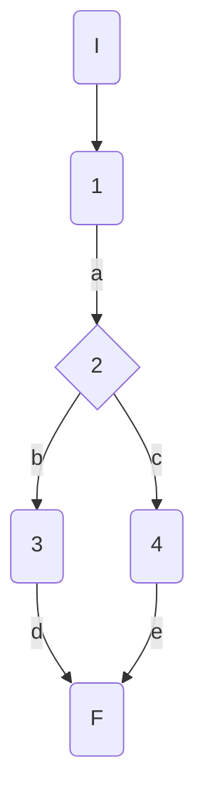

### Complejidad ciclo matica

Numero de regiones
$$
v(G) = R \\
v(G) = 2
$$

Numero de nodos y aristas
$$
v(G) = E - N + 2 \\
v(G) = 6 - 6 + 2
$$
  
Numero de decisiones
$$
v(G) = P + 1 \\
v(G) = 1 + 1
$$

### Casos de prueba


| | Camino   | Entrada   | TC | Salida  |
| --- | --- | --- | --- | --- |
| 1 | I-1a-2b-3d-F | `disciplineId` invalid  = 100| RepositoryMock returns null -> disciplineEntity = null | throw NotFoundElementException("discipline with id 100 does not exist") |
| 2 | I-1a-2c-4e-F | `disciplineId` valid  = 1|  RepositoryMock returns disicplineEntity -> disciplineEntity = {id=1, Name=100M} | return DisciplineModel({id=1, Name=100M}) |

TC1: Verificar que si se intenta recuperar datos de una disciplina con un id inválido 100 (inexistente en la bd) se devuelva la excepción NotFoundElementException con el mensaje "discipline with id 100 does not exist"

TC2: Verificar que si se intenta recuperar datos de una disciplina con un id válido 1, se devuelva la disciplina con los datos correspondientes al id 1: DisciplineModel({id=1, Name=100M})

Camino 1
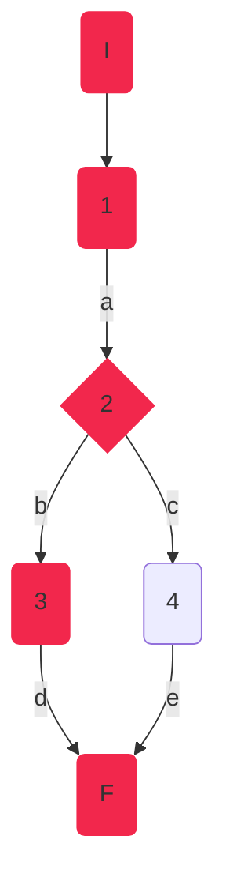
Camino 2
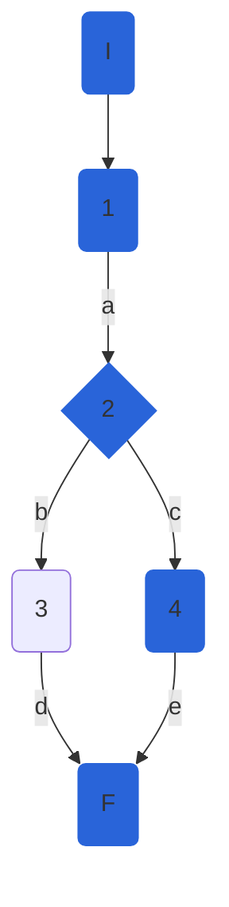
### Pruebas unitarias

```csharp
 //tc1
[Fact]
public void GetDisciplineAsync_InvalidId_ThrowsNotFoundElementException()
{
	var config = new MapperConfiguration(cfg => cfg.AddProfile<AutomapperProfile>());
	var mapper = config.CreateMapper();
	var repositoryMock = new Mock<IAthleteRepository>();
	repositoryMock.Setup(r => r.GetDisciplineAsync(100, false)).ReturnsAsync((DisciplineEntity)null);
	var disciplinesService = new DisciplineService(repositoryMock.Object, mapper);

	var exception = Assert.ThrowsAsync<NotFoundElementException>(async () => await disciplinesService.GetDisciplineAsync(100));
	Assert.Equal("discipline with id 100 does not exist", exception.Result.Message);

}
//tc2
[Fact]
public async Task GetDisciplineAsync_ValidId_ReturnsDisciplineCorrespondingToId()
{
	var config = new MapperConfiguration(cfg => cfg.AddProfile<AutomapperProfile>());
	var mapper = config.CreateMapper();
	var disciplineEntity100M = new DisciplineEntity()
	{
		Id = 1,
		Name = "100M"
	};           
	var repositoryMock = new Mock<IAthleteRepository>();
	repositoryMock.Setup(r => r.GetDisciplineAsync(1, false)).ReturnsAsync(disciplineEntity100M);
	var disciplinesService = new DisciplineService(repositoryMock.Object, mapper);
	var disciplineFromDB = await disciplinesService.GetDisciplineAsync(1);

	Assert.NotNull(disciplineFromDB);
	Assert.IsType<DisciplineModel>(disciplineFromDB);
	Assert.True(1 == disciplineFromDB.Id);
	Assert.True("100M" == disciplineFromDB.Name);
	Assert.Empty(disciplineFromDB.Athletes);
	Assert.Null(disciplineFromDB.Rules);
	Assert.Null(disciplineFromDB.CreationDate);
	Assert.Null(disciplineFromDB.FemaleWorldRecord);
	Assert.Null(disciplineFromDB.MaleWorldRecord);
}
```

## DisciplineService.DeleteDisciplineAsync

### Código Original

```csharp
public async Task DeleteDisciplineAsync(int disciplineId)
{
   await GetDisciplineAsync(disciplineId); //1
   await _athleteRepository.DeleteDisciplineAsync(disciplineId); //1
   var result = await _athleteRepository.SaveChangesAsync(); //1
	if (!result) //2
	{
		throw new Exception("Database Error"); //3
	}           
}
```
Se notó que el código original no devolvía nada. Era de tipo void, por lo tanto se refactorizó el código para poder probarlo correctamente:
#### Código Refactorizado:

```csharp
// SERVICIO
public async Task<bool> DeleteDisciplineAsync(int disciplineId)
{
	bool deleted = false;
	await GetDisciplineAsync(disciplineId);
	deleted = await _athleteRepository.DeleteDisciplineAsync(disciplineId);
	var result = await _athleteRepository.SaveChangesAsync();
	if (!result)
	{
		throw new Exception("Database Error");
	}
	return deleted;
	
}
```
### Grafo

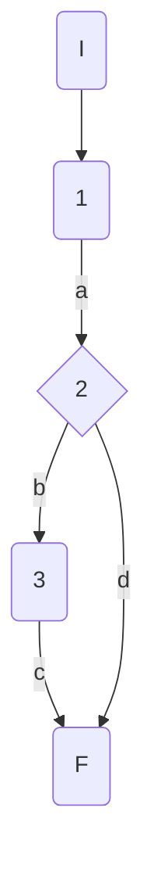

### Complejidad ciclo matica

Numero de regiones
$$
v(G) = R \\
v(G) = 2
$$

Numero de nodos y aristas
$$
v(G) = E - N + 2 \\
v(G) = 5 - 5 + 2
$$
  
Numero de decisiones
$$
v(G) = P + 1 \\
v(G) = 1 + 1
$$

### Casos de prueba


| | Camino   | Entrada   | TC | Salida  |
| --- | --- | --- | --- | --- |
| 1 | I-1a-2b-3c-F | `disciplineId` valid  = 1 | RepositoryMock.SaveChangesAsync returns false -> result=false  | throws exception("Database error") |
| 2 | I-1a-2d-F | `disciplineId` valid  = 1|  RepositoryMock returns true -> result = true | return  true|

TC1: Verificar que si ocurre un error en base de datos al eliminar una disciplina, se lance la excepción con mensaje "Database error"

TC2: Verificar que al eliminar una disciplina correctamente, se devuelva true como resultado

Camino 1
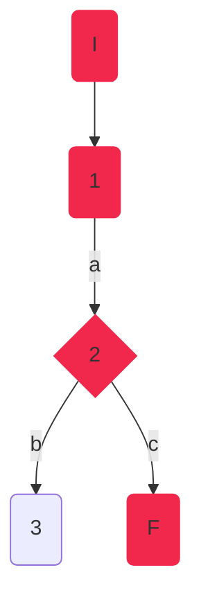
Camino 2
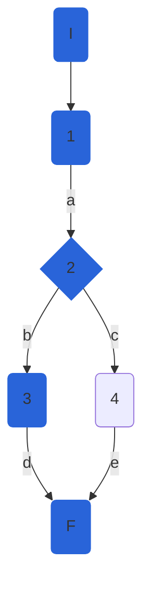
### Pruebas unitarias

```csharp
//tc1
[Fact]
public void DeleteDisciplineAsync_ValidId_ReuturnsDBException()
{
	var config = new MapperConfiguration(cfg => cfg.AddProfile<AutomapperProfile>());
	var mapper = config.CreateMapper();
	var disciplineEntity100M = new DisciplineEntity()
	{
		Id = 100,
		Name = "100M"
	};
	var repositoryMock = new Mock<IAthleteRepository>();
	
	repositoryMock.Setup(r => r.DeleteDisciplineAsync(100));
	repositoryMock.Setup(r => r.SaveChangesAsync()).ReturnsAsync(false);
	repositoryMock.Setup(r => r.GetDisciplineAsync(100, false)).ReturnsAsync(disciplineEntity100M);
	var disciplinesService = new DisciplineService(repositoryMock.Object, mapper);            

	var exception = Assert.ThrowsAsync<Exception>(async () => await disciplinesService.DeleteDisciplineAsync(100));
	Assert.Equal("Database Error", exception.Result.Message);
}
//tc2
[Fact]
public async Task DeleteDisciplineAsync_ValidId_DeletesDisicpline()
{
	var config = new MapperConfiguration(cfg => cfg.AddProfile<AutomapperProfile>());
	var mapper = config.CreateMapper();
	var disciplineEntity100M = new DisciplineEntity()
	{
		Id = 1,
		Name = "100M"
	};
	var repositoryMock = new Mock<IAthleteRepository>();
	repositoryMock.Setup(r => r.DeleteDisciplineAsync(1)).ReturnsAsync(true);
	repositoryMock.Setup(r => r.SaveChangesAsync()).ReturnsAsync(true);
	repositoryMock.Setup(r => r.GetDisciplineAsync(1, false)).ReturnsAsync(disciplineEntity100M);
	var disciplinesService = new DisciplineService(repositoryMock.Object, mapper);
	var result = await disciplinesService.DeleteDisciplineAsync(1);      
	Assert.True(result);
}
```

## DisciplineService.CreateDisciplineAsync

### Código

```csharp
public async Task<DisciplineModel> CreateDisciplineAsync(DisciplineModel discipline)
{
	var disciplineEntity = _mapper.Map<DisciplineEntity> //1(discipline);
	_athleteRepository.CreateDiscipline(disciplineEntity); //1
	var result = await _athleteRepository.SaveChangesAsync(); //1
	if (result) //2
	{
	   return  _mapper.Map<DisciplineModel>(disciplineEntity); //3
	}
	throw new Exception("Database Error"); //4
}
```

### Grafo


### Complejidad ciclo matica

Numero de regiones
$$
v(G) = R \\
v(G) = 2
$$

Numero de nodos y aristas
$$
v(G) = E - N + 2 \\
v(G) = 5 - 5 + 2
$$
  
Numero de decisiones
$$
v(G) = P + 1 \\
v(G) = 1 + 1
$$

### Casos de prueba


| | Camino   | Entrada   | TC | Salida  |
| --- | --- | --- | --- | --- |
| 1 | I-1a-2b-3c-F | `discipline` new DisciplineModel() { Name = "Long Jump"}; | RepositoryMock.SaveChangesAsync returns false -> result=false  | throws exception("Database error") |
| 2 | I-1a-2d-F | `discipline` new DisciplineModel() { Name = "Long Jump"};|  RepositoryMock returns true -> result = true | return  DisciplineModel() { Id=0, Name = "Long Jump"};|

TC1: verificar que si hay error de base de datos al crear una disciplina, se lance una excepción con el mensaje "Database error".

TC2: verificar que se cree una disciplina con {Name="Long Jump"}, se cree correctamente y se agregue un id : { Id=0, Name = "Long Jump"}

Camino 1

Camino 2

### Pruebas unitarias

```csharp
//tc1
[Fact]
public void CreateDisciplineAsync_ValidId_ReuturnsDBException()
{
	var config = new MapperConfiguration(cfg => cfg.AddProfile<AutomapperProfile>());
	var mapper = config.CreateMapper();
	var longJumpDisciplineEntity = new DisciplineEntity()
	{
		Name = "Long Jump"
	};
	var longJumpDisciplineModel = new DisciplineModel()
	{
		
		Name = "Long Jump"
	};
	var repositoryMock = new Mock<IAthleteRepository>();           
	repositoryMock.Setup(r => r.SaveChangesAsync()).ReturnsAsync(false);
	repositoryMock.Setup(r => r.CreateDiscipline(longJumpDisciplineEntity));
	var disciplinesService = new DisciplineService(repositoryMock.Object, mapper);

	var exception = Assert.ThrowsAsync<Exception>(async () => await disciplinesService.CreateDisciplineAsync(longJumpDisciplineModel));
	Assert.Equal("Database Error", exception.Result.Message);
}
//tc2
[Fact]
public async Task CreateDisciplineAsync_ValidId_CreatesDiscipline()
{
	var config = new MapperConfiguration(cfg => cfg.AddProfile<AutomapperProfile>());
	var mapper = config.CreateMapper();
	var longJumpDisciplineEntity = new DisciplineEntity()
	{
		Id = 0,
		Name = "Long Jump"
	};
	var longJumpDisciplineModel = new DisciplineModel()
	{
		Name = "Long Jump"
	};
	var repositoryMock = new Mock<IAthleteRepository>();
	repositoryMock.Setup(r => r.SaveChangesAsync()).ReturnsAsync(true);
	repositoryMock.Setup(r => r.CreateDiscipline(longJumpDisciplineEntity));
	var disciplinesService = new DisciplineService(repositoryMock.Object, mapper);
	var disciplineCreated = await disciplinesService.CreateDisciplineAsync(longJumpDisciplineModel);
	Assert.NotNull(disciplineCreated);
	Assert.Equal("Long Jump", disciplineCreated.Name);
	Assert.Equal(0, disciplineCreated.Id);
	Assert.Empty(disciplineCreated.Athletes);
	Assert.Null(disciplineCreated.Rules);
	Assert.Null(disciplineCreated.CreationDate);
	Assert.Null(disciplineCreated.FemaleWorldRecord);
	Assert.Null(disciplineCreated.MaleWorldRecord);
	
}
```

## DisciplineService.CheckPersonalBest
### Código

```csharp
public bool CheckPersonalBest(AthleteModel athlete, Decimal mark, string discipline)
    {
        Console.WriteLine(_markComparer);
        var f = _markComparer[discipline];
        bool personalBest = f(athlete.PersonalBest, mark);//1
        if (personalBest)//2
        {
            athlete.PersonalBest = mark;//3
        }
        return personalBest;//4
    }
  
```

### Grafo

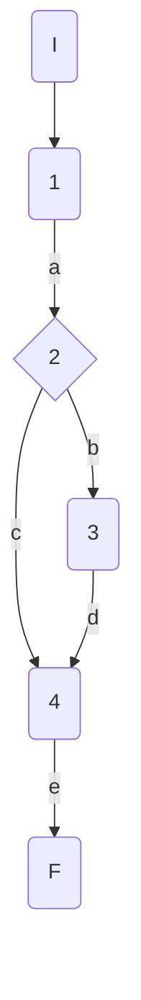

### Complejidad ciclo matica

Numero de regiones
$$
v(G) = R \\
v(G) = 2
$$

Numero de nodos y aristas
$$
v(G) = E - N + 2 \\
v(G) = 6 - 6 + 2
$$
  
Numero de decisiones
$$
v(G) = P + 1 \\
v(G) = 1 + 1
$$

### Casos de prueba

athlete, mark, discipline

| | Camino   | Entrada   | TC | Salida  |
| --- | --- | --- | --- | --- |
| 1 | I-1a-2c-4e-F | `athlete`= {Id=1,Nationality="USA", Name="Sydney Maclaughlin", Gender="f", Points=1000, PB=52.75m} `mark`=53.05m `discipline`="400MH"| personalBest = false| false|
| 2 | I-1a-2b-3d-4e-F | `athlete`={Id=1,Nationality="USA", Name="Sydney Maclaughlin", Gender="f", Points=1000, PB=52.75m}`mark`=51.79m `discipline`="400MH"| personalBest = true| true|

TC1: Verificar que si la atleta {Id=1,Nationality="USA", Name="Sydney Maclaughlin", Gender="f", Points=1000, PB=52.75m} tiene una marca = 53.05, sin superar su marca personal, devuelva false

TC2: Verificar que si la atleta {Id=1,Nationality="USA", Name="Sydney Maclaughlin", Gender="f", Points=1000, PB=52.75m} tiene una marca = 51.79, superando su mejor marca personal, devuelva true

Camino 1
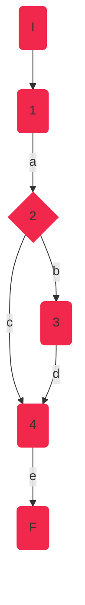
Camino 2
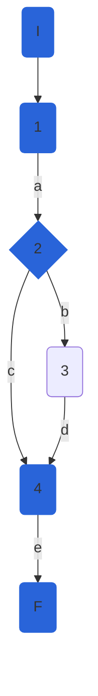

### Pruebas unitarias

```csharp
//tc1
[Fact]
public void CheckPersonalBest_NoPersonalBest()
{
	var config = new MapperConfiguration(cfg => cfg.AddProfile<AutomapperProfile>());
	var mapper = config.CreateMapper();
	var sydney = new AthleteModel()
	{
		Id=1,Nationality="USA", Name="Sydney Maclaughlin", Gender=Gender.F, Points=1000, PersonalBest=52.75m
	};
	var mark = 53.05m;
	string discipline = "400MH";
	var repositoryMock = new Mock<IAthleteRepository>();
	var disciplinesService = new DisciplineService(repositoryMock.Object, mapper);

	var result = disciplinesService.CheckPersonalBest(sydney,mark, discipline);
	Assert.False(result);            
}

//tc2
[Fact]
public void CheckPersonalBest_PersonalBest()
{
	var config = new MapperConfiguration(cfg => cfg.AddProfile<AutomapperProfile>());
	var mapper = config.CreateMapper();
	var sydney = new AthleteModel()
	{
		Id = 1,
		Nationality = "USA",
		Name = "Sydney Maclaughlin",
		Gender = Gender.F,
		Points = 1000,
		PersonalBest = 52.75m
	};
	var mark = 51.79m;
	string discipline = "400MH";
	var repositoryMock = new Mock<IAthleteRepository>();
	var disciplinesService = new DisciplineService(repositoryMock.Object, mapper);

	var result = disciplinesService.CheckPersonalBest(sydney, mark, discipline);
	Assert.True(result);
}
```

## DisciplineService.Mark

### Código

```csharp
public Decimal Mark(AthleteModel athlete)
{
	Decimal mark;//1
	if (athlete.SeasonBest != null)//2
	{
		mark = GetRandomMark(athlete.SeasonBest - 0.2m, athlete.SeasonBest + 0.2m);//3
	}
	else
	{
		mark = GetRandomMark(athlete.PersonalBest - 0.2m, athlete.PersonalBest + 0.5m);//4
	}
	return mark;//5
}
```

### Grafo

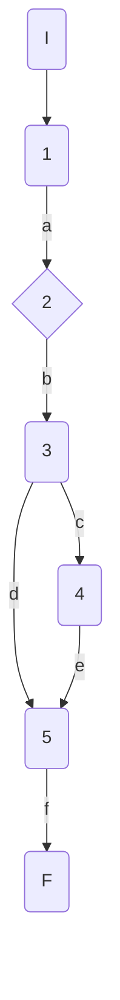

### Complejidad ciclo matica

Numero de regiones
$$
v(G) = R \\
v(G) = 2
$$

Numero de nodos y aristas
$$
v(G) = E - N + 2 \\
v(G) = 7 - 7 + 2
$$
  
Numero de decisiones
$$
v(G) = P + 1 \\
v(G) = 1 + 1
$$

### Casos de prueba

| | Camino   | Entrada   | TC | Salida  |
| --- | --- | --- | --- | --- |
| 1 | I-1a-2b-3h-4d-5f-6g-F | `athlete`={Id=1,Nationality="USA", Name="Sydney Maclaughlin", Gender="f", Points=1000, PersonalBest=52.75m, SeasonBest=52.75m} | athlete.SeasonBest!=null = false| {52.55-52.95}|
| 2 | I-1a-2c-4d-5f-6g-F | `athlete`={Id=1,Nationality="USA", Name="Sydney Maclaughlin", Gender="f", Points=1000, PersonalBest=52.75m, SeasonBest=null} | athlete.SeasonBest!=null -> true | {52.55-53.25}|

TC1: Verificar que si la atleta {Id=1,Nationality="USA", Name="Sydney Maclaughlin", Gender="f", Points=1000, PersonalBest=52.75m, SeasonBest=52.75m}, contiene marca de temporada, la marca devuelta esté en el rango 52.55-52.95

TC2: Verificar que si la atleta {Id=1,Nationality="USA", Name="Sydney Maclaughlin", Gender="f", Points=1000, PersonalBest=52.75m, SeasonBest=null}, NO TIENE marca de temporada, la marca devuelta esté en el rango 52.55-53.25

Camino 1

Camino 2
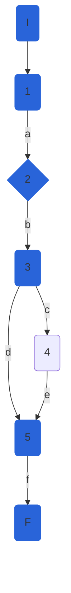
### Pruebas unitarias

```csharp
//tc1
[Fact]
public void Mark_ReturnsAthleteMark_SeasonBestIncluded()
{
	var config = new MapperConfiguration(cfg => cfg.AddProfile<AutomapperProfile>());
	var mapper = config.CreateMapper();
	var sydney = new AthleteModel()
	{
		Id = 1,
		Nationality = "USA",
		Name = "Sydney Maclaughlin",
		Gender = Gender.F,
		Points = 1000,
		PersonalBest = 52.75m,
		SeasonBest = 52.75m
	};
	var repositoryMock = new Mock<IAthleteRepository>();
	var disciplinesService = new DisciplineService(repositoryMock.Object, mapper);

	var result = disciplinesService.Mark(sydney);
	Assert.InRange(result, 52.55m, 52.94m);// Random.Next(inclusivo, exclusivo) - InRange(inclusivo, inclusivo)
}

//tc2
[Fact]
public void Mark_ReturnsAthleteMark_NoSeasonBest()
{
	var config = new MapperConfiguration(cfg => cfg.AddProfile<AutomapperProfile>());
	var mapper = config.CreateMapper();
	var sydney = new AthleteModel()
	{
		Id = 1,
		Nationality = "USA",
		Name = "Sydney Maclaughlin",
		Gender = Gender.F,
		Points = 1000,
		PersonalBest = 52.75m,
		SeasonBest = null
	};
	var repositoryMock = new Mock<IAthleteRepository>();
	var disciplinesService = new DisciplineService(repositoryMock.Object, mapper);

	var result = disciplinesService.Mark(sydney);
	Assert.InRange(result, 52.55m, 53.24m);
}
```

## DisciplineService.CheckSeasonBest

### Código

```csharp
public bool CheckSeasonBest(AthleteModel athlete, Decimal mark, string discipline)
{
	bool seasonBest = _markComparer[discipline](athlete.SeasonBest, mark);//1
	if (athlete.SeasonBest == null)//2
	{
		seasonBest = true;//3
	}
	if (seasonBest)//4
	{
		athlete.SeasonBest = mark;//5
	}
	return seasonBest;//6
}
  
```

### Grafo

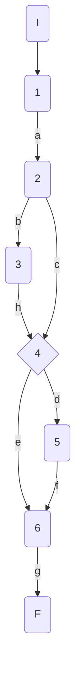

### Complejidad ciclo matica

Numero de regiones
$$
v(G) = R \\
v(G) = 3
$$

Numero de nodos y aristas
$$
v(G) = E - N + 2 \\
v(G) = 9 - 8 + 2
$$
  
Numero de decisiones
$$
v(G) = P + 1 \\
v(G) = 2 + 1
$$

### Casos de prueba

athlete, mark, discipline

| | Camino   | Entrada   | TC | Salida  |
| --- | --- | --- | --- | --- |
| 1 | I-1a-2b-3h-4d-5f-6g-F | `athlete`={Id=1,Nationality='USA', Name='Sydney Maclaughlin', Gender='f', Points=1000, PersonalBest=52.75, SeasonBest=null}`mark`=51.79 `discipline`='400MH'| athlete.SeasonBest=null -> seasonBest = true| true |
| 2 | I-1a-2c-4d-5f-6g-F | `athlete`={Id=1,Nationality='USA', Name='Sydney Maclaughlin', Gender='f', Points=1000, PersonalBest=52.75, SeasonBest=52}`mark`=51.79 `discipline`='400MH'| athlete.SeasonBest!=null -> seasonBet = true| true |
| 3 | I-1a-2c-4e-6g-F | `athlete`={Id=1,Nationality='USA', Name='Sydney Maclaughlin', Gender='f', Points=1000, PersonalBest=52.75, SeasonBest=52}`mark`=52.79 `discipline`='400MH'| athlete.SeasonBest!=null -> seasonBet = false| false |

TC1: Verificar que si la atleta {Id=1,Nationality='USA', Name='Sydney Maclaughlin', Gender='f', Points=1000, PersonalBest=52.75, SeasonBest=null}, inicialmente sin mejor marca de temporada, realiza una marca de 51.79 en la disciplina 400MH, devuelva true

TC2: Verificar que si la atleta {Id=1,Nationality='USA', Name='Sydney Maclaughlin', Gender='f', Points=1000, PersonalBest=52.75, SeasonBest=52}, con mejor marca de temporada 52, realiza una marca de 51.79 en la disciplina 400MH, mejor a su mejor marca de temporada previa, devuelva true

TC3: Verificar que si la atleta {Id=1,Nationality='USA', Name='Sydney Maclaughlin', Gender='f', Points=1000, PersonalBest=52.75, SeasonBest=52}, con mejor marca de temporada 52, realiza una marca de 52.79 en la disciplina 400MH, peor a su mejor marca de temporada previa, devuelva false

Camino 1
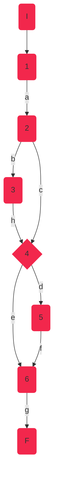
Camino 2
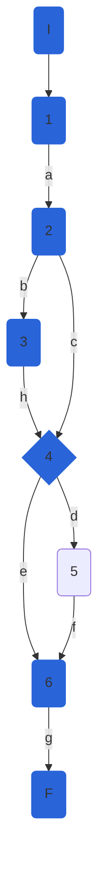
Camino 3
```mermaid
graph TD
    I(I):::c3 --> 1(1):::c3
    1 --a--> 2(2):::c3
    2 --b--> 3(3):::c3
    3 --h--> 4{4}:::c3
    2 --c--> 4{4}:::c3     
    4 --d--> 5(5):::c3
    4 --e--> 6(6) 
    5 --f--> 6(6):::c3
    6 --g--> F(F):::c3
classDef c3 fill:#B2A2FA, stroke:#B2A2FA;
```
### Pruebas unitarias

```csharp
//tc1
[Fact]
public void CheckSesasonBest_SeasonBestNull_ReturnsTrue()
{
	var config = new MapperConfiguration(cfg => cfg.AddProfile<AutomapperProfile>());
	var mapper = config.CreateMapper();
	var sydney = new AthleteModel()
	{
		Id = 1,
		Nationality = "USA",
		Name = "Sydney Maclaughlin",
		Gender = Gender.F,
		Points = 1000,
		PersonalBest = 52.75m,
		SeasonBest = null
	};
	var disciplineName = "400MH";
	var mark = 51.76m;
	var repositoryMock = new Mock<IAthleteRepository>();
	var disciplinesService = new DisciplineService(repositoryMock.Object, mapper);

	var result = disciplinesService.CheckSeasonBest(sydney,mark,disciplineName);
	Assert.True(result);
}
//tc2
[Fact]
public void CheckSesasonBest_SeasonBestImproved_ReturnsTrue()
{
	var config = new MapperConfiguration(cfg => cfg.AddProfile<AutomapperProfile>());
	var mapper = config.CreateMapper();
	var sydney = new AthleteModel()
	{
		Id = 1,
		Nationality = "USA",
		Name = "Sydney Maclaughlin",
		Gender = Gender.F,
		Points = 1000,
		PersonalBest = 52m,
		SeasonBest = 51.79m
	};
	var disciplineName = "400MH";
	var mark = 51.76m;
	var repositoryMock = new Mock<IAthleteRepository>();
	var disciplinesService = new DisciplineService(repositoryMock.Object, mapper);

	var result = disciplinesService.CheckSeasonBest(sydney, mark, disciplineName);
	Assert.True(result);
}

//tc3
[Fact]
public void CheckSesasonBest_SeasonBestNotImproved_ReturnsFalse()
{
	var config = new MapperConfiguration(cfg => cfg.AddProfile<AutomapperProfile>());
	var mapper = config.CreateMapper();
	var sydney = new AthleteModel()
	{
		Id = 1,
		Nationality = "USA",
		Name = "Sydney Maclaughlin",
		Gender = Gender.F,
		Points = 1000,
		PersonalBest = 52.75m,
		SeasonBest = 52m
	};
	var disciplineName = "400MH";
	var mark = 52.79m;
	var repositoryMock = new Mock<IAthleteRepository>();
	var disciplinesService = new DisciplineService(repositoryMock.Object, mapper);

	var result = disciplinesService.CheckSeasonBest(sydney, mark, disciplineName);
	Assert.False(result);
}
```

## DisciplineService.UpdateWorldRecord

### Código incial

```csharp
 async Task updateWorldRecord(int disciplineId,decimal worldRecord, string gender)
{
	if (gender.ToLower() == "f")//1
	{
		await _athleteRepository.UpdateDisciplineAsync(disciplineId, new DisciplineEntity()
		{
			FemaleWorldRecord = worldRecord
		});//2
	}
	else
	{
		await _athleteRepository.UpdateDisciplineAsync(disciplineId, new DisciplineEntity()
		{
			MaleWorldRecord = worldRecord
		});//3
	}
}
```
### NOTA: 
Este método no devolvía ningún valor, por lo tanto, para poder probarlo y garantizar que funcione correctamente, se convirtió este método a bool. Para poder realizar este cambio, se realizó el cambio correspondiente en el repositorio, ya que el resultado dependía del mismo y este también era de tipo void. Los cambios realizados se muestran a continuación:

### REPOSITORIO:
```csharp
public async Task<bool> UpdateDisciplineAsync(int disciplineId, DisciplineEntity discipline)
{
	//_dbContext.Entry(discipline).State = EntityState.Modified;
	bool updated = true;
	var disciplineToUpdate = await _dbContext.Disciplines.FirstOrDefaultAsync(d => d.Id == disciplineId);
	if (disciplineToUpdate == null) updated = false;
	
	disciplineToUpdate.Name = discipline.Name ?? disciplineToUpdate.Name;
	disciplineToUpdate.Rules = discipline.Rules ?? disciplineToUpdate.Rules;
	disciplineToUpdate.CreationDate = discipline.CreationDate ?? disciplineToUpdate.CreationDate;
	disciplineToUpdate.FemaleWorldRecord = discipline.FemaleWorldRecord ?? disciplineToUpdate.FemaleWorldRecord;
	disciplineToUpdate.MaleWorldRecord = discipline.MaleWorldRecord ?? disciplineToUpdate.MaleWorldRecord;
	 
	return updated;
   
}
    
```

### SERVICIO (MÉTODO CORREGIDO):
```csharp
async Task<bool> updateWorldRecord(int disciplineId,decimal worldRecord, string gender)
{
	bool updated = false;
	if (gender.ToLower() == "f")
	{
		updated = await _athleteRepository.UpdateDisciplineAsync(disciplineId, new DisciplineEntity()
		{
			FemaleWorldRecord = worldRecord
		});

	}
	else
	{
		updated = await _athleteRepository.UpdateDisciplineAsync(disciplineId, new DisciplineEntity()
		{
			MaleWorldRecord = worldRecord
		});
	}
	return updated;

}
    
```

### Grafo

```mermaid
graph TD
    I(I) --> 1(1)
    1 --a--> 2{2}
    2 --b--> F(F)
    2 --c--> 3(3)
    3 --d--> F(F)
```

### Complejidad ciclo matica

Numero de regiones
$$
v(G) = R \\
v(G) = 2
$$

Numero de nodos y aristas
$$
v(G) = E - N + 2 \\
v(G) = 5 - 5 + 2
$$
  
Numero de decisiones
$$
v(G) = P + 1 \\
v(G) = 1 + 1
$$

### Casos de prueba

| | Camino   | Entrada   | TC | Salida  |
| --- | --- | --- | --- | --- |
| 1 | I-1a-2c-3d-F | `disciplineId`=1 `worldRecord`=51.7 `gender`='f' | gender.ToLower() == "f" = true| true |
| 2 | I-1a-2b-F | `disciplineId`=1 `worldRecord`=51.7 `gender`='m' | gender.ToLower() == "f" = false| true |

TC1: Verificar que si se actualiza el record mundial de género femenino, y no se actualiza correctamente en la base de datos, devuelva false

TC2: Verificar que si se actualiza el record mundial de género masculino, y no se actualiza correctamente en la base de datos, devuelva false

Camino 1
```mermaid
graph TD
    I(I):::c1 --> 1(1):::c1 
    1 --a--> 2{2}:::c1 
    2 --b--> F(F)
    2 --c--> 3(3):::c1 
    3 --d--> F(F):::c1 
classDef c1 fill:#F2274C, stroke:#F2274C;
```
Camino 2
```mermaid
graph TD
    I(I):::c2 --> 1(1):::c2
    1 --a--> 2{2}:::c2
    2 --b--> F(F):::c2
    2 --c--> 3(3) 
    3 --d--> F(F) 
classDef c2 fill:#2964D9, stroke:#2964D9;
```
### Pruebas unitarias
Primero se realizaron 2 pruebas unitarias para esta parte:
```csharp
//tc1
[Fact]
public async Task UpdateWorldRecord_ReturnsTrue()
{
	var config = new MapperConfiguration(cfg => cfg.AddProfile<AutomapperProfile>());
	var mapper = config.CreateMapper();
	var disciplineId = 1;
	var worldRecord = 51.7m;
	var gender = "f";
	var repositoryMock = new Mock<IAthleteRepository>();
	var disciplinesService = new DisciplineService(repositoryMock.Object, mapper);

	var result = await disciplinesService.updateWorldRecord(disciplineId, worldRecord, gender);
	Assert.False(result);
}

//tc2
[Fact]
public async Task UpdateWorldRecord_ReturnsFalse()
{
	var config = new MapperConfiguration(cfg => cfg.AddProfile<AutomapperProfile>());
	var mapper = config.CreateMapper();
	var disciplineId = 1;
	var worldRecord = 51.7m;
	var gender = "m";
	var repositoryMock = new Mock<IAthleteRepository>();
	var disciplinesService = new DisciplineService(repositoryMock.Object, mapper);

	var result = await disciplinesService.updateWorldRecord(disciplineId, worldRecord, gender);
	Assert.False(result);
}
```
Sin embargo, después de investigar y descubrir el poder de XUnit, se combinaron estas pruebas utilizando el decorador "Theory" en vez de "Fact", que permite agregar entradas a los tests:
```csharp
[Theory]
[InlineData(1,51.7,"f")] //tc1
[InlineData(1, 51.7, "m")] //tc2    
public async Task UpdateWorldRecord_ReturnsTrue(int disciplineId, Decimal worldRecord, string gender)
{
	var config = new MapperConfiguration(cfg => cfg.AddProfile<AutomapperProfile>());
	var mapper = config.CreateMapper();
	var repositoryMock = new Mock<IAthleteRepository>();
	var disciplinesService = new DisciplineService(repositoryMock.Object, mapper);

	var result = await disciplinesService.updateWorldRecord(disciplineId, worldRecord, gender);
	Assert.False(result);
} 
```      

## DisciplineService.GetWorldRankingsAsync

### Código

```csharp
public async Task<IEnumerable<AthleteModel>> GetWorldRankingsAsync(int disciplineId, string gender = "all")
{
	
	if (!_allowedGenderValues.Contains(gender.ToLower())) //1
		throw new InvalidElementOperationException($"invalid gender value : {gender}. The allowed values for param are: {string.Join(',', _allowedGenderValues)}"); //2
	var discipline = await _athleteRepository.GetDisciplineAsync(disciplineId, true);
	var athletes = _mapper.Map < IList < AthleteModel >> (discipline.Athletes.ToList());
	athletes = athletes.OrderByDescending(a => a.Points).ToList(); //3
	if (gender != "all") //4
	{
		athletes =  athletes.Where(a => a.Gender.ToString() == gender).ToList(); //5
	}
	//var listAthletes = _mapper.Map<IList<AthleteModel>>(athletes);
	return athletes; //6
	
}
```

### Grafo

```mermaid
graph TD
    I(I) --> 1{1}
    1 --a--> 2(2)
    2 --b--> F(F)
    1 --c--> 3(3)
    3 --d--> 4{4}
    4 --e--> 5(5)
    5 --f--> 6(6)
    4 --g--> 6(6)
    6 --h--> F(F)
```

### Complejidad ciclo matica

Numero de regiones
$$
v(G) = R \\
v(G) = 3
$$

Numero de nodos y aristas
$$
v(G) = E - N + 2 \\
v(G) = 9 - 8 + 2
$$
  
Numero de decisiones
$$
v(G) = P + 1 \\
v(G) = 3 + 1
$$

### Casos de prueba


| | Camino   | Entrada   | TC | Salida  |
| --- | --- | --- | --- | --- |
| 1 | I-1a-2b-F | `disciplineId`=1 `gender`='k' | !allowed_genders.Contains(gender.to_lower()) = true | throws exception("throw new InvalidElementOperationException($"invalid gender value : k. The allowed values for param are: f,m,all") |
| 2 | I-1c-3d-4e-5f-6h-F | `disciplineId`=1 `gender`='f' | !allowed_genders.Contains(gender.to_lower()) = false ==> gender != "all" == true repositoryMock.GetDisciplineAsync returns {id=1, Name='400M', FemaleWorldRecord=7.52, Athletes = [{Id=1,Nationality='USA', Name='Sydney Maclaughlin', Gender='f', Points=1000}, {Id=2,Nationality='USA', Name='Allyson Felix', Gender='f', Points=1500}, , {Id=3,Nationality='Jamaica', Name='Usain Bolt', Gender='m'}]}| return [{Id=2,Nationality='USA', Name='Allyson Felix', Gender='f', Points=1500},{Id=1,Nationality='USA', Name='Sydney Maclaughlin', Gender='f', Points=1000}]|
| 3 | I-1c-3d-4g-6h-F | `disciplineId`=1 `gender`='all' | !allowed_genders.Contains(gender.to_lower()) = false ==> gender != "all" == false repositoryMock.GetDisciplineAsync returns {id=1, Name='400M', FemaleWorldRecord=7.52, Athletes = [{Id=1,Nationality='USA', Name='Sydney Maclaughlin', Gender='f', Points=1000}, {Id=2,Nationality='USA', Name='Allyson Felix', Gender='f', Points=1500}, , {Id=3,Nationality='Jamaica', Name='Usain Bolt', Gender='m', Points = 2000}]}| return [{Id=3,Nationality='Jamaica', Name='Usain Bolt', Gender='m', Points = 2000}, {Id=2,Nationality='USA', Name='Allyson Felix', Gender='f', Points=1500},{Id=1,Nationality='USA', Name='Sydney Maclaughlin', Gender='f', Points=1000}]|

TC1: Verificar que si el id de la disciplina es 1 y el género es k, se lance una excepción InvalidElementOperationException con el mensaje: "invalid gender value : k. The allowed values for param are: f,m,all"

TC2: Verificar que si el id de la disciplina es 1 y el género es f y la lista de atletas para la disciplina con id 1 es: `[{Id=1,Nationality='USA', Name='Sydney Maclaughlin', Gender='f', Points=1000}, {Id=2,Nationality='USA', Name='Allyson Felix', Gender='f', Points=1500}, , {Id=3,Nationality='Jamaica', Name='Usain Bolt', Gender='m'}]`, devuelva la lista filtrada por género f y ordenada por puntos: `[{Id=2,Nationality='USA', Name='Allyson Felix', Gender='f', Points=1500},{Id=1,Nationality='USA', Name='Sydney Maclaughlin', Gender='f', Points=1000}]`

TC3: Verificar que si el id de la disciplina es 1 y el género es all y la lista de atletas para la disciplina con id 1 es: `[{Id=1,Nationality='USA', Name='Sydney Maclaughlin', Gender='f', Points=1000}, {Id=2,Nationality='USA', Name='Allyson Felix', Gender='f', Points=1500}, , {Id=3,Nationality='Jamaica', Name='Usain Bolt', Gender='m', Points = 2000}]`, devuelve la lista de atletas ordenada por puntos de forma descendente:  `[{Id=3,Nationality='Jamaica', Name='Usain Bolt', Gender='m', Points = 2000}, {Id=2,Nationality='USA', Name='Allyson Felix', Gender='f', Points=1500},{Id=1,Nationality='USA', Name='Sydney Maclaughlin', Gender='f', Points=1000}]
`
Camino 1
```mermaid
graph TD
    I(I):::c1 --> 1{1}:::c1
    1 --a--> 2(2):::c1
    2 --b--> F(F):::c1
    1 --c--> 3(3)
    3 --d--> 4{4}
    4 --e--> 5(5)
    5 --f--> 6(6)
    4 --g--> 6(6)
    6 --h--> F(F)
classDef c1 fill:#F2274C, stroke:#F2274C;
```
Camino 2
```mermaid
graph TD
    I(I):::c2 --> 1{1}:::c2
    1 --a--> 2(2)
    2 --b--> F(F)
    1 --c--> 3(3):::c2
    3 --d--> 4{4}:::c2
    4 --e--> 5(5):::c2
    5 --f--> 6(6):::c2
    4 --g--> 6(6)
    6 --h--> F(F):::c2
classDef c2 fill:#2964D9, stroke:#2964D9;
```
Camino 3
```mermaid
graph TD
    I(I):::c3 --> 1{1}:::c3
    1 --a--> 2(2)
    2 --b--> F(F)
    1 --c--> 3(3):::c3
    3 --d--> 4{4}:::c3
    4 --e--> 5(5)
    5 --f--> 6(6):::c3
    4 --g--> 6(6)
    6 --h--> F(F):::c3
classDef c3 fill:#B2A2FA, stroke:#B2A2FA;
```
### Pruebas unitarias

```csharp
//tc1
[Fact]
public void GetWorldRankingAsync_InvalidGender_ReturnsInvalidElementOperationException()
{
	var config = new MapperConfiguration(cfg => cfg.AddProfile<AutomapperProfile>());
	var mapper = config.CreateMapper();
	var disciplineId = 1;
	var gender = "k";
	var repositoryMock = new Mock<IAthleteRepository>();
	//repositoryMock.Setup(d=>d.GetDisciplineAsync(1,true)).ReturnsAsync()
	var disciplinesService = new DisciplineService(repositoryMock.Object, mapper);

	var exception = Assert.ThrowsAsync<InvalidElementOperationException>(async () => await disciplinesService.GetWorldRankingsAsync(disciplineId, gender));
	Assert.Equal("invalid gender value : k. The allowed values for param are: f,m,all", exception.Result.Message);
}

//tc2
[Fact]
public async Task GetWorldRankingAsync_ReturnsDisciplineWorldRankings()
{
	var config = new MapperConfiguration(cfg => cfg.AddProfile<AutomapperProfile>());
	var mapper = config.CreateMapper();
	var disciplineId = 1;
	var gender = "f";
	var repositoryMock = new Mock<IAthleteRepository>();
	repositoryMock.Setup(d => d.GetDisciplineAsync(1, true)).ReturnsAsync(
		new DisciplineEntity()
		{
			Id = 1,
			Name = "400M",
			FemaleWorldRecord = 7.52m,
			Athletes = new List<AthleteEntity>(){
				new AthleteEntity(){ Id = 1,Nationality = "USA", Name = "Sydney Maclaughlin", Gender = Gender.F, Points = 1000},
				new AthleteEntity(){ Id = 2,Nationality = "USA", Name = "Allyson Felix", Gender = Gender.F, Points = 1500},
				new AthleteEntity(){ Id = 3,Nationality = "Jamaica", Name = "Usain Bolt", Gender = Gender.M}
			}
		});
	var disciplinesService = new DisciplineService(repositoryMock.Object, mapper);
	
	var worldRankings = await disciplinesService.GetWorldRankingsAsync(disciplineId, gender);
	Assert.NotNull(worldRankings);
	Assert.NotEmpty(worldRankings);
	Assert.Equal(2,worldRankings.Count());
	Assert.Contains(worldRankings, athlete => athlete.Id == 1);
	Assert.Contains(worldRankings, athlete => athlete.Id == 2);
	Assert.DoesNotContain(worldRankings, athlete => athlete.Id == 3);
	Assert.All(worldRankings, athlete => Assert.Equal(Gender.F,athlete.Gender));
	
}
//tc3
[Fact]
public async Task GetWorldRankingAsync_GenderAll_ReturnsDisciplineWorldRankings()
{
	var config = new MapperConfiguration(cfg => cfg.AddProfile<AutomapperProfile>());
	var mapper = config.CreateMapper();
	var disciplineId = 1;
	var gender = "all";
	var repositoryMock = new Mock<IAthleteRepository>();
	repositoryMock.Setup(d => d.GetDisciplineAsync(1, true)).ReturnsAsync(
		new DisciplineEntity()
		{
			Id = 1,
			Name = "400M",
			FemaleWorldRecord = 7.52m,
			Athletes = new List<AthleteEntity>(){
				new AthleteEntity(){ Id = 1,Nationality = "USA", Name = "Sydney Maclaughlin", Gender = Gender.F, Points = 1000},
				new AthleteEntity(){ Id = 2,Nationality = "USA", Name = "Allyson Felix", Gender = Gender.F, Points = 1500},
				new AthleteEntity(){ Id = 3,Nationality = "Jamaica", Name = "Usain Bolt", Gender = Gender.M, Points = 2000}
			}
		});
	var disciplinesService = new DisciplineService(repositoryMock.Object, mapper);

	var worldRankings = await disciplinesService.GetWorldRankingsAsync(disciplineId, gender);
	Assert.NotNull(worldRankings);
	Assert.NotEmpty(worldRankings);
	Assert.Equal(3, worldRankings.Count());
	Assert.Contains(worldRankings, athlete => athlete.Id == 1);
	Assert.Contains(worldRankings, athlete => athlete.Id == 2);
	Assert.Contains(worldRankings, athlete => athlete.Id == 3);
	Assert.Equal("Usain Bolt",worldRankings.First().Name);
	Assert.Equal("Sydney Maclaughlin", worldRankings.Last().Name);            
}
```

## DisciplineService.CheckWorldRecord

### Código

```csharp
bool checkWorldRecord(string gender,DisciplineModel discipline, RaceInfoModel competingResults,out decimal worldRecord)
{
	var bestMark = competingResults.GetHighestMark();//1
	if (_best3MarksFilter[discipline.Name])//2
	{
		bestMark = competingResults.GetLowestMark();//3
	}
	worldRecord = bestMark;//4
	if (gender.ToLower() == "f")//5
	{
		if (_best3MarksFilter[discipline.Name])//6
		{
			return discipline.FemaleWorldRecord > bestMark;//7
		}
		return discipline.FemaleWorldRecord < bestMark;//8
	}

	if (gender.ToLower() == "m")//9
	{
		if (_best3MarksFilter[discipline.Name])//10
		{
			return discipline.MaleWorldRecord > bestMark;//11
		}
		return discipline.MaleWorldRecord < bestMark;//12
	}
	return false;//13

}
```

### Grafo

```mermaid
graph TD
    I(I) --> 1(1)
    1 --a--> 2{2}
    2 --b--> 3(3)
    3 --p--> 4(4)
    2 --c--> 4(4)
    4 --d--> 5{5}
    5 --e--> 6{6}
    6 --f--> 7(7)
    7 --h--> F(F)
    6 --g--> 8(8)
    8 --i--> F(F)
    5 --f--> 9{9}
    9 --j--> 10{10}
    9 --k--> 13(13)
    10 --l--> 11(11)
    10 --m--> 12(12)
    11 --p--> F(F)
    12 --n--> F(F)
    13 --r--> F(F)
```

### Complejidad ciclo matica

Numero de regiones
$$
v(G) = R \\
v(G) = 6
$$

Numero de nodos y aristas
$$
v(G) = E - N + 2 \\
v(G) = 19 - 15 + 2
$$
  
Numero de decisiones
$$
v(G) = P + 1 \\
v(G) = 5 + 1
$$

### Casos de prueba

| | Camino   | Entrada   | TC | Salida  |
| --- | --- | --- | --- | --- |
| 1 | I-1a-2b-3p-4d-5e-6f-7h-F | `discipline`= {Id=1, Name="400MH", FemaleWorldRecord=51.9m}, `gender`="f", `competingResults = new List<RaceAthleteModel>(){ new RaceAthleteModel(){ Id = 1,Country = "USA", Name = "Sydney Maclaughlin", Mark=51.8m, PB=true, SB=true} ,new RaceAthleteModel(){ Id = 2,Country = "USA", Name = "Allyson Felix", Mark=52.98m, PB=false, SB=true}, new RaceAthleteModel(){ Id = 3,Country = "Netherlands", Name = "Femke Bol", Mark=53.8m, PB=false, SB=false}}` |` _best3MarksFilter["400MH"]==true -> true`, `gender.ToLower=="f"->true`, `_best3MarksFilter["400MH"]==true -> true` | `return 51.9>51.8 = true` |  
| 2 | I-1a-2b-3p-4d-5f-9j-10l-11p-F |  `discipline= {Id=1, Name="100M", MaleWorldRecord= 9.19m}`, `gender`="m", `competingResults = new List<RaceAthleteModel>(){                        new RaceAthleteModel(){ Id = 1,Country = "Jamaica", Name = "Usain Bolt", Mark=9.5m, PB=false, SB=true}, new RaceAthleteModel(){ Id = 2,Country = "Jamaica", Name = "Johann Blake", Mark=10.2m, PB=false, SB=true}, new RaceAthleteModel(){ Id = 3,Country = "Italy", Name = "Lamont Marcell Jacobs", Mark=9.9m, PB=true, SB=false}}` | `_best3MarksFilter["100M"]==true -> true, gender.ToLower=="f"->false,gender.ToLower=="m"->true, _best3MarksFilter["100M"]==true ->true` | `return 9.19>9.5 = false` | 
| 3 | I-1a-2c-4d-5e-6g-8i-F |  `discipline`= {Id=1, Name="Long Jump", FemaleWorldRecord = 7.52m}, `gender`="f", `competingResults new List<RaceAthleteModel>(){ new RaceAthleteModel(){ Id = 1,Country = "USA", Name = "Tara Davis", Mark=7.44m, PB=true, SB=true},new RaceAthleteModel(){ Id = 2,Country = "USA", Name = "Brittney Reese", Mark=7.35m, PB=false, SB=true},new RaceAthleteModel(){ Id = 3,Country = "Netherlands", Name = "Jackie Joyner-Kersee", Mark=7.28m, PB=false, SB=false}}` | `_best3MarksFilter["Long Jump"]==true -> false, gender.ToLower=="f"->false,gender.ToLower=="m"->true, _best3MarksFilter["100M"]==true -> false` | `return 7.52<7.44 = false` |  
| 4 | I-1a-2c-4d-5e-6g-8i-F |  `discipline`= {Id=1, Name="Long Jump", MaleWorldRecord="8.95"}, `gender`="m", `competingResults new List<RaceAthleteModel>(){  new RaceAthleteModel(){ Id = 1,Country = "Greece", Name = "Tentoglou Miltiadis", Mark=8.98m, PB=true, SB=true},new RaceAthleteModel(){ Id = 2,Country = "Cuba", Name = "Juan Miguel Echevarria", Mark=9.76m, PB=false, SB=true}, new RaceAthleteModel(){ Id = 3,Country = "Spain", Name = "Eusebio Cáceres", Mark=8.46m, PB=false, SB=false} } `| `_best3MarksFilter["Long Jump"]==true -> false, gender.ToLower=="f"->false,gender.ToLower=="m"->true, _best3MarksFilter["Long Jump"]==true -> false` | `return 7.95<8.98= true` |         
| 5 | I-1a-2d-4e-5f-9r-13r-F |  `discipline`= {Id=1, Name="Long Jump", MaleWorldRecord="m"}, `gender`="all", `competingResults new List<RaceAthleteModel>(){};` |`_best3MarksFilter["Long Jump"]==true -> false, gender.ToLower=="f"->false,gender.ToLower=="m"->false`| `return false` | 

TC1: Verificar que si los resultados de la competencia son: 
```csharp
new List<RaceAthleteModel>(){
    new RaceAthleteModel(){ Id = 1,Country = "USA", Name = "Sydney Maclaughlin", Mark=51.8m, PB=true, SB=true},
    new RaceAthleteModel(){ Id = 2,Country = "USA", Name = "Allyson Felix", Mark=52.98m, PB=false, SB=true},
    new RaceAthleteModel(){ Id = 3,Country = "Netherlands", Name = "Femke Bol", Mark=53.8m, PB=false, SB=false}
} 
```
para la disciplina  
```csharp
{Id=1, Name="400MH", FemaleWorldRecord=51.9m}
```
, con la mejor marca de 51.8 superando al record mundial femenino de 51.9, devuelva true.

TC2: Verificar que si los resultados de la competencia son: 
```csharp
new List<RaceAthleteModel>(){
    new RaceAthleteModel(){ Id = 1,Country = "Jamaica", Name = "Usain Bolt", Mark=9.5m, PB=false, SB=true},
    new RaceAthleteModel(){ Id = 2,Country = "Jamaica", Name = "Johann Blake", Mark=10.2m, PB=false, SB=true},
    new RaceAthleteModel(){ Id = 3,Country = "Italy", Name = "Lamont Marcell Jacobs", Mark=9.9m, PB=true, SB=false}
}
```
para la disciplina  
```csharp
{Id=1, Name="100M", MaleWorldRecord= 9.19m}
```
, con la mejor marca de 9.5 sin superar al record mundial masculino de 9.19, devuelva false.

TC3: Verificar que si los resultados de la competencia son: 
```csharp
new List<RaceAthleteModel>(){
    new RaceAthleteModel(){ Id = 1,Country = "USA", Name = "Tara Davis", Mark=7.44m, PB=true, SB=true},
    new RaceAthleteModel(){ Id = 2,Country = "USA", Name = "Brittney Reese", Mark=7.35m, PB=false, SB=true},
    new RaceAthleteModel(){ Id = 3,Country = "Netherlands", Name = "Jackie Joyner-Kersee", Mark=7.28m, PB=false, SB=false}
}

```
para la disciplina  
```csharp
{Id=1, Name="Long Jump", FemaleWorldRecord = 7.52m}
```
, con la mejor marca de 7.44, sin superar al record mundial femenino de 7.52, devuelva false.
TC4: Verificar que si los resultados de la competencia son: 
```csharp
new List<RaceAthleteModel>(){
    new RaceAthleteModel(){ Id = 1,Country = "Greece", Name = "Tentoglou Miltiadis", Mark=8.98m, PB=true, SB=true},
    new RaceAthleteModel(){ Id = 2,Country = "Cuba", Name = "Juan Miguel Echevarria", Mark=9.76m, PB=false, SB=true},
    new RaceAthleteModel(){ Id = 3,Country = "Spain", Name = "Eusebio Cáceres", Mark=8.46m, PB=false, SB=false}
} 
```
para la disciplina 
```csharp
{Id=1, Name="Long Jump", MaleWorldRecord="8.95"}
```
, con la mejor marca de 9.76, devuelva true

TC5: Verificar que si el género es all, la disciplina es 
```csharp
{Id=1, Name="400MH", FemaleWorldRecord=51.9m}
```
y los resultados de competencia están vacíos (`new List<RaceAthleteModel>()`), se devuelva false

Camino 1
```mermaid
graph TD
    I(I):::c1 --> 1(1):::c1
    1 --a--> 2{2}:::c1
    2 --b--> 3(3):::c1
    3 --p--> 4(4):::c1
    2 --c--> 4(4)
    4 --d--> 5{5}:::c1
    5 --e--> 6{6}:::c1
    6 --f--> 7(7):::c1
    7 --h--> F(F):::c1
    6 --g--> 8(8)
    8 --i--> F(F)
    5 --f--> 9{9}
    9 --j--> 10{10}
    9 --k--> 13(13)
    10 --l--> 11(11)
    10 --m--> 12(12)
    11 --p--> F(F)
    12 --n--> F(F)
    13 --r--> F(F)
classDef c1 fill:#F2274C, stroke:#F2274C;
```
Camino 2
```mermaid
graph TD
    I(I):::c2 --> 1(1):::c2 
    1 --a--> 2{2}:::c2 
    2 --b--> 3(3):::c2 
    3 --p--> 4(4):::c2 
    2 --c--> 4(4)
    4 --d--> 5{5}:::c2 
    5 --e--> 6{6}
    6 --f--> 7(7)
    7 --h--> F(F)
    6 --g--> 8(8)
    8 --i--> F(F)
    5 --f--> 9{9}:::c2 
    9 --j--> 10{10}:::c2 
    9 --k--> 13(13)
    10 --l--> 11(11):::c2 
    10 --m--> 12(12)
    11 --p--> F(F):::c2 
    12 --n--> F(F)
    13 --r--> F(F)
classDef c2 fill:#2964D9, stroke:#2964D9;
```
Camino 3
```mermaid
graph TD
    I(I):::c3  --> 1(1):::c3
    1 --a--> 2{2}:::c3
    2 --b--> 3(3)
    3 --p--> 4(4):::c3
    2 --c--> 4(4)
    4 --d--> 5{5}:::c3
    5 --e--> 6{6}:::c3
    6 --f--> 7(7)
    7 --h--> F(F)
    6 --g--> 8(8):::c3
    8 --i--> F(F):::c3
    5 --f--> 9{9}
    9 --j--> 10{10}
    9 --k--> 13(13)
    10 --l--> 11(11)
    10 --m--> 12(12)
    11 --p--> F(F)
    12 --n--> F(F)
    13 --r--> F(F)
classDef c3 fill:#ffc200, stroke:#ffc200;
```
Camino 4
```mermaid
graph TD
    I(I):::c4 --> 1(1):::c4
    1 --a--> 2{2}:::c4
    2 --b--> 3(3)
    3 --p--> 4(4)
    2 --c--> 4(4):::c4
    4 --d--> 5{5}:::c4
    5 --e--> 6{6}
    6 --f--> 7(7)
    7 --h--> F(F)
    6 --g--> 8(8)
    8 --i--> F(F)
    5 --f--> 9{9}:::c4
    9 --j--> 10{10}:::c4
    9 --k--> 13(13)
    10 --l--> 11(11)
    10 --m--> 12(12):::c4
    11 --p--> F(F)
    12 --n--> F(F):::c4
    13 --r--> F(F)
classDef c4 fill: #df80ff, stroke:#2964D9;
```
Camino 5
```mermaid
graph TD
    I(I):::c5 --> 1(1):::c5
    1 --a--> 2{2}:::c5
    2 --b--> 3(3)
    3 --p--> 4(4)
    2 --c--> 4(4):::c5
    4 --d--> 5{5}:::c5
    5 --e--> 6{6}
    6 --f--> 7(7)
    7 --h--> F(F)
    6 --g--> 8(8)
    8 --i--> F(F)
    5 --f--> 9{9}:::c5
    9 --j--> 10{10}
    9 --k--> 13(13):::c5
    10 --l--> 11(11)
    10 --m--> 12(12)
    11 --p--> F(F)
    12 --n--> F(F)
    13 --r--> F(F):::c5
classDef c5 fill:#2964A9, stroke:#2964D9;
```
### Pruebas unitarias

```csharp
//CheckWorldRecord
//tc1
[Fact]
public void CheckWorldRecord_400MHW_ReturnsTrue()
{
	var config = new MapperConfiguration(cfg => cfg.AddProfile<AutomapperProfile>());
	var mapper = config.CreateMapper();
	var discipline = new DisciplineModel() { Id = 1, Name = "400MH", FemaleWorldRecord = 51.9m };
	var gender = "f";
	var competingResults = new RaceInfoModel(new List<RaceAthleteModel>(){
				new RaceAthleteModel(){ Id = 1,Country = "USA", Name = "Sydney Maclaughlin", Mark=51.8m, PB=true, SB=true},
				new RaceAthleteModel(){ Id = 2,Country = "USA", Name = "Allyson Felix", Mark=52.98m, PB=false, SB=true},
				new RaceAthleteModel(){ Id = 3,Country = "Netherlands", Name = "Femke Bol", Mark=53.8m, PB=false, SB=false} }
				);
	var repositoryMock = new Mock<IAthleteRepository>();
	var disciplinesService = new DisciplineService(repositoryMock.Object, mapper);
	var worldRecord = -1m;
	var result = disciplinesService.checkWorldRecord(gender, discipline, competingResults, out worldRecord);

	Assert.True(result);
	Assert.NotEqual(-1, worldRecord);
	Assert.Equal(51.8m, worldRecord);            
}

//tc2
[Fact]
public void CheckWorldRecord_100MM_ReturnsFalse()
{
	var config = new MapperConfiguration(cfg => cfg.AddProfile<AutomapperProfile>());
	var mapper = config.CreateMapper();
	var discipline = new DisciplineModel() { Id = 1, Name = "100M", MaleWorldRecord = 9.19m };
	var gender = "m";
	var competingResults = new RaceInfoModel(new List<RaceAthleteModel>(){
				new RaceAthleteModel(){ Id = 1,Country = "Jamaica", Name = "Usain Bolt", Mark=9.5m, PB=false, SB=true},
				new RaceAthleteModel(){ Id = 2,Country = "Jamaica", Name = "Johann Blake", Mark=10.2m, PB=false, SB=true},
				new RaceAthleteModel(){ Id = 3,Country = "Italy", Name = "Lamont Marcell Jacobs", Mark=9.9m, PB=true, SB=false}
			});
	var repositoryMock = new Mock<IAthleteRepository>();
	var disciplinesService = new DisciplineService(repositoryMock.Object, mapper);
	var bestMark = -1m;
	var result = disciplinesService.checkWorldRecord(gender, discipline, competingResults, out bestMark);

	Assert.False(result);
	Assert.NotEqual(-1, bestMark);
	Assert.Equal(9.5m, bestMark);
}

//tc3
[Fact]
public void CheckWorldRecord_LongJumpW_ReturnsFalse()
{
	var config = new MapperConfiguration(cfg => cfg.AddProfile<AutomapperProfile>());
	var mapper = config.CreateMapper();
	var discipline = new DisciplineModel() { Id = 1, Name = "Long Jump", FemaleWorldRecord = 7.52m };
	var gender = "f";
	var competingResults = new RaceInfoModel(new List<RaceAthleteModel>(){
				new RaceAthleteModel(){ Id = 1,Country = "USA", Name = "Tara Davis", Mark=7.44m, PB=true, SB=true},
				new RaceAthleteModel(){ Id = 2,Country = "USA", Name = "Brittney Reese", Mark=7.35m, PB=false, SB=true},
				new RaceAthleteModel(){ Id = 3,Country = "Netherlands", Name = "Jackie Joyner-Kersee", Mark=7.28m, PB=false, SB=false}
			});
	var repositoryMock = new Mock<IAthleteRepository>();
	var disciplinesService = new DisciplineService(repositoryMock.Object, mapper);
	var bestMark = -1m;
	var result = disciplinesService.checkWorldRecord(gender, discipline, competingResults, out bestMark);

	Assert.False(result);
	Assert.NotEqual(-1, bestMark);
	Assert.Equal(7.44m, bestMark);
}

//tc4
[Fact]
public void CheckWorldRecord_LongJumpM_ReturnsFalse()
{
	var config = new MapperConfiguration(cfg => cfg.AddProfile<AutomapperProfile>());
	var mapper = config.CreateMapper();
	var discipline = new DisciplineModel() { Id = 1, Name = "Long Jump", MaleWorldRecord = 8.95m };
	var gender = "m";
	var competingResults = new RaceInfoModel(new List<RaceAthleteModel>(){
				new RaceAthleteModel(){ Id = 1,Country = "Greece", Name = "Tentoglou Miltiadis", Mark=8.98m, PB=true, SB=true},
				new RaceAthleteModel(){ Id = 2,Country = "Cuba", Name = "Juan Miguel Echevarria", Mark=8.76m, PB=false, SB=true},
				new RaceAthleteModel(){ Id = 3,Country = "Spain", Name = "Eusebio Cáceres", Mark=8.46m, PB=false, SB=false}
			});
	var repositoryMock = new Mock<IAthleteRepository>();
	var disciplinesService = new DisciplineService(repositoryMock.Object, mapper);
	var bestMark = -1m;
	var result = disciplinesService.checkWorldRecord(gender, discipline, competingResults, out bestMark);

	Assert.True(result);
	Assert.NotEqual(-1, bestMark);
	Assert.Equal(8.98m, bestMark);
}

//tc4
[Fact]
public void CheckWorldRecord_InvalidGender_ReturnsFalse()
{
	var config = new MapperConfiguration(cfg => cfg.AddProfile<AutomapperProfile>());
	var mapper = config.CreateMapper();
	var discipline = new DisciplineModel() { Id = 1, Name = "Long Jump", MaleWorldRecord = 8.95m };
	var gender = "all";
	var competingResults = new RaceInfoModel(new List<RaceAthleteModel>(){
				new RaceAthleteModel(){ Id = 1,Country = "Greece", Name = "Tentoglou Miltiadis", Mark=8.98m, PB=true, SB=true},
				new RaceAthleteModel(){ Id = 2,Country = "Cuba", Name = "Juan Miguel Echevarria", Mark=8.76m, PB=false, SB=true},
				new RaceAthleteModel(){ Id = 3,Country = "Spain", Name = "Eusebio Cáceres", Mark=8.46m, PB=false, SB=false}
			});
	var repositoryMock = new Mock<IAthleteRepository>();
	var disciplinesService = new DisciplineService(repositoryMock.Object, mapper);
	var bestMark = -1m;
	var result = disciplinesService.checkWorldRecord(gender, discipline, competingResults, out bestMark);

	Assert.False(result);            
}
```


## DisciplineService.UpdateDisciplineAsync

### Código

```csharp
public async Task<DisciplineModel> UpdateDisciplineAsync(int disciplineId, DisciplineModel discipline)
{
	await GetDisciplineAsync(disciplineId);
	var disciplineEntity = _mapper.Map<DisciplineEntity>(discipline);           
	await _athleteRepository.UpdateDisciplineAsync(disciplineId, disciplineEntity);

	var result = await _athleteRepository.SaveChangesAsync();//1
	if (result)//2
	{
		disciplineEntity.Id = disciplineId;
		return _mapper.Map<DisciplineModel>(disciplineEntity);//3
	}
	throw new Exception("Database Error");//4
}
```

### Grafo

```mermaid
graph TD
    I(I) --> 1(1)
    1 --a--> 2{2}
    2 --b--> 3(3)
    3 --c--> F(F)
    2 --d--> 4(4)
    4 --e--> F(F)
```

### Complejidad ciclo matica

Numero de regiones
$$
v(G) = R \\
v(G) = 2
$$

Numero de nodos y aristas
$$
v(G) = E - N + 2 \\
v(G) = 6 - 6 + 2
$$
  
Numero de decisiones
$$
v(G) = P + 1 \\
v(G) = 1 + 1
$$

### Casos de prueba


| | Camino   | Entrada   | TC | Salida  |
| --- | --- | --- | --- | --- |
| 1 | I-1a-2b-3c-F | `disciplineId`=1 `discipline` new DisciplineModel() { Id = 1, Name = "Triple Jump", MaleWorldRecord = 15.95m }; | RepositoryMock.UpdateDisciplineAsync(1,discipline)->returns true, RepositoryMock.GetDiscipline(1) -> returns { Id = 1, Name = "Long Jump", MaleWorldRecord = 8.95m }, RepositoryMock.SaveChangesAsync returns true -> result=true  | new DisciplineModel() { Id = 1, Name = "Triple Jump", MaleWorldRecord = 15.95m } |
| 2 | I-1a-2b-4e-F | `disciplineId`=1 `discipline` new DisciplineModel() { Id = 1, Name = "Triple Jump", MaleWorldRecord = 15.95m }; | RepositoryMock.UpdateDisciplineAsync(1,discipline)->returns true, RepositoryMock.GetDiscipline(1) -> returns { Id = 1, Name = "Long Jump", MaleWorldRecord = 8.95m }, RepositoryMock.SaveChangesAsync returns false -> result=false  | throws Exception("Database Error") |

TC1: verificar que si hay error de base de datos al crear una disciplina, se lance una excepción con el mensaje "Database error".

TC2: verificar que se cree una disciplina con {Name="Long Jump"}, se cree correctamente y se agregue un id : { Id=0, Name = "Long Jump"}

Camino 1
```mermaid
graph TD
    I(I):::c1 --> 1(1):::c1
    1 --a--> 2{2}:::c1
    2 --b--> 3(3):::c1
    3 --c--> F(F):::c1
    2 --d--> 4(4)
    4 --e--> F(F)
classDef c1 fill:#F2274C, stroke:#F2274C;
```
Camino 2
```mermaid
graph TD
    I(I):::c2 --> 1(1):::c2
    1 --a--> 2{2}:::c2
    2 --b--> 3(3)
    3 --c--> F(F)
    2 --d--> 4(4):::c2
    4 --e--> F(F):::c2
classDef c2 fill:#2964D9, stroke:#2964D9;
```
### Pruebas unitarias

```csharp
//DisciplineService.UpdateDisciplineAsync
//tc1
[Fact]
public async Task UpdateDisciplineAsync_ReturnsTrue()
{
	var config = new MapperConfiguration(cfg => cfg.AddProfile<AutomapperProfile>());
	var mapper = config.CreateMapper();
	var disciplineId = 1;
	var disciplineEntityBeforeChanges = new DisciplineEntity() { Id = 1, Name = "Long Jump", MaleWorldRecord = 8.95m };
	var disciplineEntity = new DisciplineEntity() { Id = 1, Name = "Triple Jump", MaleWorldRecord = 15.95m };
	var disciplineModel = new DisciplineModel() { Id = 1, Name = "Triple Jump", MaleWorldRecord = 15.95m };
	var repositoryMock = new Mock<IAthleteRepository>();
	repositoryMock.Setup(r => r.UpdateDisciplineAsync(1, disciplineEntity)).ReturnsAsync(true);
	repositoryMock.Setup(r => r.SaveChangesAsync()).ReturnsAsync(true);
	repositoryMock.Setup(r => r.GetDisciplineAsync(1, false)).ReturnsAsync(disciplineEntityBeforeChanges);

	var disciplinesService = new DisciplineService(repositoryMock.Object, mapper);
	var updatedDiscipline = await disciplinesService.UpdateDisciplineAsync(disciplineId, disciplineModel);

	Assert.NotNull(updatedDiscipline);
	Assert.Equal("Triple Jump", updatedDiscipline.Name);
	Assert.Equal(15.95m, updatedDiscipline.MaleWorldRecord);
}
//tc2
[Fact]
public void UpdateDisciplineAsync_FailSaveChangesInRepository_ThrowsException()
{
	var config = new MapperConfiguration(cfg => cfg.AddProfile<AutomapperProfile>());
	var mapper = config.CreateMapper();
	var disciplineId = 1;
	var disciplineEntityBeforeChanges = new DisciplineEntity() { Id = 1, Name = "Long Jump", MaleWorldRecord = 8.95m };
	var disciplineEntity = new DisciplineEntity() { Id = 1, Name = "Triple Jump", MaleWorldRecord = 8.95m };
	var disciplineModel = new DisciplineModel() { Id = 1, Name = "Triple Jump", MaleWorldRecord = 8.95m };
	var repositoryMock = new Mock<IAthleteRepository>();
	repositoryMock.Setup(r => r.UpdateDisciplineAsync(1, disciplineEntity)).ReturnsAsync(true);
	repositoryMock.Setup(r => r.SaveChangesAsync()).ReturnsAsync(false);
	repositoryMock.Setup(r => r.GetDisciplineAsync(1, false)).ReturnsAsync(disciplineEntityBeforeChanges);

	var disciplinesService = new DisciplineService(repositoryMock.Object, mapper);            
	var exception = Assert.ThrowsAsync<Exception>(async () => await disciplinesService.UpdateDisciplineAsync(disciplineId, disciplineModel));
	Assert.Equal("Database Error", exception.Result.Message);
}
```

## DisciplineService.UpdateDisciplineAsync

### Código

```csharp
public async Task<DisciplineModel> UpdateDisciplineAsync(int disciplineId, DisciplineModel discipline)
{
	await GetDisciplineAsync(disciplineId);
	var disciplineEntity = _mapper.Map<DisciplineEntity>(discipline);           
	await _athleteRepository.UpdateDisciplineAsync(disciplineId, disciplineEntity);

	var result = await _athleteRepository.SaveChangesAsync();//1
	if (result)//2
	{
		disciplineEntity.Id = disciplineId;
		return _mapper.Map<DisciplineModel>(disciplineEntity);//3
	}
	throw new Exception("Database Error");//4
}
```

### Grafo

```mermaid
graph TD
    I(I) --> 1(1)
    1 --a--> 2{2}
    2 --b--> 3(3)
    3 --c--> F(F)
    2 --d--> 4(4)
    4 --e--> F(F)
```

### Complejidad ciclo matica

Numero de regiones
$$
v(G) = R \\
v(G) = 2
$$

Numero de nodos y aristas
$$
v(G) = E - N + 2 \\
v(G) = 6 - 6 + 2
$$
  
Numero de decisiones
$$
v(G) = P + 1 \\
v(G) = 1 + 1
$$

### Casos de prueba


| | Camino   | Entrada   | TC | Salida  |
| --- | --- | --- | --- | --- |
| 1 | I-1a-2b-3c-F | `disciplineId`=1 `discipline` new DisciplineModel() { Id = 1, Name = "Triple Jump", MaleWorldRecord = 15.95m }; | RepositoryMock.UpdateDisciplineAsync(1,discipline)->returns true, RepositoryMock.GetDiscipline(1) -> returns { Id = 1, Name = "Long Jump", MaleWorldRecord = 8.95m }, RepositoryMock.SaveChangesAsync returns true -> result=true  | new DisciplineModel() { Id = 1, Name = "Triple Jump", MaleWorldRecord = 15.95m } |
| 2 | I-1a-2b-4e-F | `disciplineId`=1 `discipline` new DisciplineModel() { Id = 1, Name = "Triple Jump", MaleWorldRecord = 15.95m }; | RepositoryMock.UpdateDisciplineAsync(1,discipline)->returns true, RepositoryMock.GetDiscipline(1) -> returns { Id = 1, Name = "Long Jump", MaleWorldRecord = 8.95m }, RepositoryMock.SaveChangesAsync returns false -> result=false  | throws Exception("Database Error") |

TC1: verificar que si hay error de base de datos al crear una disciplina, se lance una excepción con el mensaje "Database error".

TC2: verificar que se cree una disciplina con {Name="Long Jump"}, se cree correctamente y se agregue un id : { Id=0, Name = "Long Jump"}

Camino 1
```mermaid
graph TD
    I(I):::c1 --> 1(1):::c1
    1 --a--> 2{2}:::c1
    2 --b--> 3(3):::c1
    3 --c--> F(F):::c1
    2 --d--> 4(4)
    4 --e--> F(F)
classDef c1 fill:#F2274C, stroke:#F2274C;
```
Camino 2
```mermaid
graph TD
    I(I):::c2 --> 1(1):::c2
    1 --a--> 2{2}:::c2
    2 --b--> 3(3)
    3 --c--> F(F)
    2 --d--> 4(4):::c2
    4 --e--> F(F):::c2
classDef c2 fill:#2964D9, stroke:#2964D9;
```
### Pruebas unitarias

```csharp
//DisciplineService.UpdateDisciplineAsync
//tc1
[Fact]
public async Task UpdateDisciplineAsync_ReturnsTrue()
{
	var config = new MapperConfiguration(cfg => cfg.AddProfile<AutomapperProfile>());
	var mapper = config.CreateMapper();
	var disciplineId = 1;
	var disciplineEntityBeforeChanges = new DisciplineEntity() { Id = 1, Name = "Long Jump", MaleWorldRecord = 8.95m };
	var disciplineEntity = new DisciplineEntity() { Id = 1, Name = "Triple Jump", MaleWorldRecord = 15.95m };
	var disciplineModel = new DisciplineModel() { Id = 1, Name = "Triple Jump", MaleWorldRecord = 15.95m };
	var repositoryMock = new Mock<IAthleteRepository>();
	repositoryMock.Setup(r => r.UpdateDisciplineAsync(1, disciplineEntity)).ReturnsAsync(true);
	repositoryMock.Setup(r => r.SaveChangesAsync()).ReturnsAsync(true);
	repositoryMock.Setup(r => r.GetDisciplineAsync(1, false)).ReturnsAsync(disciplineEntityBeforeChanges);

	var disciplinesService = new DisciplineService(repositoryMock.Object, mapper);
	var updatedDiscipline = await disciplinesService.UpdateDisciplineAsync(disciplineId, disciplineModel);

	Assert.NotNull(updatedDiscipline);
	Assert.Equal("Triple Jump", updatedDiscipline.Name);
	Assert.Equal(15.95m, updatedDiscipline.MaleWorldRecord);
}
//tc2
[Fact]
public void UpdateDisciplineAsync_FailSaveChangesInRepository_ThrowsException()
{
	var config = new MapperConfiguration(cfg => cfg.AddProfile<AutomapperProfile>());
	var mapper = config.CreateMapper();
	var disciplineId = 1;
	var disciplineEntityBeforeChanges = new DisciplineEntity() { Id = 1, Name = "Long Jump", MaleWorldRecord = 8.95m };
	var disciplineEntity = new DisciplineEntity() { Id = 1, Name = "Triple Jump", MaleWorldRecord = 8.95m };
	var disciplineModel = new DisciplineModel() { Id = 1, Name = "Triple Jump", MaleWorldRecord = 8.95m };
	var repositoryMock = new Mock<IAthleteRepository>();
	repositoryMock.Setup(r => r.UpdateDisciplineAsync(1, disciplineEntity)).ReturnsAsync(true);
	repositoryMock.Setup(r => r.SaveChangesAsync()).ReturnsAsync(false);
	repositoryMock.Setup(r => r.GetDisciplineAsync(1, false)).ReturnsAsync(disciplineEntityBeforeChanges);

	var disciplinesService = new DisciplineService(repositoryMock.Object, mapper);            
	var exception = Assert.ThrowsAsync<Exception>(async () => await disciplinesService.UpdateDisciplineAsync(disciplineId, disciplineModel));
	Assert.Equal("Database Error", exception.Result.Message);
}
```


## AthletesController.CreateAthleteAsync

### Código

```csharp
[HttpPost]
public async Task<ActionResult<AthleteModel>> CreateAthleteAsync([FromBody] AthleteModel athlete,int disciplineId)
{
    try
    {
        if (!ModelState.IsValid)//1
            return BadRequest(ModelState);//2

        athlete.ImagePath = athlete.ImagePath ?? "Resources\\Images\\genericAthlete.jpg";//3
        var newAthlete = await _athleteService.CreateAthleteAsync(athlete, disciplineId);//4
        return Created($"/api/disicplines/{disciplineId}/athletes/{newAthlete.Id}", newAthlete);//5
    }
    catch (NotFoundElementException ex)//6
    {
        return NotFound(ex.Message);//7
    }
    catch (Exception)//8
    {
        return StatusCode(StatusCodes.Status500InternalServerError, "Something happened.");//9
    }
}
```

### Grafo

```mermaid
graph TD
    I(I) --> 1(1)
    1 --> 2(2)
    2 --> F(F)
    1 --> 3(3)
    3 --> 4(4)
    4 --> 5(5)
    4 --> 6(6)
    5 --> F
    6 --> 7(7)
    7 --> F
    6 --> 8(8)
    8 --> 9(9)
    9 --> F
```

### Complejidad ciclo matica

Numero de regiones
$$ v(G) = R $$
$$v(G) = 4 $$

Numero de nodos y aristas
$$ v(G) = E - N + 2 $$
$$ v(G) = 13 - 11 + 2 $$
$$ v(G) = 4 $$
  
Numero de decisiones
$$ v(G) = P + 1 $$
$$ v(G) = 3 + 1$$
$$ v(G) = 4 $$

### Casos de prueba

| | Camino   | Entrada   | TC | Salida  |
| --- | --- | --- | --- | --- |
| 1 | I 1 3 4 6 8 9 F |  athlete (Model) valido, se recibe una excepcion no esperada | `_athleteService.CreateAthleteAsync(athlete, disciplineId);` lanza una `Exception` (general), `disciplineId = <any>`, `athleteModel` valido | `StatusCode:500` |
| 2 | I 1 3 4 6 7 F | athlete (Model) valido, se recibe una excepcion `NotFound` | `_athleteService.CreateAthleteAsync(athlete, disciplineId);` lanza una `NotFound`, `disciplineId = <any>`, `athleteModel` valido | `StatusCode:404` |
| 3 | I 1 3 4 5 F | athlete (Model) valido y disciplineId existe | `disciplineId = 1`, `athleteModel` valido | `StatusCode:201` |
| 4 | I 1 2 F | athlete (Model) no valido | `disciplineId = 1`, `athleteModel` no valido | `StatusCode:400` |

1. Verificar que si
	```csharp
	var athlete = new AthleteModel()
	{
		Id = 1,
		BirthDate = DateTime.Now,
		DisciplineId = 1,
		Gender = Gender.M,
		Name = "Pepe",
		NumberOfCompetitions = 1,
		PersonalBest = 125,
		SeasonBest = 150,
		Nationality = "Boliviano"
	}
	```
	 (valido) y `_athleteService.CreateAthleteAsync(...)` lanza una `Exception("Something happened.")`, entonces `CreateAthleteAsync`  devuelve el **Status Code 500**.
2. Verificar que si
	```csharp
	var athlete = new AthleteModel()
	{
		Id = 1,
		BirthDate = DateTime.Now,
		DisciplineId = 1,
		Gender = Gender.M,
		Name = "Pepe",
		NumberOfCompetitions = 1,
		PersonalBest = 125,
		SeasonBest = 150,
		Nationality = "Boliviano"
	}
	```
	y `_athleteService.CreateAthleteAsync(...)` lanza una excepción `NotFoundElementException($"Athlete with id 1 does not exist in discipline 87")`, entonces `CreateAthleteAsync`  devuelve el **Status Code 404**.
3. Verificar que si
	```csharp
	var athlete = new AthleteModel()
	{
		Id = 1,
		BirthDate = DateTime.Now,
		DisciplineId = 1,
		Gender = Gender.M,
		Name = "Pepe",
		NumberOfCompetitions = 1,
		PersonalBest = 125,
		SeasonBest = 150,
		Nationality = "Boliviano"
	}
	```
	entonces `CreateAthleteAsync`  devuelve una respuesta con **Status Code 201** y devuelve un `AthleteModel` con los mismos datos del modelo de entrada.
4. Verificar que si
	```csharp
	var athlete = new AthleteModel()
	{
		Name = null,
		BirthDate = DateTime.Now,
		NumberOfCompetitions = 1,
		PersonalBest = 125,
		SeasonBest = 150,
		Nationality = "Boliviano"
	};
	```
	entonces `CreateAthleteAsync`  devuelve un **Status Code 400**.

Camino 1
```mermaid
graph TD
    I(I):::c1 --> 1(1)
    1:::c1 --> 2(2)
    2 --> F(F)
    1 --> 3(3)
    3:::c1 --> 4(4)
    4:::c1 --> 5(5)
    4 --> 6(6)
    5 --> F
    6:::c1 --> 7(7)
    7 --> F
    6 --> 8(8)
    8:::c1 --> 9(9)
    9:::c1 --> F:::c1
    classDef c1 fill:#F2274C, stroke:#F2274C;
```

Camino 2
```mermaid
graph TD
    I(I):::c1 --> 1(1)
    1:::c1 --> 2(2)
    2 --> F(F)
    1 --> 3(3)
    3:::c1 --> 4(4)
    4:::c1 --> 5(5)
    4 --> 6(6)
    5 --> F
    6:::c1 --> 7(7)
    7:::c1 --> F
    6 --> 8(8)
    8 --> 9(9)
    9 --> F:::c1
    classDef c1 fill:#2964D9, stroke:#2964D9;
```

Camino 3
```mermaid
graph TD
    I(I):::c1 --> 1(1)
    1:::c1 --> 2(2)
    2 --> F(F)
    1 --> 3(3)
    3:::c1 --> 4(4)
    4:::c1 --> 5(5)
    4 --> 6(6)
    5:::c1 --> F
    6 --> 7(7)
    7 --> F
    6 --> 8(8)
    8 --> 9(9)
    9 --> F:::c1
classDef c1 fill:#B2A2FA, stroke:#B2A2FA;
```

Camino 3
```mermaid
graph TD
    I(I):::c1 --> 1(1)
    1:::c1 --> 2(2)
    2:::c1 --> F(F)
    1 --> 3(3)
    3 --> 4(4)
    4 --> 5(5)
    4 --> 6(6)
    5 --> F
    6 --> 7(7)
    7 --> F
    6 --> 8(8)
    8 --> 9(9)
    9 --> F:::c1
classDef c1 fill:#B2A2FA, stroke:#B2A2FA;
```

### Pruebas unitarias

```csharp
//CreateAthleteAsync
//tc1
[Fact]
public async Task CreateAthleteAsync_ReturnsStatusCode500()
{
	int disciplineId = 1;
	var serviceMock = new Mock<IAthleteService>();
	var athlete = new AthleteModel()
	{
		Id = 1,
		BirthDate = DateTime.Now,
		DisciplineId = disciplineId,
		Gender = Gender.M,
		Name = "Pepe",
		NumberOfCompetitions = 1,
		PersonalBest = 125,
		SeasonBest = 150,
		Nationality = "Boliviano"
	};

	serviceMock.Setup(serv => serv.CreateAthleteAsync(It.IsAny<AthleteModel>(), It.IsAny<int>()))
		.Throws(new Exception("Something happened."));

	var fileService = new FileService();
	var athletesController = new AthletesController(serviceMock.Object, fileService);

	var response = await athletesController.CreateAthleteAsync(athlete,disciplineId);
	var athleteActual = ((ObjectResult)response.Result).Value;
	var actualStatusCode = ((ObjectResult) response.Result).StatusCode;

	Assert.Equal(500, actualStatusCode);
	Assert.Equal("Something happened.", athleteActual);
}

//tc2
[Fact]
public async Task CreateAthleteAsync_ReturnsStatusCode404()
{
	int disciplineId = 87;
	var serviceMock = new Mock<IAthleteService>();
	var athlete = new AthleteModel()
	{
		Id = 1,
		BirthDate = DateTime.Now,
		DisciplineId = disciplineId,
		Gender = Gender.M,
		Name = "Pepe",
		NumberOfCompetitions = 1,
		PersonalBest = 125,
		SeasonBest = 150,
		Nationality = "Boliviano"
	};

	serviceMock.Setup(serv => serv.CreateAthleteAsync(It.IsAny<AthleteModel>(), It.IsAny<int>()))
		.Throws(new NotFoundElementException($"Athlete with id {athlete.Id} does not exist in discipline {disciplineId}"));

	var fileService = new FileService();
	var athletesController = new AthletesController(serviceMock.Object, fileService);

	var response = await athletesController.CreateAthleteAsync(athlete, disciplineId);
	var athleteActual = ((ObjectResult)response.Result).Value;
	var actualStatusCode = ((ObjectResult)response.Result).StatusCode;
	
	Assert.Equal(404, actualStatusCode);
	Assert.Equal("Athlete with id 1 does not exist in discipline 87", athleteActual);
}
//tc3
[Fact]
public async Task CreateAthleteAsync_ReturnsStatusCode201()
{
	int disciplineId = 1;
	var serviceMock = new Mock<IAthleteService>();
	var athlete = new AthleteModel()
	{
		Id = 1,
		BirthDate = DateTime.Now,
		DisciplineId = disciplineId,
		Gender = Gender.M,
		Name = "Pepe",
		NumberOfCompetitions = 1,
		PersonalBest = 125,
		SeasonBest = 150,
		Nationality = "Boliviano"
	};

	serviceMock.Setup(serv => serv.CreateAthleteAsync(It.IsAny<AthleteModel>(), It.IsAny<int>())).ReturnsAsync(athlete);

	var fileService = new FileService();
	var athletesController = new AthletesController(serviceMock.Object, fileService);

	var response = await athletesController.CreateAthleteAsync(athlete, disciplineId);
	var athleteActual = ((ObjectResult)response.Result).Value;
	var actualStatusCode = ((ObjectResult)response.Result).StatusCode;

	Assert.Equal(201, actualStatusCode);
	Assert.Equal(athlete, athleteActual);
}
//tc4
//Failing, BUG Identified Model.IsValid not working
//TO DO: try to fix the bug 
//[Fact]
//public async Task CreateAthleteAsync_ReturnsStatusCode400()
//{
//    int disciplineId = 1;
//    var serviceMock = new Mock<IAthleteService>();
//    var athlete = new AthleteModel()//no name set
//    {
//        Name = null,
//        BirthDate = DateTime.Now,
//        NumberOfCompetitions = 1,
//        PersonalBest = 125,
//        SeasonBest = 150,
//        Nationality = "Boliviano"
//    };

//    serviceMock.Setup(serv => serv.CreateAthleteAsync(It.IsAny<AthleteModel>(), It.IsAny<int>())).ReturnsAsync(athlete);

//    var fileService = new FileService();
//    var athletesController = new AthletesController(serviceMock.Object, fileService);

//    var response = await athletesController.CreateAthleteAsync(athlete, disciplineId);
//    var athleteActual = ((ObjectResult)response.Result).Value;
//    var actualStatusCode = ((ObjectResult)response.Result).StatusCode;

//    Assert.Equal(400, actualStatusCode);
//    Assert.IsType<BadRequestObjectResult>(response.Result);
//}
```

### Peculiaridades 
El test case 4 nos permitió identificar un `BUG 🪲` en el cual aunque campos del `AthleteModel` eran especificados como `[Required]`, al momento de validar el modelo, al ser estos campos `null` indica que el modelo es valido, lo cual es un comportamiento no esperado.


## AthletesController.DeleteAthleteAsync

### Código

```csharp
[HttpDelete("{athleteId:int}")]
public async Task<ActionResult> DeleteAthleteAsync(int athleteId,int disciplineId)
{
	try
	{
		await _athleteService.DeleteAthleteAsync(athleteId, disciplineId);//1
		return Ok();//2
	}
	catch (NotFoundElementException ex)//3
	{
		return NotFound(ex.Message);//4
	}
	catch (Exception)//5
	{
		return StatusCode(StatusCodes.Status500InternalServerError, "Something happened.");//6
	}
}
```

### Grafo

```mermaid
graph TD
    I(I) --> 1
    1(1) --> 2
    1(1) --> 3
    2(2) --> F(F)
    3(3) --> 4
    3(3) --> 5
    4(4) --> F
    5(5) --> 6
    6(6) --> F
```

### Complejidad ciclo matica

Numero de regiones
$$ v(G) = R $$
$$v(G) = 3 $$

Numero de nodos y aristas
$$ v(G) = E - N + 2 $$
$$ v(G) = 9 - 8 + 2 $$
$$ v(G) = 3 $$
  
Numero de decisiones
$$ v(G) = P + 1 $$
$$ v(G) = 2 + 1$$
$$ v(G) = 3 $$

### Casos de prueba

| | Camino   | Entrada   | TC | Salida  |
| --- | --- | --- | --- | --- |
| 1 | I 1 3 5 6 F |  `athleteId` cualquiera, `disciplineId` cualquiera, throw `Exception`  | `athleteId=<any>` `disciplineId=<any>`, throw `Exception` | `StatusCode:500` |
| 2 | I 1 3 4 F |  `athleteId` no existe, `disciplineId` existe , throw `NotFoundElementException` | `athleteId=87` `disciplineId=1` | `StatusCode:404` |
| 3 | I 1 2 F |  `athleteId` existe, `disciplineId` existe  | `athleteId = 1`, `disciplineId = 1`| `StatusCode:200` |

1. Verificar que si `_athleteService.DeleteAthleteAsync(...)` lanza una `Exception("Something happened.")`, entonces `DeleteAthleteAsync`  devuelve el **Status Code 500**.
2. Verificar que si `_athleteService.DeleteAthleteAsync(...)` lanza una excepción `NotFoundElementException($"Athlete with id 87 does not exist in discipline 1")`, entonces `CreateAthleteAsync`  devuelve el **Status Code 404**.
3. Verificar que si `disciplineId = 1`, `athleteId = 1`  (ambos existen) entonces `CreateAthleteAsync`  devuelve una respuesta con **Status Code 200**.

Camino 1
```mermaid
graph TD
    I(I):::c1 --> 1:::c1
    1(1) --> 2
    1(1) --> 3:::c1
    2(2) --> F(F):::c1
    3(3) --> 4
    3(3) --> 5:::c1
    4(4) --> F
    5(5) --> 6:::c1
    6(6) --> F
    classDef c1 fill:#F2274C, stroke:#F2274C;
```

Camino 2
```mermaid
graph TD
    I(I):::c1 --> 1:::c1
    1(1) --> 2
    1(1) --> 3:::c1
    2(2) --> F(F):::c1
    3(3) --> 4:::c1
    3(3) --> 5
    4(4) --> F
    5(5) --> 6
    6(6) --> F
    classDef c1 fill:#2964D9, stroke:#2964D9;
```

Camino 3
```mermaid
graph TD
    I(I):::c1 --> 1:::c1
    1(1) --> 2:::c1
    1(1) --> 3
    2(2) --> F(F):::c1
    3(3) --> 4
    3(3) --> 5
    4(4) --> F
    5(5) --> 6
    6(6) --> F
classDef c1 fill:#B2A2FA, stroke:#B2A2FA;
```
### Pruebas unitarias

```csharp
//DeleteAthleteAsync
//tc1
[Fact]
public async Task DeleteAthleteAsync_ReturnsStatusCode500()
{
	int disciplineId = 1;
	int athleteId = 1;
	var serviceMock = new Mock<IAthleteService>();

	serviceMock.Setup(serv => serv.DeleteAthleteAsync(athleteId,disciplineId))
		.Throws(new Exception("Something happened"));

	var fileService = new FileService();
	var athletesController = new AthletesController(serviceMock.Object, fileService);

	var response = await athletesController.DeleteAthleteAsync(athleteId, disciplineId);
	var actualStatusCode = ((ObjectResult)response).StatusCode;

	Assert.Equal(500, actualStatusCode);
}
//tc2
[Fact]
public async Task DeleteAthleteAsync_ReturnsStatusCode404()
{
	int disciplineId = 1;
	int athleteId = 87;
	var serviceMock = new Mock<IAthleteService>();

	serviceMock.Setup(serv => serv.DeleteAthleteAsync(athleteId, disciplineId))
		.Throws(new NotFoundElementException($"Athlete with id {athleteId} does not exist in discipline {disciplineId}"));

	var fileService = new FileService();
	var athletesController = new AthletesController(serviceMock.Object, fileService);

	var response = await athletesController.DeleteAthleteAsync(athleteId, disciplineId);
	var actualStatusCode = ((ObjectResult)response).StatusCode;

	Assert.Equal(404, actualStatusCode);
}
//tc3
[Fact]
public async Task DeleteAthleteAsync_ReturnsStatusCode200()
{
	int disciplineId = 1;
	int athleteId = 1;
	var serviceMock = new Mock<IAthleteService>();

	serviceMock.Setup(serv => serv.DeleteAthleteAsync(athleteId, disciplineId));

	var fileService = new FileService();
	var athletesController = new AthletesController(serviceMock.Object, fileService);

	var response = await athletesController.DeleteAthleteAsync(athleteId, disciplineId);
	var actualStatusCode = ((OkResult)response).StatusCode;

	Assert.Equal(200, actualStatusCode);
}
```


## AthletesController.GetAthletesAsync

### Código

```csharp
[HttpGet]
public async Task<ActionResult<IEnumerable<ShortAthleteModel>>> GetAthletesAsync(int disciplineId)
{
    try
    {
        var athletes = await _athleteService.GetAthletesAsync(disciplineId);//1
        return Ok(athletes);//2
    }
    catch (NotFoundElementException ex)//3
    {
        return NotFound(ex.Message);//4
    }
    catch (Exception)//5
    {
        return StatusCode(StatusCodes.Status500InternalServerError, "Something happened.");//6
    }
}
```

### Grafo

```mermaid
graph TD
    I(I) --> 1(1)
    1 --> 2(2)
    1 --> 3(3)
    3 --> 4(4)
    3 --> 5(5)
    5 --> 6(6)
    2 --> F(F)
    4 --> F(F)
    6 --> F(F)
```

### Complejidad ciclo matica

Numero de regiones
$$
v(G) = R \\
v(G) = 3
$$

Numero de nodos y aristas
$$
v(G) = E - N + 2 \\
v(G) = 9 - 8 + 2
$$
  
Numero de decisiones
$$
v(G) = P + 1 \\
v(G) = 2 + 1
$$

### Casos de prueba

| | Camino   | Entrada   | TC | Salida  |
| --- | --- | --- | --- | --- |
| 1 | I 1 3 5 6 F | `disciplineId` valid or invalid (throw not expected exception) | `disciplineId = 87` | `Status Code: 500` |
| 2 | I 1 3 4 F | `disciplineId` invalid  | `disciplineId = 87` | `Status Code: 404` |
| 3 | I 1 2 F | `disciplineId` valid  | `disciplineId = 1` | `Status Code: 200` `[{},{},...]` |

Camino 1
```mermaid
graph TD
    I(I):::c1 --> 1{1}
    1 --> 2(2)
    1:::c1 --> 3{3}
    3:::c1 --> 4(4)
    3 --> 5(5)
    5:::c1 --> 6(6)
    2 --> F(F)
    4 --> F(F)
    6:::c1 --> F(F):::c1
classDef c1 fill:#F2274C, stroke:#F2274C;
```

Camino 2
```mermaid
graph TD
    I(I):::c2 --> 1{1}
    1 --> 2(2)
    1:::c2 --> 3{3}
    3:::c2 --> 4(4)
    3 --> 5(5)
    5 --> 6(6)
    2 --> F(F)
    4:::c2 --> F(F)
    6 --> F(F):::c2
classDef c2 fill:#2964D9, stroke:#2964D9;
```

Camino 3
```mermaid
graph TD
    I(I):::c3 --> 1{1}
    1 --> 2(2)
    1:::c3 --> 3{3}
    3 --> 4(4)
    3 --> 5(5)
    5 --> 6(6)
    2:::c3 --> F(F)
    4 --> F(F)
    6 --> F(F):::c3
classDef c3 fill:#B2A2FA, stroke:#B2A2FA;
```

### Pruebas unitarias

```csharp
//GetAthletesAsync
//tc1
[Fact]
public async Task GetAthletesAsync_ReturnsStatusCode500()
{
    int disciplineId = 87;
    var serviceMock = new Mock<IAthleteService>();

    serviceMock.Setup(serv => serv.GetAthletesAsync(disciplineId))
        .Throws(new Exception("Something happened"));

    var fileService = new FileService();
    var athletesController = new AthletesController(serviceMock.Object, fileService);

    var response = await athletesController.GetAthletesAsync(disciplineId);
    var athletesList = response.Value as List<ShortAthleteModel>;
    var actualStatusCode = ((ObjectResult)response.Result).StatusCode;

    Assert.Equal(500, actualStatusCode);
}
//tc2
[Fact]
public async Task GetAthletesAsync_ReturnsStatusCode404()
{
    int athleteId = 95;
    int disciplineId = 87;
    var serviceMock = new Mock<IAthleteService>();

    serviceMock.Setup(serv => serv.GetAthletesAsync(disciplineId))
        .Throws(new NotFoundElementException($"Athlete with id {athleteId} does not exist in discipline {disciplineId}"));

    var fileService = new FileService();
    var athletesController = new AthletesController(serviceMock.Object, fileService);

    var response = await athletesController.GetAthletesAsync(disciplineId);
    var athletesList = response.Value as List<ShortAthleteModel>;
    var actualStatusCode = ((NotFoundObjectResult) response.Result).StatusCode;

    Assert.Equal(404, actualStatusCode);
}
//tc3
[Fact]
public async Task GetAthletesAsync_ReturnsListOfAthletes()
{
    int disciplinedId = 1;
    int statusCodeExpected = 200;
    var athleteModel = new ShortAthleteModel()
    {
        Id = 95,
        Name = "Juan",
        Nationality = "Boliviano",
        NumberOfCompetitions = 1,
        DisciplineId = disciplinedId,
        Gender = Gender.M,
        PersonalBest = 125,
        SeasonBest = 125,
    };
    var athletesEnumerable = new List<ShortAthleteModel>() { athleteModel } as IEnumerable<ShortAthleteModel>;
    var serviceMock = new Mock<IAthleteService>();

    serviceMock.Setup(serv => serv.GetAthletesAsync(disciplinedId)).ReturnsAsync(athletesEnumerable);

    var fileService = new FileService();
    var athletesController = new AthletesController(serviceMock.Object,fileService);

    var response = await athletesController.GetAthletesAsync(disciplinedId);
    var athletesList = response.Value as List<ShortAthleteModel>;
    var actualStatusCode = ((OkObjectResult) response.Result).StatusCode;

    Assert.Equal(statusCodeExpected,actualStatusCode);
}
```## AthletesController.GetAthletesAsync

### Código

```csharp
[HttpGet]
public async Task<ActionResult<IEnumerable<ShortAthleteModel>>> GetAthletesAsync(int disciplineId)
{
    try
    {
        var athletes = await _athleteService.GetAthletesAsync(disciplineId);//1
        return Ok(athletes);//2
    }
    catch (NotFoundElementException ex)//3
    {
        return NotFound(ex.Message);//4
    }
    catch (Exception)//5
    {
        return StatusCode(StatusCodes.Status500InternalServerError, "Something happened.");//6
    }
}
```

### Grafo

```mermaid
graph TD
    I(I) --> 1(1)
    1 --> 2(2)
    1 --> 3(3)
    3 --> 4(4)
    3 --> 5(5)
    5 --> 6(6)
    2 --> F(F)
    4 --> F(F)
    6 --> F(F)
```

### Complejidad ciclo matica

Numero de regiones
$$
v(G) = R \\
v(G) = 3
$$

Numero de nodos y aristas
$$
v(G) = E - N + 2 \\
v(G) = 9 - 8 + 2
$$
  
Numero de decisiones
$$
v(G) = P + 1 \\
v(G) = 2 + 1
$$

### Casos de prueba

| | Camino   | Entrada   | TC | Salida  |
| --- | --- | --- | --- | --- |
| 1 | I 1 3 5 6 F | `disciplineId` valid or invalid (throw not expected exception) | `disciplineId = 87` | `Status Code: 500` |
| 2 | I 1 3 4 F | `disciplineId` invalid  | `disciplineId = 87` | `Status Code: 404` |
| 3 | I 1 2 F | `disciplineId` valid  | `disciplineId = 1` | `Status Code: 200` `[{},{},...]` |

Camino 1
```mermaid
graph TD
    I(I):::c1 --> 1{1}
    1 --> 2(2)
    1:::c1 --> 3{3}
    3:::c1 --> 4(4)
    3 --> 5(5)
    5:::c1 --> 6(6)
    2 --> F(F)
    4 --> F(F)
    6:::c1 --> F(F):::c1
classDef c1 fill:#F2274C, stroke:#F2274C;
```

Camino 2
```mermaid
graph TD
    I(I):::c2 --> 1{1}
    1 --> 2(2)
    1:::c2 --> 3{3}
    3:::c2 --> 4(4)
    3 --> 5(5)
    5 --> 6(6)
    2 --> F(F)
    4:::c2 --> F(F)
    6 --> F(F):::c2
classDef c2 fill:#2964D9, stroke:#2964D9;
```

Camino 3
```mermaid
graph TD
    I(I):::c3 --> 1{1}
    1 --> 2(2)
    1:::c3 --> 3{3}
    3 --> 4(4)
    3 --> 5(5)
    5 --> 6(6)
    2:::c3 --> F(F)
    4 --> F(F)
    6 --> F(F):::c3
classDef c3 fill:#B2A2FA, stroke:#B2A2FA;
```

### Pruebas unitarias

```csharp
//GetAthletesAsync
//tc1
[Fact]
public async Task GetAthletesAsync_ReturnsStatusCode500()
{
    int disciplineId = 87;
    var serviceMock = new Mock<IAthleteService>();

    serviceMock.Setup(serv => serv.GetAthletesAsync(disciplineId))
        .Throws(new Exception("Something happened"));

    var fileService = new FileService();
    var athletesController = new AthletesController(serviceMock.Object, fileService);

    var response = await athletesController.GetAthletesAsync(disciplineId);
    var athletesList = response.Value as List<ShortAthleteModel>;
    var actualStatusCode = ((ObjectResult)response.Result).StatusCode;

    Assert.Equal(500, actualStatusCode);
}
//tc2
[Fact]
public async Task GetAthletesAsync_ReturnsStatusCode404()
{
    int athleteId = 95;
    int disciplineId = 87;
    var serviceMock = new Mock<IAthleteService>();

    serviceMock.Setup(serv => serv.GetAthletesAsync(disciplineId))
        .Throws(new NotFoundElementException($"Athlete with id {athleteId} does not exist in discipline {disciplineId}"));

    var fileService = new FileService();
    var athletesController = new AthletesController(serviceMock.Object, fileService);

    var response = await athletesController.GetAthletesAsync(disciplineId);
    var athletesList = response.Value as List<ShortAthleteModel>;
    var actualStatusCode = ((NotFoundObjectResult) response.Result).StatusCode;

    Assert.Equal(404, actualStatusCode);
}
//tc3
[Fact]
public async Task GetAthletesAsync_ReturnsListOfAthletes()
{
    int disciplinedId = 1;
    int statusCodeExpected = 200;
    var athleteModel = new ShortAthleteModel()
    {
        Id = 95,
        Name = "Juan",
        Nationality = "Boliviano",
        NumberOfCompetitions = 1,
        DisciplineId = disciplinedId,
        Gender = Gender.M,
        PersonalBest = 125,
        SeasonBest = 125,
    };
    var athletesEnumerable = new List<ShortAthleteModel>() { athleteModel } as IEnumerable<ShortAthleteModel>;
    var serviceMock = new Mock<IAthleteService>();

    serviceMock.Setup(serv => serv.GetAthletesAsync(disciplinedId)).ReturnsAsync(athletesEnumerable);

    var fileService = new FileService();
    var athletesController = new AthletesController(serviceMock.Object,fileService);

    var response = await athletesController.GetAthletesAsync(disciplinedId);
    var athletesList = response.Value as List<ShortAthleteModel>;
    var actualStatusCode = ((OkObjectResult) response.Result).StatusCode;

    Assert.Equal(statusCodeExpected,actualStatusCode);
}
```


## AthleteService.CreateAthleteAsync

### Código

```csharp
public async Task<AthleteModel> CreateAthleteAsync(AthleteModel athlete, int disciplineId)
{
	//1
	await GetDisciplineAsync(disciplineId);
	athlete.DisciplineId = disciplineId;
	var athleteEntity = _mapper.Map<AthleteEntity>(athlete);
	 _athleteRepository.CreateAthlete(athleteEntity, disciplineId);
	var result = await _athleteRepository.SaveChangesAsync();
	
	if (result)//2
	{
		return map(_mapper.Map<AthleteModel>(athleteEntity));//3
	}
	throw new Exception("Database Error");//4
}
```

### Grafo

```mermaid
graph TD
    I(I) --> 1
    1(1) --> 2
    2(2) --> 3
    2(2) --> 4
    3(3) --> F
    4(4) --> F
```

### Complejidad ciclo matica

Numero de regiones
$$ v(G) = R $$
$$v(G) = 2 $$

Numero de nodos y aristas
$$ v(G) = E - N + 2 $$
$$ v(G) = 6 - 6 + 2 $$
$$ v(G) = 2 $$
  
Numero de decisiones
$$ v(G) = P + 1 $$
$$ v(G) = 1 + 1$$
$$ v(G) = 2 $$

### Casos de prueba

| | Camino   | Entrada   | TC | Salida  |
| --- | --- | --- | --- | --- |
| 1 | I 1 2 3 4 F |  `_athleteRepository.SaveChangesAsync();` retorna `result = false`  | `result = false` | `throw new Exception("Database Error");` |
| 2 | I 1 2 5 F |  `_athleteRepository.SaveChangesAsync();` retorna `result = true`  | `result = true` | `new AthleteModel = {Id...}` |

1. Verificar que si `_athleteRepository.SaveChangesAsync();` retorna `result = false`, entonces `CreateAthleteAsync`  lanza una excepción `throw new Exception("Database Error");`.
2. Verificar que si `_athleteRepository.SaveChangesAsync();` retorna `result = true` (con `athleteId=1`, `disciplineId=1`) y athlete:
	```csharp
	{
		Id = 1,
		DisciplineId = 1,
		Name = "Juan",
		Nationality = "Boliviano",
		NumberOfCompetitions = 1,
		Gender = Gender.M,
		PersonalBest = 125,
		SeasonBest = 125,
	}
	```
	entonces `CreateAthleteAsync` retornara 
	```csharp
	AthleteModel(){
		Id = 1,
		DisciplineId = 1,
		Name = "Juan",
		Nationality = "Boliviano",
		NumberOfCompetitions = 1,
		Gender = Gender.M,
		PersonalBest = 125,
		SeasonBest = 125,
	}
	```

Camino 1
```mermaid
graph TD
    I(I):::c1 --> 1
    1(1):::c1 --> 2
    2(2):::c1 --> 3
    2(2) --> 4
    3(3):::c1 --> F:::c1
    4(4) --> F
    classDef c1 fill:#F2274C, stroke:#F2274C;
```

Camino 2
```mermaid
graph TD
    I(I):::c1 --> 1
    1(1):::c1 --> 2
    2(2):::c1 --> 3
    2(2) --> 4
    3(3) --> F:::c1
    4(4):::c1 --> F
    classDef c1 fill:#2964D9, stroke:#2964D9;
```
### Pruebas unitarias

```csharp
//CreateAthleteAsync
[Theory]
[InlineData(false)]//tc1
[InlineData(true)]//tc2
public async Task CreateAthleteAsync_UpdateDb(bool dbUpdateResult)
{
	int athleteId = 1;
	int disciplineId = 1;
	var disciplineEntity100M = new DisciplineEntity()
	{
		Id = disciplineId,
		Name = "100M"
	};
	var config = new MapperConfiguration(cfg => cfg.AddProfile<AutomapperProfile>());
	var mapper = config.CreateMapper();
	var athleteModel = new AthleteModel()
	{
		Id = athleteId,
		Name = "Juan",
		DisciplineId = disciplineId,
		Nationality = "Boliviano",
		NumberOfCompetitions = 1,
		Gender = Gender.M,
		PersonalBest = 125,
		SeasonBest = 125,
	};

	var athleteEntity = new AthleteEntity()
	{
		Id = athleteId,
		Name = "Juan",
		Nationality = "Boliviano",
		NumberOfCompetitions = 1,
		Gender = Gender.M,
		PersonalBest = 125,
		SeasonBest = 125,
	};


	var repositoryMock = new Mock<IAthleteRepository>();
	repositoryMock.Setup(r => r.GetDisciplineAsync(disciplineId, false)).ReturnsAsync(disciplineEntity100M);
	repositoryMock.Setup(r => r.CreateAthlete(athleteEntity, disciplineId));
	repositoryMock.Setup(r => r.SaveChangesAsync()).ReturnsAsync(dbUpdateResult);

	var athleteService = new AthleteService(repositoryMock.Object, mapper);

	if (!dbUpdateResult)
	{
		//tc1
		Exception exception = await Assert.ThrowsAsync<Exception>(
		() => athleteService.CreateAthleteAsync( athleteModel, disciplineId));
		Assert.Equal("Database Error", exception.Message);
	}
	if (dbUpdateResult)
	{
		//tc2
		var athleteModelActual = await athleteService.CreateAthleteAsync( athleteModel, disciplineId);
		Assert.Equal(athleteModel, athleteModelActual);
	}
}
```


## AthleteService.DeleteAthleteAsync

### Código
Código original
```csharp
public async Task DeleteAthleteAsync(int athleteId, int disciplineId)
{
	await GetAthleteAsync(athleteId, disciplineId);
	await _athleteRepository.DeleteAthleteAsync(athleteId,disciplineId);
	var result = await _athleteRepository.SaveChangesAsync();
	if (!result)
	{
		throw new Exception("Database Error");
	}
}
```
Correccion
```csharp
public async Task<bool> DeleteAthleteAsync(int athleteId, int disciplineId)
{
	//1
	await GetAthleteAsync(athleteId, disciplineId);
	await _athleteRepository.DeleteAthleteAsync(athleteId,disciplineId);
	var result = await _athleteRepository.SaveChangesAsync();

	if (!result)//2
	{
		throw new Exception("Database Error");//3
	}
	return result;//4
	
}
```
### Grafo

```mermaid
graph TD
    I(I) --> 1
    1(1) --> 2
    2(2) --> 3
    2(2) --> 4
    3(3) --> F
    4(4) --> F
```

### Complejidad ciclo matica

Numero de regiones
$$ v(G) = R $$
$$v(G) = 2 $$

Numero de nodos y aristas
$$ v(G) = E - N + 2 $$
$$ v(G) = 6 - 6 + 2 $$
$$ v(G) = 2 $$
  
Numero de decisiones
$$ v(G) = P + 1 $$
$$ v(G) = 1 + 1$$
$$ v(G) = 2 $$

### Casos de prueba
| | Camino   | Entrada   | TC | Salida  |
| --- | --- | --- | --- | --- |
| 1 | I 1 2 3 4 F |  `_athleteRepository.SaveChangesAsync();` retorna `result = false`  | `result = false` | `throw new Exception("Database Error");` |
| 2 | I 1 2 5 F |  `_athleteRepository.SaveChangesAsync();` retorna `result = true`  | `result = true` | `true` |

1. Verificar que si `_athleteRepository.SaveChangesAsync();` retorna `result = false`, entonces `DeleteAthleteAsync`  lanza una excepción `throw new Exception("Database Error");`.
2. Verificar que si `_athleteRepository.SaveChangesAsync();` retorna `result = true` (con `athleteId=1`, `disciplineId=1`) entonces `DeleteAthleteAsync` retornara `true`
	
Camino 1
```mermaid
graph TD
    I(I):::c1 --> 1
    1(1):::c1 --> 2
    2(2):::c1 --> 3
    2(2) --> 4
    3(3):::c1 --> F:::c1
    4(4) --> F
    classDef c1 fill:#F2274C, stroke:#F2274C;
```

Camino 2
```mermaid
graph TD
    I(I):::c1 --> 1
    1(1):::c1 --> 2
    2(2):::c1 --> 3
    2(2) --> 4
    3(3) --> F:::c1
    4(4):::c1 --> F
    classDef c1 fill:#2964D9, stroke:#2964D9;
```

### Pruebas unitarias

```csharp
//DeleteAthleteAsync
[Theory]
[InlineData(false)]//tc1
[InlineData(true)]//tc2
public async Task DeleteAthleteAsync_UpdateDb(bool dbUpdateResult)
{
	int athleteId = 1;
	int disciplineId = 1;
	var disciplineEntity100M = new DisciplineEntity()
	{
		Id = disciplineId,
		Name = "100M"
	};
	var config = new MapperConfiguration(cfg => cfg.AddProfile<AutomapperProfile>());
	var mapper = config.CreateMapper();

	var athleteEntity = new AthleteEntity()
	{
		Id = athleteId,
		Name = "Juan",
		Nationality = "Boliviano",
		NumberOfCompetitions = 1,
		Gender = Gender.M,
		PersonalBest = 125,
		SeasonBest = 125,
	};


	var repositoryMock = new Mock<IAthleteRepository>();
	repositoryMock.Setup(r => r.DeleteAthleteAsync(athleteId,disciplineId));
	repositoryMock.Setup(r => r.GetDisciplineAsync(disciplineId, false)).ReturnsAsync(disciplineEntity100M);
	repositoryMock.Setup(r => r.GetAthleteAsync(athleteId,disciplineId)).ReturnsAsync(athleteEntity);
	repositoryMock.Setup(r => r.SaveChangesAsync()).ReturnsAsync(dbUpdateResult);

	var athleteService = new AthleteService(repositoryMock.Object, mapper);

	if (!dbUpdateResult)
	{
		//tc1
		Exception exception = await Assert.ThrowsAsync<Exception>(
		() => athleteService.DeleteAthleteAsync(athleteId, disciplineId));
		Assert.Equal("Database Error", exception.Message);
	}
	if (dbUpdateResult)
	{
		//tc2
		bool athleteDeleted = await athleteService.DeleteAthleteAsync(athleteId, disciplineId);
		Assert.True(athleteDeleted);
	}
}
```


## AthleteService.GetAthleteAsync

### Código

```csharp
public async Task<AthleteModel> GetAthleteAsync(int athleteId, int disciplineId)
{
	//1
	await GetDisciplineAsync(disciplineId);
	var athleteEntity = await _athleteRepository.GetAthleteAsync(athleteId, disciplineId);
	if (athleteEntity == null)//2
		throw new NotFoundElementException($"Athlete with id {athleteId} does not exist in discipline {disciplineId}");//3

	//4
	var athleteModel = _mapper.Map<AthleteModel>(athleteEntity);
	athleteModel.DisciplineId = disciplineId;
	return athleteModel;
}
```

### Grafo

```mermaid
graph TD
    I(I) --> 1
    1(1) --> 2
    2(2) --> 3
    2(2) --> 4
    3(3) --> F
    4(4) --> F
```

### Complejidad ciclo matica

Numero de regiones
$$ v(G) = R $$
$$v(G) = 2 $$

Numero de nodos y aristas
$$ v(G) = E - N + 2 $$
$$ v(G) = 6 - 6 + 2 $$
$$ v(G) = 2 $$
  
Numero de decisiones
$$ v(G) = P + 1 $$
$$ v(G) = 1 + 1$$
$$ v(G) = 2 $$

### Casos de prueba

| | Camino   | Entrada   | TC | Salida  |
| --- | --- | --- | --- | --- |
| 1 | I 1 2 3 F |  `athleteId` no existe  | `athleteId=87` | throw `NotFoundElementException` |
| 2 | I 1 2 4 F |  `athleteId` existe | `athleteId=1` | `{Id=1, Name="Some Name", ...}`  |

1. Verificar que si `athleteId=87`, `disciplineId=1` se lanza una excepción `NotFoundElementException` con mensaje `Athlete with id 87 does not exist in discipline 1`
2. Verificar que si `athleteId=1`, `disciplineId=1` se retorna un `AthleteModel` con `{Id=1, DisciplineId=1, ...}`

Camino 1
```mermaid
graph TD
    I(I):::c1 --> 1
    1(1):::c1 --> 2
    2(2):::c1 --> 3
    2(2) --> 4
    3(3):::c1 --> F:::c1
    4(4) --> F
    classDef c1 fill:#F2274C, stroke:#F2274C;
```

Camino 2
```mermaid
graph TD
    I(I):::c1 --> 1
    1(1):::c1 --> 2
    2(2):::c1 --> 3
    2(2) --> 4
    3(3) --> F:::c1
    4(4):::c1 --> F
    classDef c1 fill:#2964D9, stroke:#2964D9;
```

### Pruebas unitarias

```csharp
//GetAthleteAsync
//tc1
[Fact]
public async Task GetAthleteAsync_AthleteIdNotExist_ThrowsNotFoundElementException()
{
	int athleteId = 87;
	int disciplineId = 1;
	var disciplineEntity100M = new DisciplineEntity()
	{
		Id = 1,
		Name = "100M"
	};
	var config = new MapperConfiguration(cfg => cfg.AddProfile<AutomapperProfile>());
	var mapper = config.CreateMapper();
	

	var repositoryMock = new Mock<IAthleteRepository>();
	repositoryMock.Setup(r => r.GetDisciplineAsync(disciplineId, false)).ReturnsAsync(disciplineEntity100M);
	repositoryMock.Setup(r => r.GetAthleteAsync(athleteId,disciplineId));

	var athleteService = new AthleteService(repositoryMock.Object, mapper);

	NotFoundElementException exception = await Assert.ThrowsAsync<NotFoundElementException>(
		() => athleteService.GetAthleteAsync(athleteId, disciplineId));
	Assert.Equal($"Athlete with id {athleteId} does not exist in discipline {disciplineId}", exception.Message);
}
//tc2
[Fact]
public async Task GetAthleteAsync_AthleteIdExist_ReturnsAthleteModel()
{
	int athleteId = 1;
	int disciplineId = 1;
	var disciplineEntity100M = new DisciplineEntity()
	{
		Id = disciplineId,
		Name = "100M"
	};
	var athleteEntity = new AthleteEntity()
	{
		Id = athleteId,
		Name = "Juan",
		Nationality = "Boliviano",
		NumberOfCompetitions = 1,
		Gender = Gender.M,
		PersonalBest = 125,
		SeasonBest = 125,
	};
	var athleteExpected = new AthleteModel()
	{
		Id = athleteId,
		DisciplineId = disciplineId,
		Name = "Juan",
		Nationality = "Boliviano",
		NumberOfCompetitions = 1,
		Gender = Gender.M,
		PersonalBest = 125,
		SeasonBest = 125,
	};

	var config = new MapperConfiguration(cfg => cfg.AddProfile<AutomapperProfile>());
	var mapper = config.CreateMapper();


	var repositoryMock = new Mock<IAthleteRepository>();
	repositoryMock.Setup(r => r.GetDisciplineAsync(disciplineId, false)).ReturnsAsync(disciplineEntity100M);
	repositoryMock.Setup(r => r.GetAthleteAsync(athleteId, disciplineId)).ReturnsAsync(athleteEntity);

	var athleteService = new AthleteService(repositoryMock.Object, mapper);

	var athleteActual = await athleteService.GetAthleteAsync(athleteId, disciplineId);
	Assert.Equal(athleteExpected,athleteActual);
	Assert.True(athleteExpected.Equals(athleteActual));
}
```
### Peculiaridades
Para la prueba del segundo tc, para controlar que todos los campos sean iguales se sobrecargo `Equals` en la `class AthleteModel`
```csharp
public override bool Equals(object obj)
{
	if (!(obj is AthleteModel))
	{
		return false;
	}

	AthleteModel other = (AthleteModel)obj;
	return this.Id == other.Id &&
		this.Name == other.Name &&
		this.Nationality == other.Nationality &&
		this.IsActive == other.IsActive &&
		this.NumberOfCompetitions == other.NumberOfCompetitions &&
		this.DisciplineId == other.DisciplineId &&
		this.Gender == other.Gender &&
		this.PersonalBest == other.PersonalBest &&
		this.SeasonBest == other.SeasonBest &&
		this.Points == other.Points &&
		this.ImagePath == other.ImagePath;
}
```
esto permite a `Assert.Equals` hacer la comparación entre los dos objetos y no solo a nivel de memoria. Esto permite comparar mas fácilmente los objetos. Además que permite definir según nuestro criterio lo que es la igualdad de los dos objetos.

## AthleteService.GetDisciplineAsync

### Código

```csharp
private async Task<DisciplineEntity> GetDisciplineAsync(int disciplineId)
{
	var discipline = await _athleteRepository.GetDisciplineAsync(disciplineId,false);//1
	if (discipline == null)//2
		throw new NotFoundElementException($"Discipline with id {disciplineId} was not found");//3
	return discipline;//4
}
```

### Grafo

```mermaid
graph TD
    I(I) --> 1
    1(1) --> 2
    2(2) --> 3
    2(2) --> 4
    3(3) --> F
    4(4) --> F
```

### Complejidad ciclo matica

Numero de regiones
$$ v(G) = R $$
$$v(G) = 2 $$

Numero de nodos y aristas
$$ v(G) = E - N + 2 $$
$$ v(G) = 6 - 6 + 2 $$
$$ v(G) = 2 $$
  
Numero de decisiones
$$ v(G) = P + 1 $$
$$ v(G) = 1 + 1$$
$$ v(G) = 2 $$

### Casos de prueba

| | Camino   | Entrada   | TC | Salida  |
| --- | --- | --- | --- | --- |
| 1 | I 1 2 3 F |  `disciplineId` no existe  | `disciplineId=87` | throw `NotFoundElementException` |
| 2 | I 1 2 4 F |  `disciplineId` existe | `disciplineId=1` | `{Id=1, Name="Some Name", ...}`  |

1. Verificar que si `disciplineId=87` se lanza una excepción `NotFoundElementException` con mensaje `"Discipline with id 87 was not found"`
2. Verificar que si `disciplineId=1` retorna `DisciplineEntity` con `{Id=1, Name = "Some Name", ...}`

Camino 1
```mermaid
graph TD
    I(I):::c1 --> 1
    1(1):::c1 --> 2
    2(2):::c1 --> 3
    2(2) --> 4
    3(3):::c1 --> F:::c1
    4(4) --> F
    classDef c1 fill:#F2274C, stroke:#F2274C;
```

Camino 2
```mermaid
graph TD
    I(I):::c1 --> 1
    1(1):::c1 --> 2
    2(2):::c1 --> 3
    2(2) --> 4
    3(3) --> F:::c1
    4(4):::c1 --> F
    classDef c1 fill:#2964D9, stroke:#2964D9;
```

### Pruebas unitarias

```csharp
//CreateAthleteAsync
[Theory]
[InlineData(87)]//tc1
[InlineData(1)]//tc2
public async Task GetDisciplineAsync(int disciplineId)
{
	int athleteId = 1;
	var disciplineEntity100M = new DisciplineEntity()
	{
		Id = disciplineId,
		Name = "100M"
	};
	var config = new MapperConfiguration(cfg => cfg.AddProfile<AutomapperProfile>());
	var mapper = config.CreateMapper();
	

	var repositoryMock = new Mock<IAthleteRepository>();

	bool disciplineIdExist = disciplineId == 1;

	if (!disciplineIdExist)
	{
		repositoryMock.Setup(r => r.GetDisciplineAsync(disciplineId, false));
		var athleteService = new AthleteService(repositoryMock.Object, mapper);
		//tc1
		NotFoundElementException exception = await Assert.ThrowsAsync<NotFoundElementException>(
		() => athleteService.GetDisciplineAsync(disciplineId));
		Assert.Equal($"Discipline with id {disciplineId} was not found", exception.Message);
	}
	if (disciplineIdExist)
	{
		repositoryMock.Setup(r => r.GetDisciplineAsync(disciplineId, false)).ReturnsAsync(disciplineEntity100M);
		var athleteService = new AthleteService(repositoryMock.Object, mapper);
		//tc2
		var disciplineActual = await athleteService.GetDisciplineAsync(disciplineId);
		Assert.Equal(disciplineEntity100M, disciplineActual);
	}
}
```


## AthleteService.UpdateAthleteAsync

### Código

```csharp
public async Task<AthleteModel> UpdateAthleteAsync(int athleteId, AthleteModel athlete, int disciplineId)
{
	//1
	var discipline = await GetDisciplineAsync(disciplineId);
	await GetAthleteAsync(athleteId, disciplineId);
	var athleteEntity = _mapper.Map<AthleteEntity>(athlete);
	await _athleteRepository.UpdateAthleteAsync(athleteId, athleteEntity, disciplineId);
	var result = await _athleteRepository.SaveChangesAsync();
	if (result)//2
	{
		athleteEntity.Discipline = discipline;//3
		return _mapper.Map<AthleteModel>(athleteEntity);//4
	}
	throw new Exception("Database Error");//5
	
}
```

### Grafo

```mermaid
graph TD
    I(I) --> 1
    1(1) --> 2
    2(2) --> 3
    2(2) --> 5
    3(3) --> 4
    5(5) --> F(F)
    4(4) --> F
```

### Complejidad ciclo matica

Numero de regiones
$$ v(G) = R $$
$$v(G) = 2 $$

Numero de nodos y aristas
$$ v(G) = E - N + 2 $$
$$ v(G) = 7 - 7 + 2 $$
$$ v(G) = 2 $$
  
Numero de decisiones
$$ v(G) = P + 1 $$
$$ v(G) = 1 + 1$$
$$ v(G) = 2 $$

### Casos de prueba

| | Camino   | Entrada   | TC | Salida  |
| --- | --- | --- | --- | --- |
| 1 | I 1 2 3 4 F |  `_athleteRepository.SaveChangesAsync();` retorna `result = false`  | `result = false` | `throw new Exception("Database Error");` |
| 2 | I 1 2 5 F |  `_athleteRepository.SaveChangesAsync();` retorna `result = true`  | `result = true` | ` AthleteModel = {Id...}` |

1. Verificar que si `_athleteRepository.SaveChangesAsync();` retorna `result = false`, entonces `UpdateAthleteAsync`  lanza una excepción `throw new Exception("Database Error");`.
2. Verificar que si `_athleteRepository.SaveChangesAsync();` retorna `result = true` (con `athleteId=1`, `disciplineId=1`) y athlete:
	```csharp
	{
		Id = 1,
		DisciplineId = 1,
		Name = "Juan",
		Nationality = "Boliviano",
		NumberOfCompetitions = 1,
		Gender = Gender.M,
		PersonalBest = 125,
		SeasonBest = 125,
	}
	```
	entonces `UpdateAthleteAsync` retornara 
	```csharp
	AthleteModel(){
		Id = 1,
		DisciplineId = 1,
		Name = "Juan",
		Nationality = "Boliviano",
		NumberOfCompetitions = 1,
		Gender = Gender.M,
		PersonalBest = 125,
		SeasonBest = 125,
	}
	```
	
Camino 1
```mermaid
graph TD
    I(I):::c1 --> 1
    1(1):::c1 --> 2
    2(2):::c1 --> 3
    2(2) --> 5
    3(3):::c1 --> 4
    5(5) --> F(F)
    4(4):::c1 --> F:::c1
    classDef c1 fill:#F2274C, stroke:#F2274C;
```

Camino 2
```mermaid
graph TD
    I(I):::c1 --> 1
    1(1):::c1 --> 2
    2(2):::c1 --> 3
    2(2) --> 5
    3(3) --> 4
    5(5):::c1 --> F(F)
    4(4) --> F:::c1
    classDef c1 fill:#2964D9, stroke:#2964D9;
```
### Pruebas unitarias

```csharp
//UpdateAthleteAsync
[Theory]
[InlineData(false)]//tc1
[InlineData(true)]//tc2
public async Task UpdateAthleteAsync_UpdateDb(bool dbUpdateResult)
{
	int athleteId = 1;
	int disciplineId = 1;
	var disciplineEntity100M = new DisciplineEntity()
	{
		Id = disciplineId,
		Name = "100M"
	};
	var config = new MapperConfiguration(cfg => cfg.AddProfile<AutomapperProfile>());
	var mapper = config.CreateMapper();
	var athleteModel = new AthleteModel()
	{
		Id = athleteId,
		Name = "Juan",
		DisciplineId = disciplineId,
		Nationality = "Boliviano",
		NumberOfCompetitions = 1,
		Gender = Gender.M,
		PersonalBest = 125,
		SeasonBest = 125,
	};

	var athleteEntity = new AthleteEntity()
	{
		Id = athleteId,
		Name = "Juan",
		Nationality = "Boliviano",
		NumberOfCompetitions = 1,
		Gender = Gender.M,
		PersonalBest = 125,
		SeasonBest = 125,
	};

	
	var repositoryMock = new Mock<IAthleteRepository>();
	repositoryMock.Setup(r => r.GetDisciplineAsync(disciplineId, false)).ReturnsAsync(disciplineEntity100M);
	repositoryMock.Setup(r => r.GetAthleteAsync(athleteId, disciplineId)).ReturnsAsync(athleteEntity);
	repositoryMock.Setup(r => r.UpdateAthleteAsync(athleteId, athleteEntity, disciplineId));
	repositoryMock.Setup(r => r.SaveChangesAsync()).ReturnsAsync(dbUpdateResult);

	var athleteService = new AthleteService(repositoryMock.Object, mapper);
	
	if (!dbUpdateResult)
	{
		//tc
		Exception exception = await Assert.ThrowsAsync<Exception>(
		() => athleteService.UpdateAthleteAsync(athleteId, athleteModel, disciplineId));
		Assert.Equal("Database Error", exception.Message);
	}
	if (dbUpdateResult)
	{
		var athleteModelActual = await athleteService.UpdateAthleteAsync(athleteId, athleteModel, disciplineId);
		Assert.Equal(athleteModel, athleteModelActual);
	}
}
```


## AthleteService.GetAthletesAsync

### Código

```csharp
public async Task<IEnumerable<ShortAthleteModel>> GetAthletesAsync(int disciplineId)
{
    await GetDisciplineAsync(disciplineId);//1

    //2
    var athletesListEntity = await _athleteRepository.GetAthletesAsync(disciplineId);
    var athletes = _mapper.Map<IList<ShortAthleteModel>>(athletesListEntity);
    
    foreach(var athlete in athletes)//3
    {
        athlete.DisciplineId = disciplineId;//4
    }

    return athletes;//5
}
```

### Grafo

```mermaid
graph TD
    I(I) --> 1(1)
    1 --> 2(2)
    1 --> F
    2 --> 3(3)
    3 --> 4(4)
    4 --> 3
    3 --> 5(5)
    5 --> F(F)
```

### Complejidad ciclo matica

Numero de regiones
$$
v(G) = R \\
v(G) = 3
$$

Numero de nodos y aristas
$$
v(G) = E - N + 2 \\
v(G) = 8 - 7 + 2
v(G) = 3
$$
  
Numero de decisiones
$$
v(G) = P + 1 \\
v(G) = 2 + 1
v(G) = 3
$$

### Casos de prueba

| | Camino   | Entrada   | TC | Salida  |
| --- | --- | --- | --- | --- |
| 1 | I 1 2 3 4 3 5 F | `disciplineId` existe y existen atletas registrados en esa disciplina | `disciplineId = 1` | `[{atObj1,athObj2}]` |
| 2 | I 1 2 3 5 F | `disciplineId` existe pero no existen atletas registrados en esa disciplina | `disciplineId = 2` | `[]` |
| 3 | I 1 F | `disciplineId` no existe | `disciplineId = 87` | `throw NotFoundElementException($"Discipline with id {disciplineId} was not found")` |

1. Verificar que cuando el `disciplineId=1` el tamaño de la lista retornada es `1`
2. Verificar que cuando el `disciplineId=2` el tamaño de la lista retornada es `0` (empty)
3. Verificar que cuando el `disciplineId=87` se lanza una excepcion de `NotFoundElementException` con el mensaje `Discipline with id 87 was not found`

Camino 1
```mermaid
graph TD
    I(I):::c1 --> 1(1)
    1:::c1 --> 2(2)
    1 --> F
    2:::c1 --> 3(3)
    3:::c1 --> 4(4)
    4:::c1 --> 3
    3 --> 5(5)
    5:::c1 --> F(F):::c1
    classDef c1 fill:#F2274C, stroke:#F2274C;
```

Camino 2
```mermaid
graph TD
    I(I):::c1 --> 1(1)
    1:::c1 --> 2(2)
    1 --> F
    2:::c1 --> 3(3)
    3:::c1 --> 4(4)
    4 --> 3
    3 --> 5(5)
    5:::c1 --> F(F):::c1
classDef c1 fill:#2964D9, stroke:#2964D9;
```

Camino 3
```mermaid
graph TD
    I(I):::c1 --> 1(1)
    1:::c1 --> 2(2)
    1 --> F
    2 --> 3(3)
    3 --> 4(4)
    4 --> 3
    3 --> 5(5)
    5 --> F(F):::c1
classDef c1 fill:#B2A2FA, stroke:#B2A2FA;
```

### Peculiaridad

Al realizar las pruebas para este metodo se observo que con el test case 1 se lograba el 100% de statement coverage del metodo. Sin embargo, solo con ese tc no se esta probando los paths "ocultos" del tc2 y tc3

### Pruebas unitarias

```csharp
//GetAthletesAsync
//tc1
[Fact]
public async Task GetAthletesAsync_DisciplineIdValidAndExistAthletes_ReturnsListOfAthletes()
{
    int disciplineId = 1;

    var config = new MapperConfiguration(cfg => cfg.AddProfile<AutomapperProfile>());
    var mapper = config.CreateMapper();
    var athleteModel = new AthleteEntity()
    {
        Id = 95,
        Name = "Juan",
        Nationality = "Boliviano",
        NumberOfCompetitions = 1,
        Gender = Gender.M,
        PersonalBest = 125,
        SeasonBest = 125,
    };
    var disciplineEntity100M = new DisciplineEntity()
    {
        Id = 1,
        Name = "100M"
    };

    var athletesEntityEnumerable = new List<AthleteEntity>() { athleteModel } as IEnumerable<AthleteEntity>;
    var repositoryMock = new Mock<IAthleteRepository>();
    repositoryMock.Setup(r => r.GetDisciplineAsync(disciplineId, false)).ReturnsAsync(disciplineEntity100M);
    repositoryMock.Setup(r => r.GetAthletesAsync(disciplineId)).ReturnsAsync(athletesEntityEnumerable);

    var athleteService = new AthleteService(repositoryMock.Object, mapper);
    var athletesList = await athleteService.GetAthletesAsync(disciplineId);

    int expectedListSize = 1;

    Assert.Equal(expectedListSize, athletesList.Count());
}

//tc2
[Fact]
public async Task GetAthletesAsync_DisciplineIdValidAndNotExistAthletes_ReturnsEmptyList()
{
    int disciplineId = 2;

    var config = new MapperConfiguration(cfg => cfg.AddProfile<AutomapperProfile>());
    var mapper = config.CreateMapper();
    var disciplineEntity100M = new DisciplineEntity()
    {
        Id = 1,
        Name = "100M"
    };
    var athletesEntityEnumerable = new List<AthleteEntity>() as IEnumerable<AthleteEntity>;
    
    var repositoryMock = new Mock<IAthleteRepository>();
    repositoryMock.Setup(r => r.GetDisciplineAsync(disciplineId, false)).ReturnsAsync(disciplineEntity100M);
    repositoryMock.Setup(r => r.GetAthletesAsync(disciplineId)).ReturnsAsync(athletesEntityEnumerable);

    var athleteService = new AthleteService(repositoryMock.Object, mapper);
    var athletesList = await athleteService.GetAthletesAsync(disciplineId);

    Assert.Empty(athletesList);
}

//tc3
[Fact]
public async Task GetAthletesAsync_DisciplineIdNotExist_ThrowsNotFoundElementException()
{
    int disciplineId = 87;

    var config = new MapperConfiguration(cfg => cfg.AddProfile<AutomapperProfile>());
    var mapper = config.CreateMapper();
    var disciplineEntity100M = new DisciplineEntity()
    {
        Id = 1,
        Name = "100M"
    };
    var athletesEntityEnumerable = new List<AthleteEntity>() as IEnumerable<AthleteEntity>;

    var repositoryMock = new Mock<IAthleteRepository>();
    repositoryMock.Setup(r => r.GetDisciplineAsync(disciplineId, false)).ThrowsAsync(new NotFoundElementException($"Discipline with id {disciplineId} was not found"));
    repositoryMock.Setup(r => r.GetAthletesAsync(disciplineId)).ReturnsAsync(athletesEntityEnumerable);

    var athleteService = new AthleteService(repositoryMock.Object, mapper);


    NotFoundElementException exception = await Assert.ThrowsAsync<NotFoundElementException>(() => athleteService.GetAthletesAsync(disciplineId));
    Assert.Equal("Discipline with id 87 was not found", exception.Message);
}
```