# Índice
# 1. Objetivos
## 1.1. Objetivo general
Implementar Pruebas de Unidad (Unit Tests) para medir la cobertura de las mismas (Code Coverage) en una aplicación real.
## 1.2. Objetivos específicos
- Seleccionar el framework adecuado para implementar las pruebas de unidad en la aplicación seleccionada
- Seleccionar la herramienta de cobertura más adecuada para medir la cobertura de código fuente de la aplicación seleccionada
- Implementar pruebas de unidad a partir de la identificación de casos de prueba utilizando las técnicas de Path Coverage
- Llegar a 70% de cobertura de código de línea (Statement coverage) en la aplicación seleccionada
# 2. Descripción de la Aplicación bajo prueba (AUT)
## 2.1. Contexto de la aplicación 
La aplicación consiste en una API desarrollada en .NET, que cuenta con 2 recursos, atletas y disciplinas, así gestionando información sobre el deporte atletismo. 
Una disciplina contiene un identificador único, un nombre, las reglas de la misma, la fecha en la que se creó, el récord mundial femenino y masculino, una lista de atletas y opcionalmente una imagen que se puede subir al momento de crear una disciplina y se  guarda como archivo estático en la aplicación.

```json
{
        "id": 1,
        "name": "200M",
        "rules": "200M has to be run in a straight line plus curve",
        "creationDate": "1990-08-21T00:00:00",
        "femaleWorldRecord": 20.85,
        "maleWorldRecord": 20.58,
        "athletes": []
}
```

Un atleta pertenece a una disciplina, y una disciplina puede estar relacionada a varios atletas (relación n:1). Un atleta contiene un identificador único, nombre, nacionalidad, un booleano para indicar si está o no activo, número de competencias en las que estuvo, género, mejor marca personal, mejor marca de temporada, fecha de nacimiento y puntos que tiene en el ranking de la disciplina a la que pertenece.

```json
{
    "name": "Femke Bol",
    "nationality": "Netherlands",
    "isActive": true,
    "numberOfCompetitions": 9,
    "gender": "M",
    "personalBest": 53.05,
    "seasonBest": null,
    "birthDate": "1995-04-28T00:00:00",
    "points":250
}
```

La API cuenta con 2 roles de seguridad: administrador y usuario. La única acción que puede realizar el usuario es ver la lista de disciplinas; todo lo demás requiere de permiso de administrador (loguearse como administrador).

La API cuenta con los siguientes endpoints:

#### DISCIPLINAS:  
- GetDisciplines: (GET) ruta: http://localhost:5077/api/disciplines
	obtiene la lista de todas las disciplinas de la bd con sus datos respectivos
- GetDiscipline: (GET) ruta:  http://localhost:5077/api/disciplines/{id}
	obtiene la información de una disciplina especificada por el id
- DeleteDiscipline: (DELETE) ruta: http://localhost:5077/api/disciplines/{id}
	Elimina una disciplina de la bd, a través de su id
- UpdateDiscipline: (PUT) ruta:http://localhost:5077/api/disciplines/{id}
	Actualiza datos de una disciplina existente
- CreateDiscipline: (POST) ruta: http://localhost:5077/api/disciplines
	Crea una disciplina a partir del BODY del método POST
- Race: (GET) ruta:  http://localhost:5077/api/disciplines/[id]/race/?gender=[M/F]&podium=[true/false]
	Simula una carrera de una disciplina con un determinado género y con opción de devolver solamente el podio (3 primeros lugares), o resultados de todos los atletas que compitieron.
- GetWorldRankings: (GET) ruta: http://localhost:5077/api/disciplines/{id}/worldRankings/?gender=[M/F/ALL]
	Obtiene el ranking mundial de una disciplina determinada, para hombres, mujeres o ambos, clasificando y ordenando a los atletas por los puntos que tienen.

#### ATLETAS
- GetAthletes: (GET) ruta: http://localhost:5077/api/disciplines/{id}/athletes
	Obtiene la lista de atletas que pertenecen a una determinada disciplina
- GetAthlete: (GET) ruta: http://localhost:5077/api/disciplines/{id}/athletes/{id} 
	Obtiene información de un atleta determinado de una disciplina
- CreateAthlete: (POST) ruta: http://localhost:5077/api/disciplines/{id}/athletes
Crea un atleta en una disciplina determinada, a través del BODY de la del método.
- UpdateAthlete: (PUT) ruta: http://localhost:5077/api/disciplines/{id}/athletes/{id}
	Actualiza datos correspondientes a un atleta de una disciplina
- DeleteAthlete: (DELETE) ruta: http://localhost:5077/api/disciplines/{id}/athletes/{id}
	Elimina un atleta de una disciplina
#### SEGURIDAD
- CreateRoleAsync: (POST) ruta: http://localhost:5077/api/auth/role
	Crea un rol de usuario
- CreateUserRoleAsync: (POST) ruta: http://localhost:5077/api/auth/User
Asigna un rol determinado a un usuario determinado
- LoginAsync: (POST) ruta: http://localhost:5077/api/auth/login
	Realiza el login de un usuario existente
- RegisterAsync: (POST) ruta: http://localhost:5077/api/auth/User
	Registra un nuevo usuario

### 2.1.1.  Cómo hacer correr el proyecto 
#### Prerrequisitos:
- Tener instalado Visual Studio con soporte a aplicaciones REST de dotnetcore
- Tener instalada la versión 3.1 del framework donetcore
##### Para la base de datos:
Tener instalado localdb para Visual Studio o cambiar la cadena de conexión en `appsettings.json`:` ConnectionStrings: AthleteApi` para utilizar una base de datos externa
```json
"ConnectionStrings": {
	"AthleteApi": "Data Source=(localdb)\\MSSQLLocalDB;Database=AthleteAPI;Trusted_Connection=True;"
}
```

Hacer correr las migraciones de base de datos con los siguientes comandos:
```
dotnet tool install --global dotnet-ef
dotnet ef database update
```

desde la terminal, dentro del proyecto, es decir en la ruta `\CALIDAD-practica2-PruebasDeUnidad-AhtletesAPI-UNIT-TESTING\AthletesAPI` como se muestra en la siguiente imagen: 	
**

**
Es normal que salgan warnings, pero al final debe salirnos Done.
Una vez corridos los comandos, si se quiere ver la base de datos, entrar a Ver-> Explorador de objetos de SQL Server:

![[Pasted image 20221014115055.png]]

y se deberían mostrar las tablas de la base de datos AthleteAPI:

****
Una vez realizados los pasos anteriores satisfactoriamente, se puede proceder a correr la aplicación a través de Visual Studio: 

****

### 2.1.2. Cómo funciona
Para probar el funcionamiento de la API, se provee la documentación de Postman en el repositorio, en formato json:
****
Para importar el archivo desde Postman, hacer click en import:
****
Después se debe arrastrar el archivo e importar 

La aplicación debe estar corriendo para probar desde postman. Se debe setear la variable de entorno athletesAPI a http://localhost/5077 desde postman, o bien reemplazar la variable por la ruta, es decir reemplazar 

por

en todos los endpoints.

Se podrán ver todos los endpoints posibles y proceder a probar:

Cabe destacar que para probar cualquier endpoint fuera del GetDisciplines, requiere login de administrador para obtener el token. Para esto se puede usar un usuario que ya tiene asignado el rol de administrador para el login:

Una vez logueado satisfactoriamente, se devuelve un token. Se debe copiar este token al campo de Authentication -> Bearer Token -> BearerToken en cada endpoint, por ejemplo:

Una vez realizado esto, se puede probar cada endpoint:


## 2.2. TechStack 
### 2.2.1. Tecnologías usadas
El proyecto está codificado en c#, a través del framework .NETCore, versión 3.1.
Para el manejo de la base de datos, se utilizaron los paquetes NuGet de EntityFrameworkCore:
microsoft.entityframeworkcore 
microsoft.entityframeworkcore.design
microsoft.entityframeworkcore.sqlserver
Estos 3 paquetes permiten seguir el enfoque “Code First”, permitiendo mapear las clases de entidad a la base de base de datos.
El paquete automapper.extensions.microsoft.dependencyinjection permite mapear una entidad (representación de un registro de base de datos) a un modelo (representación de la entidad en la aplicación) y viceversa.
La API tiene implementada seguridad, a través del manejo de tokens (JWT), con un tiempo de vida de 2 horas, implementada a través del paquetes NuGet proporcionados por el framework de NetCore, específicamente:
microsoft.aspnetcore.authentication.jwtbearer (para el manejo de tokens)
microsoft.aspnetcore.identity (para el manejo de usuarios y roles)
microsoft.aspnetcore.identity.entityframeworkcore (para el manejo de las tablas de usuario y rol en base de datos, creadas a partir del código fuente)

### 2.2.2. Estructura del proyecto
El proyecto tiene una estructura de MVC (modelo vista controlador), y cuenta con 3 capas: 

CONTROLADORES: 1 por cada recurso, encargados de manejar los endpoints y manejar los datos en formato JSON

SERVICIOS: 1 por cada recurso,  se encargan de toda la lógica de negocio y comunicación entre controlador y repositorio

REPOSITORIO: 1 para toda la aplicación, se encarga de interactuar con la base de datos, recuperando e insertando información


## 2.3. Scope de la AUT
La aplicación bajo prueba tiene un total de:
31 archivos de clase que pueden ser probados
1023 líneas de código que pueden ser probadas
57 métodos que pueden ser probados
El total de líneas de la aplicación no puede ser probada, o al menos no tiene sentido probar ya que esta contiene archivos de migraciones.
# 3. Estado inicial

Como se observa en la imagen de arriba, al inicio el proyecto no contaba con ninguna prueba de unidad implementada.


# 4. Estado final (incluir número de líneas, métodos y archivos probados frente al total)
## 4.1. Comparación estado inicial y final 

# 5. Flujo de Trabajo
## 5.1. Elección de Framework para .NET
Una vez seleccionada la aplicación para realizar las pruebas,  se buscó el framework adecuado para realizar los tests. Se encontraron 3 frameworks principales para testing en dotnet, incluyendo Microsoft, Nunit y Xunit. Cada integrante se encargó de buscar reseñas y características para uno de los 3, y posteriormente probarlo:

### 5.1.1. Microsoft  Incluir opiniones/reseñas, tabla de características y un ejemplo/prueba 
### 5.1.2. Nunit 
Reseñas
En slant se encontró una comparación de este framework para comparar pros y contras
PROS
PRO Better support for integration and system test

PRO Excellent availability of learning resources
Due to it's popularity and active development, plenty of learning resources (such as detailed documentation and various tutorials) exist for learning NUnit.

PRO Widely used 
NUnit is one of the most popular testing frameworks for .NET. Other than giving a certain sense of security in the continuation of the project, it also means that there are a lot of third-party resources, guides and tutorials available for NUnit.

PRO Built-in fluent Assertions
It has more readable Assertions out of the box like Assert.That(myClass.MyMethod(null), Throws.ArgumentNullException.With.Message.Contains("param");
NUnit also has good tutorials in using the variants for parameterized tests: e.g. its easy to find an example how to correctly use [TestCaseSource(typeof(myTesCaseEnumerator))].

CONS

CON Slow to adapt
NUnit is developed slowly; some developers complain that it is no longer able to keep up with new testing approaches.

	En lambda test se encontró una comparación con XUnit y MSTest, sus puntos más importantes son:
- NUnit has been downloaded more than 126 million times from NuGet.org. This shows the popularity of NUnit within the .NET user community. As of writing this article, there were close to 24,000 questions tagged as NUnit on Stackoverflow. It is a popular test framework used for test automation. If you are planning to perform Test-Driven Development (TDD) with C#, you should have a close look at the NUnit framework.
- When we do NUnit vs. XUnit vs. MSTest, extensibility plays an important role in choosing a particular test framework. The choice might depend on the needs of the project, but in some scenarios, extensibility can turn the tables around for a particular test framework. When compared to MSTest and NUnit frameworks, xUnit framework is more extensible since it makes use of [Fact] and [Theory] attributes. Many attributes that were present in NUnit framework e.g. [TestFixture], [TestFixtureSetup], [TestFixtureTearDown] [ClassCleanup], [ClassInitialize], [TestCleanup], etc. are not included in the xUnit framework.
-  In NUnit parallelism is possible at the level of Children (child tests are executed in parallel with other tests), Fixtures (descendants of test till the level of Test Fixtures can execute in parallel), Self (test itself can be executed in parallel with other tests), and All (test & its descendants can execute in parallel with others at the same level).
- The NUnit uses [SetUp], [TearDown] pairs whereas MSTest uses [TestInitialize], [TestCleanup] pairs for setting up the activities related to initialization & de-initialization of the test code.

Características

CARACTERÍSTICAS
Xunit.net Tiara
Descripción general
Testing framework para todos los lenguajes .Net con soporte de .NET 5 y .NET Core frameworks
Soporte actualizaciones
.NET 4 o mejores y Visual Studio 2017 o mejores
Plataformas (windows, linux, etc)
Corre sobre todo lo que pueda correr Visual Studio (windows, mac, etc)
Comunidad
Nunit es parte de la .NET Foundation que provee guias y soporte para el uso de la herramienta
Documentación
Documentación clara para todas las operaciones que se quieran realizar
Flexibilidad
-  Corre sobre Visual Studio
- Tiene dependencia con Selenium y NUnit test framework


Ventajas
-  Ayuda a crear test de manera paralela, secuencial y ordenada-Puede ser ejecutado vía lineas de comandos con diferentes parámetros para correr los test
- NUnit Assertions ayudan a mejorar la ejecución de los PASS/FAIL
- Los test pueden ser ejecutados vía líneas de comandos con diferentes parámetros para usarlos al correr los test
- Mejor soporte e integración para el sistema
- Ampliamente usado por muchos desarrolladores (30 años)


Desventajas
- Lento de adaptar y mantenerse al ritmo con nuevos test approaches
- No es compatible con .NET Core 2 
Diferencias destacables
- Usa TestFixture(nav, versión, os) para recibir parámetros de navegador, versión del navegador y sistema operativo
- Utiliza funciones SetUp y TearDown para inicializar y cerrar servidores
- Al usarse con Visual Studio todas las corridas, configuraciones y resultados con test se pueden manejar desde la IDE de Visual Studio


 
### 5.1.3. Xunit Incluir
Reseñas
En stackOverflow se encontraron múltiples reseñas, sobre todo en inglés:
-xUnit.net is more modern, more TDD adherent, more extensible, and also trending in .NET Core development. It's also well documented.
-I am not sure how you found out that xUnit is "well documented", as it clearly doesn't.
-  How is the documentation "better"? It barely exists
- XUnit doesn't work with Console.WriteLine()
- a bad documented green sandbox with broken understanding of TDD, bad documentation and lack of cool features. 
- posted that around 4 years ago and I've been using xunit since then up until now. the documentation and the community is way better than before and it's more mature now

	En reddit se encontraron comentarios como:
- I'd definitely go with xUnit since it has all the new sauce.
- Spend an hour with each and then pick the one that feels most intuitive. Or just pick XUnit if you want the current populist choice. It really doesn't matter.
-  either choice is fine. I use both; NUnit at the office, and XUnit for my personal projects.
- One reason I like xUnit more than NUnit is that xUnit discourages per-test setup and teardown by only allowing constructor setup and teardown.
- I personally prefer xUnit, because of their reliance on language features instead of attributes
- They're both good choices. I think it's really a matter of taste.

Se puede notar que varias personas piensan que XUnit es un buen framework para testing, y un porcentaje menor cree que no.

Características

CARACTERÍSTICAS
Xunit.net Tiara
Descripción general
gratis, open-source, nace en 2007
Soporte actualizaciones
soporte de .Net core hasta la última versión
Plataformas (windows, linux, etc)
windows, mac, linux
Comunidad
orientado a la comunidad, comunidad extensa, foros abiertos, ejemplos y recursos, más de 7500 respuestas en foros
Documentación
buena, orientada a guía para tareas específicas
Flexibiilidad
-Bastante flexible ya que permite agregar atributos, tipos de datos, assert
-Compatible con otros XUnit Frameworks
-Permite extender clase Assert
Ventajas
- crea una instancia nueva de la clase para cada test, lo cual garantiza que cada test se ejecute aisladamente
- Extensible para TDD
- Ejecución paralela de tests
- soporte de DataDrivenTests (múltiples entradas pasadas a 1 método de test en)
- instalación sencilla
- * creado para MEJORAR Nunit
- Assert.Throws permite testear un set específico de código para lanzar una excepción y retorna la excepción satisfactoria para que se puedan realizar asserts sobre la instancia de excepción
- Terminología intuitiva
 - apoyo de la comunidad
 - Comentarios:I would go with xUnit since it is more extensible and has fewer attributes, making the code clean & easy to maintain.
xUnit was created to succeed NUnit, a popular unit testing library that is part of the .NET framework. Although the .NET framework has evolved since NUnit was first written, xUnit leverages some of its advanced features to write cleaner tests that are easier to debug and run than in NUnit.s
xUnit framework provides much better isolation of tests in comparison to NUnit and MSTest frameworks. For each test case, the test class is instantiated, executed, and is discarded after the execution. This ensures that the tests can be executed in any order as there is reduced/no dependency between the tests
Desventajas
- no tiene mocks incluidos
- reciente, menos conocido
- documentación no estructurada
- no tiene disponibilidad de obtener test context
Diferencias destacables
- no requiere atributo para una clase de test
- no usa [SetUp] ni [TearDown] - se puede simular el setup en el constructor ya que este se instancia en cada test - para Teardown se puede utilizar Idisponsable.Disponse
- ASSERTIONS:
-no Throws.Nothing exception
-no Fail
-no Is.GreaterThan


Prueba
	Para probar el framework, se creó un proyecto pequeño: tiaraRS/POC-Xunit-.net (github.com)
### 5.1.4. Elección - proveer ventajas y razón clara de porqué elegimos XUNIT
Se realizó una tabla general para comparar las características más destacables de los 3:

#### CARACTERÍSTICAS
Microsoft 
Nunit 
Xunit 
Facilidad de uso
Simple
Simple
simple
Facilidad de sintaxis
Uso de attributes
Con decoradores de SetUp TearDown y Fact
sintaxis amigable, lo único los decorators de Theory y Fact que pueden confundir al principio
Comodidad
Con interfaces de prueba integradas en visual studio
Con interfaces de prueba integradas en visual studio
cómodo, interfaz para ejecutar pruebas desde visual studio
Features útiles
Capacidad de correr pruebas en paralelo y compatible com Moq
Capacidad de correr pruebas en paralelo y compatible com Moq
Gran variedad de asserts, compatible con Moq en Visual Studio


### 5.1.5. Guía para integrar proyecto a Xunit
Para poder integrar XUnit a la aplicación desde Visual Studio, y ejecutar las pruebas, se siguió la siguiente guía: Getting Started: .NET Framework with Visual Studio > xUnit.net

Al ser una API con la estructura mencionada anteriormente, se tienen dependencias entre capas, por lo tanto, para poder probar cada método aisladamente, se deben utilizar mocks:
(explicación de uso de mocks en esta estructura).
.Net provee el paquete Moq para poder crear mocks. 

Para utilizar moq, primero se crea un mock de tipo de clase/interface que queramos, en este caso el repositorio:
`var repositoryMock = new Mock<IAthleteRepository>();`
Posteriormente, se indica al mock qué método quiere simular (a través del Setup), y qué queremos que devuelva al ejecutar el método que simula (Returns):
`repositoryMock.Setup(r => r.GetDisciplineAsync(1, false)).ReturnsAsync(disciplineEntity100M);`
Por último, le pasamos la dependencia del mock de repositorio al servicio, que es la clase que probaremos:
`var disciplinesService = new DisciplineService(repositoryMock.Object, mapper);`

## 5.2. Elección de Herramienta para Cobertura
### 5.2.1. Opciones de cobertura + breve explicación
### 5.2.2. Comparación entre Fine Code Coverage y Coverlet, con captura de ejemplo

Algo interesante que pudimos notar al poder comparar ambas herramientas, es que mostraban distintos porcentajes de cobertura de línea. Después de indagar, nos dimos cuenta de que la herramienta Fine Code Coverage no tomaba en cuenta los archivos de migraciones, en cambio la herramienta Coverlet si lo hacía. Tomamos el criterio de que los archivos de migraciones no se deben tomar en cuenta ya que no son parte de la aplicación como tal. Para corregir esto en el análisis de Coverlet, se agregó el atributo `[ ExcludeFromCoverage ]`

a cada clase de las migraciones.

### 5.2.3. Guía para instalación Coverlet
#### Prerrequisitos
- Tener instalado `dotnet`
- Tener creado un proyecto de testing
#### Instalación
1. Añadir `coverlet.msbuild` a cada proyecto de testing (`.csproj`) mediante el NuGet package manager o con el comando (correr el comando a nivel de `.csproj`).
    ```cmd
    dotnet add package coverlet.msbuild
    ```
    Esto modificara el archivo `.csproj`  instalando el paquete.
    ![[Pasted image 20221011224354.png]]
    ```xml
    <PackageReference Include="coverlet.msbuild" Version="3.1.2">
      <IncludeAssets>runtime; build; native; contentfiles; analyzers; buildtransitive</IncludeAssets>
      <PrivateAssets>all</PrivateAssets>
    </PackageReference>
    ```
2. En un powershell con privilegios de administrador ejecutar
    ```cmd
    dotnet tool install -g dotnet-reportgenerator-globaltool
    dotnet tool install dotnet-reportgenerator-globaltool --tool-path tools
    dotnet new tool-manifest
    dotnet tool install dotnet-reportgenerator-globaltool
    ```
    Respuesta esperada
    ```cmd
    C:\WINDOWS\system32> dotnet tool install -g dotnet-reportgenerator-globaltool
    Puede invocar la herramienta con el comando siguiente: reportgenerator
    La herramienta "dotnet-reportgenerator-globaltool" (versión '5.1.10') se instaló correctamente.
    C:\WINDOWS\system32> dotnet tool install dotnet-reportgenerator-globaltool --tool-path tools
    Puede invocar la herramienta con el comando siguiente: reportgenerator
    La herramienta "dotnet-reportgenerator-globaltool" (versión '5.1.10') se instaló correctamente.
    C:\WINDOWS\system32> dotnet new tool-manifest
    La plantilla "Archivo de manifiesto de la herramienta local de dotnet" se creó correctamente.
 
    C:\WINDOWS\system32> dotnet tool install dotnet-reportgenerator-globaltool
    Puede invocar la herramienta desde este directorio con los comandos siguientes: "dotnet tool run reportgenerator" o "dotnet reportgenerator".
    La herramienta "dotnet-reportgenerator-globaltool" (versión "5.1.10") se instaló correctamente. Se ha agregado la entrada al archivo de manifiesto C:\WINDOWS\system32\.config\dotnet-tools.json.
    C:\WINDOWS\system32>
    ```
3. Instalar la extensión `Run Coverlet Report` en Visual Studio, reiniciar el IDE para que los cambios surjan efecto.
    ![[Pasted image 20221011224717.png]]
    Ingresar a `Herramientas > Opciones` y modificar el valor de `Integration type`
    ![[Pasted image 20221011225133.png]]
    Instalación completa.
#### Uso y generación de reportes
Para obtener el reporte se deberá correr todos los test por lo menos una vez, para inicializar de manera correcta las referencias a los proyectos de test. (solo necesario la primera vez).
Para correr el análisis de cobertura ir a `Herramientas > Run Code Coverage`. Esto generara los files del reporte y los abrirá en Visual Studio.
![[Pasted image 20221011230520.png]]
Para ver las líneas resaltadas directamente en el IDE seleccionar `Herramientas > Toggle Code Coverage Highlighting` para activar o desactivar la opción.
![[Pasted image 20221011230438.png]]
guia extension
 

## 5.3. Descripción de flujo de trabajo
### 5.3.1. Manejo del Trello
	
Para el trello se manejaron 5 columnas, la de información, la de cosas pendientes, el sprint backlog, las tareas en proceso y las tareas concluidas. 

### 5.3.2. Flujo de Trabajo
Cada uno tenía la tarea de aumentar la cobertura de código en un 25%, para alcanzar el objetivo deseado. Para poder cumplir el objetivo planteado, se utilizó la técnica para determinar casos de prueba que se utiliza en Path Coverage. Por teoría sabemos que 100% de path coverage garantiza 100% de statement coverage, que es la métrica que utiliza nuestra herramienta de cobertura, por lo tanto, al utilizar esta técnica, garantizamos que incremente el % de statement coverage. Para aplicar la técnica, cada uno se creaba una rama y se tenían 3 checks:
Realizar el grafo para determinar la complejidad ciclomática, para poder saber cuántos casos de prueba se necesitan como máximo para un método.
Determinar los casos de prueba a partir del grafo, siguiendo la heurística del camino más largo, e ir cambiando la última decisión para hallar todos los caminos posibles.
Implementar los casos de prueba en el código fuente
Una vez cumplidas estos 3 checks, se verifica que realmente el % de cobertura haya subido, y las líneas que esperamos estén en verde (toggle code coverage highlight). Posteriormente, se unen los cambios al main y se verifica que todos los tests pasen. Finalmente, se realiza el push a github.

# 6. Casos de prueba y pruebas de unidad

## DisciplineService.GetDisciplinesAsync

### Código

```csharp
public async Task<IEnumerable<DisciplineModel>> GetDisciplinesAsync()
{
    var disciplineEntityList = await _athleteRepository.GetDisciplinesAsync();
    var disciplines = _mapper.Map<IList<DisciplineModel>>(disciplineEntityList);
    return disciplines;
}
```

### Grafo


### Complejidad ciclo matica

Numero de regiones
$$
v(G) = R \\
v(G) = 1
$$

Numero de nodos y aristas
$$
v(G) = E - N + 2 \\
v(G) = 2 - 3 + 2
$$
  
Numero de decisiones
$$
v(G) = P + 1 \\
v(G) = 0 + 1
$$

### Casos de prueba

| | Camino   | Entrada   | TC | Salida  |
| --- | --- | --- | --- | --- |
| 1 | I-1-F | `athleteRepositoryMock.GetDisciplinesAsync()` return `Ilist<DisciplineEntity>(){new DisciplineEntity(){ Id = 1,Name = "100M"}, new DisciplineEntity(){Id = 2,Name = "200M"}}` | --- | `IList<DisciplineModel>(){new DisciplineModel(){ Id = 1,Name = "100M"}`, `new DisciplineModel(){Id = 2,Name = "200M"}}` |

TC1: Verificar que al recuperar las disciplinas de la bd `Ilist<DisciplineEntity>(){new DisciplineEntity(){ Id = 1,Name = "100M"}, new DisciplineEntity(){Id = 2,Name = "200M"}}` se recuperen correctamente (`IList<DisciplineModel>(){new DisciplineModel(){ Id = 1,Name = "100M"}, new DisciplineModel(){Id = 2,Name = "200M"}}`)

Camino 1

### Pruebas unitarias

```csharp
[Fact]
public async Task GetDisciplinesAsync_ReturnsListOfDisciplines()
{
	var config = new MapperConfiguration(cfg => cfg.AddProfile<AutomapperProfile>());
	var mapper = config.CreateMapper();
	var disciplineEntity100M = new DisciplineEntity()
	{
		Id = 1,
		Name = "100M"              
	};
	var disciplineEntity200M = new DisciplineEntity()
	{
		Id = 2,
		Name = "200M"               
	};
	var disciplinesEnumerable = new List<DisciplineEntity>() { disciplineEntity100M, disciplineEntity200M } as IEnumerable<DisciplineEntity>;
	var repositoryMock = new Mock<IAthleteRepository>();
	repositoryMock.Setup(r => r.GetDisciplinesAsync()).ReturnsAsync(disciplinesEnumerable);

	var disciplinesService = new DisciplineService(repositoryMock.Object, mapper);
	var disciplinesList = await disciplinesService.GetDisciplinesAsync();
	Assert.NotNull(disciplinesList);
	Assert.NotEmpty(disciplinesList);
	Assert.Equal(2,disciplinesList.Count());
	Assert.Equal("100M", disciplinesList.First().Name);
	Assert.Equal("200M", disciplinesList.Last().Name);
}
```

## DisciplineService.GetDisciplineAsync

### Código

```csharp
public async Task<DisciplineModel> GetDisciplineAsync(int disciplineId, bool showAthletes = false)
        {
            var disciplineEntity = await _athleteRepository.GetDisciplineAsync(disciplineId,showAthletes); //1
            
            if (disciplineEntity == null) //2
                throw new NotFoundElementException($"discipline with id {disciplineId} does not exist"); //3
            return _mapper.Map<DisciplineModel>(disciplineEntity); //4
        }
```

### Grafo

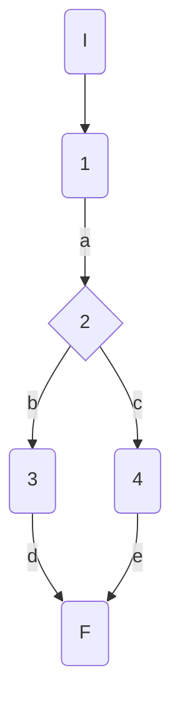

### Complejidad ciclo matica

Numero de regiones
$$
v(G) = R \\
v(G) = 2
$$

Numero de nodos y aristas
$$
v(G) = E - N + 2 \\
v(G) = 6 - 6 + 2
$$
  
Numero de decisiones
$$
v(G) = P + 1 \\
v(G) = 1 + 1
$$

### Casos de prueba


| | Camino   | Entrada   | TC | Salida  |
| --- | --- | --- | --- | --- |
| 1 | I-1a-2b-3d-F | `disciplineId` invalid  = 100| RepositoryMock returns null -> disciplineEntity = null | throw NotFoundElementException("discipline with id 100 does not exist") |
| 2 | I-1a-2c-4e-F | `disciplineId` valid  = 1|  RepositoryMock returns disicplineEntity -> disciplineEntity = {id=1, Name=100M} | return DisciplineModel({id=1, Name=100M}) |

TC1: Verificar que si se intenta recuperar datos de una disciplina con un id inválido 100 (inexistente en la bd) se devuelva la excepción NotFoundElementException con el mensaje "discipline with id 100 does not exist"

TC2: Verificar que si se intenta recuperar datos de una disciplina con un id válido 1, se devuelva la disciplina con los datos correspondientes al id 1: DisciplineModel({id=1, Name=100M})

Camino 1
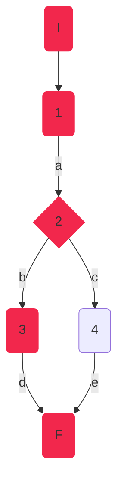
Camino 2
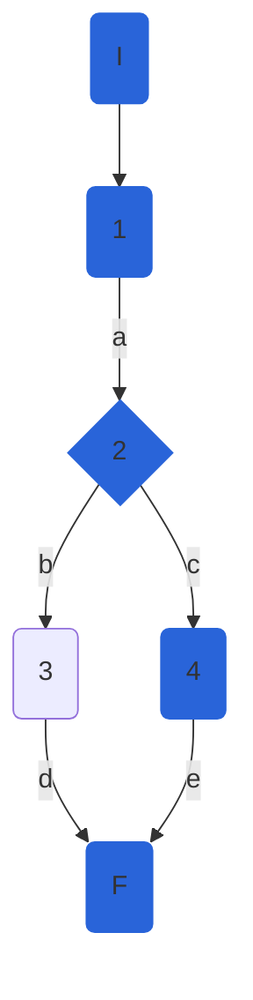
### Pruebas unitarias

```csharp
 //tc1
[Fact]
public void GetDisciplineAsync_InvalidId_ThrowsNotFoundElementException()
{
	var config = new MapperConfiguration(cfg => cfg.AddProfile<AutomapperProfile>());
	var mapper = config.CreateMapper();
	var repositoryMock = new Mock<IAthleteRepository>();
	repositoryMock.Setup(r => r.GetDisciplineAsync(100, false)).ReturnsAsync((DisciplineEntity)null);
	var disciplinesService = new DisciplineService(repositoryMock.Object, mapper);

	var exception = Assert.ThrowsAsync<NotFoundElementException>(async () => await disciplinesService.GetDisciplineAsync(100));
	Assert.Equal("discipline with id 100 does not exist", exception.Result.Message);

}
//tc2
[Fact]
public async Task GetDisciplineAsync_ValidId_ReturnsDisciplineCorrespondingToId()
{
	var config = new MapperConfiguration(cfg => cfg.AddProfile<AutomapperProfile>());
	var mapper = config.CreateMapper();
	var disciplineEntity100M = new DisciplineEntity()
	{
		Id = 1,
		Name = "100M"
	};           
	var repositoryMock = new Mock<IAthleteRepository>();
	repositoryMock.Setup(r => r.GetDisciplineAsync(1, false)).ReturnsAsync(disciplineEntity100M);
	var disciplinesService = new DisciplineService(repositoryMock.Object, mapper);
	var disciplineFromDB = await disciplinesService.GetDisciplineAsync(1);

	Assert.NotNull(disciplineFromDB);
	Assert.IsType<DisciplineModel>(disciplineFromDB);
	Assert.True(1 == disciplineFromDB.Id);
	Assert.True("100M" == disciplineFromDB.Name);
	Assert.Empty(disciplineFromDB.Athletes);
	Assert.Null(disciplineFromDB.Rules);
	Assert.Null(disciplineFromDB.CreationDate);
	Assert.Null(disciplineFromDB.FemaleWorldRecord);
	Assert.Null(disciplineFromDB.MaleWorldRecord);
}
```

## DisciplineService.DeleteDisciplineAsync

### Código Original

```csharp
public async Task DeleteDisciplineAsync(int disciplineId)
{
   await GetDisciplineAsync(disciplineId); //1
   await _athleteRepository.DeleteDisciplineAsync(disciplineId); //1
   var result = await _athleteRepository.SaveChangesAsync(); //1
	if (!result) //2
	{
		throw new Exception("Database Error"); //3
	}           
}
```
Se notó que el código original no devolvía nada. Era de tipo void, por lo tanto se refactorizó el código para poder probarlo correctamente:
#### Código Refactorizado:

```csharp
// SERVICIO
public async Task<bool> DeleteDisciplineAsync(int disciplineId)
{
	bool deleted = false;
	await GetDisciplineAsync(disciplineId);
	deleted = await _athleteRepository.DeleteDisciplineAsync(disciplineId);
	var result = await _athleteRepository.SaveChangesAsync();
	if (!result)
	{
		throw new Exception("Database Error");
	}
	return deleted;
	
}
```
### Grafo

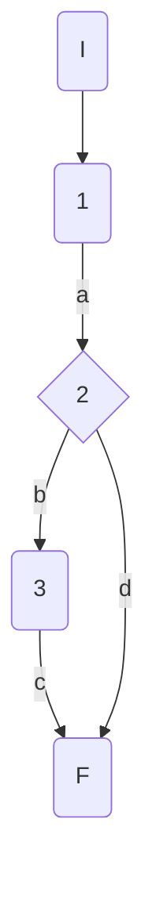

### Complejidad ciclo matica

Numero de regiones
$$
v(G) = R \\
v(G) = 2
$$

Numero de nodos y aristas
$$
v(G) = E - N + 2 \\
v(G) = 5 - 5 + 2
$$
  
Numero de decisiones
$$
v(G) = P + 1 \\
v(G) = 1 + 1
$$

### Casos de prueba


| | Camino   | Entrada   | TC | Salida  |
| --- | --- | --- | --- | --- |
| 1 | I-1a-2b-3c-F | `disciplineId` valid  = 1 | RepositoryMock.SaveChangesAsync returns false -> result=false  | throws exception("Database error") |
| 2 | I-1a-2d-F | `disciplineId` valid  = 1|  RepositoryMock returns true -> result = true | return  true|

TC1: Verificar que si ocurre un error en base de datos al eliminar una disciplina, se lance la excepción con mensaje "Database error"

TC2: Verificar que al eliminar una disciplina correctamente, se devuelva true como resultado

Camino 1
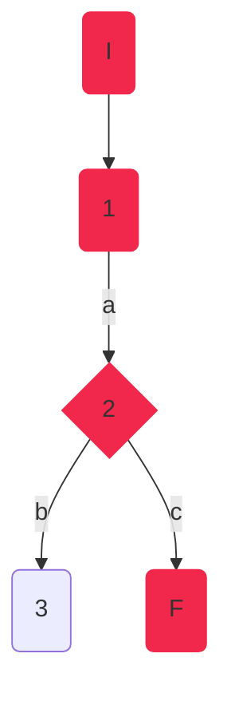
Camino 2
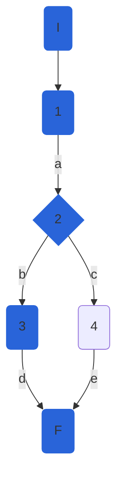
### Pruebas unitarias

```csharp
//tc1
[Fact]
public void DeleteDisciplineAsync_ValidId_ReuturnsDBException()
{
	var config = new MapperConfiguration(cfg => cfg.AddProfile<AutomapperProfile>());
	var mapper = config.CreateMapper();
	var disciplineEntity100M = new DisciplineEntity()
	{
		Id = 100,
		Name = "100M"
	};
	var repositoryMock = new Mock<IAthleteRepository>();
	
	repositoryMock.Setup(r => r.DeleteDisciplineAsync(100));
	repositoryMock.Setup(r => r.SaveChangesAsync()).ReturnsAsync(false);
	repositoryMock.Setup(r => r.GetDisciplineAsync(100, false)).ReturnsAsync(disciplineEntity100M);
	var disciplinesService = new DisciplineService(repositoryMock.Object, mapper);            

	var exception = Assert.ThrowsAsync<Exception>(async () => await disciplinesService.DeleteDisciplineAsync(100));
	Assert.Equal("Database Error", exception.Result.Message);
}
//tc2
[Fact]
public async Task DeleteDisciplineAsync_ValidId_DeletesDisicpline()
{
	var config = new MapperConfiguration(cfg => cfg.AddProfile<AutomapperProfile>());
	var mapper = config.CreateMapper();
	var disciplineEntity100M = new DisciplineEntity()
	{
		Id = 1,
		Name = "100M"
	};
	var repositoryMock = new Mock<IAthleteRepository>();
	repositoryMock.Setup(r => r.DeleteDisciplineAsync(1)).ReturnsAsync(true);
	repositoryMock.Setup(r => r.SaveChangesAsync()).ReturnsAsync(true);
	repositoryMock.Setup(r => r.GetDisciplineAsync(1, false)).ReturnsAsync(disciplineEntity100M);
	var disciplinesService = new DisciplineService(repositoryMock.Object, mapper);
	var result = await disciplinesService.DeleteDisciplineAsync(1);      
	Assert.True(result);
}
```

## DisciplineService.CreateDisciplineAsync

### Código

```csharp
public async Task<DisciplineModel> CreateDisciplineAsync(DisciplineModel discipline)
        {
            var disciplineEntity = _mapper.Map<DisciplineEntity> //1(discipline);
            _athleteRepository.CreateDiscipline(disciplineEntity); //1
            var result = await _athleteRepository.SaveChangesAsync(); //1
            if (result) //2
            {
               return  _mapper.Map<DisciplineModel>(disciplineEntity); //3
            }
            throw new Exception("Database Error"); //4
        }
```

### Grafo


### Complejidad ciclo matica

Numero de regiones
$$
v(G) = R \\
v(G) = 2
$$

Numero de nodos y aristas
$$
v(G) = E - N + 2 \\
v(G) = 5 - 5 + 2
$$
  
Numero de decisiones
$$
v(G) = P + 1 \\
v(G) = 1 + 1
$$

### Casos de prueba


| | Camino   | Entrada   | TC | Salida  |
| --- | --- | --- | --- | --- |
| 1 | I-1a-2b-3c-F | `discipline` new DisciplineModel() { Name = "Long Jump"}; | RepositoryMock.SaveChangesAsync returns false -> result=false  | throws exception("Database error") |
| 2 | I-1a-2d-F | `discipline` new DisciplineModel() { Name = "Long Jump"};|  RepositoryMock returns true -> result = true | return  DisciplineModel() { Id=0, Name = "Long Jump"};|

TC1: verificar que si hay error de base de datos al crear una disciplina, se lance una excepción con el mensaje "Database error".

TC2: verificar que se cree una disciplina con {Name="Long Jump"}, se cree correctamente y se agregue un id : { Id=0, Name = "Long Jump"}

Camino 1

Camino 2

### Pruebas unitarias

```csharp
//tc1
[Fact]
public void CreateDisciplineAsync_ValidId_ReuturnsDBException()
{
	var config = new MapperConfiguration(cfg => cfg.AddProfile<AutomapperProfile>());
	var mapper = config.CreateMapper();
	var longJumpDisciplineEntity = new DisciplineEntity()
	{
		Name = "Long Jump"
	};
	var longJumpDisciplineModel = new DisciplineModel()
	{
		
		Name = "Long Jump"
	};
	var repositoryMock = new Mock<IAthleteRepository>();           
	repositoryMock.Setup(r => r.SaveChangesAsync()).ReturnsAsync(false);
	repositoryMock.Setup(r => r.CreateDiscipline(longJumpDisciplineEntity));
	var disciplinesService = new DisciplineService(repositoryMock.Object, mapper);

	var exception = Assert.ThrowsAsync<Exception>(async () => await disciplinesService.CreateDisciplineAsync(longJumpDisciplineModel));
	Assert.Equal("Database Error", exception.Result.Message);
}
//tc2
[Fact]
public async Task CreateDisciplineAsync_ValidId_CreatesDiscipline()
{
	var config = new MapperConfiguration(cfg => cfg.AddProfile<AutomapperProfile>());
	var mapper = config.CreateMapper();
	var longJumpDisciplineEntity = new DisciplineEntity()
	{
		Id = 0,
		Name = "Long Jump"
	};
	var longJumpDisciplineModel = new DisciplineModel()
	{
		Name = "Long Jump"
	};
	var repositoryMock = new Mock<IAthleteRepository>();
	repositoryMock.Setup(r => r.SaveChangesAsync()).ReturnsAsync(true);
	repositoryMock.Setup(r => r.CreateDiscipline(longJumpDisciplineEntity));
	var disciplinesService = new DisciplineService(repositoryMock.Object, mapper);
	var disciplineCreated = await disciplinesService.CreateDisciplineAsync(longJumpDisciplineModel);
	Assert.NotNull(disciplineCreated);
	Assert.Equal("Long Jump", disciplineCreated.Name);
	Assert.Equal(0, disciplineCreated.Id);
	Assert.Empty(disciplineCreated.Athletes);
	Assert.Null(disciplineCreated.Rules);
	Assert.Null(disciplineCreated.CreationDate);
	Assert.Null(disciplineCreated.FemaleWorldRecord);
	Assert.Null(disciplineCreated.MaleWorldRecord);
	
}
```

## DisciplineService.CheckPersonalBest
### Código

```csharp
public bool CheckPersonalBest(AthleteModel athlete, Decimal mark, string discipline)
    {
        Console.WriteLine(_markComparer);
        var f = _markComparer[discipline];
        bool personalBest = f(athlete.PersonalBest, mark);//1
        if (personalBest)//2
        {
            athlete.PersonalBest = mark;//3
        }
        return personalBest;//4
    }
  
```

### Grafo

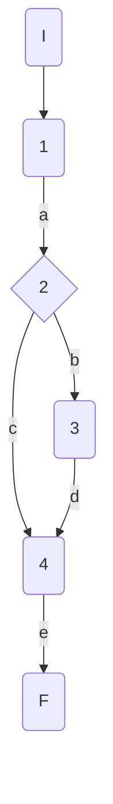

### Complejidad ciclo matica

Numero de regiones
$$
v(G) = R \\
v(G) = 2
$$

Numero de nodos y aristas
$$
v(G) = E - N + 2 \\
v(G) = 6 - 6 + 2
$$
  
Numero de decisiones
$$
v(G) = P + 1 \\
v(G) = 1 + 1
$$

### Casos de prueba

athlete, mark, discipline

| | Camino   | Entrada   | TC | Salida  |
| --- | --- | --- | --- | --- |
| 1 | I-1a-2c-4e-F | `athlete`= {Id=1,Nationality="USA", Name="Sydney Maclaughlin", Gender="f", Points=1000, PB=52.75m} `mark`=53.05m `discipline`="400MH"| personalBest = false| false|
| 2 | I-1a-2b-3d-4e-F | `athlete`={Id=1,Nationality="USA", Name="Sydney Maclaughlin", Gender="f", Points=1000, PB=52.75m}`mark`=51.79m `discipline`="400MH"| personalBest = true| true|

TC1: Verificar que si la atleta {Id=1,Nationality="USA", Name="Sydney Maclaughlin", Gender="f", Points=1000, PB=52.75m} tiene una marca = 53.05, sin superar su marca personal, devuelva false

TC2: Verificar que si la atleta {Id=1,Nationality="USA", Name="Sydney Maclaughlin", Gender="f", Points=1000, PB=52.75m} tiene una marca = 51.79, superando su mejor marca personal, devuelva true

Camino 1
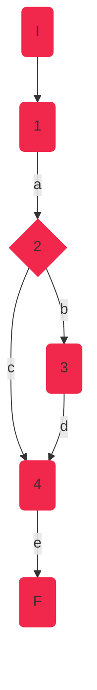
Camino 2
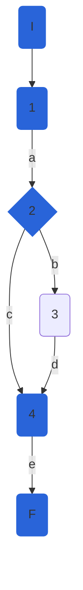

### Pruebas unitarias

```csharp
//tc1
[Fact]
public void CheckPersonalBest_NoPersonalBest()
{
	var config = new MapperConfiguration(cfg => cfg.AddProfile<AutomapperProfile>());
	var mapper = config.CreateMapper();
	var sydney = new AthleteModel()
	{
		Id=1,Nationality="USA", Name="Sydney Maclaughlin", Gender=Gender.F, Points=1000, PersonalBest=52.75m
	};
	var mark = 53.05m;
	string discipline = "400MH";
	var repositoryMock = new Mock<IAthleteRepository>();
	var disciplinesService = new DisciplineService(repositoryMock.Object, mapper);

	var result = disciplinesService.CheckPersonalBest(sydney,mark, discipline);
	Assert.False(result);            
}

//tc2
[Fact]
public void CheckPersonalBest_PersonalBest()
{
	var config = new MapperConfiguration(cfg => cfg.AddProfile<AutomapperProfile>());
	var mapper = config.CreateMapper();
	var sydney = new AthleteModel()
	{
		Id = 1,
		Nationality = "USA",
		Name = "Sydney Maclaughlin",
		Gender = Gender.F,
		Points = 1000,
		PersonalBest = 52.75m
	};
	var mark = 51.79m;
	string discipline = "400MH";
	var repositoryMock = new Mock<IAthleteRepository>();
	var disciplinesService = new DisciplineService(repositoryMock.Object, mapper);

	var result = disciplinesService.CheckPersonalBest(sydney, mark, discipline);
	Assert.True(result);
}
```

## DisciplineService.Mark

### Código

```csharp
public Decimal Mark(AthleteModel athlete)
{
	Decimal mark;//1
	if (athlete.SeasonBest != null)//2
	{
		mark = GetRandomMark(athlete.SeasonBest - 0.2m, athlete.SeasonBest + 0.2m);//3
	}
	else
	{
		mark = GetRandomMark(athlete.PersonalBest - 0.2m, athlete.PersonalBest + 0.5m);//4
	}
	return mark;//5
}
```

### Grafo

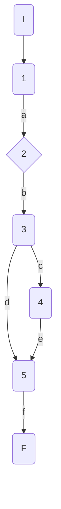

### Complejidad ciclo matica

Numero de regiones
$$
v(G) = R \\
v(G) = 2
$$

Numero de nodos y aristas
$$
v(G) = E - N + 2 \\
v(G) = 7 - 7 + 2
$$
  
Numero de decisiones
$$
v(G) = P + 1 \\
v(G) = 1 + 1
$$

### Casos de prueba

| | Camino   | Entrada   | TC | Salida  |
| --- | --- | --- | --- | --- |
| 1 | I-1a-2b-3h-4d-5f-6g-F | `athlete`={Id=1,Nationality="USA", Name="Sydney Maclaughlin", Gender="f", Points=1000, PersonalBest=52.75m, SeasonBest=52.75m} | athlete.SeasonBest!=null = false| {52.55-52.95}|
| 2 | I-1a-2c-4d-5f-6g-F | `athlete`={Id=1,Nationality="USA", Name="Sydney Maclaughlin", Gender="f", Points=1000, PersonalBest=52.75m, SeasonBest=null} | athlete.SeasonBest!=null -> true | {52.55-53.25}|

TC1: Verificar que si la atleta {Id=1,Nationality="USA", Name="Sydney Maclaughlin", Gender="f", Points=1000, PersonalBest=52.75m, SeasonBest=52.75m}, contiene marca de temporada, la marca devuelta esté en el rango 52.55-52.95

TC2: Verificar que si la atleta {Id=1,Nationality="USA", Name="Sydney Maclaughlin", Gender="f", Points=1000, PersonalBest=52.75m, SeasonBest=null}, NO TIENE marca de temporada, la marca devuelta esté en el rango 52.55-53.25

Camino 1

Camino 2

### Pruebas unitarias

```csharp
//tc1
[Fact]
public void Mark_ReturnsAthleteMark_SeasonBestIncluded()
{
	var config = new MapperConfiguration(cfg => cfg.AddProfile<AutomapperProfile>());
	var mapper = config.CreateMapper();
	var sydney = new AthleteModel()
	{
		Id = 1,
		Nationality = "USA",
		Name = "Sydney Maclaughlin",
		Gender = Gender.F,
		Points = 1000,
		PersonalBest = 52.75m,
		SeasonBest = 52.75m
	};
	var repositoryMock = new Mock<IAthleteRepository>();
	var disciplinesService = new DisciplineService(repositoryMock.Object, mapper);

	var result = disciplinesService.Mark(sydney);
	Assert.InRange(result, 52.55m, 52.94m);// Random.Next(inclusivo, exclusivo) - InRange(inclusivo, inclusivo)
}

//tc2
[Fact]
public void Mark_ReturnsAthleteMark_NoSeasonBest()
{
	var config = new MapperConfiguration(cfg => cfg.AddProfile<AutomapperProfile>());
	var mapper = config.CreateMapper();
	var sydney = new AthleteModel()
	{
		Id = 1,
		Nationality = "USA",
		Name = "Sydney Maclaughlin",
		Gender = Gender.F,
		Points = 1000,
		PersonalBest = 52.75m,
		SeasonBest = null
	};
	var repositoryMock = new Mock<IAthleteRepository>();
	var disciplinesService = new DisciplineService(repositoryMock.Object, mapper);

	var result = disciplinesService.Mark(sydney);
	Assert.InRange(result, 52.55m, 53.24m);
}
```

## DisciplineService.CheckSeasonBest

### Código

```csharp
public bool CheckSeasonBest(AthleteModel athlete, Decimal mark, string discipline)
{
	bool seasonBest = _markComparer[discipline](athlete.SeasonBest, mark);//1
	if (athlete.SeasonBest == null)//2
	{
		seasonBest = true;//3
	}
	if (seasonBest)//4
	{
		athlete.SeasonBest = mark;//5
	}
	return seasonBest;//6
}
  
```

### Grafo

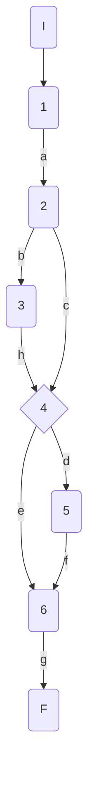

### Complejidad ciclo matica

Numero de regiones
$$
v(G) = R \\
v(G) = 3
$$

Numero de nodos y aristas
$$
v(G) = E - N + 2 \\
v(G) = 9 - 8 + 2
$$
  
Numero de decisiones
$$
v(G) = P + 1 \\
v(G) = 2 + 1
$$

### Casos de prueba

athlete, mark, discipline

| | Camino   | Entrada   | TC | Salida  |
| --- | --- | --- | --- | --- |
| 1 | I-1a-2b-3h-4d-5f-6g-F | `athlete`={Id=1,Nationality='USA', Name='Sydney Maclaughlin', Gender='f', Points=1000, PersonalBest=52.75, SeasonBest=null}`mark`=51.79 `discipline`='400MH'| athlete.SeasonBest=null -> seasonBest = true| true |
| 2 | I-1a-2c-4d-5f-6g-F | `athlete`={Id=1,Nationality='USA', Name='Sydney Maclaughlin', Gender='f', Points=1000, PersonalBest=52.75, SeasonBest=52}`mark`=51.79 `discipline`='400MH'| athlete.SeasonBest!=null -> seasonBet = true| true |
| 3 | I-1a-2c-4e-6g-F | `athlete`={Id=1,Nationality='USA', Name='Sydney Maclaughlin', Gender='f', Points=1000, PersonalBest=52.75, SeasonBest=52}`mark`=52.79 `discipline`='400MH'| athlete.SeasonBest!=null -> seasonBet = false| false |

TC1: Verificar que si la atleta {Id=1,Nationality='USA', Name='Sydney Maclaughlin', Gender='f', Points=1000, PersonalBest=52.75, SeasonBest=null}, inicialmente sin mejor marca de temporada, realiza una marca de 51.79 en la disciplina 400MH, devuelva true

TC2: Verificar que si la atleta {Id=1,Nationality='USA', Name='Sydney Maclaughlin', Gender='f', Points=1000, PersonalBest=52.75, SeasonBest=52}, con mejor marca de temporada 52, realiza una marca de 51.79 en la disciplina 400MH, mejor a su mejor marca de temporada previa, devuelva true

TC3: Verificar que si la atleta {Id=1,Nationality='USA', Name='Sydney Maclaughlin', Gender='f', Points=1000, PersonalBest=52.75, SeasonBest=52}, con mejor marca de temporada 52, realiza una marca de 52.79 en la disciplina 400MH, peor a su mejor marca de temporada previa, devuelva false

Camino 1
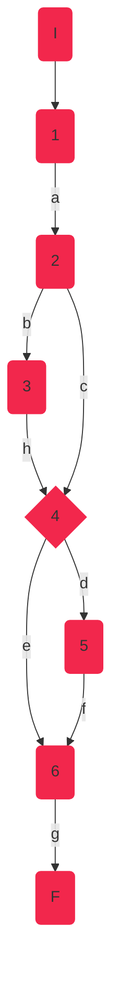
Camino 2
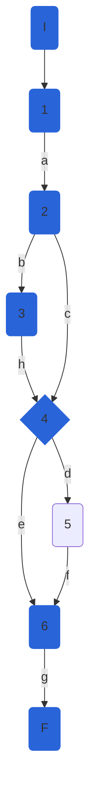
Camino 3
```mermaid
graph TD
    I(I):::c3 --> 1(1):::c3
    1 --a--> 2(2):::c3
    2 --b--> 3(3):::c3
    3 --h--> 4{4}:::c3
    2 --c--> 4{4}:::c3     
    4 --d--> 5(5):::c3
    4 --e--> 6(6) 
    5 --f--> 6(6):::c3
    6 --g--> F(F):::c3
classDef c3 fill:#B2A2FA, stroke:#B2A2FA;
```
### Pruebas unitarias

```csharp
//tc1
[Fact]
public void CheckSesasonBest_SeasonBestNull_ReturnsTrue()
{
	var config = new MapperConfiguration(cfg => cfg.AddProfile<AutomapperProfile>());
	var mapper = config.CreateMapper();
	var sydney = new AthleteModel()
	{
		Id = 1,
		Nationality = "USA",
		Name = "Sydney Maclaughlin",
		Gender = Gender.F,
		Points = 1000,
		PersonalBest = 52.75m,
		SeasonBest = null
	};
	var disciplineName = "400MH";
	var mark = 51.76m;
	var repositoryMock = new Mock<IAthleteRepository>();
	var disciplinesService = new DisciplineService(repositoryMock.Object, mapper);

	var result = disciplinesService.CheckSeasonBest(sydney,mark,disciplineName);
	Assert.True(result);
}
//tc2
[Fact]
public void CheckSesasonBest_SeasonBestImproved_ReturnsTrue()
{
	var config = new MapperConfiguration(cfg => cfg.AddProfile<AutomapperProfile>());
	var mapper = config.CreateMapper();
	var sydney = new AthleteModel()
	{
		Id = 1,
		Nationality = "USA",
		Name = "Sydney Maclaughlin",
		Gender = Gender.F,
		Points = 1000,
		PersonalBest = 52m,
		SeasonBest = 51.79m
	};
	var disciplineName = "400MH";
	var mark = 51.76m;
	var repositoryMock = new Mock<IAthleteRepository>();
	var disciplinesService = new DisciplineService(repositoryMock.Object, mapper);

	var result = disciplinesService.CheckSeasonBest(sydney, mark, disciplineName);
	Assert.True(result);
}

//tc3
[Fact]
public void CheckSesasonBest_SeasonBestNotImproved_ReturnsFalse()
{
	var config = new MapperConfiguration(cfg => cfg.AddProfile<AutomapperProfile>());
	var mapper = config.CreateMapper();
	var sydney = new AthleteModel()
	{
		Id = 1,
		Nationality = "USA",
		Name = "Sydney Maclaughlin",
		Gender = Gender.F,
		Points = 1000,
		PersonalBest = 52.75m,
		SeasonBest = 52m
	};
	var disciplineName = "400MH";
	var mark = 52.79m;
	var repositoryMock = new Mock<IAthleteRepository>();
	var disciplinesService = new DisciplineService(repositoryMock.Object, mapper);

	var result = disciplinesService.CheckSeasonBest(sydney, mark, disciplineName);
	Assert.False(result);
}
```

## DisciplineService.UpdateWorldRecord

### Código incial

```csharp
 async Task updateWorldRecord(int disciplineId,decimal worldRecord, string gender)
{
	if (gender.ToLower() == "f")//1
	{
		await _athleteRepository.UpdateDisciplineAsync(disciplineId, new DisciplineEntity()
		{
			FemaleWorldRecord = worldRecord
		});//2
	}
	else
	{
		await _athleteRepository.UpdateDisciplineAsync(disciplineId, new DisciplineEntity()
		{
			MaleWorldRecord = worldRecord
		});//3
	}
}
```
### NOTA: 
Este método no devolvía ningún valor, por lo tanto, para poder probarlo y garantizar que funcione correctamente, se convirtió este método a bool. Para poder realizar este cambio, se realizó el cambio correspondiente en el repositorio, ya que el resultado dependía del mismo y este también era de tipo void. Los cambios realizados se muestran a continuación:

### REPOSITORIO:
```csharp
public async Task<bool> UpdateDisciplineAsync(int disciplineId, DisciplineEntity discipline)
{
	//_dbContext.Entry(discipline).State = EntityState.Modified;
	bool updated = true;
	var disciplineToUpdate = await _dbContext.Disciplines.FirstOrDefaultAsync(d => d.Id == disciplineId);
	if (disciplineToUpdate == null) updated = false;
	
	disciplineToUpdate.Name = discipline.Name ?? disciplineToUpdate.Name;
	disciplineToUpdate.Rules = discipline.Rules ?? disciplineToUpdate.Rules;
	disciplineToUpdate.CreationDate = discipline.CreationDate ?? disciplineToUpdate.CreationDate;
	disciplineToUpdate.FemaleWorldRecord = discipline.FemaleWorldRecord ?? disciplineToUpdate.FemaleWorldRecord;
	disciplineToUpdate.MaleWorldRecord = discipline.MaleWorldRecord ?? disciplineToUpdate.MaleWorldRecord;
	 
	return updated;
   
}
    
```

### SERVICIO (MÉTODO CORREGIDO):
```csharp
async Task<bool> updateWorldRecord(int disciplineId,decimal worldRecord, string gender)
{
	bool updated = false;
	if (gender.ToLower() == "f")
	{
		updated = await _athleteRepository.UpdateDisciplineAsync(disciplineId, new DisciplineEntity()
		{
			FemaleWorldRecord = worldRecord
		});

	}
	else
	{
		updated = await _athleteRepository.UpdateDisciplineAsync(disciplineId, new DisciplineEntity()
		{
			MaleWorldRecord = worldRecord
		});
	}
	return updated;

}
    
```

### Grafo

```mermaid
graph TD
    I(I) --> 1(1)
    1 --a--> 2{2}
    2 --b--> F(F)
    2 --c--> 3(3)
    3 --d--> F(F)
```

### Complejidad ciclo matica

Numero de regiones
$$
v(G) = R \\
v(G) = 2
$$

Numero de nodos y aristas
$$
v(G) = E - N + 2 \\
v(G) = 5 - 5 + 2
$$
  
Numero de decisiones
$$
v(G) = P + 1 \\
v(G) = 1 + 1
$$

### Casos de prueba

| | Camino   | Entrada   | TC | Salida  |
| --- | --- | --- | --- | --- |
| 1 | I-1a-2c-3d-F | `disciplineId`=1 `worldRecord`=51.7 `gender`='f' | gender.ToLower() == "f" = true| true |
| 2 | I-1a-2b-F | `disciplineId`=1 `worldRecord`=51.7 `gender`='m' | gender.ToLower() == "f" = false| true |

TC1: Verificar que si se actualiza el record mundial de género femenino, y no se actualiza correctamente en la base de datos, devuelva false

TC2: Verificar que si se actualiza el record mundial de género masculino, y no se actualiza correctamente en la base de datos, devuelva false

Camino 1
```mermaid
graph TD
    I(I):::c1 --> 1(1):::c1 
    1 --a--> 2{2}:::c1 
    2 --b--> F(F)
    2 --c--> 3(3):::c1 
    3 --d--> F(F):::c1 
classDef c1 fill:#F2274C, stroke:#F2274C;
```
Camino 2
```mermaid
graph TD
    I(I):::c2 --> 1(1):::c2
    1 --a--> 2{2}:::c2
    2 --b--> F(F):::c2
    2 --c--> 3(3) 
    3 --d--> F(F) 
classDef c2 fill:#2964D9, stroke:#2964D9;
```
### Pruebas unitarias
Primero se realizaron 2 pruebas unitarias para esta parte:
```csharp
//tc1
[Fact]
public async Task UpdateWorldRecord_ReturnsTrue()
{
	var config = new MapperConfiguration(cfg => cfg.AddProfile<AutomapperProfile>());
	var mapper = config.CreateMapper();
	var disciplineId = 1;
	var worldRecord = 51.7m;
	var gender = "f";
	var repositoryMock = new Mock<IAthleteRepository>();
	var disciplinesService = new DisciplineService(repositoryMock.Object, mapper);

	var result = await disciplinesService.updateWorldRecord(disciplineId, worldRecord, gender);
	Assert.False(result);
}

//tc2
[Fact]
public async Task UpdateWorldRecord_ReturnsFalse()
{
	var config = new MapperConfiguration(cfg => cfg.AddProfile<AutomapperProfile>());
	var mapper = config.CreateMapper();
	var disciplineId = 1;
	var worldRecord = 51.7m;
	var gender = "m";
	var repositoryMock = new Mock<IAthleteRepository>();
	var disciplinesService = new DisciplineService(repositoryMock.Object, mapper);

	var result = await disciplinesService.updateWorldRecord(disciplineId, worldRecord, gender);
	Assert.False(result);
}
```
Sin embargo, después de investigar y descubrir el poder de XUnit, se combinaron estas pruebas utilizando el decorador "Theory" en vez de "Fact", que permite agregar entradas a los tests:
```csharp
[Theory]
[InlineData(1,51.7,"f")] //tc1
[InlineData(1, 51.7, "m")] //tc2    
public async Task UpdateWorldRecord_ReturnsTrue(int disciplineId, Decimal worldRecord, string gender)
{
	var config = new MapperConfiguration(cfg => cfg.AddProfile<AutomapperProfile>());
	var mapper = config.CreateMapper();
	var repositoryMock = new Mock<IAthleteRepository>();
	var disciplinesService = new DisciplineService(repositoryMock.Object, mapper);

	var result = await disciplinesService.updateWorldRecord(disciplineId, worldRecord, gender);
	Assert.False(result);
} 
```      

## DisciplineService.GetWorldRankingsAsync

### Código

```csharp
public async Task<IEnumerable<AthleteModel>> GetWorldRankingsAsync(int disciplineId, string gender = "all")
{
	
	if (!_allowedGenderValues.Contains(gender.ToLower())) //1
		throw new InvalidElementOperationException($"invalid gender value : {gender}. The allowed values for param are: {string.Join(',', _allowedGenderValues)}"); //2
	var discipline = await _athleteRepository.GetDisciplineAsync(disciplineId, true);
	var athletes = _mapper.Map < IList < AthleteModel >> (discipline.Athletes.ToList());
	athletes = athletes.OrderByDescending(a => a.Points).ToList(); //3
	if (gender != "all") //4
	{
		athletes =  athletes.Where(a => a.Gender.ToString() == gender).ToList(); //5
	}
	//var listAthletes = _mapper.Map<IList<AthleteModel>>(athletes);
	return athletes; //6
	
}
```

### Grafo

```mermaid
graph TD
    I(I) --> 1{1}
    1 --a--> 2(2)
    2 --b--> F(F)
    1 --c--> 3(3)
    3 --d--> 4{4}
    4 --e--> 5(5)
    5 --f--> 6(6)
    4 --g--> 6(6)
    6 --h--> F(F)
```

### Complejidad ciclo matica

Numero de regiones
$$
v(G) = R \\
v(G) = 3
$$

Numero de nodos y aristas
$$
v(G) = E - N + 2 \\
v(G) = 9 - 8 + 2
$$
  
Numero de decisiones
$$
v(G) = P + 1 \\
v(G) = 3 + 1
$$

### Casos de prueba


| | Camino   | Entrada   | TC | Salida  |
| --- | --- | --- | --- | --- |
| 1 | I-1a-2b-F | `disciplineId`=1 `gender`='k' | !allowed_genders.Contains(gender.to_lower()) = true | throws exception("throw new InvalidElementOperationException($"invalid gender value : k. The allowed values for param are: f,m,all") |
| 2 | I-1c-3d-4e-5f-6h-F | `disciplineId`=1 `gender`='f' | !allowed_genders.Contains(gender.to_lower()) = false ==> gender != "all" == true repositoryMock.GetDisciplineAsync returns {id=1, Name='400M', FemaleWorldRecord=7.52, Athletes = [{Id=1,Nationality='USA', Name='Sydney Maclaughlin', Gender='f', Points=1000}, {Id=2,Nationality='USA', Name='Allyson Felix', Gender='f', Points=1500}, , {Id=3,Nationality='Jamaica', Name='Usain Bolt', Gender='m'}]}| return [{Id=2,Nationality='USA', Name='Allyson Felix', Gender='f', Points=1500},{Id=1,Nationality='USA', Name='Sydney Maclaughlin', Gender='f', Points=1000}]|
| 3 | I-1c-3d-4g-6h-F | `disciplineId`=1 `gender`='all' | !allowed_genders.Contains(gender.to_lower()) = false ==> gender != "all" == false repositoryMock.GetDisciplineAsync returns {id=1, Name='400M', FemaleWorldRecord=7.52, Athletes = [{Id=1,Nationality='USA', Name='Sydney Maclaughlin', Gender='f', Points=1000}, {Id=2,Nationality='USA', Name='Allyson Felix', Gender='f', Points=1500}, , {Id=3,Nationality='Jamaica', Name='Usain Bolt', Gender='m', Points = 2000}]}| return [{Id=3,Nationality='Jamaica', Name='Usain Bolt', Gender='m', Points = 2000}, {Id=2,Nationality='USA', Name='Allyson Felix', Gender='f', Points=1500},{Id=1,Nationality='USA', Name='Sydney Maclaughlin', Gender='f', Points=1000}]|

TC1: Verificar que si el id de la disciplina es 1 y el género es k, se lance una excepción InvalidElementOperationException con el mensaje: "invalid gender value : k. The allowed values for param are: f,m,all"

TC2: Verificar que si el id de la disciplina es 1 y el género es f y la lista de atletas para la disciplina con id 1 es: `[{Id=1,Nationality='USA', Name='Sydney Maclaughlin', Gender='f', Points=1000}, {Id=2,Nationality='USA', Name='Allyson Felix', Gender='f', Points=1500}, , {Id=3,Nationality='Jamaica', Name='Usain Bolt', Gender='m'}]`, devuelva la lista filtrada por género f y ordenada por puntos: `[{Id=2,Nationality='USA', Name='Allyson Felix', Gender='f', Points=1500},{Id=1,Nationality='USA', Name='Sydney Maclaughlin', Gender='f', Points=1000}]`

TC3: Verificar que si el id de la disciplina es 1 y el género es all y la lista de atletas para la disciplina con id 1 es: `[{Id=1,Nationality='USA', Name='Sydney Maclaughlin', Gender='f', Points=1000}, {Id=2,Nationality='USA', Name='Allyson Felix', Gender='f', Points=1500}, , {Id=3,Nationality='Jamaica', Name='Usain Bolt', Gender='m', Points = 2000}]`, devuelve la lista de atletas ordenada por puntos de forma descendente:  `[{Id=3,Nationality='Jamaica', Name='Usain Bolt', Gender='m', Points = 2000}, {Id=2,Nationality='USA', Name='Allyson Felix', Gender='f', Points=1500},{Id=1,Nationality='USA', Name='Sydney Maclaughlin', Gender='f', Points=1000}]
`
Camino 1
```mermaid
graph TD
    I(I):::c1 --> 1{1}:::c1
    1 --a--> 2(2):::c1
    2 --b--> F(F):::c1
    1 --c--> 3(3)
    3 --d--> 4{4}
    4 --e--> 5(5)
    5 --f--> 6(6)
    4 --g--> 6(6)
    6 --h--> F(F)
classDef c1 fill:#F2274C, stroke:#F2274C;
```
Camino 2
```mermaid
graph TD
    I(I):::c2 --> 1{1}:::c2
    1 --a--> 2(2)
    2 --b--> F(F)
    1 --c--> 3(3):::c2
    3 --d--> 4{4}:::c2
    4 --e--> 5(5):::c2
    5 --f--> 6(6):::c2
    4 --g--> 6(6)
    6 --h--> F(F):::c2
classDef c2 fill:#2964D9, stroke:#2964D9;
```
Camino 3
```mermaid
graph TD
    I(I):::c3 --> 1{1}:::c3
    1 --a--> 2(2)
    2 --b--> F(F)
    1 --c--> 3(3):::c3
    3 --d--> 4{4}:::c3
    4 --e--> 5(5)
    5 --f--> 6(6):::c3
    4 --g--> 6(6)
    6 --h--> F(F):::c3
classDef c3 fill:#B2A2FA, stroke:#B2A2FA;
```
### Pruebas unitarias

```csharp
//tc1
[Fact]
public void GetWorldRankingAsync_InvalidGender_ReturnsInvalidElementOperationException()
{
	var config = new MapperConfiguration(cfg => cfg.AddProfile<AutomapperProfile>());
	var mapper = config.CreateMapper();
	var disciplineId = 1;
	var gender = "k";
	var repositoryMock = new Mock<IAthleteRepository>();
	//repositoryMock.Setup(d=>d.GetDisciplineAsync(1,true)).ReturnsAsync()
	var disciplinesService = new DisciplineService(repositoryMock.Object, mapper);

	var exception = Assert.ThrowsAsync<InvalidElementOperationException>(async () => await disciplinesService.GetWorldRankingsAsync(disciplineId, gender));
	Assert.Equal("invalid gender value : k. The allowed values for param are: f,m,all", exception.Result.Message);
}

//tc2
[Fact]
public async Task GetWorldRankingAsync_ReturnsDisciplineWorldRankings()
{
	var config = new MapperConfiguration(cfg => cfg.AddProfile<AutomapperProfile>());
	var mapper = config.CreateMapper();
	var disciplineId = 1;
	var gender = "f";
	var repositoryMock = new Mock<IAthleteRepository>();
	repositoryMock.Setup(d => d.GetDisciplineAsync(1, true)).ReturnsAsync(
		new DisciplineEntity()
		{
			Id = 1,
			Name = "400M",
			FemaleWorldRecord = 7.52m,
			Athletes = new List<AthleteEntity>(){
				new AthleteEntity(){ Id = 1,Nationality = "USA", Name = "Sydney Maclaughlin", Gender = Gender.F, Points = 1000},
				new AthleteEntity(){ Id = 2,Nationality = "USA", Name = "Allyson Felix", Gender = Gender.F, Points = 1500},
				new AthleteEntity(){ Id = 3,Nationality = "Jamaica", Name = "Usain Bolt", Gender = Gender.M}
			}
		});
	var disciplinesService = new DisciplineService(repositoryMock.Object, mapper);
	
	var worldRankings = await disciplinesService.GetWorldRankingsAsync(disciplineId, gender);
	Assert.NotNull(worldRankings);
	Assert.NotEmpty(worldRankings);
	Assert.Equal(2,worldRankings.Count());
	Assert.Contains(worldRankings, athlete => athlete.Id == 1);
	Assert.Contains(worldRankings, athlete => athlete.Id == 2);
	Assert.DoesNotContain(worldRankings, athlete => athlete.Id == 3);
	Assert.All(worldRankings, athlete => Assert.Equal(Gender.F,athlete.Gender));
	
}
//tc3
[Fact]
public async Task GetWorldRankingAsync_GenderAll_ReturnsDisciplineWorldRankings()
{
	var config = new MapperConfiguration(cfg => cfg.AddProfile<AutomapperProfile>());
	var mapper = config.CreateMapper();
	var disciplineId = 1;
	var gender = "all";
	var repositoryMock = new Mock<IAthleteRepository>();
	repositoryMock.Setup(d => d.GetDisciplineAsync(1, true)).ReturnsAsync(
		new DisciplineEntity()
		{
			Id = 1,
			Name = "400M",
			FemaleWorldRecord = 7.52m,
			Athletes = new List<AthleteEntity>(){
				new AthleteEntity(){ Id = 1,Nationality = "USA", Name = "Sydney Maclaughlin", Gender = Gender.F, Points = 1000},
				new AthleteEntity(){ Id = 2,Nationality = "USA", Name = "Allyson Felix", Gender = Gender.F, Points = 1500},
				new AthleteEntity(){ Id = 3,Nationality = "Jamaica", Name = "Usain Bolt", Gender = Gender.M, Points = 2000}
			}
		});
	var disciplinesService = new DisciplineService(repositoryMock.Object, mapper);

	var worldRankings = await disciplinesService.GetWorldRankingsAsync(disciplineId, gender);
	Assert.NotNull(worldRankings);
	Assert.NotEmpty(worldRankings);
	Assert.Equal(3, worldRankings.Count());
	Assert.Contains(worldRankings, athlete => athlete.Id == 1);
	Assert.Contains(worldRankings, athlete => athlete.Id == 2);
	Assert.Contains(worldRankings, athlete => athlete.Id == 3);
	Assert.Equal("Usain Bolt",worldRankings.First().Name);
	Assert.Equal("Sydney Maclaughlin", worldRankings.Last().Name);            
}
```

## DisciplineService.CheckWorldRecord

### Código

```csharp
bool checkWorldRecord(string gender,DisciplineModel discipline, RaceInfoModel competingResults,out decimal worldRecord)
{
	var bestMark = competingResults.GetHighestMark();//1
	if (_best3MarksFilter[discipline.Name])//2
	{
		bestMark = competingResults.GetLowestMark();//3
	}
	worldRecord = bestMark;//4
	if (gender.ToLower() == "f")//5
	{
		if (_best3MarksFilter[discipline.Name])//6
		{
			return discipline.FemaleWorldRecord > bestMark;//7
		}
		return discipline.FemaleWorldRecord < bestMark;//8
	}

	if (gender.ToLower() == "m")//9
	{
		if (_best3MarksFilter[discipline.Name])//10
		{
			return discipline.MaleWorldRecord > bestMark;//11
		}
		return discipline.MaleWorldRecord < bestMark;//12
	}
	return false;//13

}
```

### Grafo

```mermaid
graph TD
    I(I) --> 1(1)
    1 --a--> 2{2}
    2 --b--> 3(3)
    3 --p--> 4(4)
    2 --c--> 4(4)
    4 --d--> 5{5}
    5 --e--> 6{6}
    6 --f--> 7(7)
    7 --h--> F(F)
    6 --g--> 8(8)
    8 --i--> F(F)
    5 --f--> 9{9}
    9 --j--> 10{10}
    9 --k--> 13(13)
    10 --l--> 11(11)
    10 --m--> 12(12)
    11 --p--> F(F)
    12 --n--> F(F)
    13 --r--> F(F)
```

### Complejidad ciclo matica

Numero de regiones
$$
v(G) = R \\
v(G) = 6
$$

Numero de nodos y aristas
$$
v(G) = E - N + 2 \\
v(G) = 19 - 15 + 2
$$
  
Numero de decisiones
$$
v(G) = P + 1 \\
v(G) = 5 + 1
$$

### Casos de prueba

| | Camino   | Entrada   | TC | Salida  |
| --- | --- | --- | --- | --- |
| 1 | I-1a-2b-3p-4d-5e-6f-7h-F | `discipline`= {Id=1, Name="400MH", FemaleWorldRecord=51.9m}, `gender`="f", `competingResults = new List<RaceAthleteModel>(){ new RaceAthleteModel(){ Id = 1,Country = "USA", Name = "Sydney Maclaughlin", Mark=51.8m, PB=true, SB=true} ,new RaceAthleteModel(){ Id = 2,Country = "USA", Name = "Allyson Felix", Mark=52.98m, PB=false, SB=true}, new RaceAthleteModel(){ Id = 3,Country = "Netherlands", Name = "Femke Bol", Mark=53.8m, PB=false, SB=false}}` |` _best3MarksFilter["400MH"]==true -> true`, `gender.ToLower=="f"->true`, `_best3MarksFilter["400MH"]==true -> true` | `return 51.9>51.8 = true` |  
| 2 | I-1a-2b-3p-4d-5f-9j-10l-11p-F |  `discipline= {Id=1, Name="100M", MaleWorldRecord= 9.19m}`, `gender`="m", `competingResults = new List<RaceAthleteModel>(){                        new RaceAthleteModel(){ Id = 1,Country = "Jamaica", Name = "Usain Bolt", Mark=9.5m, PB=false, SB=true}, new RaceAthleteModel(){ Id = 2,Country = "Jamaica", Name = "Johann Blake", Mark=10.2m, PB=false, SB=true}, new RaceAthleteModel(){ Id = 3,Country = "Italy", Name = "Lamont Marcell Jacobs", Mark=9.9m, PB=true, SB=false}}` | `_best3MarksFilter["100M"]==true -> true, gender.ToLower=="f"->false,gender.ToLower=="m"->true, _best3MarksFilter["100M"]==true ->true` | `return 9.19>9.5 = false` | 
| 3 | I-1a-2c-4d-5e-6g-8i-F |  `discipline`= {Id=1, Name="Long Jump", FemaleWorldRecord = 7.52m}, `gender`="f", `competingResults new List<RaceAthleteModel>(){ new RaceAthleteModel(){ Id = 1,Country = "USA", Name = "Tara Davis", Mark=7.44m, PB=true, SB=true},new RaceAthleteModel(){ Id = 2,Country = "USA", Name = "Brittney Reese", Mark=7.35m, PB=false, SB=true},new RaceAthleteModel(){ Id = 3,Country = "Netherlands", Name = "Jackie Joyner-Kersee", Mark=7.28m, PB=false, SB=false}}` | `_best3MarksFilter["Long Jump"]==true -> false, gender.ToLower=="f"->false,gender.ToLower=="m"->true, _best3MarksFilter["100M"]==true -> false` | `return 7.52<7.44 = false` |  
| 4 | I-1a-2c-4d-5e-6g-8i-F |  `discipline`= {Id=1, Name="Long Jump", MaleWorldRecord="8.95"}, `gender`="m", `competingResults new List<RaceAthleteModel>(){  new RaceAthleteModel(){ Id = 1,Country = "Greece", Name = "Tentoglou Miltiadis", Mark=8.98m, PB=true, SB=true},new RaceAthleteModel(){ Id = 2,Country = "Cuba", Name = "Juan Miguel Echevarria", Mark=9.76m, PB=false, SB=true}, new RaceAthleteModel(){ Id = 3,Country = "Spain", Name = "Eusebio Cáceres", Mark=8.46m, PB=false, SB=false} } `| `_best3MarksFilter["Long Jump"]==true -> false, gender.ToLower=="f"->false,gender.ToLower=="m"->true, _best3MarksFilter["Long Jump"]==true -> false` | `return 7.95<8.98= true` |         
| 5 | I-1a-2d-4e-5f-9r-13r-F |  `discipline`= {Id=1, Name="Long Jump", MaleWorldRecord="m"}, `gender`="all", `competingResults new List<RaceAthleteModel>(){};` |`_best3MarksFilter["Long Jump"]==true -> false, gender.ToLower=="f"->false,gender.ToLower=="m"->false`| `return false` | 

TC1: Verificar que si los resultados de la competencia son: 
```csharp
new List<RaceAthleteModel>(){
    new RaceAthleteModel(){ Id = 1,Country = "USA", Name = "Sydney Maclaughlin", Mark=51.8m, PB=true, SB=true},
    new RaceAthleteModel(){ Id = 2,Country = "USA", Name = "Allyson Felix", Mark=52.98m, PB=false, SB=true},
    new RaceAthleteModel(){ Id = 3,Country = "Netherlands", Name = "Femke Bol", Mark=53.8m, PB=false, SB=false}
} 
```
para la disciplina  
```csharp
{Id=1, Name="400MH", FemaleWorldRecord=51.9m}
```
, con la mejor marca de 51.8 superando al record mundial femenino de 51.9, devuelva true.

TC2: Verificar que si los resultados de la competencia son: 
```csharp
new List<RaceAthleteModel>(){
    new RaceAthleteModel(){ Id = 1,Country = "Jamaica", Name = "Usain Bolt", Mark=9.5m, PB=false, SB=true},
    new RaceAthleteModel(){ Id = 2,Country = "Jamaica", Name = "Johann Blake", Mark=10.2m, PB=false, SB=true},
    new RaceAthleteModel(){ Id = 3,Country = "Italy", Name = "Lamont Marcell Jacobs", Mark=9.9m, PB=true, SB=false}
}
```
para la disciplina  
```csharp
{Id=1, Name="100M", MaleWorldRecord= 9.19m}
```
, con la mejor marca de 9.5 sin superar al record mundial masculino de 9.19, devuelva false.

TC3: Verificar que si los resultados de la competencia son: 
```csharp
new List<RaceAthleteModel>(){
    new RaceAthleteModel(){ Id = 1,Country = "USA", Name = "Tara Davis", Mark=7.44m, PB=true, SB=true},
    new RaceAthleteModel(){ Id = 2,Country = "USA", Name = "Brittney Reese", Mark=7.35m, PB=false, SB=true},
    new RaceAthleteModel(){ Id = 3,Country = "Netherlands", Name = "Jackie Joyner-Kersee", Mark=7.28m, PB=false, SB=false}
}

```
para la disciplina  
```csharp
{Id=1, Name="Long Jump", FemaleWorldRecord = 7.52m}
```
, con la mejor marca de 7.44, sin superar al record mundial femenino de 7.52, devuelva false.
TC4: Verificar que si los resultados de la competencia son: 
```csharp
new List<RaceAthleteModel>(){
    new RaceAthleteModel(){ Id = 1,Country = "Greece", Name = "Tentoglou Miltiadis", Mark=8.98m, PB=true, SB=true},
    new RaceAthleteModel(){ Id = 2,Country = "Cuba", Name = "Juan Miguel Echevarria", Mark=9.76m, PB=false, SB=true},
    new RaceAthleteModel(){ Id = 3,Country = "Spain", Name = "Eusebio Cáceres", Mark=8.46m, PB=false, SB=false}
} 
```
para la disciplina 
```csharp
{Id=1, Name="Long Jump", MaleWorldRecord="8.95"}
```
, con la mejor marca de 9.76, devuelva true

TC5: Verificar que si el género es all, la disciplina es 
```csharp
{Id=1, Name="400MH", FemaleWorldRecord=51.9m}
```
y los resultados de competencia están vacíos (`new List<RaceAthleteModel>()`), se devuelva false

Camino 1
```mermaid
graph TD
    I(I):::c1 --> 1(1):::c1
    1 --a--> 2{2}:::c1
    2 --b--> 3(3):::c1
    3 --p--> 4(4):::c1
    2 --c--> 4(4)
    4 --d--> 5{5}:::c1
    5 --e--> 6{6}:::c1
    6 --f--> 7(7):::c1
    7 --h--> F(F):::c1
    6 --g--> 8(8)
    8 --i--> F(F)
    5 --f--> 9{9}
    9 --j--> 10{10}
    9 --k--> 13(13)
    10 --l--> 11(11)
    10 --m--> 12(12)
    11 --p--> F(F)
    12 --n--> F(F)
    13 --r--> F(F)
classDef c1 fill:#F2274C, stroke:#F2274C;
```
Camino 2
```mermaid
graph TD
    I(I):::c2 --> 1(1):::c2 
    1 --a--> 2{2}:::c2 
    2 --b--> 3(3):::c2 
    3 --p--> 4(4):::c2 
    2 --c--> 4(4)
    4 --d--> 5{5}:::c2 
    5 --e--> 6{6}
    6 --f--> 7(7)
    7 --h--> F(F)
    6 --g--> 8(8)
    8 --i--> F(F)
    5 --f--> 9{9}:::c2 
    9 --j--> 10{10}:::c2 
    9 --k--> 13(13)
    10 --l--> 11(11):::c2 
    10 --m--> 12(12)
    11 --p--> F(F):::c2 
    12 --n--> F(F)
    13 --r--> F(F)
classDef c2 fill:#2964D9, stroke:#2964D9;
```
Camino 3
```mermaid
graph TD
    I(I):::c3  --> 1(1):::c3
    1 --a--> 2{2}:::c3
    2 --b--> 3(3)
    3 --p--> 4(4):::c3
    2 --c--> 4(4)
    4 --d--> 5{5}:::c3
    5 --e--> 6{6}:::c3
    6 --f--> 7(7)
    7 --h--> F(F)
    6 --g--> 8(8):::c3
    8 --i--> F(F):::c3
    5 --f--> 9{9}
    9 --j--> 10{10}
    9 --k--> 13(13)
    10 --l--> 11(11)
    10 --m--> 12(12)
    11 --p--> F(F)
    12 --n--> F(F)
    13 --r--> F(F)
classDef c3 fill:#ffc200, stroke:#ffc200;
```
Camino 4
```mermaid
graph TD
    I(I):::c4 --> 1(1):::c4
    1 --a--> 2{2}:::c4
    2 --b--> 3(3)
    3 --p--> 4(4)
    2 --c--> 4(4):::c4
    4 --d--> 5{5}:::c4
    5 --e--> 6{6}
    6 --f--> 7(7)
    7 --h--> F(F)
    6 --g--> 8(8)
    8 --i--> F(F)
    5 --f--> 9{9}:::c4
    9 --j--> 10{10}:::c4
    9 --k--> 13(13)
    10 --l--> 11(11)
    10 --m--> 12(12):::c4
    11 --p--> F(F)
    12 --n--> F(F):::c4
    13 --r--> F(F)
classDef c4 fill: #df80ff, stroke:#2964D9;
```
Camino 5
```mermaid
graph TD
    I(I):::c5 --> 1(1):::c5
    1 --a--> 2{2}:::c5
    2 --b--> 3(3)
    3 --p--> 4(4)
    2 --c--> 4(4):::c5
    4 --d--> 5{5}:::c5
    5 --e--> 6{6}
    6 --f--> 7(7)
    7 --h--> F(F)
    6 --g--> 8(8)
    8 --i--> F(F)
    5 --f--> 9{9}:::c5
    9 --j--> 10{10}
    9 --k--> 13(13):::c5
    10 --l--> 11(11)
    10 --m--> 12(12)
    11 --p--> F(F)
    12 --n--> F(F)
    13 --r--> F(F):::c5
classDef c5 fill:#2964A9, stroke:#2964D9;
```
### Pruebas unitarias

```csharp
//CheckWorldRecord
//tc1
[Fact]
public void CheckWorldRecord_400MHW_ReturnsTrue()
{
	var config = new MapperConfiguration(cfg => cfg.AddProfile<AutomapperProfile>());
	var mapper = config.CreateMapper();
	var discipline = new DisciplineModel() { Id = 1, Name = "400MH", FemaleWorldRecord = 51.9m };
	var gender = "f";
	var competingResults = new RaceInfoModel(new List<RaceAthleteModel>(){
				new RaceAthleteModel(){ Id = 1,Country = "USA", Name = "Sydney Maclaughlin", Mark=51.8m, PB=true, SB=true},
				new RaceAthleteModel(){ Id = 2,Country = "USA", Name = "Allyson Felix", Mark=52.98m, PB=false, SB=true},
				new RaceAthleteModel(){ Id = 3,Country = "Netherlands", Name = "Femke Bol", Mark=53.8m, PB=false, SB=false} }
				);
	var repositoryMock = new Mock<IAthleteRepository>();
	var disciplinesService = new DisciplineService(repositoryMock.Object, mapper);
	var worldRecord = -1m;
	var result = disciplinesService.checkWorldRecord(gender, discipline, competingResults, out worldRecord);

	Assert.True(result);
	Assert.NotEqual(-1, worldRecord);
	Assert.Equal(51.8m, worldRecord);            
}

//tc2
[Fact]
public void CheckWorldRecord_100MM_ReturnsFalse()
{
	var config = new MapperConfiguration(cfg => cfg.AddProfile<AutomapperProfile>());
	var mapper = config.CreateMapper();
	var discipline = new DisciplineModel() { Id = 1, Name = "100M", MaleWorldRecord = 9.19m };
	var gender = "m";
	var competingResults = new RaceInfoModel(new List<RaceAthleteModel>(){
				new RaceAthleteModel(){ Id = 1,Country = "Jamaica", Name = "Usain Bolt", Mark=9.5m, PB=false, SB=true},
				new RaceAthleteModel(){ Id = 2,Country = "Jamaica", Name = "Johann Blake", Mark=10.2m, PB=false, SB=true},
				new RaceAthleteModel(){ Id = 3,Country = "Italy", Name = "Lamont Marcell Jacobs", Mark=9.9m, PB=true, SB=false}
			});
	var repositoryMock = new Mock<IAthleteRepository>();
	var disciplinesService = new DisciplineService(repositoryMock.Object, mapper);
	var bestMark = -1m;
	var result = disciplinesService.checkWorldRecord(gender, discipline, competingResults, out bestMark);

	Assert.False(result);
	Assert.NotEqual(-1, bestMark);
	Assert.Equal(9.5m, bestMark);
}

//tc3
[Fact]
public void CheckWorldRecord_LongJumpW_ReturnsFalse()
{
	var config = new MapperConfiguration(cfg => cfg.AddProfile<AutomapperProfile>());
	var mapper = config.CreateMapper();
	var discipline = new DisciplineModel() { Id = 1, Name = "Long Jump", FemaleWorldRecord = 7.52m };
	var gender = "f";
	var competingResults = new RaceInfoModel(new List<RaceAthleteModel>(){
				new RaceAthleteModel(){ Id = 1,Country = "USA", Name = "Tara Davis", Mark=7.44m, PB=true, SB=true},
				new RaceAthleteModel(){ Id = 2,Country = "USA", Name = "Brittney Reese", Mark=7.35m, PB=false, SB=true},
				new RaceAthleteModel(){ Id = 3,Country = "Netherlands", Name = "Jackie Joyner-Kersee", Mark=7.28m, PB=false, SB=false}
			});
	var repositoryMock = new Mock<IAthleteRepository>();
	var disciplinesService = new DisciplineService(repositoryMock.Object, mapper);
	var bestMark = -1m;
	var result = disciplinesService.checkWorldRecord(gender, discipline, competingResults, out bestMark);

	Assert.False(result);
	Assert.NotEqual(-1, bestMark);
	Assert.Equal(7.44m, bestMark);
}

//tc4
[Fact]
public void CheckWorldRecord_LongJumpM_ReturnsFalse()
{
	var config = new MapperConfiguration(cfg => cfg.AddProfile<AutomapperProfile>());
	var mapper = config.CreateMapper();
	var discipline = new DisciplineModel() { Id = 1, Name = "Long Jump", MaleWorldRecord = 8.95m };
	var gender = "m";
	var competingResults = new RaceInfoModel(new List<RaceAthleteModel>(){
				new RaceAthleteModel(){ Id = 1,Country = "Greece", Name = "Tentoglou Miltiadis", Mark=8.98m, PB=true, SB=true},
				new RaceAthleteModel(){ Id = 2,Country = "Cuba", Name = "Juan Miguel Echevarria", Mark=8.76m, PB=false, SB=true},
				new RaceAthleteModel(){ Id = 3,Country = "Spain", Name = "Eusebio Cáceres", Mark=8.46m, PB=false, SB=false}
			});
	var repositoryMock = new Mock<IAthleteRepository>();
	var disciplinesService = new DisciplineService(repositoryMock.Object, mapper);
	var bestMark = -1m;
	var result = disciplinesService.checkWorldRecord(gender, discipline, competingResults, out bestMark);

	Assert.True(result);
	Assert.NotEqual(-1, bestMark);
	Assert.Equal(8.98m, bestMark);
}

//tc4
[Fact]
public void CheckWorldRecord_InvalidGender_ReturnsFalse()
{
	var config = new MapperConfiguration(cfg => cfg.AddProfile<AutomapperProfile>());
	var mapper = config.CreateMapper();
	var discipline = new DisciplineModel() { Id = 1, Name = "Long Jump", MaleWorldRecord = 8.95m };
	var gender = "all";
	var competingResults = new RaceInfoModel(new List<RaceAthleteModel>(){
				new RaceAthleteModel(){ Id = 1,Country = "Greece", Name = "Tentoglou Miltiadis", Mark=8.98m, PB=true, SB=true},
				new RaceAthleteModel(){ Id = 2,Country = "Cuba", Name = "Juan Miguel Echevarria", Mark=8.76m, PB=false, SB=true},
				new RaceAthleteModel(){ Id = 3,Country = "Spain", Name = "Eusebio Cáceres", Mark=8.46m, PB=false, SB=false}
			});
	var repositoryMock = new Mock<IAthleteRepository>();
	var disciplinesService = new DisciplineService(repositoryMock.Object, mapper);
	var bestMark = -1m;
	var result = disciplinesService.checkWorldRecord(gender, discipline, competingResults, out bestMark);

	Assert.False(result);            
}
```


## DisciplineService.UpdateDisciplineAsync

### Código

```csharp
public async Task<DisciplineModel> UpdateDisciplineAsync(int disciplineId, DisciplineModel discipline)
{
	await GetDisciplineAsync(disciplineId);
	var disciplineEntity = _mapper.Map<DisciplineEntity>(discipline);           
	await _athleteRepository.UpdateDisciplineAsync(disciplineId, disciplineEntity);

	var result = await _athleteRepository.SaveChangesAsync();//1
	if (result)//2
	{
		disciplineEntity.Id = disciplineId;
		return _mapper.Map<DisciplineModel>(disciplineEntity);//3
	}
	throw new Exception("Database Error");//4
}
```

### Grafo

```mermaid
graph TD
    I(I) --> 1(1)
    1 --a--> 2{2}
    2 --b--> 3(3)
    3 --c--> F(F)
    2 --d--> 4(4)
    4 --e--> F(F)
```

### Complejidad ciclo matica

Numero de regiones
$$
v(G) = R \\
v(G) = 2
$$

Numero de nodos y aristas
$$
v(G) = E - N + 2 \\
v(G) = 6 - 6 + 2
$$
  
Numero de decisiones
$$
v(G) = P + 1 \\
v(G) = 1 + 1
$$

### Casos de prueba


| | Camino   | Entrada   | TC | Salida  |
| --- | --- | --- | --- | --- |
| 1 | I-1a-2b-3c-F | `disciplineId`=1 `discipline` new DisciplineModel() { Id = 1, Name = "Triple Jump", MaleWorldRecord = 15.95m }; | RepositoryMock.UpdateDisciplineAsync(1,discipline)->returns true, RepositoryMock.GetDiscipline(1) -> returns { Id = 1, Name = "Long Jump", MaleWorldRecord = 8.95m }, RepositoryMock.SaveChangesAsync returns true -> result=true  | new DisciplineModel() { Id = 1, Name = "Triple Jump", MaleWorldRecord = 15.95m } |
| 2 | I-1a-2b-4e-F | `disciplineId`=1 `discipline` new DisciplineModel() { Id = 1, Name = "Triple Jump", MaleWorldRecord = 15.95m }; | RepositoryMock.UpdateDisciplineAsync(1,discipline)->returns true, RepositoryMock.GetDiscipline(1) -> returns { Id = 1, Name = "Long Jump", MaleWorldRecord = 8.95m }, RepositoryMock.SaveChangesAsync returns false -> result=false  | throws Exception("Database Error") |

TC1: verificar que si hay error de base de datos al crear una disciplina, se lance una excepción con el mensaje "Database error".

TC2: verificar que se cree una disciplina con {Name="Long Jump"}, se cree correctamente y se agregue un id : { Id=0, Name = "Long Jump"}

Camino 1
```mermaid
graph TD
    I(I):::c1 --> 1(1):::c1
    1 --a--> 2{2}:::c1
    2 --b--> 3(3):::c1
    3 --c--> F(F):::c1
    2 --d--> 4(4)
    4 --e--> F(F)
classDef c1 fill:#F2274C, stroke:#F2274C;
```
Camino 2
```mermaid
graph TD
    I(I):::c2 --> 1(1):::c2
    1 --a--> 2{2}:::c2
    2 --b--> 3(3)
    3 --c--> F(F)
    2 --d--> 4(4):::c2
    4 --e--> F(F):::c2
classDef c2 fill:#2964D9, stroke:#2964D9;
```
### Pruebas unitarias

```csharp
//DisciplineService.UpdateDisciplineAsync
//tc1
[Fact]
public async Task UpdateDisciplineAsync_ReturnsTrue()
{
	var config = new MapperConfiguration(cfg => cfg.AddProfile<AutomapperProfile>());
	var mapper = config.CreateMapper();
	var disciplineId = 1;
	var disciplineEntityBeforeChanges = new DisciplineEntity() { Id = 1, Name = "Long Jump", MaleWorldRecord = 8.95m };
	var disciplineEntity = new DisciplineEntity() { Id = 1, Name = "Triple Jump", MaleWorldRecord = 15.95m };
	var disciplineModel = new DisciplineModel() { Id = 1, Name = "Triple Jump", MaleWorldRecord = 15.95m };
	var repositoryMock = new Mock<IAthleteRepository>();
	repositoryMock.Setup(r => r.UpdateDisciplineAsync(1, disciplineEntity)).ReturnsAsync(true);
	repositoryMock.Setup(r => r.SaveChangesAsync()).ReturnsAsync(true);
	repositoryMock.Setup(r => r.GetDisciplineAsync(1, false)).ReturnsAsync(disciplineEntityBeforeChanges);

	var disciplinesService = new DisciplineService(repositoryMock.Object, mapper);
	var updatedDiscipline = await disciplinesService.UpdateDisciplineAsync(disciplineId, disciplineModel);

	Assert.NotNull(updatedDiscipline);
	Assert.Equal("Triple Jump", updatedDiscipline.Name);
	Assert.Equal(15.95m, updatedDiscipline.MaleWorldRecord);
}
//tc2
[Fact]
public void UpdateDisciplineAsync_FailSaveChangesInRepository_ThrowsException()
{
	var config = new MapperConfiguration(cfg => cfg.AddProfile<AutomapperProfile>());
	var mapper = config.CreateMapper();
	var disciplineId = 1;
	var disciplineEntityBeforeChanges = new DisciplineEntity() { Id = 1, Name = "Long Jump", MaleWorldRecord = 8.95m };
	var disciplineEntity = new DisciplineEntity() { Id = 1, Name = "Triple Jump", MaleWorldRecord = 8.95m };
	var disciplineModel = new DisciplineModel() { Id = 1, Name = "Triple Jump", MaleWorldRecord = 8.95m };
	var repositoryMock = new Mock<IAthleteRepository>();
	repositoryMock.Setup(r => r.UpdateDisciplineAsync(1, disciplineEntity)).ReturnsAsync(true);
	repositoryMock.Setup(r => r.SaveChangesAsync()).ReturnsAsync(false);
	repositoryMock.Setup(r => r.GetDisciplineAsync(1, false)).ReturnsAsync(disciplineEntityBeforeChanges);

	var disciplinesService = new DisciplineService(repositoryMock.Object, mapper);            
	var exception = Assert.ThrowsAsync<Exception>(async () => await disciplinesService.UpdateDisciplineAsync(disciplineId, disciplineModel));
	Assert.Equal("Database Error", exception.Result.Message);
}
```

## DisciplineService.UpdateDisciplineAsync

### Código

```csharp
public async Task<DisciplineModel> UpdateDisciplineAsync(int disciplineId, DisciplineModel discipline)
{
	await GetDisciplineAsync(disciplineId);
	var disciplineEntity = _mapper.Map<DisciplineEntity>(discipline);           
	await _athleteRepository.UpdateDisciplineAsync(disciplineId, disciplineEntity);

	var result = await _athleteRepository.SaveChangesAsync();//1
	if (result)//2
	{
		disciplineEntity.Id = disciplineId;
		return _mapper.Map<DisciplineModel>(disciplineEntity);//3
	}
	throw new Exception("Database Error");//4
}
```

### Grafo

```mermaid
graph TD
    I(I) --> 1(1)
    1 --a--> 2{2}
    2 --b--> 3(3)
    3 --c--> F(F)
    2 --d--> 4(4)
    4 --e--> F(F)
```

### Complejidad ciclo matica

Numero de regiones
$$
v(G) = R \\
v(G) = 2
$$

Numero de nodos y aristas
$$
v(G) = E - N + 2 \\
v(G) = 6 - 6 + 2
$$
  
Numero de decisiones
$$
v(G) = P + 1 \\
v(G) = 1 + 1
$$

### Casos de prueba


| | Camino   | Entrada   | TC | Salida  |
| --- | --- | --- | --- | --- |
| 1 | I-1a-2b-3c-F | `disciplineId`=1 `discipline` new DisciplineModel() { Id = 1, Name = "Triple Jump", MaleWorldRecord = 15.95m }; | RepositoryMock.UpdateDisciplineAsync(1,discipline)->returns true, RepositoryMock.GetDiscipline(1) -> returns { Id = 1, Name = "Long Jump", MaleWorldRecord = 8.95m }, RepositoryMock.SaveChangesAsync returns true -> result=true  | new DisciplineModel() { Id = 1, Name = "Triple Jump", MaleWorldRecord = 15.95m } |
| 2 | I-1a-2b-4e-F | `disciplineId`=1 `discipline` new DisciplineModel() { Id = 1, Name = "Triple Jump", MaleWorldRecord = 15.95m }; | RepositoryMock.UpdateDisciplineAsync(1,discipline)->returns true, RepositoryMock.GetDiscipline(1) -> returns { Id = 1, Name = "Long Jump", MaleWorldRecord = 8.95m }, RepositoryMock.SaveChangesAsync returns false -> result=false  | throws Exception("Database Error") |

TC1: verificar que si hay error de base de datos al crear una disciplina, se lance una excepción con el mensaje "Database error".

TC2: verificar que se cree una disciplina con {Name="Long Jump"}, se cree correctamente y se agregue un id : { Id=0, Name = "Long Jump"}

Camino 1
```mermaid
graph TD
    I(I):::c1 --> 1(1):::c1
    1 --a--> 2{2}:::c1
    2 --b--> 3(3):::c1
    3 --c--> F(F):::c1
    2 --d--> 4(4)
    4 --e--> F(F)
classDef c1 fill:#F2274C, stroke:#F2274C;
```
Camino 2
```mermaid
graph TD
    I(I):::c2 --> 1(1):::c2
    1 --a--> 2{2}:::c2
    2 --b--> 3(3)
    3 --c--> F(F)
    2 --d--> 4(4):::c2
    4 --e--> F(F):::c2
classDef c2 fill:#2964D9, stroke:#2964D9;
```
### Pruebas unitarias

```csharp
//DisciplineService.UpdateDisciplineAsync
//tc1
[Fact]
public async Task UpdateDisciplineAsync_ReturnsTrue()
{
	var config = new MapperConfiguration(cfg => cfg.AddProfile<AutomapperProfile>());
	var mapper = config.CreateMapper();
	var disciplineId = 1;
	var disciplineEntityBeforeChanges = new DisciplineEntity() { Id = 1, Name = "Long Jump", MaleWorldRecord = 8.95m };
	var disciplineEntity = new DisciplineEntity() { Id = 1, Name = "Triple Jump", MaleWorldRecord = 15.95m };
	var disciplineModel = new DisciplineModel() { Id = 1, Name = "Triple Jump", MaleWorldRecord = 15.95m };
	var repositoryMock = new Mock<IAthleteRepository>();
	repositoryMock.Setup(r => r.UpdateDisciplineAsync(1, disciplineEntity)).ReturnsAsync(true);
	repositoryMock.Setup(r => r.SaveChangesAsync()).ReturnsAsync(true);
	repositoryMock.Setup(r => r.GetDisciplineAsync(1, false)).ReturnsAsync(disciplineEntityBeforeChanges);

	var disciplinesService = new DisciplineService(repositoryMock.Object, mapper);
	var updatedDiscipline = await disciplinesService.UpdateDisciplineAsync(disciplineId, disciplineModel);

	Assert.NotNull(updatedDiscipline);
	Assert.Equal("Triple Jump", updatedDiscipline.Name);
	Assert.Equal(15.95m, updatedDiscipline.MaleWorldRecord);
}
//tc2
[Fact]
public void UpdateDisciplineAsync_FailSaveChangesInRepository_ThrowsException()
{
	var config = new MapperConfiguration(cfg => cfg.AddProfile<AutomapperProfile>());
	var mapper = config.CreateMapper();
	var disciplineId = 1;
	var disciplineEntityBeforeChanges = new DisciplineEntity() { Id = 1, Name = "Long Jump", MaleWorldRecord = 8.95m };
	var disciplineEntity = new DisciplineEntity() { Id = 1, Name = "Triple Jump", MaleWorldRecord = 8.95m };
	var disciplineModel = new DisciplineModel() { Id = 1, Name = "Triple Jump", MaleWorldRecord = 8.95m };
	var repositoryMock = new Mock<IAthleteRepository>();
	repositoryMock.Setup(r => r.UpdateDisciplineAsync(1, disciplineEntity)).ReturnsAsync(true);
	repositoryMock.Setup(r => r.SaveChangesAsync()).ReturnsAsync(false);
	repositoryMock.Setup(r => r.GetDisciplineAsync(1, false)).ReturnsAsync(disciplineEntityBeforeChanges);

	var disciplinesService = new DisciplineService(repositoryMock.Object, mapper);            
	var exception = Assert.ThrowsAsync<Exception>(async () => await disciplinesService.UpdateDisciplineAsync(disciplineId, disciplineModel));
	Assert.Equal("Database Error", exception.Result.Message);
}
```

# 7. Conclusiones

# 8. Bibliografía
https://www.lambdatest.com/blog/nunit-vs-xunit-vs-mstest/
https://www.slant.co/options/1756/~nunit-review
https://docs.nunit.org/