Nombres:
Tiara Rojas Stambuk
Kevin Cespedes Arancibia
Diego Quiñones Rudon

INFORMACIÓN:
1. REPOSITORIOS: 
- ORIGINAL: https://github.com/tiaraRS/CALIDAD-practica2-PruebasDeUnidad-AhtletesAPI-ORIGINAL
- CON PRUEBAS DE UNIDAD: https://github.com/tiaraRS/CALIDAD-practica2-PruebasDeUnidad-AhtletesAPI-UNIT-TESTING
2. TRELLO: https://trello.com/b/hKlHLWGO/practica-2-pruebas-unitarias
3. PRESENTACIÓN PARA DEMO: https://www.canva.com/design/DAFO_cLPs4Y/n03i0XWZNXU8HRVsmZU-HQ/edit?utm_content=DAFO_cLPs4Y&utm_campaign=designshare&utm_medium=link2&utm_source=sharebutton 

# 1. Objetivos
## 1.1. Objetivo general
Implementar Pruebas de Unidad (Unit Tests) para medir la cobertura de las mismas (Code Coverage) en una aplicación real.
## 1.2. Objetivos específicos
- Seleccionar el framework adecuado para implementar las pruebas de unidad en la aplicación seleccionada
- Seleccionar la herramienta de cobertura más adecuada para medir la cobertura de código fuente de la aplicación seleccionada
- Implementar pruebas de unidad a partir de la identificación de casos de prueba utilizando las técnicas de Path Coverage
- Llegar a 70% de cobertura de código de línea (Statement coverage) en la aplicación seleccionada
# 2. Descripción de la Aplicación bajo prueba (AUT)
## 2.1. Contexto de la aplicación 
La aplicación consiste en una API desarrollada en .NET, que cuenta con 2 recursos, atletas y disciplinas, así gestionando información sobre el deporte atletismo. 
Una disciplina contiene un identificador único, un nombre, las reglas de la misma, la fecha en la que se creó, el récord mundial femenino y masculino, una lista de atletas y opcionalmente una imagen que se puede subir al momento de crear una disciplina y se  guarda como archivo estático en la aplicación.

```json
{
        "id": 1,
        "name": "200M",
        "rules": "200M has to be run in a straight line plus curve",
        "creationDate": "1990-08-21T00:00:00",
        "femaleWorldRecord": 20.85,
        "maleWorldRecord": 20.58,
        "athletes": []
}
```

Un atleta pertenece a una disciplina, y una disciplina puede estar relacionada a varios atletas (relación n:1). Un atleta contiene un identificador único, nombre, nacionalidad, un booleano para indicar si está o no activo, número de competencias en las que estuvo, género, mejor marca personal, mejor marca de temporada, fecha de nacimiento y puntos que tiene en el ranking de la disciplina a la que pertenece.

```json
{
    "name": "Femke Bol",
    "nationality": "Netherlands",
    "isActive": true,
    "numberOfCompetitions": 9,
    "gender": "M",
    "personalBest": 53.05,
    "seasonBest": null,
    "birthDate": "1995-04-28T00:00:00",
    "points":250
}
```

La API cuenta con 2 roles de seguridad: administrador y usuario. La única acción que puede realizar el usuario es ver la lista de disciplinas; todo lo demás requiere de permiso de administrador (loguearse como administrador).

La API cuenta con los siguientes endpoints:

#### DISCIPLINAS:  
- GetDisciplines: (GET) ruta: http://localhost:5077/api/disciplines
	obtiene la lista de todas las disciplinas de la bd con sus datos respectivos
- GetDiscipline: (GET) ruta:  http://localhost:5077/api/disciplines/{id}
	obtiene la información de una disciplina especificada por el id
- DeleteDiscipline: (DELETE) ruta: http://localhost:5077/api/disciplines/{id}
	Elimina una disciplina de la bd, a través de su id
- UpdateDiscipline: (PUT) ruta:http://localhost:5077/api/disciplines/{id}
	Actualiza datos de una disciplina existente
- CreateDiscipline: (POST) ruta: http://localhost:5077/api/disciplines
	Crea una disciplina a partir del BODY del método POST
- Race: (GET) ruta:  http://localhost:5077/api/disciplines/[id]/race/?gender=[M/F]&podium=[true/false]
	Simula una carrera de una disciplina con un determinado género y con opción de devolver solamente el podio (3 primeros lugares), o resultados de todos los atletas que compitieron.
- GetWorldRankings: (GET) ruta: http://localhost:5077/api/disciplines/{id}/worldRankings/?gender=[M/F/ALL]
	Obtiene el ranking mundial de una disciplina determinada, para hombres, mujeres o ambos, clasificando y ordenando a los atletas por los puntos que tienen.

#### ATLETAS
- GetAthletes: (GET) ruta: http://localhost:5077/api/disciplines/{id}/athletes
	Obtiene la lista de atletas que pertenecen a una determinada disciplina
- GetAthlete: (GET) ruta: http://localhost:5077/api/disciplines/{id}/athletes/{id} 
	Obtiene información de un atleta determinado de una disciplina
- CreateAthlete: (POST) ruta: http://localhost:5077/api/disciplines/{id}/athletes
Crea un atleta en una disciplina determinada, a través del BODY de la del método.
- UpdateAthlete: (PUT) ruta: http://localhost:5077/api/disciplines/{id}/athletes/{id}
	Actualiza datos correspondientes a un atleta de una disciplina
- DeleteAthlete: (DELETE) ruta: http://localhost:5077/api/disciplines/{id}/athletes/{id}
	Elimina un atleta de una disciplina
#### SEGURIDAD
- CreateRoleAsync: (POST) ruta: http://localhost:5077/api/auth/role
	Crea un rol de usuario
- CreateUserRoleAsync: (POST) ruta: http://localhost:5077/api/auth/User
Asigna un rol determinado a un usuario determinado
- LoginAsync: (POST) ruta: http://localhost:5077/api/auth/login
	Realiza el login de un usuario existente
- RegisterAsync: (POST) ruta: http://localhost:5077/api/auth/User
	Registra un nuevo usuario

### 2.1.1.  Cómo hacer correr el proyecto 
#### Prerrequisitos:
- Tener instalado Visual Studio con soporte a aplicaciones REST de dotnetcore
- Tener instalada la versión 3.1 del framework donetcore
##### Para la base de datos:
Tener instalado localdb para Visual Studio o cambiar la cadena de conexión en `appsettings.json`:` ConnectionStrings: AthleteApi` para utilizar una base de datos externa
```json
"ConnectionStrings": {
	"AthleteApi": "Data Source=(localdb)\\MSSQLLocalDB;Database=AthleteAPI;Trusted_Connection=True;"
}
```

Hacer correr las migraciones de base de datos con los siguientes comandos:
```
dotnet tool install --global dotnet-ef
dotnet ef database update
```

desde la terminal, dentro del proyecto, es decir en la ruta `\CALIDAD-practica2-PruebasDeUnidad-AhtletesAPI-UNIT-TESTING\AthletesAPI` como se muestra en la siguiente imagen: 	
**

**
Es normal que salgan warnings, pero al final debe salirnos Done.
Una vez corridos los comandos, si se quiere ver la base de datos, entrar a Ver-> Explorador de objetos de SQL Server:

![[Pasted image 20221014115055.png]]

y se deberían mostrar las tablas de la base de datos AthleteAPI:

****
Una vez realizados los pasos anteriores satisfactoriamente, se puede proceder a correr la aplicación a través de Visual Studio: 

****

### 2.1.2. Cómo funciona
Para probar el funcionamiento de la API, se provee la documentación de Postman en el repositorio, en formato json:
****

Para importar el archivo desde Postman, hacer click en import:

****
Después se debe arrastrar el archivo e importar 

![[Pasted image 20221014145618.png]]

****

La aplicación debe estar corriendo para probar desde postman. Se debe setear la variable de entorno athletesAPI a http://localhost/5077 desde postman, o bien reemplazar la variable por la ruta, es decir reemplazar 

****
por

****

en todos los endpoints.
Se podrán ver todos los endpoints posibles y proceder a probar:

****

Cabe destacar que para probar cualquier endpoint fuera del GetDisciplines, requiere login de administrador para obtener el token. Para esto se puede usar un usuario que ya tiene asignado el rol de administrador para el login:

****

Una vez logueado satisfactoriamente, se devuelve un token. Se debe copiar este token al campo de Authentication -> Bearer Token -> BearerToken en cada endpoint, por ejemplo:

****

Una vez realizado esto, se puede probar cada endpoint:

****

## 2.2. TechStack 
### 2.2.1. Tecnologías usadas
El proyecto está codificado en c#, a través del framework .NETCore, versión 3.1.
Para el manejo de la base de datos, se utilizaron los paquetes NuGet de EntityFrameworkCore:
- microsoft.entityframeworkcore 
- microsoft.entityframeworkcore.design
- microsoft.entityframeworkcore.sqlserver
Estos 3 paquetes permiten seguir el enfoque “Code First”, permitiendo mapear las clases de entidad a la base de base de datos.
El paquete automapper.extensions.microsoft.dependencyinjection permite mapear una entidad (representación de un registro de base de datos) a un modelo (representación de la entidad en la aplicación) y viceversa.
La API tiene implementada seguridad, a través del manejo de tokens (JWT), con un tiempo de vida de 2 horas, implementada a través del paquetes NuGet proporcionados por el framework de NetCore, específicamente:
- microsoft.aspnetcore.authentication.jwtbearer (para el manejo de tokens)
- microsoft.aspnetcore.identity (para el manejo de usuarios y roles)
- microsoft.aspnetcore.identity.entityframeworkcore (para el manejo de las tablas de usuario y rol en base de datos, creadas a partir del código fuente)

### 2.2.2. Estructura del proyecto
El proyecto tiene una estructura de MVC (modelo vista controlador), y cuenta con 3 capas:

****

CONTROLADORES: 1 por cada recurso, encargados de manejar los endpoints y manejar los datos en formato JSON

SERVICIOS: 1 por cada recurso,  se encargan de toda la lógica de negocio y comunicación entre controlador y repositorio

REPOSITORIO: 1 para toda la aplicación, se encarga de interactuar con la base de datos, recuperando e insertando información

## 2.3. Scope de la AUT

La aplicación bajo prueba tiene un total de:
- 31 archivos de clase que pueden ser probados
- 1023 líneas de código que pueden ser probadas
- 57 métodos que pueden ser probados

El total de líneas (**2137**) de la aplicación no puede ser probada, o al menos no tiene sentido probar ya que esta contiene archivos de migraciones de base de datos, archivos de configuración como `Program.cs` o `StartUp.cs`. Estos archivos fueron excluidos para el diseño de las pruebas y el calculo de la cobertura.

La aplicación bajo prueba, incluyendo solamente lo que se puede probar tiene un total de:
- **28** archivos de clase que pueden ser probados
- **943** líneas de código que pueden ser probadas
- **57** métodos que pueden ser probados
 
# 3. Estado inicial

****

Como se observa en la imagen de arriba, al inicio el proyecto no contaba con ninguna prueba de unidad implementada Por evidentes razones la cobertura era de un 0%.

****

****

# 4. Estado final

Al finalizar el diseño e implementación de las pruebas de unidad se realizaron **89 Unit tests**

****

Con una cobertura final de 80% se probaron:

- **757/943** líneas
- **38/57** métodos
- **28/28** clases (archivos)

****

****

Y aunque no nos basamos en la métrica de branch coverage, se consiguió un 65%.

****

## 4.1. Comparación estado inicial y final 

| Métrica | Inicial | Final |
| --- | --- | --- |
| Statement Coverage | 0% | 80% |
| Líneas probadas  | 0/943 | 757/943 |
| Métodos probados  | 0/57 | 38/57 |
| Pruebas unitarias  | 0 | 89 |

# 5. Flujo de Trabajo
## 5.1. Elección de xUnit Framework para .NET
Una vez seleccionada la aplicación para realizar las pruebas,  se buscó el framework adecuado para realizar los tests. Se encontraron 3 frameworks principales para testing en dotnet:
- Microsoft (MSTest) 
- Nunit 
- xUnit

Cada integrante se encargó de buscar reseñas y características para uno de los 3, y posteriormente probarlo:

### 5.1.1. Microsoft (MSTest)
#### Opiniones y reseñas

Las reseñas y opiniones de distintos foros denotan una falta de apoyo de la comunidad hacia MSTest para pruebas con .NET.  Principalmente influenciado por la poca flexibilidad y la dependencia que tenia en versiones iniciales de un server TFS y del IDE Visual Studio.
Aunque se reconoce que tiene una gran cantidad de Asserts y una construcción robusta, soportada por Microsoft. Y la sintaxis de MSTest attributes mas simplificada comparada con Nunit attributes
Sin embargo la dificultad de sintaxis a comparación de otros frameworks y los factores previamente mencionados lo hacen la opción menos favorita.

> I wouldn't go with MSTest. Although it's probably the most future proof of the frameworks with Microsoft behind **it's not the most flexible solution**. It won't run stand alone without some hacks. So running it on a **build server other than TFS (Team Foundation Server, now Azure DevOps) without installing Visual Studio is hard**. The visual studio test-runner is actually slower than Testdriven.Net + any of the other frameworks. And because the releases of this framework are tied to releases of Visual Studio there are less updates and if you have to work with an older VS you're tied to an older MSTest. (stackOverflow, https://stackoverflow.com/a/261323, 2009)

> For me xunit is a little bit simpler (initialize fields in constructor instead of using annotations), but that's totally minor. Use any of them, it won't make that much difference anyway. It's not worth the time you put into comparing the two. Just pick what you know or what seems to be simpler (reddit, https://www.reddit.com/r/csharp/comments/m119j3/comment/gqazpfp/?, 2009)

reddit (https://www.reddit.com/r/dotnet/comments/87dqdi/mstest_or_xunit/)

> Even Microsoft is using XUnit in their new tutorials. I’d prefer it over MSTest and NUnit. Not a huge difference though. All can work as good testing frameworks.

>  I've always used MSTest for it's native TFS compatibility. The TestCategory and ExpectedException have always worked for me & my teams on NetFx or dotnet. TFS 2015 on-prem has some issues that require a little more manual configuration and coverage is still lacking. (5 years ago, 2017)

> MSTest supports Assrt.Inconclusive. This is essential for integration testing when you need to know the difference between a failed test and a test that can't be run because a prerequisite is broken. (5yr ago, 2017)

> Historically you had to have vs installed to run mstest tests, which was a pain for CI. I believe that has since changed, but I still will reach for xunit or nunit every time. In reality I don't think there's that much difference these days. I'd worry more about your mocking framework, far more coupling happens there.

> xUnit is, by default, leaner and cleaner than both NUnit and MSTest when it comes to writing unit tests. This feature is one of many that enables us to help write cleaner tests. (10 months ago, 2022)

> xUnit is, by default, leaner and cleaner than both NUnit and MSTest when it comes to writing unit tests. This feature is one of many that enables us to help write cleaner tests. (10 months ago, 2022)

#### Características 

****

#### Proof of concept (POC) 
Para probar el framework se siguió la siguiente guía de la documentación oficial de Microsoft [Unit testing C# with MSTest and .NET - .NET | Microsoft Learn](https://learn.microsoft.com/en-us/dotnet/core/testing/unit-testing-with-mstest)

```csharp
using Microsoft.VisualStudio.TestTools.UnitTesting;
using Prime.Services;

namespace Prime.UnitTests.Services
{
    [TestClass]
    public class PrimeService_IsPrimeShould
    {
        private readonly PrimeService _primeService;

        public PrimeService_IsPrimeShould()
        {
            _primeService = new PrimeService();
        }

        [TestMethod]
        public void IsPrime_InputIs1_ReturnFalse()
        {
            bool result = _primeService.IsPrime(1);

            Assert.IsFalse(result, "1 should not be prime");
        }
    }
}
```

### 5.1.2. Nunit 
#### Reseñas
En slant se encontró una comparación de este framework para comparar pros y contras
PROS
- PRO Better support for integration and system test
- PRO Excellent availability of learning resources: Due to it's popularity and active development, plenty of learning resources (such as detailed documentation and various tutorials) exist for learning NUnit.
- PRO Widely used: NUnit is one of the most popular testing frameworks for .NET. Other than giving a certain sense of security in the continuation of the project, it also means that there are a lot of third-party resources, guides and tutorials available for NUnit.
- PRO Built-in fluent Assertions: It has more readable Assertions out of the box like Assert.That(myClass.MyMethod(null), Throws.ArgumentNullException.With.Message.Contains("param");
	NUnit also has good tutorials in using the variants for parameterized tests: e.g. its easy to find an example how to correctly use [TestCaseSource(typeof(myTesCaseEnumerator))].

CONS

- CON Slow to adapt: NUnit is developed slowly; some developers complain that it is no longer able to keep up with new testing approaches.

En lambda test se encontró una comparación con XUnit y MSTest, sus puntos más importantes son:
- NUnit has been downloaded more than 126 million times from NuGet.org. This shows the popularity of NUnit within the .NET user community. As of writing this article, there were close to 24,000 questions tagged as NUnit on Stackoverflow. It is a popular test framework used for test automation. If you are planning to perform Test-Driven Development (TDD) with C#, you should have a close look at the NUnit framework.
- When we do NUnit vs. XUnit vs. MSTest, extensibility plays an important role in choosing a particular test framework. The choice might depend on the needs of the project, but in some scenarios, extensibility can turn the tables around for a particular test framework. When compared to MSTest and NUnit frameworks, xUnit framework is more extensible since it makes use of [Fact] and [Theory] attributes. Many attributes that were present in NUnit framework e.g. [TestFixture], [TestFixtureSetup], [TestFixtureTearDown] [ClassCleanup], [ClassInitialize], [TestCleanup], etc. are not included in the xUnit framework.
-  In NUnit parallelism is possible at the level of Children (child tests are executed in parallel with other tests), Fixtures (descendants of test till the level of Test Fixtures can execute in parallel), Self (test itself can be executed in parallel with other tests), and All (test & its descendants can execute in parallel with others at the same level).
- The NUnit uses [SetUp], [TearDown] pairs whereas MSTest uses [TestInitialize], [TestCleanup] pairs for setting up the activities related to initialization & de-initialization of the test code.

#### Características

****
 
### 5.1.3. xUnit
#### Reseñas
En stackOverflow se encontraron múltiples reseñas, sobre todo en inglés:
-xUnit.net is more modern, more TDD adherent, more extensible, and also trending in .NET Core development. It's also well documented.
-I am not sure how you found out that xUnit is "well documented", as it clearly doesn't.
-  How is the documentation "better"? It barely exists
- XUnit doesn't work with Console.WriteLine()
- a bad documented green sandbox with broken understanding of TDD, bad documentation and lack of cool features. 
- posted that around 4 years ago and I've been using xunit since then up until now. the documentation and the community is way better than before and it's more mature now

	En reddit se encontraron comentarios como:
- I'd definitely go with xUnit since it has all the new sauce.
- Spend an hour with each and then pick the one that feels most intuitive. Or just pick XUnit if you want the current populist choice. It really doesn't matter.
-  either choice is fine. I use both; NUnit at the office, and XUnit for my personal projects.
- One reason I like xUnit more than NUnit is that xUnit discourages per-test setup and teardown by only allowing constructor setup and teardown.
- I personally prefer xUnit, because of their reliance on language features instead of attributes
- They're both good choices. I think it's really a matter of taste.

Se puede notar que varias personas piensan que XUnit es un buen framework para testing, y un porcentaje menor cree que no.

#### Características
****
****
#### Proof of Concept (POF)
Para probar el framework, se creó un proyecto pequeño: tiaraRS/POC-Xunit-.net [tiaraRS/POC-Xunit-.net (github.com)](https://github.com/tiaraRS/POC-Xunit-.net)
	
### 5.1.4. Elección - xUnit
Después de una extensa investigación se concluyo que **xUnit** seria el framework utilizado para implementar las pruebas de unidad.
Las razones principales son:
- Es el framework en ascenso, con pocos años, de los creadores de NUnit, desarrollado con el fin de ajustarse mas a las practicas de testing actuales.
- La facilidad en la sintaxis, permite evitar tareas de setup, pudiendo inicializarse los atributos en el constructor de la clase de prueba.
- El uso de attributes `[Fact]` para test individuales y `[Theory]` para test a los que se pueden pasar diferentes parámetros de entrada.
- Es el framework con mejor soporte y mas usado por la comunidad, incluso por la misma documentación oficial de Microsoft
- Permite la ejecución de pruebas en paralelo a nivel de método.
- Permite seleccionar que pruebas ejecutar (ejecución parcial)
Muchas de las reseñas y opiniones encontradas, señalan que los 3 frameworks mencionados tienen características muy similares y no destacan mucho sobre los otros.
Se realizó una tabla general para comparar las características más destacables de los 3:

#### CARACTERÍSTICAS

****


### 5.1.5. Guía para integrar proyecto a Xunit
Para poder integrar XUnit a la aplicación desde Visual Studio, y ejecutar las pruebas, se siguió la siguiente guía: [Getting Started: .NET Framework with Visual Studio > xUnit.net](https://xunit.net/docs/getting-started/netfx/visual-studio)

Al ser una API con la estructura mencionada anteriormente, se tienen dependencias entre capas, por lo tanto, para poder probar cada método aisladamente, se deben utilizar mocks:
[Mocks para pruebas de unidad .NET - Presentaciones de Google](https://docs.google.com/presentation/d/1WLo925vleuyvWQAkxEgi_GyI2UJTVgJvrFcG3vtZcIo/edit#slide=id.g16897550f5e_0_0).
.Net provee el paquete Moq para poder crear mocks. 

Para utilizar moq, primero se crea un mock de tipo de clase/interface que queramos, en este caso el repositorio:
`var repositoryMock = new Mock<IAthleteRepository>();`
Posteriormente, se indica al mock qué método quiere simular (a través del Setup), y qué queremos que devuelva al ejecutar el método que simula (Returns):
```csharp
repositoryMock.Setup(r => r.GetDisciplineAsync(1, false)).ReturnsAsync(disciplineEntity100M);
```
Por último, le pasamos la dependencia del mock de repositorio al servicio, que es la clase que probaremos:
```csharp
var disciplinesService = new DisciplineService(repositoryMock.Object, mapper);
```

## 5.2. Elección de Herramienta para Cobertura - Coverlet

### 5.2.1. Opciones de cobertura
Existen varias herramientas para calcular la cobertura de código sin embargo la mayoría de estas son de pago o requiere alguna licencia o suscripción.

Algunas de las herramientas son:
- NCover
- Cake
- Coverage levels
- Test well
- Fine Code Coverage
- Coverlet

Las herramientas mas soportadas en foros y por la comunidad son: 
- Visual Studio integrated coverage, sin embargo a esta solo se puede acceder en la version Enterprise del IDE.
- dotCover de JetBrains que de igual manera es de pago
- NCover que proporciona información detallada sobre la cobertura ya que la herramienta en su totalidad esta centrada en ello, de igual manera es de pago.

Entre las opciones que consideramos (gratuitas):
- Fine Code Coverage: permitió una instalación sencilla como extension de VisualStudio, con la métrica de statement coverage.
- Coverlet: la instalación si es un poco mas complicada, sin embargo microsoft usa la herramienta en su documentación, brindando tutoriales para su instalación, siendo gratuita, permite la generación de reportes en diferentes formatos. Destacando el HTML, que de manera interactiva te permiten ver las líneas y métricas de cada Archivo o clase. Y en su version de partner brinda incluso las métricas a nivel de método. Finalmente la ventaja principal es que permite ver en el IDE las líneas resaltadas: en verde las cubiertas y en rojo las no cubiertas.

![[Pasted image 20221014175620.png]]

Por todo ello la elección de Coverlet es clara.

### 5.2.2. Comparación entre Fine Code Coverage y Coverlet, con captura de ejemplo

Algo interesante que pudimos notar al poder comparar ambas herramientas, es que mostraban distintos porcentajes de cobertura de línea. Después de indagar, nos dimos cuenta de que la herramienta Fine Code Coverage no tomaba en cuenta los archivos de migraciones, en cambio la herramienta Coverlet si lo hacía. Tomamos el criterio de que los archivos de migraciones no se deben tomar en cuenta ya que no son parte de la aplicación como tal. Para corregir esto en el análisis de Coverlet, se agregó el atributo `[ ExcludeFromCoverage ]`

```csharp
[ExcludeFromCodeCoverage]
public partial class InitialMigration : Migration
{
```

a cada clase de las migraciones.

### 5.2.3. Guía para instalación Coverlet
#### Prerrequisitos
- Tener instalado `dotnet`
- Tener creado un proyecto de testing
#### Instalación
1. Añadir `coverlet.msbuild` a cada proyecto de testing (`.csproj`) mediante el NuGet package manager o con el comando (correr el comando a nivel de `.csproj`).
    ```cmd
    dotnet add package coverlet.msbuild
    ```
    Esto modificara el archivo `.csproj`  instalando el paquete.
    ![[Pasted image 20221011224354.png]]
    ```xml
    <PackageReference Include="coverlet.msbuild" Version="3.1.2">
      <IncludeAssets>runtime; build; native; contentfiles; analyzers; buildtransitive</IncludeAssets>
      <PrivateAssets>all</PrivateAssets>
    </PackageReference>
    ```
2. En un powershell con privilegios de administrador ejecutar
    ```cmd
    dotnet tool install -g dotnet-reportgenerator-globaltool
    dotnet tool install dotnet-reportgenerator-globaltool --tool-path tools
    dotnet new tool-manifest
    dotnet tool install dotnet-reportgenerator-globaltool
    ```
    Respuesta esperada
    ```cmd
    C:\WINDOWS\system32> dotnet tool install -g dotnet-reportgenerator-globaltool
    Puede invocar la herramienta con el comando siguiente: reportgenerator
    La herramienta "dotnet-reportgenerator-globaltool" (versión '5.1.10') se instaló correctamente.
    C:\WINDOWS\system32> dotnet tool install dotnet-reportgenerator-globaltool --tool-path tools
    Puede invocar la herramienta con el comando siguiente: reportgenerator
    La herramienta "dotnet-reportgenerator-globaltool" (versión '5.1.10') se instaló correctamente.
    C:\WINDOWS\system32> dotnet new tool-manifest
    La plantilla "Archivo de manifiesto de la herramienta local de dotnet" se creó correctamente.
 
    C:\WINDOWS\system32> dotnet tool install dotnet-reportgenerator-globaltool
    Puede invocar la herramienta desde este directorio con los comandos siguientes: "dotnet tool run reportgenerator" o "dotnet reportgenerator".
    La herramienta "dotnet-reportgenerator-globaltool" (versión "5.1.10") se instaló correctamente. Se ha agregado la entrada al archivo de manifiesto C:\WINDOWS\system32\.config\dotnet-tools.json.
    C:\WINDOWS\system32>
    ```
3. Instalar la extensión `Run Coverlet Report` en Visual Studio, reiniciar el IDE para que los cambios surjan efecto.
    ![[Pasted image 20221011224717.png]]
    Ingresar a `Herramientas > Opciones` y modificar el valor de `Integration type`
    ![[Pasted image 20221011225133.png]]
    Instalación completa.
#### Uso y generación de reportes
Para obtener el reporte se deberá correr todos los test por lo menos una vez, para inicializar de manera correcta las referencias a los proyectos de test. (solo necesario la primera vez).
Para correr el análisis de cobertura ir a `Herramientas > Run Code Coverage`. Esto generara los files del reporte y los abrirá en Visual Studio.
![[Pasted image 20221011230520.png]]
Para ver las líneas resaltadas directamente en el IDE seleccionar `Herramientas > Toggle Code Coverage Highlighting` para activar o desactivar la opción.
![[Pasted image 20221011230438.png]]
guia extension
 

## 5.3. Descripción de flujo de trabajo
### 5.3.1. Manejo del Trello

Para el trello se manejaron 5 columnas, la de información, la de cosas pendientes, el sprint backlog, las tareas en proceso y las tareas concluidas. 

![[Pasted image 20221014180106.png]]

### 5.3.2. Flujo de Trabajo
Cada uno tenía la tarea de aumentar la cobertura de código en un 25%, para alcanzar el objetivo deseado. Para poder cumplir el objetivo planteado, se utilizó la técnica para determinar casos de prueba que se utiliza en Path Coverage. Por teoría sabemos que 100% de path coverage garantiza 100% de statement coverage, que es la métrica que utiliza nuestra herramienta de cobertura, por lo tanto, al utilizar esta técnica, garantizamos que incremente el % de statement coverage. Para aplicar la técnica, cada uno se creaba una rama y se tenían 3 checks:
Realizar el grafo para determinar la complejidad celomática, para poder saber cuántos casos de prueba se necesitan como máximo para un método.
Determinar los casos de prueba a partir del grafo, siguiendo la heurística del camino más largo, e ir cambiando la última decisión para hallar todos los caminos posibles.
Implementar los casos de prueba en el código fuente
Una vez cumplidas estos 3 checks, se verifica que realmente el % de cobertura haya subido, y las líneas que esperamos estén en verde (toggle code coverage highlight). Posteriormente, se unen los cambios al main y se verifica que todos los tests pasen. Finalmente, se realiza el push a github.

# 6. Casos de prueba y pruebas de unidad

Se diseñaron e implementaron las  pruebas de unidad identificando primero los test cases mediante Path coverage, realizándose los grafos y test cases para cada uno de los métodos testeados. Al ser 38 métodos, incluirlos, haría el documento muy extenso, por lo que se opto en mostrarlo por GitHub. 

##  [CALIDAD-practica2-PruebasDeUnidad-AhtletesAPI-UNIT-TESTING/6. Casos de prueba y pruebas de unidad.md at main · tiaraRS/CALIDAD-practica2-PruebasDeUnidad-AhtletesAPI-UNIT-TESTING (github.com)](https://github.com/tiaraRS/CALIDAD-practica2-PruebasDeUnidad-AhtletesAPI-UNIT-TESTING/blob/main/InformePractica2/6.%20Casos%20de%20prueba%20y%20pruebas%20de%20unidad.md)

En este repositorio se muestran todos los test diseñados e implementados (incluye el código, los grafos y caminos). 
A continuación se muestran los ejemplos mas interesantes o complejos de lo realizado para cada método que se probo.

## DisciplineService.RaceAsync
 
### Código
 
```csharp
public async Task<RaceInfoModel> RaceAsync(int disciplineId,string gender = null, string podium = "false")
        {
            var competingResults = new RaceInfoModel();//1
            if (gender == null)//2
            {
                throw new IncompleteRequestException("Unable to complete request. Please specify gender as param");//3
            }
            var discipline = await GetDisciplineAsync(disciplineId);
            var disciplineName = discipline.Name;
            var athletesListEntity = await _athleteRepository.GetAthletesAsync(disciplineId);//4
            if (athletesListEntity.ToList().Count==0)//5
                 throw new NoAthletesToRaceException($"There are no athletes in discipline to perform race");//6
            var athletes = _mapper.Map<IList<AthleteModel>>(athletesListEntity);            
            var racingAthletes = athletes.Where(a => a.Gender.ToString() == gender && a.IsActive==true);//7
            if (racingAthletes.ToList().Count == 0) //8
                throw new NoAthletesToRaceException($"There are no athletes in discipline with gender {gender} which are active to perform race");//9
            await GetAthletesResults(racingAthletes, competingResults, disciplineName, disciplineId);
 
            decimal worldRecord = -1;
            competingResults.WorldRecord = checkWorldRecord(gender, discipline, competingResults,out worldRecord);//10
            if (_best3MarksFilter[disciplineName])//11
            {
                competingResults.AthletesRaceInfo = competingResults.AthletesRaceInfo.OrderBy(a => a.Mark).ToList();//12
            }
            else
            {
                competingResults.AthletesRaceInfo = competingResults.AthletesRaceInfo.OrderByDescending(a => a.Mark).ToList();//13
            }
            if (podium == "true")//14
            {
                if (_best3MarksFilter[disciplineName])//15
                {
                    competingResults.AthletesRaceInfo = competingResults.AthletesRaceInfo.OrderBy(a => a.Mark).Take(3).ToList();//16
                }
                else
                {
                    competingResults.AthletesRaceInfo = competingResults.AthletesRaceInfo.OrderByDescending(a => a.Mark).Take(3).ToList();//17
                }
               
            }          
            if (competingResults.WorldRecord) //18
                await updateWorldRecord(disciplineId, worldRecord, gender);//19
            var result = await _athleteRepository.SaveChangesAsync();//20
            if (!result)//21
            {
                throw new Exception("Database Error");//22
            }
            return competingResults;//23
 
        }
```
 
### Grafo
 
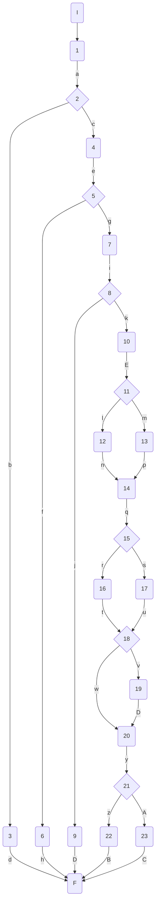
 
### Complejidad ciclo matica
 
Numero de regiones
$$
v(G) = R \\
v(G) = 8
$$
 
Numero de nodos y aristas
$$
v(G) = E - N + 2 \\
v(G) = 31 - 25 + 2
$$
 
Numero de decisiones
$$
v(G) = P + 1 \\
v(G) = 7 + 1
$$
 
### Casos de prueba
 
| | Camino   | Entrada   | TC | Salida  |
| --- | --- | --- | --- | --- |
| 1 | I-1a-2c-4e-5g-7i-8k-10E-11l-12h-14q-15r-16t-18v-19D-20y-21z-22B-F | `disciplineId`=1 `gender`=m `podium`=true `athleteRepository.GetAthletesAsync(disciplineId)`=[{Id=1, Name="Usain Bolt", gender="m", isActive=true, SeasonBest=9.37, PersonalBest=9.37}] , `athleteRepository.GetDisciplineAsync(1)`={Id=1, Name="100M", MaleWorldRecord=9.58}, `athleteRepository.SaveChangesAsync()`=false | `gender==null -> false , athletesListEntity.ToList().Count==0 -> false, racingAthletes.ToList().Count==0 -> false, _best3MarksFilter["Long Jump"] = false, podium -> true, _best3MarksFilter["100M"] = true, competingResults.WorldRecord=false, !result = true` | throw new Exception("Database Error") |
| 2 | I-1a-2c-4e-5g-7i-8k-10E-11l-12h-14q-15r-16t-18v-19D-20y-21A-23C-F | `disciplineId`=1 `gender`=f `podium`=true `athleteRepository.GetAthletesAsync(disciplineId)`=[{Id=1, Name="Usain Bolt", gender="m", isActive=true, SeasonBest=9.37, PersonalBest=9.37}] , `athleteRepository.GetDisciplineAsync(1)`={Id=1, Name="100M", MaleWorldRecord=9.58}, `athleteRepository.SaveChangesAsync()`=true| `gender==null -> false , athletesListEntity.ToList().Count==0 -> false, racingAthletes.ToList().Count==0 -> false, _best3MarksFilter["Long Jump"] = false, podium -> true, _best3MarksFilter["100M"] = true, competingResults.WorldRecord=true, !result = false` | competingResults |
| 3 | I-1a-2c-4e-5g-7i-8k-10E-11l-12h-14q-15r-16t-18w-20y-21z-22B-F | `disciplineId`=1 `gender`=m `podium`=true `athleteRepository.GetAthletesAsync(disciplineId)'=[{Id=1, Name="Usain Bolt", gender="m", isActive=true, SeasonBest=10.00, PersonalBest=9.58}] , `athleteRepository.GetDisciplineAsync(1)={Id=1, Name="100M", MaleWorldRecord=9.58}, `athleteRepository.SaveChangesAsync()`=false| `gender==null -> false , athletesListEntity.ToList().Count==0 -> false, racingAthletes.ToList().Count==0 -> false, _best3MarksFilter["100M"] = false, podium -> true, _best3MarksFilter["100M"] = true, competingResults.WorldRecord=false, !result = true` | throw new Exception("Database Error") |
| 4 | I-1a-2c-4e-5g-7i-8k-10E-11l-12n-14q-15s-17u-18w-20y-21z-22B-F | IMPOSIBLE |  |  |
| 5 | I-1a-2c-4e-5g-7i-8k-10E-11m-13p-14q-15r-16t-18w-20y-21z-22B-F | `disciplineId`=1 `gender`=m `podium`=true `athleteRepository.GetAthletesAsync(disciplineId)`=[{Id=1, Name="Usain Bolt", gender="m", isActive=true, SeasonBest=8.00, PersonalBest=8.00}] , `athleteRepository.GetDisciplineAsync(1)`={Id=1, Name="Long Jump", MaleWorldRecord=8.9}, `athleteRepository.SaveChangesAsync()`=false | `gender==null -> false , athletesListEntity.ToList().Count==0 -> false, racingAthletes.ToList().Count==0 -> false, _best3MarksFilter["Long Jump"] = false, podium -> true, _best3MarksFilter["Long Jump"] = true, competingResults.WorldRecord=false, !result = true` | throw new Exception("Database Error") |
| 6 | I-1a-2c-4e-5g-7i-8j-9D-F | `disciplineId`=1 `gender`=f `podium`=false `athleteRepository.GetAthletesAsync(disciplineId)`=[{Id=1, Name="Usain Bolt", gender="m", isActive=false}] | `gender==null -> false , athletesListEntity.ToList().Count==0 -> false, racingAthletes.ToList().Count==0 -> true` | throw new NoAthletesToRaceException($"There are no athletes in discipline to perform race") |
| 7 | I-1a-2c-4e-5f-6h-F | `disciplineId`=1 `gender`=f `podium`=false `athleteRepository.GetAthletesAsync(disciplineId)'=[]` | `gender==null -> false , athletesListEntity.ToList().Count==0 -> true` | throw new NoAthletesToRaceException($"There are no athletes in discipline with gender f which are active to perform race") |
| 8 |  I-1a-2b-3d-F | `disciplineId`=1 `gender`=null `podium`=false | `gender==null -> true` | throw new IncompleteRequestException("Unable to complete request. Please specify gender as param") |
 
TC1: Verificar que si disciplineId=1, gender="m", podium=true, el repositorio devuelve [{Id=1, Name="Usain Bolt", gender="m", isActive=true, SeasonBest=9.37, PersonalBest=9.37}] como atletas de la disciplina, y la disciplina recuperada del repositorio es {Id=1, Name="Long Jump", MaleWorldRecord=8.9}, y se guardan INCORRECTAMENTE los cambios en la bd, entonces se lanza una excepción genérica con el mensaje "Database Error"
 
TC2: Verificar que si disciplineId=1, gender="f", podium=true, el repositorio devuelve [{Id=1, Name="Usain Bolt", gender="m", isActive=true, SeasonBest=9.37, PersonalBest=9.37}] como atletas de la disciplina, la disciplina recuperada del repositorio es {Id=1, Name="100M", MaleWorldRecord=9.58} y se guardan correctamente los cambios en la bd, entonces se devuelven resultados de competencia.
 
TC3: Verificar que si disciplineId=1, gender="m", podium=true, el repositorio devuelve [{Id=1, Name="Usain Bolt", gender="m", isActive=true, SeasonBest=10.00, PersonalBest=9.58}] como atletas de la disciplina, y la disciplina recuperada del repositorio es {Id=1, Name="100M", MaleWorldRecord=9.58}, y se guardan INCORRECTAMENTE los cambios en la bd, entonces se lanza una excepción genérica con el mensaje "Database Error"
 
TC5: Verificar que si disciplineId=1, gender="m", podium=true, el repositorio devuelve [{Id=1, Name="Usain Bolt", gender="m", isActive=true, SeasonBest=9.37, PersonalBest=9.37}] como atletas de la disciplina, y la disciplina recuperada del repositorio es {Id=1, Name="Long Jump", MaleWorldRecord=8.9},, y se guardan INCORRECTAMENTE los cambios en la bd, entonces se lanza una excepción genérica con el mensaje "Database Error"
 
TC6: Verificar que si disciplineId=1, gender="f", podium=false, el repositorio devuelve [{Id=1, Name="Usain Bolt", gender="m", isActive=false}] como atletas de la disciplina, entonces se lanza una excepción de tipo NoAthletesToRaceException con el mensaje "There are no athletes in discipline to perform race"
 
TC7: Verificar que si disciplineId=1, gender="f", podium=false, el repositorio devuelve una lista vacía ([]) como atletas de la disciplina, entonces se lanza una excepción de tipo NoAthletesToRaceException con el mensaje "There are no athletes in discipline with gender f which are active to perform race"
 
TC8: Verificar que si disciplineId=1, gender=null, podium=false, entonces se lanza una excepción de tipo IncompleteRequestException con el mensaje "Unable to complete request. Please specify gender as param"
 
Camino 1
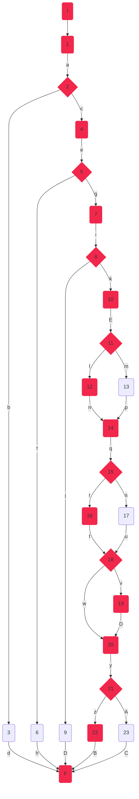
Camino 2
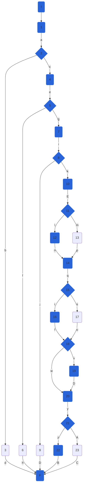
Camino 3

Camino 4
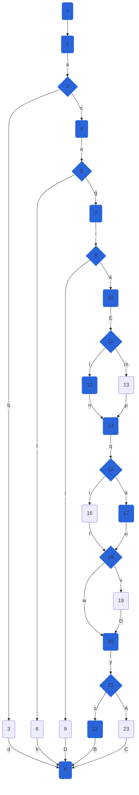
Camino 5
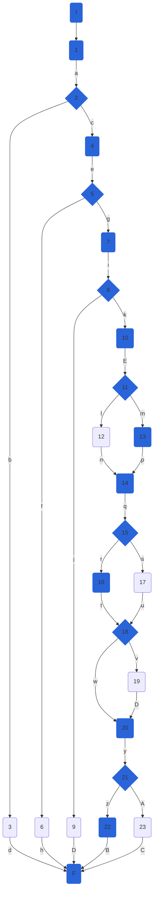
Camino 6
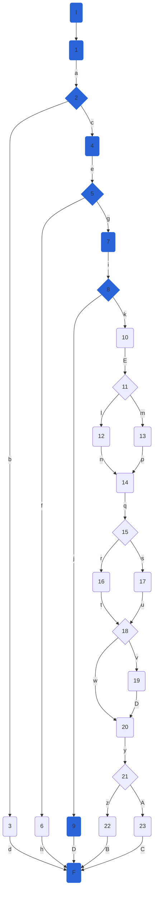
Camino 7
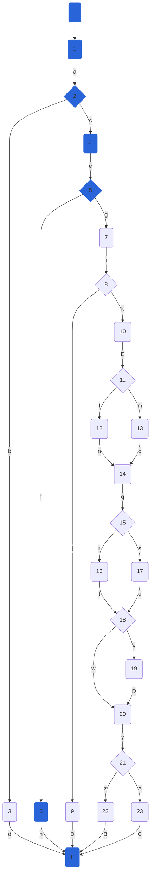
Camino 8
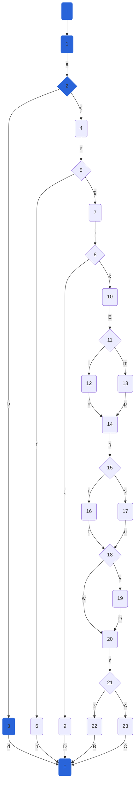
 
### Pruebas unitarias
 
```csharp
//tc1
        [Fact]
        public void RaceAsync_ThrowsDBErrorException()
        {
            var config = new MapperConfiguration(cfg => cfg.AddProfile<AutomapperProfile>());
            var mapper = config.CreateMapper();
            var disciplineId = 1;
            var gender = "M";
            var podium = "true";
            var disciplineEntity = new DisciplineEntity() { Id = 1, Name = "100M", MaleWorldRecord = 9.58m };
            var disciplineModel = new DisciplineModel() { Id = 1, Name = "Triple Jump", MaleWorldRecord = 8.95m };
            var repositoryMock = new Mock<IAthleteRepository>();
            repositoryMock.Setup(r => r.UpdateDisciplineAsync(1, disciplineEntity)).ReturnsAsync(true);
            repositoryMock.Setup(r => r.SaveChangesAsync()).ReturnsAsync(false);
            repositoryMock.Setup(r => r.GetAthletesAsync(1)).ReturnsAsync(new List<AthleteEntity>() {
                new AthleteEntity(){ Id = 1, Name = "Usain Bolt", Gender = Gender.M, IsActive = true, SeasonBest = 9.37m, PersonalBest = 9.37m
                } });
            repositoryMock.Setup(r => r.GetDisciplineAsync(1, false)).ReturnsAsync(disciplineEntity);
           
            var disciplinesService = new DisciplineService(repositoryMock.Object, mapper);
            var exception = Assert.ThrowsAsync<Exception>(async () => await disciplinesService.RaceAsync(disciplineId,gender,podium));
            Assert.Equal("Database Error", exception.Result.Message);
        }
 
        //tc2
        [Fact]
        public async Task RaceAsync_ReturnsCompetingResults_WorldRecord()
        {
            var config = new MapperConfiguration(cfg => cfg.AddProfile<AutomapperProfile>());
            var mapper = config.CreateMapper();
            var disciplineId = 1;
            var gender = "M";
            var podium = "true";
            var disciplineEntity = new DisciplineEntity() { Id = 1, Name = "100M", MaleWorldRecord = 9.58m };
            var repositoryMock = new Mock<IAthleteRepository>();
            repositoryMock.Setup(r => r.UpdateDisciplineAsync(1, disciplineEntity)).ReturnsAsync(true);
            repositoryMock.Setup(r => r.SaveChangesAsync()).ReturnsAsync(true);
            repositoryMock.Setup(r => r.GetAthletesAsync(1)).ReturnsAsync(new List<AthleteEntity>() {
                new AthleteEntity(){ Id = 1, Name = "Usain Bolt", Gender = Gender.M, IsActive = true, SeasonBest = 9.37m, PersonalBest = 9.37m
                } });
            repositoryMock.Setup(r => r.GetDisciplineAsync(1, false)).ReturnsAsync(disciplineEntity);
 
            var disciplinesService = new DisciplineService(repositoryMock.Object, mapper);
            var competingResults = await disciplinesService.RaceAsync(disciplineId, gender, podium);
            Assert.NotNull(competingResults);
            Assert.Single(competingResults.AthletesRaceInfo);
            Assert.Contains(competingResults.AthletesRaceInfo, athlete => athlete.Id == 1);
            Assert.Contains(competingResults.AthletesRaceInfo, athlete => athlete.Name == "Usain Bolt");
            Assert.True(competingResults.WorldRecord);        
        }
        //tc3
        [Fact]
        public void RaceAsync_ThrowsDBException_NoWorldRecord()
        {
            var config = new MapperConfiguration(cfg => cfg.AddProfile<AutomapperProfile>());
            var mapper = config.CreateMapper();
            var disciplineId = 1;
            var gender = "M";
            var podium = "true";
            var disciplineEntity = new DisciplineEntity() { Id = 1, Name = "100M", MaleWorldRecord = 9.58m };
            var repositoryMock = new Mock<IAthleteRepository>();
            repositoryMock.Setup(r => r.UpdateDisciplineAsync(1, disciplineEntity)).ReturnsAsync(true);
            repositoryMock.Setup(r => r.SaveChangesAsync()).ReturnsAsync(false);
            repositoryMock.Setup(r => r.GetAthletesAsync(1)).ReturnsAsync(new List<AthleteEntity>() {
                new AthleteEntity(){ Id = 1, Name = "Usain Bolt", Gender = Gender.M, IsActive = true, SeasonBest = 9.98m, PersonalBest = 9.58m
                } });
            repositoryMock.Setup(r => r.GetDisciplineAsync(1, false)).ReturnsAsync(disciplineEntity);
 
            var disciplinesService = new DisciplineService(repositoryMock.Object, mapper);
            var exception = Assert.ThrowsAsync<Exception>(async () => await disciplinesService.RaceAsync(disciplineId, gender, podium));
            Assert.Equal("Database Error", exception.Result.Message);
        }
        //tc5
        [Fact]
        public void RaceAsync_ReturnsCompetingResults_NoWorldRecord()
        {
            var config = new MapperConfiguration(cfg => cfg.AddProfile<AutomapperProfile>());
            var mapper = config.CreateMapper();
            var disciplineId = 1;
            var gender = "M";
            var podium = "true";
            var disciplineEntity = new DisciplineEntity() { Id = 1, Name = "Long Jump", MaleWorldRecord = 8.9m };
            var repositoryMock = new Mock<IAthleteRepository>();
            repositoryMock.Setup(r => r.UpdateDisciplineAsync(1, disciplineEntity)).ReturnsAsync(true);
            repositoryMock.Setup(r => r.SaveChangesAsync()).ReturnsAsync(false);
            repositoryMock.Setup(r => r.GetAthletesAsync(1)).ReturnsAsync(new List<AthleteEntity>() {
                new AthleteEntity(){ Id = 1, Name = "Usain Bolt", Gender = Gender.M, IsActive = true, SeasonBest = 8m, PersonalBest = 8m
                } });
            repositoryMock.Setup(r => r.GetDisciplineAsync(1, false)).ReturnsAsync(disciplineEntity);
 
            var disciplinesService = new DisciplineService(repositoryMock.Object, mapper);
            var exception = Assert.ThrowsAsync<Exception>(async () => await disciplinesService.RaceAsync(disciplineId, gender, podium));
            Assert.Equal("Database Error", exception.Result.Message);
        }
        //tc6
        [Fact]
        public void RaceAsync_NoAthletesToRaceException()
        {
            var config = new MapperConfiguration(cfg => cfg.AddProfile<AutomapperProfile>());
            var mapper = config.CreateMapper();
            var disciplineId = 1;
            var gender = "M";
            var podium = "true";
            var disciplineEntity = new DisciplineEntity() { Id = 1, Name = "100M", MaleWorldRecord = 9.58m };
            var repositoryMock = new Mock<IAthleteRepository>();
            repositoryMock.Setup(r => r.UpdateDisciplineAsync(1, disciplineEntity)).ReturnsAsync(true);
            repositoryMock.Setup(r => r.SaveChangesAsync()).ReturnsAsync(false);
            repositoryMock.Setup(r => r.GetAthletesAsync(1)).ReturnsAsync(new List<AthleteEntity>());
            repositoryMock.Setup(r => r.GetDisciplineAsync(1, false)).ReturnsAsync(disciplineEntity);
 
            var disciplinesService = new DisciplineService(repositoryMock.Object, mapper);
            var exception = Assert.ThrowsAsync<NoAthletesToRaceException>(async () => await disciplinesService.RaceAsync(disciplineId, gender, podium));
            Assert.Equal("There are no athletes in discipline to perform race", exception.Result.Message);
        }
        //tc7
        [Fact]
        public void RaceAsync_NoAthletesWithGenderToRaceException()
        {
            var config = new MapperConfiguration(cfg => cfg.AddProfile<AutomapperProfile>());
            var mapper = config.CreateMapper();
            var disciplineId = 1;
            var gender = "M";
            var podium = "true";
            var disciplineEntity = new DisciplineEntity() { Id = 1, Name = "100M", MaleWorldRecord = 9.58m };
            var repositoryMock = new Mock<IAthleteRepository>();
            repositoryMock.Setup(r => r.UpdateDisciplineAsync(1, disciplineEntity)).ReturnsAsync(true);
            repositoryMock.Setup(r => r.SaveChangesAsync()).ReturnsAsync(true);
            repositoryMock.Setup(r => r.GetAthletesAsync(1)).ReturnsAsync(new List<AthleteEntity>() {
                new AthleteEntity(){ Id = 1, Name = "Usain Bolt", Gender = Gender.M, IsActive = false, SeasonBest = 9.98m, PersonalBest = 9.58m
                } });
            repositoryMock.Setup(r => r.GetDisciplineAsync(1, false)).ReturnsAsync(disciplineEntity);
 
            var disciplinesService = new DisciplineService(repositoryMock.Object, mapper);
            var exception = Assert.ThrowsAsync<NoAthletesToRaceException>(async () => await disciplinesService.RaceAsync(disciplineId, gender, podium));
            Assert.Equal("There are no athletes in discipline with gender M which are active to perform race", exception.Result.Message);
        }
        //tc8
        [Fact]
        public void RaceAsync_InvalidGender_ReturnsIncompleteRequestException()
        {
            var config = new MapperConfiguration(cfg => cfg.AddProfile<AutomapperProfile>());
            var mapper = config.CreateMapper();
            var disciplineId = 1;
            var repositoryMock = new Mock<IAthleteRepository>();
       
            var disciplinesService = new DisciplineService(repositoryMock.Object, mapper);
            var exception = Assert.ThrowsAsync<IncompleteRequestException>(async () => await disciplinesService.RaceAsync(disciplineId));
            Assert.Equal("Unable to complete request. Please specify gender as param", exception.Result.Message);
        }
```


## DisciplineService.CheckSeasonBest

### Código

```csharp
public bool CheckSeasonBest(AthleteModel athlete, Decimal mark, string discipline)
{
	bool seasonBest = _markComparer[discipline](athlete.SeasonBest, mark);//1
	if (athlete.SeasonBest == null)//2
	{
		seasonBest = true;//3
	}
	if (seasonBest)//4
	{
		athlete.SeasonBest = mark;//5
	}
	return seasonBest;//6
}
  
```

### Grafo

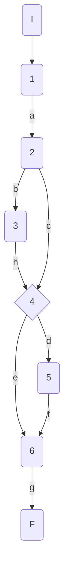

### Complejidad ciclo matica

Numero de regiones
$$
v(G) = R \\
v(G) = 3
$$

Numero de nodos y aristas
$$
v(G) = E - N + 2 \\
v(G) = 9 - 8 + 2
$$
  
Numero de decisiones
$$
v(G) = P + 1 \\
v(G) = 2 + 1
$$

### Casos de prueba

athlete, mark, discipline

| | Camino   | Entrada   | TC | Salida  |
| --- | --- | --- | --- | --- |
| 1 | I-1a-2b-3h-4d-5f-6g-F | `athlete`={Id=1,Nationality='USA', Name='Sydney Maclaughlin', Gender='f', Points=1000, PersonalBest=52.75, SeasonBest=null}`mark`=51.79 `discipline`='400MH'| athlete.SeasonBest=null -> seasonBest = true| true |
| 2 | I-1a-2c-4d-5f-6g-F | `athlete`={Id=1,Nationality='USA', Name='Sydney Maclaughlin', Gender='f', Points=1000, PersonalBest=52.75, SeasonBest=52}`mark`=51.79 `discipline`='400MH'| athlete.SeasonBest!=null -> seasonBet = true| true |
| 3 | I-1a-2c-4e-6g-F | `athlete`={Id=1,Nationality='USA', Name='Sydney Maclaughlin', Gender='f', Points=1000, PersonalBest=52.75, SeasonBest=52}`mark`=52.79 `discipline`='400MH'| athlete.SeasonBest!=null -> seasonBet = false| false |

TC1: Verificar que si la atleta {Id=1,Nationality='USA', Name='Sydney Maclaughlin', Gender='f', Points=1000, PersonalBest=52.75, SeasonBest=null}, inicialmente sin mejor marca de temporada, realiza una marca de 51.79 en la disciplina 400MH, devuelva true

TC2: Verificar que si la atleta {Id=1,Nationality='USA', Name='Sydney Maclaughlin', Gender='f', Points=1000, PersonalBest=52.75, SeasonBest=52}, con mejor marca de temporada 52, realiza una marca de 51.79 en la disciplina 400MH, mejor a su mejor marca de temporada previa, devuelva true

TC3: Verificar que si la atleta {Id=1,Nationality='USA', Name='Sydney Maclaughlin', Gender='f', Points=1000, PersonalBest=52.75, SeasonBest=52}, con mejor marca de temporada 52, realiza una marca de 52.79 en la disciplina 400MH, peor a su mejor marca de temporada previa, devuelva false

Camino 1
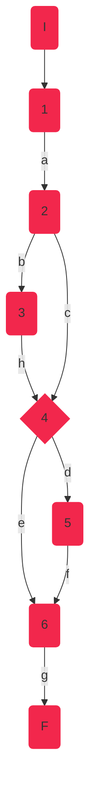
Camino 2
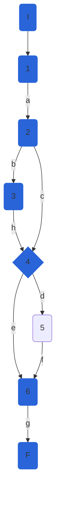
Camino 3
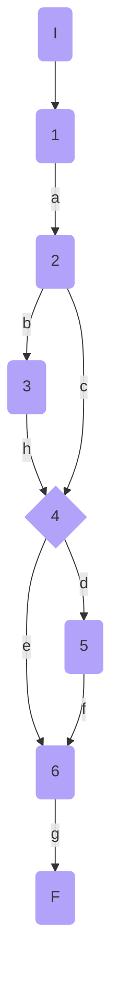
### Pruebas unitarias

```csharp
//tc1
[Fact]
public void CheckSesasonBest_SeasonBestNull_ReturnsTrue()
{
	var config = new MapperConfiguration(cfg => cfg.AddProfile<AutomapperProfile>());
	var mapper = config.CreateMapper();
	var sydney = new AthleteModel()
	{
		Id = 1,
		Nationality = "USA",
		Name = "Sydney Maclaughlin",
		Gender = Gender.F,
		Points = 1000,
		PersonalBest = 52.75m,
		SeasonBest = null
	};
	var disciplineName = "400MH";
	var mark = 51.76m;
	var repositoryMock = new Mock<IAthleteRepository>();
	var disciplinesService = new DisciplineService(repositoryMock.Object, mapper);

	var result = disciplinesService.CheckSeasonBest(sydney,mark,disciplineName);
	Assert.True(result);
}
//tc2
[Fact]
public void CheckSesasonBest_SeasonBestImproved_ReturnsTrue()
{
	var config = new MapperConfiguration(cfg => cfg.AddProfile<AutomapperProfile>());
	var mapper = config.CreateMapper();
	var sydney = new AthleteModel()
	{
		Id = 1,
		Nationality = "USA",
		Name = "Sydney Maclaughlin",
		Gender = Gender.F,
		Points = 1000,
		PersonalBest = 52m,
		SeasonBest = 51.79m
	};
	var disciplineName = "400MH";
	var mark = 51.76m;
	var repositoryMock = new Mock<IAthleteRepository>();
	var disciplinesService = new DisciplineService(repositoryMock.Object, mapper);

	var result = disciplinesService.CheckSeasonBest(sydney, mark, disciplineName);
	Assert.True(result);
}

//tc3
[Fact]
public void CheckSesasonBest_SeasonBestNotImproved_ReturnsFalse()
{
	var config = new MapperConfiguration(cfg => cfg.AddProfile<AutomapperProfile>());
	var mapper = config.CreateMapper();
	var sydney = new AthleteModel()
	{
		Id = 1,
		Nationality = "USA",
		Name = "Sydney Maclaughlin",
		Gender = Gender.F,
		Points = 1000,
		PersonalBest = 52.75m,
		SeasonBest = 52m
	};
	var disciplineName = "400MH";
	var mark = 52.79m;
	var repositoryMock = new Mock<IAthleteRepository>();
	var disciplinesService = new DisciplineService(repositoryMock.Object, mapper);

	var result = disciplinesService.CheckSeasonBest(sydney, mark, disciplineName);
	Assert.False(result);
}
```


## AthleteService.GetAthleteAsync

### Código

```csharp
public async Task<AthleteModel> GetAthleteAsync(int athleteId, int disciplineId)
{
	//1
	await GetDisciplineAsync(disciplineId);
	var athleteEntity = await _athleteRepository.GetAthleteAsync(athleteId, disciplineId);
	if (athleteEntity == null)//2
		throw new NotFoundElementException($"Athlete with id {athleteId} does not exist in discipline {disciplineId}");//3

	//4
	var athleteModel = _mapper.Map<AthleteModel>(athleteEntity);
	athleteModel.DisciplineId = disciplineId;
	return athleteModel;
}
```

### Grafo

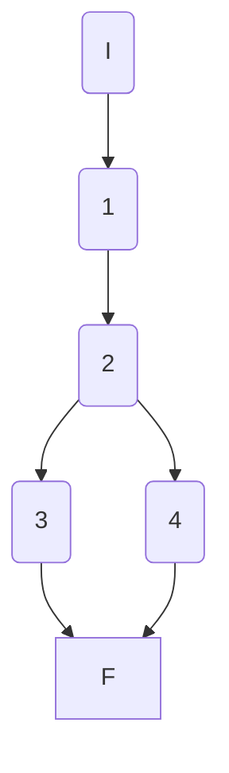

### Complejidad ciclo matica

Numero de regiones
$$ v(G) = R $$
$$v(G) = 2 $$

Numero de nodos y aristas
$$ v(G) = E - N + 2 $$
$$ v(G) = 6 - 6 + 2 $$
$$ v(G) = 2 $$
  
Numero de decisiones
$$ v(G) = P + 1 $$
$$ v(G) = 1 + 1$$
$$ v(G) = 2 $$

### Casos de prueba

| | Camino   | Entrada   | TC | Salida  |
| --- | --- | --- | --- | --- |
| 1 | I 1 2 3 F |  `athleteId` no existe  | `athleteId=87` | throw `NotFoundElementException` |
| 2 | I 1 2 4 F |  `athleteId` existe | `athleteId=1` | `{Id=1, Name="Some Name", ...}`  |

1. Verificar que si `athleteId=87`, `disciplineId=1` se lanza una excepción `NotFoundElementException` con mensaje `Athlete with id 87 does not exist in discipline 1`
2. Verificar que si `athleteId=1`, `disciplineId=1` se retorna un `AthleteModel` con `{Id=1, DisciplineId=1, ...}`

Camino 1
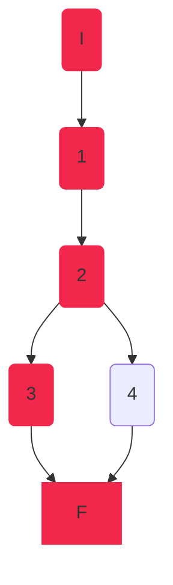

Camino 2
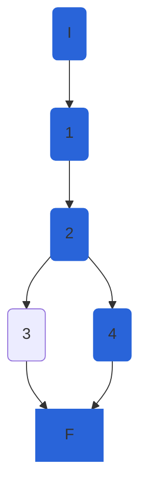

### Pruebas unitarias

```csharp
//GetAthleteAsync
//tc1
[Fact]
public async Task GetAthleteAsync_AthleteIdNotExist_ThrowsNotFoundElementException()
{
	int athleteId = 87;
	int disciplineId = 1;
	var disciplineEntity100M = new DisciplineEntity()
	{
		Id = 1,
		Name = "100M"
	};
	var config = new MapperConfiguration(cfg => cfg.AddProfile<AutomapperProfile>());
	var mapper = config.CreateMapper();
	

	var repositoryMock = new Mock<IAthleteRepository>();
	repositoryMock.Setup(r => r.GetDisciplineAsync(disciplineId, false)).ReturnsAsync(disciplineEntity100M);
	repositoryMock.Setup(r => r.GetAthleteAsync(athleteId,disciplineId));

	var athleteService = new AthleteService(repositoryMock.Object, mapper);

	NotFoundElementException exception = await Assert.ThrowsAsync<NotFoundElementException>(
		() => athleteService.GetAthleteAsync(athleteId, disciplineId));
	Assert.Equal($"Athlete with id {athleteId} does not exist in discipline {disciplineId}", exception.Message);
}
//tc2
[Fact]
public async Task GetAthleteAsync_AthleteIdExist_ReturnsAthleteModel()
{
	int athleteId = 1;
	int disciplineId = 1;
	var disciplineEntity100M = new DisciplineEntity()
	{
		Id = disciplineId,
		Name = "100M"
	};
	var athleteEntity = new AthleteEntity()
	{
		Id = athleteId,
		Name = "Juan",
		Nationality = "Boliviano",
		NumberOfCompetitions = 1,
		Gender = Gender.M,
		PersonalBest = 125,
		SeasonBest = 125,
	};
	var athleteExpected = new AthleteModel()
	{
		Id = athleteId,
		DisciplineId = disciplineId,
		Name = "Juan",
		Nationality = "Boliviano",
		NumberOfCompetitions = 1,
		Gender = Gender.M,
		PersonalBest = 125,
		SeasonBest = 125,
	};

	var config = new MapperConfiguration(cfg => cfg.AddProfile<AutomapperProfile>());
	var mapper = config.CreateMapper();


	var repositoryMock = new Mock<IAthleteRepository>();
	repositoryMock.Setup(r => r.GetDisciplineAsync(disciplineId, false)).ReturnsAsync(disciplineEntity100M);
	repositoryMock.Setup(r => r.GetAthleteAsync(athleteId, disciplineId)).ReturnsAsync(athleteEntity);

	var athleteService = new AthleteService(repositoryMock.Object, mapper);

	var athleteActual = await athleteService.GetAthleteAsync(athleteId, disciplineId);
	Assert.Equal(athleteExpected,athleteActual);
	Assert.True(athleteExpected.Equals(athleteActual));
}
```
### Peculiaridades
Para la prueba del segundo tc, para controlar que todos los campos sean iguales se sobrecargo `Equals` en la `class AthleteModel`
```csharp
public override bool Equals(object obj)
{
	if (!(obj is AthleteModel))
	{
		return false;
	}

	AthleteModel other = (AthleteModel)obj;
	return this.Id == other.Id &&
		this.Name == other.Name &&
		this.Nationality == other.Nationality &&
		this.IsActive == other.IsActive &&
		this.NumberOfCompetitions == other.NumberOfCompetitions &&
		this.DisciplineId == other.DisciplineId &&
		this.Gender == other.Gender &&
		this.PersonalBest == other.PersonalBest &&
		this.SeasonBest == other.SeasonBest &&
		this.Points == other.Points &&
		this.ImagePath == other.ImagePath;
}
```
esto permite a `Assert.Equals` hacer la comparación entre los dos objetos y no solo a nivel de memoria. Esto permite comparar mas fácilmente los objetos. Además que permite definir según nuestro criterio lo que es la igualdad de los dos objetos.


## AthletesController.CreateAthleteAsync

### Código

```csharp
[HttpPost]
public async Task<ActionResult<AthleteModel>> CreateAthleteAsync([FromBody] AthleteModel athlete,int disciplineId)
{
    try
    {
        if (!ModelState.IsValid)//1
            return BadRequest(ModelState);//2

        athlete.ImagePath = athlete.ImagePath ?? "Resources\\Images\\genericAthlete.jpg";//3
        var newAthlete = await _athleteService.CreateAthleteAsync(athlete, disciplineId);//4
        return Created($"/api/disicplines/{disciplineId}/athletes/{newAthlete.Id}", newAthlete);//5
    }
    catch (NotFoundElementException ex)//6
    {
        return NotFound(ex.Message);//7
    }
    catch (Exception)//8
    {
        return StatusCode(StatusCodes.Status500InternalServerError, "Something happened.");//9
    }
}
```

### Grafo

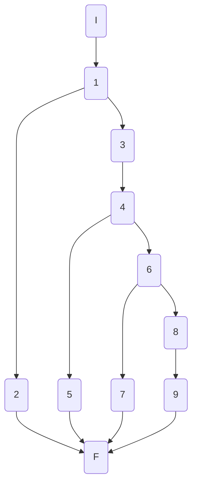

### Complejidad ciclo matica

Numero de regiones
$$ v(G) = R $$
$$v(G) = 4 $$

Numero de nodos y aristas
$$ v(G) = E - N + 2 $$
$$ v(G) = 13 - 11 + 2 $$
$$ v(G) = 4 $$
  
Numero de decisiones
$$ v(G) = P + 1 $$
$$ v(G) = 3 + 1$$
$$ v(G) = 4 $$

### Casos de prueba

| | Camino   | Entrada   | TC | Salida  |
| --- | --- | --- | --- | --- |
| 1 | I 1 3 4 6 8 9 F |  athlete (Model) valido, se recibe una excepcion no esperada | `_athleteService.CreateAthleteAsync(athlete, disciplineId);` lanza una `Exception` (general), `disciplineId = <any>`, `athleteModel` valido | `StatusCode:500` |
| 2 | I 1 3 4 6 7 F | athlete (Model) valido, se recibe una excepcion `NotFound` | `_athleteService.CreateAthleteAsync(athlete, disciplineId);` lanza una `NotFound`, `disciplineId = <any>`, `athleteModel` valido | `StatusCode:404` |
| 3 | I 1 3 4 5 F | athlete (Model) valido y disciplineId existe | `disciplineId = 1`, `athleteModel` valido | `StatusCode:201` |
| 4 | I 1 2 F | athlete (Model) no valido | `disciplineId = 1`, `athleteModel` no valido | `StatusCode:400` |

1. Verificar que si
	```csharp
	var athlete = new AthleteModel()
	{
		Id = 1,
		BirthDate = DateTime.Now,
		DisciplineId = 1,
		Gender = Gender.M,
		Name = "Pepe",
		NumberOfCompetitions = 1,
		PersonalBest = 125,
		SeasonBest = 150,
		Nationality = "Boliviano"
	}
	```
	 (valido) y `_athleteService.CreateAthleteAsync(...)` lanza una `Exception("Something happened.")`, entonces `CreateAthleteAsync`  devuelve el **Status Code 500**.
2. Verificar que si
	```csharp
	var athlete = new AthleteModel()
	{
		Id = 1,
		BirthDate = DateTime.Now,
		DisciplineId = 1,
		Gender = Gender.M,
		Name = "Pepe",
		NumberOfCompetitions = 1,
		PersonalBest = 125,
		SeasonBest = 150,
		Nationality = "Boliviano"
	}
	```
	y `_athleteService.CreateAthleteAsync(...)` lanza una excepción `NotFoundElementException($"Athlete with id 1 does not exist in discipline 87")`, entonces `CreateAthleteAsync`  devuelve el **Status Code 404**.
3. Verificar que si
	```csharp
	var athlete = new AthleteModel()
	{
		Id = 1,
		BirthDate = DateTime.Now,
		DisciplineId = 1,
		Gender = Gender.M,
		Name = "Pepe",
		NumberOfCompetitions = 1,
		PersonalBest = 125,
		SeasonBest = 150,
		Nationality = "Boliviano"
	}
	```
	entonces `CreateAthleteAsync`  devuelve una respuesta con **Status Code 201** y devuelve un `AthleteModel` con los mismos datos del modelo de entrada.
4. Verificar que si
	```csharp
	var athlete = new AthleteModel()
	{
		Name = null,
		BirthDate = DateTime.Now,
		NumberOfCompetitions = 1,
		PersonalBest = 125,
		SeasonBest = 150,
		Nationality = "Boliviano"
	};
	```
	entonces `CreateAthleteAsync`  devuelve un **Status Code 400**.

Camino 1
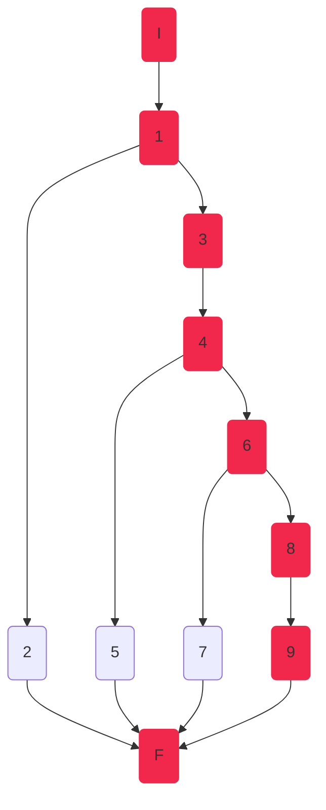

Camino 2
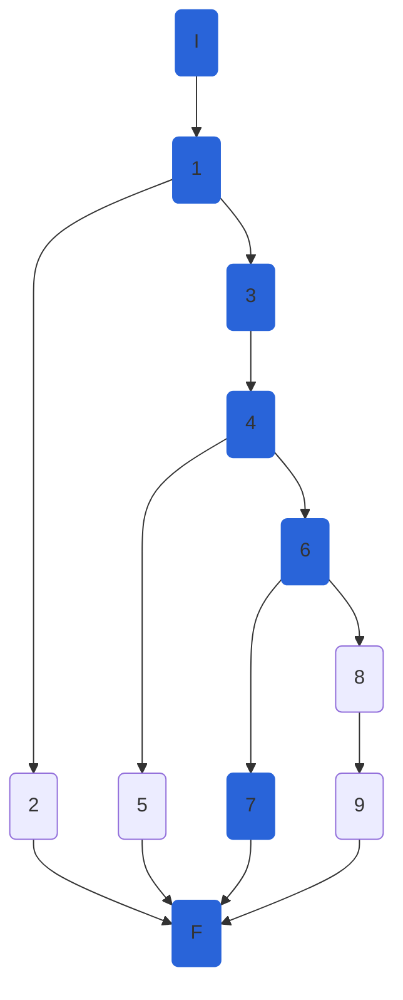

Camino 3
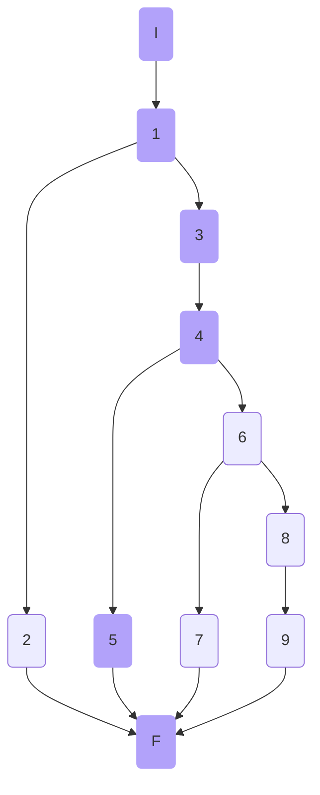

Camino 3
```mermaid
graph TD
    I(I):::c1 --> 1(1)
    1:::c1 --> 2(2)
    2:::c1 --> F(F)
    1 --> 3(3)
    3 --> 4(4)
    4 --> 5(5)
    4 --> 6(6)
    5 --> F
    6 --> 7(7)
    7 --> F
    6 --> 8(8)
    8 --> 9(9)
    9 --> F:::c1
classDef c1 fill:#B2A2FA, stroke:#B2A2FA;
```

### Pruebas unitarias

```csharp
//CreateAthleteAsync
//tc1
[Fact]
public async Task CreateAthleteAsync_ReturnsStatusCode500()
{
	int disciplineId = 1;
	var serviceMock = new Mock<IAthleteService>();
	var athlete = new AthleteModel()
	{
		Id = 1,
		BirthDate = DateTime.Now,
		DisciplineId = disciplineId,
		Gender = Gender.M,
		Name = "Pepe",
		NumberOfCompetitions = 1,
		PersonalBest = 125,
		SeasonBest = 150,
		Nationality = "Boliviano"
	};

	serviceMock.Setup(serv => serv.CreateAthleteAsync(It.IsAny<AthleteModel>(), It.IsAny<int>()))
		.Throws(new Exception("Something happened."));

	var fileService = new FileService();
	var athletesController = new AthletesController(serviceMock.Object, fileService);

	var response = await athletesController.CreateAthleteAsync(athlete,disciplineId);
	var athleteActual = ((ObjectResult)response.Result).Value;
	var actualStatusCode = ((ObjectResult) response.Result).StatusCode;

	Assert.Equal(500, actualStatusCode);
	Assert.Equal("Something happened.", athleteActual);
}

//tc2
[Fact]
public async Task CreateAthleteAsync_ReturnsStatusCode404()
{
	int disciplineId = 87;
	var serviceMock = new Mock<IAthleteService>();
	var athlete = new AthleteModel()
	{
		Id = 1,
		BirthDate = DateTime.Now,
		DisciplineId = disciplineId,
		Gender = Gender.M,
		Name = "Pepe",
		NumberOfCompetitions = 1,
		PersonalBest = 125,
		SeasonBest = 150,
		Nationality = "Boliviano"
	};

	serviceMock.Setup(serv => serv.CreateAthleteAsync(It.IsAny<AthleteModel>(), It.IsAny<int>()))
		.Throws(new NotFoundElementException($"Athlete with id {athlete.Id} does not exist in discipline {disciplineId}"));

	var fileService = new FileService();
	var athletesController = new AthletesController(serviceMock.Object, fileService);

	var response = await athletesController.CreateAthleteAsync(athlete, disciplineId);
	var athleteActual = ((ObjectResult)response.Result).Value;
	var actualStatusCode = ((ObjectResult)response.Result).StatusCode;
	
	Assert.Equal(404, actualStatusCode);
	Assert.Equal("Athlete with id 1 does not exist in discipline 87", athleteActual);
}
//tc3
[Fact]
public async Task CreateAthleteAsync_ReturnsStatusCode201()
{
	int disciplineId = 1;
	var serviceMock = new Mock<IAthleteService>();
	var athlete = new AthleteModel()
	{
		Id = 1,
		BirthDate = DateTime.Now,
		DisciplineId = disciplineId,
		Gender = Gender.M,
		Name = "Pepe",
		NumberOfCompetitions = 1,
		PersonalBest = 125,
		SeasonBest = 150,
		Nationality = "Boliviano"
	};

	serviceMock.Setup(serv => serv.CreateAthleteAsync(It.IsAny<AthleteModel>(), It.IsAny<int>())).ReturnsAsync(athlete);

	var fileService = new FileService();
	var athletesController = new AthletesController(serviceMock.Object, fileService);

	var response = await athletesController.CreateAthleteAsync(athlete, disciplineId);
	var athleteActual = ((ObjectResult)response.Result).Value;
	var actualStatusCode = ((ObjectResult)response.Result).StatusCode;

	Assert.Equal(201, actualStatusCode);
	Assert.Equal(athlete, athleteActual);
}
//tc4
//Failing, BUG Identified Model.IsValid not working
//TO DO: try to fix the bug 
//[Fact]
//public async Task CreateAthleteAsync_ReturnsStatusCode400()
//{
//    int disciplineId = 1;
//    var serviceMock = new Mock<IAthleteService>();
//    var athlete = new AthleteModel()//no name set
//    {
//        Name = null,
//        BirthDate = DateTime.Now,
//        NumberOfCompetitions = 1,
//        PersonalBest = 125,
//        SeasonBest = 150,
//        Nationality = "Boliviano"
//    };

//    serviceMock.Setup(serv => serv.CreateAthleteAsync(It.IsAny<AthleteModel>(), It.IsAny<int>())).ReturnsAsync(athlete);

//    var fileService = new FileService();
//    var athletesController = new AthletesController(serviceMock.Object, fileService);

//    var response = await athletesController.CreateAthleteAsync(athlete, disciplineId);
//    var athleteActual = ((ObjectResult)response.Result).Value;
//    var actualStatusCode = ((ObjectResult)response.Result).StatusCode;

//    Assert.Equal(400, actualStatusCode);
//    Assert.IsType<BadRequestObjectResult>(response.Result);
//}
```

### Peculiaridades 
El test case 4 nos permitió identificar un `BUG 🪲` en el cual aunque campos del `AthleteModel` eran especificados como `[Required]`, al momento de validar el modelo, al ser estos campos `null` indica que el modelo es valido, lo cual es un comportamiento no esperado.


# 7. Conclusiones

- Se alcanzo un 80% de statement coverage superando el 70% planteado como objetivo 
- Para el diseño de las pruebas se utilizo la técnica y metodología de path coverage, calculando la complejidad cyclomatic, identificando los caminos, diseñando los casos de prueba, e implementando las pruebas de unidad en base a lo anterior.
- Se selecciono el framework xUnit para la implementación de las pruebas de unidad
	A pesar de que muchas de las reseñas y opiniones encontradas, señalan que los 3 frameworks mencionados tienen características muy similares y no destacan mucho sobre los otros
	Las razones principales para elegir xUnit son:
	- La facilidad en la sintaxis, permite evitar tareas de setup, pudiendo inicializarse los atributos en el constructor de la clase de prueba.
	- El uso de attributes `[Fact]` para test individuales y `[Theory]` para test a los que se pueden pasar diferentes parámetros de entrada.
	- Es el framework con mejor soporte y mas usado por la comunidad, incluso por la misma documentación oficial de Microsoft
	- Permite la ejecución de pruebas en paralelo a nivel de método.
	- Permite seleccionar que pruebas ejecutar (ejecución parcial).
- Se selecciono Coverlet como la herramienta de cobertura más adecuada. Por ser gratuita y presentar la funcionalidad de la generación de reportes y resaltado del código según la cobertura. Comparándolo con Fine Code Coverage, esta tiene un uso e instalación mucho mas sencillo, sin embargo no permite la generación de reportes y el resaltado del código en el IDE, lo cual era fundamental para nuestra metodología de trabajo.