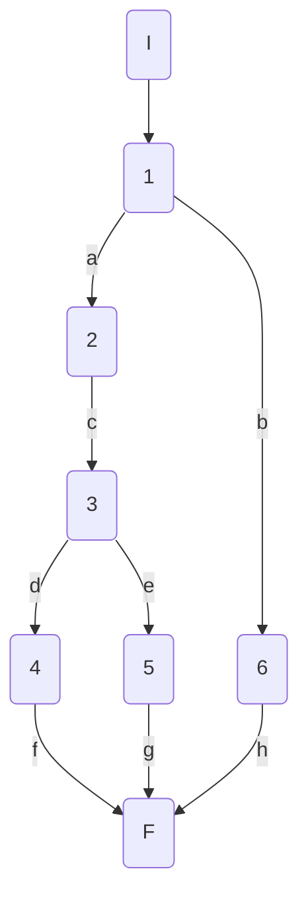
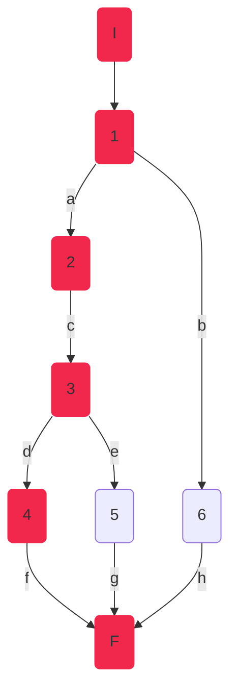
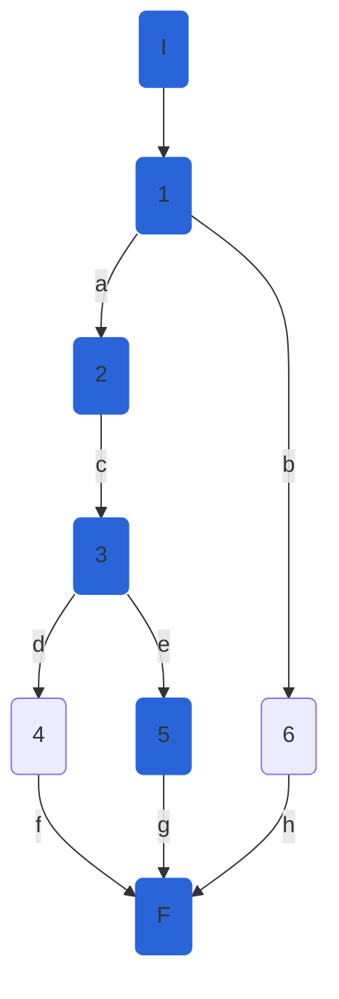
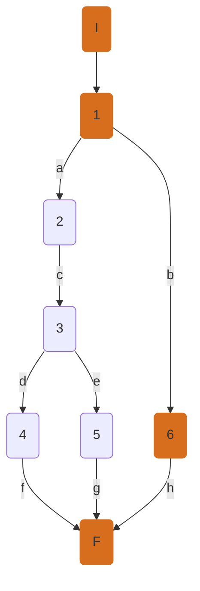
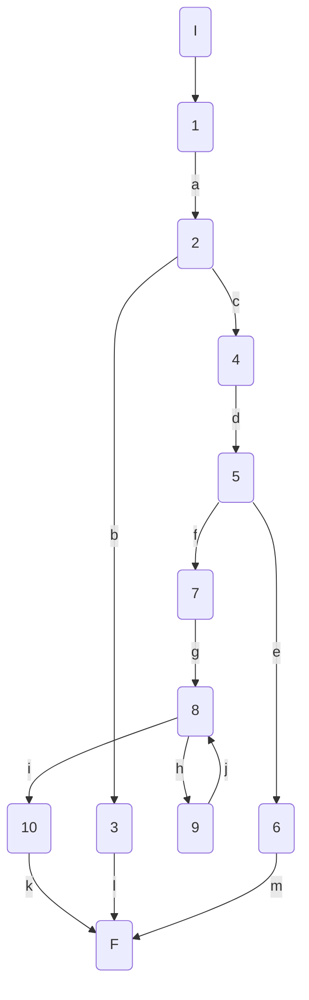
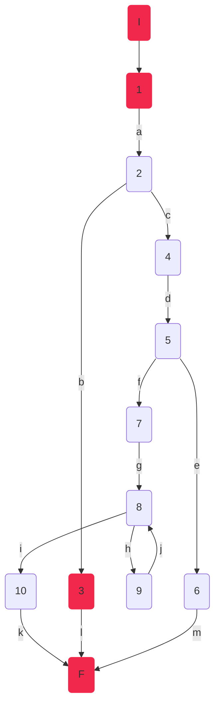
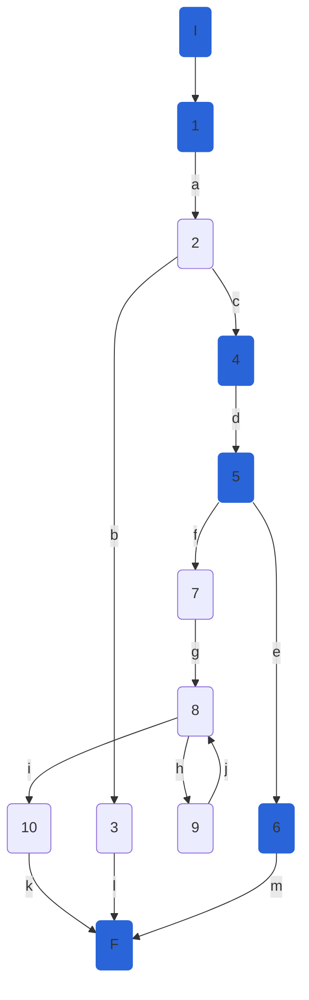
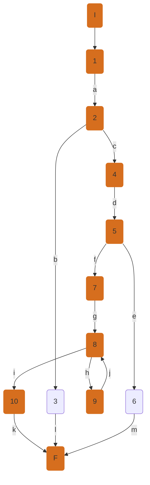

AuthController.LoginAsync.Mark

## AuthController.LoginAsync

### Código

```csharp
      public async Task<ActionResult<UserManagerResponse>> LoginAsync([FromBody] LoginViewModel model)
        {
            if (ModelState.IsValid)
            {
                var result = await userService.LoginUserAsync(model);

                if (result.IsSuccess)
                {
                    return Ok(result);
                }

                return BadRequest(result);
            }

            return BadRequest("Some properties are not valid");
        }
```

### Grafo



### Complejidad ciclo matica

Numero de regiones

$$
v(G) = R \\
v(G) = 3
$$

Numero de nodos y aristas

$$
v(G) = E - N + 2 \\
v(G) = 9 - 8 + 2
$$

Numero de decisiones

$$
v(G) = P + 1 \\
v(G) = 2 + 1
$$

### Casos de prueba

|     | Camino          | Entrada                                                          | TC                                                   | Salida                                             |
| --- | --------------- | ---------------------------------------------------------------- | ---------------------------------------------------- | -------------------------------------------------- |
| 1   | I-1a-2c-3d-4f-F | `user`={Email="testmail@gmail.com", Password="Secret12345"}      | ModelState.IsValid->True and result.IsSuccess->True  | return Status Code:200                             |
| 2   | I-1a-2c-3e-5g-F | `user`={Email="testmail@gmail.com", Password="thisIsNotThePass"} | ModelState.IsValid->True and result.IsSuccess->False | return Bad Request: "Invalid password"             |
| 3   | I-1b-6h-F       | `user`={Email="notAnEmail", Password="a"}                        | ModelState.IsValid->False                            | return Bad Request:"Some properties are not valid" |

TC1: El usuario se loguea correctamente
TC2: El usuario no se loguea porque su contraseña es incorrecta
TC3: El usuario no se loguea debido a que los datos que ingreso no son adecuados para el modelo

Camino 1



Camino 2



Camino 3



### Pruebas unitarias

```csharp
//CreatRoleAsync
        //tc1
        [Fact]
        public async Task CreateRole_ReturnsStatusCode200()
        {
            //ARRANGE
            var roleModel = new CreateRoleViewModel()
            {
                Name = "Admin",
                NormalizedName = "ADMIN",
            };
            var userResponseModel = new UserManagerResponse()
            {
                Token = "Role created successfully!",
                IsSuccess = true,
            };
            var serviceMock = new Mock<IUserService>();
            serviceMock.Setup(r => r.CreateRoleAsync(roleModel)).ReturnsAsync(userResponseModel);

            //ACT
            var authController = new AuthController(serviceMock.Object);
            var response = await authController.CreateRolenAsync(roleModel);
            var status = response.Result as OkObjectResult;
            var userResponse = status.Value as UserManagerResponse;

            //ASSERT
            Assert.True(userResponse.IsSuccess);
        }

        //tc2
        [Fact]
        public async Task CreateRole_ReturnsBadRequestResultNotSuccess()
        {
            //ARRANGE
            var roleModel = new CreateRoleViewModel()
            {
                Name = "NoRole",
                NormalizedName = "notNorMal",
            };
            var userResponseModel = new UserManagerResponse()
            {
                Token = "Role did not create",
                IsSuccess = false,
            };
            var serviceMock = new Mock<IUserService>();
            serviceMock.Setup(r => r.CreateRoleAsync(roleModel)).ReturnsAsync(userResponseModel);

            //ACT
            var authController = new AuthController(serviceMock.Object);
            var response = await authController.CreateRolenAsync(roleModel);
            var status = response.Result as BadRequestObjectResult;
            var userResponse = status.Value as UserManagerResponse;

            //ASSERT
            Assert.False(userResponse.IsSuccess);
        }

        //tc3
        [Fact]
        public async Task CreateRole_ReturnsBadRequestInvalidModel()
        {
            //ARRANGE
            var roleModel = new CreateRoleViewModel()
            {
                Name = null,
                NormalizedName = null,
            };
            var serviceMock = new Mock<IUserService>();

            //ACT
            var authController = new AuthController(serviceMock.Object);
            authController.ModelState.AddModelError("test", "modelNotValid");
            var response = await authController.CreateRolenAsync(roleModel);
            var actualStatusCode = ((BadRequestObjectResult)response.Result).StatusCode;

            //ASSERT
            Assert.Equal(400, actualStatusCode);
        }
```

AuthController.RegisterAsync.Mark

## AuthController.RegisterAsync

### Código

```csharp
        public async Task<ActionResult> RegisterAsync([FromBody] RegisterViewModel model)
        {
            if (ModelState.IsValid) //1
            {
                var result = await userService.RegisterUserAsync(model); //2

                if (result.IsSuccess)//3
                    return Ok(result); //4

                return BadRequest(result);//5
            }

            return BadRequest("Some properties are not valid"); // 6
        }
```

### Grafo


### Complejidad ciclo matica

Numero de regiones

$$
v(G) = R \\
v(G) = 3
$$

Numero de nodos y aristas

$$
v(G) = E - N + 2 \\
v(G) = 9 - 8 + 2
$$

Numero de decisiones

$$
v(G) = P + 1 \\
v(G) = 2 + 1
$$

### Casos de prueba

|     | Camino          | Entrada                                                                                           | TC                                                   | Salida                                                            |
| --- | --------------- | ------------------------------------------------------------------------------------------------- | ---------------------------------------------------- | ----------------------------------------------------------------- |
| 1   | I-1a-2c-3d-4f-F | `user`={Email="testmail@gmail.com", Password="SecretPass1234", ConfirmPassword="SecretPass1234"}  | ModelState.IsValid->True and result.IsSuccess->True  | return Status Code:200                                            |
| 2   | I-1a-2c-3e-5g-F | `user`={Email="testmail@gmail.com", Password="SecretPass1234", ConfirmPassword="AnotherPass1234"} | ModelState.IsValid->True and result.IsSuccess->False | return Bad Request: "Confirm password doesn't match the password" |
| 3   | I-1b-6h-F       | `user`={Email="nem", Password="nope", ConfirmPassword="n"}                                        | ModelState.IsValid->False                            | return Bad Request:"Some properties are not valid"                |

TC1: El usuario se logra registrar correctamente
TC2: El usuario no se registra debido a un error generico en el servicio
TC3: El usuario no se registra debido a que los datos que ingreso no son adecuados para el modelo

Camino 1


Camino 2


Camino 3


### Pruebas unitarias

```csharp
//RegisterAsync
        //tc1
        [Fact]
        public async Task RegisterUser_ReturnsStatusCode200()
        {
            //ARRANGE
            var registerModel = new RegisterViewModel()
            {
                Email = "testmail@gmail.com",
                Password = "SecretPass1234",
                ConfirmPassword = "SecretPass1234"
            };
            var userResponseModel = new UserManagerResponse()
            {
                Token = "User created successfully!",
                IsSuccess = true,
            };
            var registerServiceMock = new Mock<IUserService>();
            registerServiceMock.Setup(r => r.RegisterUserAsync(registerModel)).ReturnsAsync(userResponseModel);

            //ACT
            var registerController = new AuthController(registerServiceMock.Object);
            var response = await registerController.RegisterAsync(registerModel);
            var status = response.Result as OkObjectResult;
            var userResponse = status.Value as UserManagerResponse;

            //ASSERT
            Assert.True(userResponse.IsSuccess);
        }

        //tc2
        [Fact]
        public async Task RegisterUser_ReturnsBadRequestDifferentPasswords()
        {
            //ARRANGE
            var registerModel = new RegisterViewModel()
            {
                Email = "testmail@gmail.com",
                Password = "SecretPass1234",
                ConfirmPassword = "AnotherPass1234"
            };
            var userResponseModel = new UserManagerResponse()
            {
                Token = "Confirm password doesn't match the password!",
                IsSuccess = false,
            };
            var registerServiceMock = new Mock<IUserService>();
            registerServiceMock.Setup(r => r.RegisterUserAsync(registerModel)).ReturnsAsync(userResponseModel);

            //ACT
            var registerController = new AuthController(registerServiceMock.Object);
            var response = await registerController.RegisterAsync(registerModel);
            var status = response.Result as BadRequestObjectResult;
            var userResponse = status.Value as UserManagerResponse;

            //ASSERT
            Assert.False(userResponse.IsSuccess);
        }

        //tc3
        [Fact]
        public async Task RegisterUser_ReturnsBadRequestInvalidModel()
        {
            //ARRANGE
            var registerModel = new RegisterViewModel()
            {
                Email = "nem",
                Password = "nope",
                ConfirmPassword = "n"
            };
            var registerServiceMock = new Mock<IUserService>();

            //ACT
            var registerController = new AuthController(registerServiceMock.Object);
            registerController.ModelState.AddModelError("test", "modelNotValid");
            var response = await registerController.RegisterAsync(registerModel);
            var actualStatusCode = ((BadRequestObjectResult)response.Result).StatusCode;

            //ASSERT
            Assert.Equal(400, actualStatusCode);
        }
```

AuthController.CreateRolenAsync.Mark

## AuthController.CreateRolenAsync

### Código

```csharp
        public async Task<ActionResult<UserManagerResponse>> CreateRolenAsync([FromBody] CreateRoleViewModel model)
        {
            if (ModelState.IsValid)//1
            {
                var result = await userService.CreateRoleAsync(model);//2

                if (result.IsSuccess)//3
                {
                    return Ok(result);//4
                }

                return BadRequest(result);//5
            }
            return BadRequest("Some properties are not valid");//6
        }
```

### Grafo


### Complejidad ciclo matica

Numero de regiones

$$
v(G) = R \\
v(G) = 3
$$

Numero de nodos y aristas

$$
v(G) = E - N + 2 \\
v(G) = 9 - 8 + 2
$$

Numero de decisiones

$$
v(G) = P + 1 \\
v(G) = 2 + 1
$$

### Casos de prueba

|     | Camino          | Entrada                                            | TC                                                   | Salida                                             |
| --- | --------------- | -------------------------------------------------- | ---------------------------------------------------- | -------------------------------------------------- |
| 1   | I-1a-2c-3d-4f-F | `role`={Name="Admin", NormalizedName="ADMIN"}      | ModelState.IsValid->True and result.IsSuccess->True  | return Status Code:200                             |
| 2   | I-1a-2c-3e-5g-F | `role`={Name="NoRole", NormalizedName="notNorMal"} | ModelState.IsValid->True and result.IsSuccess->False | return Bad Request: "Role did not create"          |
| 3   | I-1b-6h-F       | `role`={Name=null, NormalizedName=null}            | ModelState.IsValid->False                            | return Bad Request:"Some properties are not valid" |

TC1: Se crea un nuevo rol correctamente
TC2: No se crea un rol debido a un error generico en el servicio
TC3: No se crea un rol debido a que los datos que ingreso no son adecuados para el modelo

Camino 1


Camino 2


Camino 3


### Pruebas unitarias

```csharp
//CreatRoleAsync
        //tc1
        [Fact]
        public async Task CreateRole_ReturnsStatusCode200()
        {
            //ARRANGE
            var roleModel = new CreateRoleViewModel()
            {
                Name = "Admin",
                NormalizedName = "ADMIN",
            };
            var userResponseModel = new UserManagerResponse()
            {
                Token = "Role created successfully!",
                IsSuccess = true,
            };
            var serviceMock = new Mock<IUserService>();
            serviceMock.Setup(r => r.CreateRoleAsync(roleModel)).ReturnsAsync(userResponseModel);

            //ACT
            var authController = new AuthController(serviceMock.Object);
            var response = await authController.CreateRolenAsync(roleModel);
            var status = response.Result as OkObjectResult;
            var userResponse = status.Value as UserManagerResponse;

            //ASSERT
            Assert.True(userResponse.IsSuccess);
        }

        //tc2
        [Fact]
        public async Task CreateRole_ReturnsBadRequestResultNotSuccess()
        {
            //ARRANGE
            var roleModel = new CreateRoleViewModel()
            {
                Name = "NoRole",
                NormalizedName = "notNorMal",
            };
            var userResponseModel = new UserManagerResponse()
            {
                Token = "Role did not create",
                IsSuccess = false,
            };
            var serviceMock = new Mock<IUserService>();
            serviceMock.Setup(r => r.CreateRoleAsync(roleModel)).ReturnsAsync(userResponseModel);

            //ACT
            var authController = new AuthController(serviceMock.Object);
            var response = await authController.CreateRolenAsync(roleModel);
            var status = response.Result as BadRequestObjectResult;
            var userResponse = status.Value as UserManagerResponse;

            //ASSERT
            Assert.False(userResponse.IsSuccess);
        }

        //tc3
        [Fact]
        public async Task CreateRole_ReturnsBadRequestInvalidModel()
        {
            //ARRANGE
            var roleModel = new CreateRoleViewModel()
            {
                Name = null,
                NormalizedName = null,
            };
            var serviceMock = new Mock<IUserService>();

            //ACT
            var authController = new AuthController(serviceMock.Object);
            authController.ModelState.AddModelError("test", "modelNotValid");
            var response = await authController.CreateRolenAsync(roleModel);
            var actualStatusCode = ((BadRequestObjectResult)response.Result).StatusCode;

            //ASSERT
            Assert.Equal(400, actualStatusCode);
        }
```

AuthController.CreateUserRolenAsync.Mark

## AuthController.CreateUserRolenAsync

### Código

```csharp
        public async Task<ActionResult<UserManagerResponse>> CreateUserRolenAsync([FromBody] CreateUserRoleViewModel model)
        {
            if (ModelState.IsValid) //1
            {
                var result = await userService.CreateUserRoleAsync(model);//2

                if (result.IsSuccess)//3
                {
                    return Ok(result);//4
                }

                return BadRequest(result);//5
            }
            return BadRequest("Some properties are not valid");//6
        }
```

### Grafo


### Complejidad ciclo matica

Numero de regiones

$$
v(G) = R \\
v(G) = 3
$$

Numero de nodos y aristas

$$
v(G) = E - N + 2 \\
v(G) = 9 - 8 + 2
$$

Numero de decisiones

$$
v(G) = P + 1 \\
v(G) = 2 + 1
$$

### Casos de prueba

|     | Camino          | Entrada                                                                             | TC                                                   | Salida                                             |
| --- | --------------- | ----------------------------------------------------------------------------------- | ---------------------------------------------------- | -------------------------------------------------- |
| 1   | I-1a-2c-3d-4f-F | `userRole`={UserId="a391ce2932cd-19ca392f32c2", RoleId="ff3c465ocei1-35963lsto3is"} | ModelState.IsValid->True and result.IsSuccess->True  | return Status Code:200                             |
| 2   | I-1a-2c-3e-5g-F | `userRole`={UserId="a391ce2932cd-19ca392f32c2", RoleId="3"}                         | ModelState.IsValid->True and result.IsSuccess->False | return Bad Request: "Role does not exist"          |
| 3   | I-1b-6h-F       | `userRole`={UserId=null, RoleId=null}                                               | ModelState.IsValid->False                            | return Bad Request:"Some properties are not valid" |

TC1: Se asigno un rol a un usuario correctamente
TC2: No se logro encontrar un rol para asignar al usuario
TC3: El modelo de Asignacion de rol que se encontro tiene campos con valor nulo

Camino 1


Camino 2


Camino 3


### Pruebas unitarias

```csharp
//CreatUserRoleAsync
        //tc1
        [Fact]
        public async Task CreateUserRole_ReturnsStatusCode200()
        {
            //ARRANGE
            var roleModel = new CreateUserRoleViewModel()
            {
                UserId = "a391ce2932cd-19ca392f32c2",
                RoleId = "ff3c465ocei1-35963lsto3is",
            };
            var userResponseModel = new UserManagerResponse()
            {
                Token = "Role assigned",
                IsSuccess = true
            };
            var serviceMock = new Mock<IUserService>();
            serviceMock.Setup(r => r.CreateUserRoleAsync(roleModel)).ReturnsAsync(userResponseModel);

            //ACT
            var authController = new AuthController(serviceMock.Object);
            var response = await authController.CreateUserRolenAsync(roleModel);
            var status = response.Result as OkObjectResult;
            var userResponse = status.Value as UserManagerResponse;

            //ASSERT
            Assert.True(userResponse.IsSuccess);
        }

        //tc2
        [Fact]
        public async Task CreateUserRole_ReturnsBadRequestResultNotSuccess()
        {
            //ARRANGE
            var roleModel = new CreateUserRoleViewModel()
            {
                UserId = "a391ce2932cd-19ca392f32c2",
                RoleId = "3",
            };
            var userResponseModel = new UserManagerResponse()
            {
                Token = "Role does not exist",
                IsSuccess = false
            };
            var serviceMock = new Mock<IUserService>();
            serviceMock.Setup(r => r.CreateUserRoleAsync(roleModel)).ReturnsAsync(userResponseModel);

            //ACT
            var authController = new AuthController(serviceMock.Object);
            var response = await authController.CreateUserRolenAsync(roleModel);
            var status = response.Result as BadRequestObjectResult;
            var userResponse = status.Value as UserManagerResponse;

            //ASSERT
            Assert.False(userResponse.IsSuccess);
        }

        //tc3
        [Fact]
        public async Task CreateUserRole_ReturnsBadRequestInvalidModel()
        {
            //ARRANGE
            var roleModel = new CreateUserRoleViewModel()
            {
                UserId = null,
                RoleId = null
            };
            var serviceMock = new Mock<IUserService>();

            //ACT
            var authController = new AuthController(serviceMock.Object);
            authController.ModelState.AddModelError("test", "modelNotValid");
            var response = await authController.CreateUserRolenAsync(roleModel);
            var actualStatusCode = ((BadRequestObjectResult)response.Result).StatusCode;

            //ASSERT
            Assert.Equal(400, actualStatusCode);
        }
```

### User Service

UserService.LoginUserAsync.Mark

## UserService.LoginUserAsync

### Código

```csharp
public async Task<UserManagerResponse> LoginUserAsync(LoginViewModel model)
        {
            var user = await userManager.FindByEmailAsync(model.Email); // 1

            if (user == null)// 2
            {
                return new UserManagerResponse// 3
                {
                    Token = "There is no user with that Email address",
                    IsSuccess = false,
                };
            }

            var result = await userManager.CheckPasswordAsync(user, model.Password);// 4

            if (!result)// 5
                return new UserManagerResponse// 6
                {
                    Token = "Invalid password",
                    IsSuccess = false,
                };

            var roles = await userManager.GetRolesAsync(user);// 7
            var claims = new List<Claim>()
            {
                new Claim("Email", model.Email),
                new Claim(ClaimTypes.NameIdentifier, user.Id),
            };

            foreach (var role in roles) // 8
            {
                claims.Add(new Claim(ClaimTypes.Role, role));// 9
            }


            var key = new SymmetricSecurityKey(Encoding.UTF8.GetBytes(configuration["AuthSettings:Key"]));// 10

            var token = new JwtSecurityToken(
                issuer: configuration["AuthSettings:Issuer"],
                audience: configuration["AuthSettings:Audience"],
                claims: claims,
                expires: DateTime.Now.AddHours(2),
                signingCredentials: new SigningCredentials(key, SecurityAlgorithms.HmacSha256));

            string tokenAsString = new JwtSecurityTokenHandler().WriteToken(token);

            return new UserManagerResponse
            {
                Token = tokenAsString,
                IsSuccess = true,
                ExpireDate = token.ValidTo
            };
        }
```

### Grafo



### Complejidad ciclo matica

Numero de regiones

$$
v(G) = R \\
v(G) = 4
$$

Numero de nodos y aristas

$$
v(G) = E - N + 2 \\
v(G) = 14 - 12 + 2 \\
v(G) = 4
$$

Numero de decisiones

$$
v(G) = P + 1 \\
v(G) = 3 + 1
v(G) = 4
$$

### Casos de prueba

|     | Camino                          | Entrada                                                          | TC                                                         | Salida                                                          |
| --- | ------------------------------- | ---------------------------------------------------------------- | ---------------------------------------------------------- | --------------------------------------------------------------- |
| 1   | I-1a-2b-3l-F                    | `user`={Email="testmail@gmail.com", Password="Secret1234"}       | user ==null ->True                                         | return UserResponse: "There is no user with that Email address" |
| 2   | I-1a-2c-4d-5e-6m-F              | `user`={Email="testmail@gmail.com", Password="thisIsNotThePass"} | user ==null ->False and !result->True                      | return UserResponse: "Invalid password"                         |
| 3   | I-1a-2c-4d-5f-7g-8h-9j-8i-10k-F | `user`={Email="correctMail@gmail.com", Password="Secret1234"}    | user ==null ->False and !result->False and roles.size()>=1 | return UserResponse; IsSuccess=true                             |
| 4   | I-1a-2c-4d-5f-7g-8i-10k-F       | `user`={Email="correctMail@gmail.com", Password="Secret1234"}    | user ==null ->False and !result->False and roles.size()==0 | return UserResponse; IsSuccess=true                             |

TC1: El usuario intenta logearse pero el sistema no encuentra un usuario con esa direccion de correo electronico
TC2: El usuario intenta logearse pero la contaseña no es la correcta.
TC3: El login se hizo exitosamente
TC4: El login se hizo exitosamente sin asignarle ningun rol al usuario

Camino 1



Camino 2



Camino 3



Camino 4

```mermaid
graph TD
    I(I):::c4 --> 1(1):::c4
    1 --a--> 2(2):::c4
    2 --b--> 3(3)
    2 --c--> 4(4):::c4
    4 --d--> 5(5:::c4
    5 --e--> 6(6)
    5 --f--> 7(7):::c4
    7 --g--> 8(8):::c4
    8 --h--> 9(9)
    8 --i--> 10(10):::c4
    9 --j--> 8(8)
    10 --k--> F(F):::c4
    3 --l--> F(F)
    6 --m--> F(F)
classDef c4 fill:#12B520, stroke:#12B520;
```

### Pruebas unitarias

```csharp
//LoginUserAsync
        //tc1
        [Fact]
        public async Task LoginUser_DoesntFoundUserWithEmail()
        {
            //ARRANGE
            var loginModel = new LoginViewModel()
            {
                Email = "testmail@gmai.com",
                Password = "Secret1234",
            };

            var userManagerMock = new Mock<UserManager<IdentityUser>>(Mock.Of<IUserStore<IdentityUser>>(), null, null, null, null, null, null, null, null);
            var roleManagerMock = new Mock<RoleManager<IdentityRole>>(Mock.Of<IRoleStore<IdentityRole>>(), null, null, null, null);
            var configurationMock = new Mock<IConfiguration>();

            userManagerMock.Setup(r => r.FindByEmailAsync(loginModel.Email)).ReturnsAsync((IdentityUser)null);

            //ACT
            var userService = new UserService(userManagerMock.Object, roleManagerMock.Object, configurationMock.Object);
            var response = await userService.LoginUserAsync(loginModel);

            //ASSERT
            Assert.Equal("There is no user with that Email address", response.Token);
        }

        //tc2
        [Fact]
        public async Task LoginUser_UserInvalidPassword()
        {
            //ARRANGE
            var loginModel = new LoginViewModel()
            {
                Email = "testmail@gmai.com",
                Password = "thisIsNotThePass",
            };
            var identityUser = new IdentityUser()
            {
                Id = "12",
                UserName = "TestName",
                Email = "testmail@gmai.com",
                PasswordHash = "hasAFAS2341HES",
            };
            var userManagerMock = new Mock<UserManager<IdentityUser>>(Mock.Of<IUserStore<IdentityUser>>(), null, null, null, null, null, null, null, null);
            var roleManagerMock = new Mock<RoleManager<IdentityRole>>(Mock.Of<IRoleStore<IdentityRole>>(), null, null, null, null);
            var configurationMock = new Mock<IConfiguration>();

            userManagerMock.Setup(r => r.FindByEmailAsync(loginModel.Email)).ReturnsAsync(identityUser);
            userManagerMock.Setup(r => r.CheckPasswordAsync(identityUser, loginModel.Password)).ReturnsAsync(false);

            //ACT
            var userService = new UserService(userManagerMock.Object, roleManagerMock.Object, configurationMock.Object);
            var response = await userService.LoginUserAsync(loginModel);

            //ASSERT
            Assert.Equal("Invalid password", response.Token);
        }

        //tc3
        [Fact]
        public async Task LoginUser_LoginIsSuccesfulWithRoles()
        {
            //ARRANGE
            var loginModel = new LoginViewModel()
            {
                Email = "correctMail@gmail.com",
                Password = "Secret1234",
            };
            var identityUser = new IdentityUser()
            {
                Id = "12",
                UserName = "TestName",
                Email = "correctMail@gmail.com",
                PasswordHash = "hasAFAS2341HES",
            };
            var roles = new List<String>();
            roles.Add("Admin");
            roles.Add("User");
            var userManagerMock = new Mock<UserManager<IdentityUser>>(Mock.Of<IUserStore<IdentityUser>>(), null, null, null, null, null, null, null, null);
            var roleManagerMock = new Mock<RoleManager<IdentityRole>>(Mock.Of<IRoleStore<IdentityRole>>(), null, null, null, null);
            var configurationMock = new Mock<IConfiguration>();

            userManagerMock.Setup(r => r.FindByEmailAsync(loginModel.Email)).ReturnsAsync(identityUser);
            userManagerMock.Setup(r => r.CheckPasswordAsync(identityUser, loginModel.Password)).ReturnsAsync(true);
            userManagerMock.Setup(r => r.GetRolesAsync(identityUser)).ReturnsAsync(roles);
            configurationMock.Setup(r => r["AuthSettings:Key"]).Returns("SuperSecretKeyEncryptor");

            //ACT
            var userService = new UserService(userManagerMock.Object, roleManagerMock.Object, configurationMock.Object);
            var response = await userService.LoginUserAsync(loginModel);

            //ASSERT
            Assert.True(response.IsSuccess);
        }

        //tc4
        [Fact]
        public async Task LoginUser_LoginIsSuccesfulWithoutRoles()
        {
            //ARRANGE
            var loginModel = new LoginViewModel()
            {
                Email = "correctMail@gmail.com",
                Password = "Secret1234",
            };
            var identityUser = new IdentityUser()
            {
                Id = "12",
                UserName = "TestName",
                Email = "correctMail@gmail.com",
                PasswordHash = "hasAFAS2341HES",
            };
            var roles = new List<String>();
            var userManagerMock = new Mock<UserManager<IdentityUser>>(Mock.Of<IUserStore<IdentityUser>>(), null, null, null, null, null, null, null, null);
            var roleManagerMock = new Mock<RoleManager<IdentityRole>>(Mock.Of<IRoleStore<IdentityRole>>(), null, null, null, null);
            var configurationMock = new Mock<IConfiguration>();

            userManagerMock.Setup(r => r.FindByEmailAsync(loginModel.Email)).ReturnsAsync(identityUser);
            userManagerMock.Setup(r => r.CheckPasswordAsync(identityUser, loginModel.Password)).ReturnsAsync(true);
            userManagerMock.Setup(r => r.GetRolesAsync(identityUser)).ReturnsAsync(roles);
            configurationMock.Setup(r => r["AuthSettings:Key"]).Returns("SuperSecretKeyEncryptor");

            //ACT
            var userService = new UserService(userManagerMock.Object, roleManagerMock.Object, configurationMock.Object);
            var response = await userService.LoginUserAsync(loginModel);

            //ASSERT
            Assert.True(response.IsSuccess);
        }
```

UserService.RegisterUserAsync.Mark

## UserService.RegisterUserAsync

### Código

```csharp
 public async Task<UserManagerResponse> RegisterUserAsync(RegisterViewModel model)
        {
            if (model == null) // 1
            {
                throw new NullReferenceException("model is null"); // 2
            }

            if (model.Password != model.ConfirmPassword)//3
                return new UserManagerResponse//4
                {
                    Token = "Confirm password doesn't match the password",
                    IsSuccess = false,
                };

            var identityUser = new IdentityUser// 5
            {
                Email = model.Email,
                UserName = model.Email
            };

            var result = await userManager.CreateAsync(identityUser, model.Password);

            if (result.Succeeded)// 6
            {
                return new UserManagerResponse// 7
                {
                    Token = "User created successfully!",
                    IsSuccess = true,
                };
            }

            return new UserManagerResponse// 8
            {
                Token = "User did not create",
                IsSuccess = false,
                Errors = result.Errors.Select(e => e.Description)
            };
        }
```

### Grafo

```mermaid
graph TD
    I(I) --> 1(1)
    1 --a--> 2(2)
    1 --b--> 3(3)
    3 --c--> 4(4)
    3 --d--> 5(5)
    5 --e--> 6(6)
    6 --f--> 7(7)
    6 --g--> 8(8)
    7 --h--> F(F)
    8 --i--> F(F)
    4 --j--> F(F)
    2 --k--> F(F)
```

### Complejidad ciclo matica

Numero de regiones

$$
v(G) = R \\
v(G) = 4
$$

Numero de nodos y aristas

$$
v(G) = E - N + 2 \\
v(G) = 12 - 10 + 2
v(G) = 4
$$

Numero de decisiones

$$
v(G) = P + 1 \\
v(G) = 3 + 1
v(G) = 4
$$

### Casos de prueba

|     | Camino             | Entrada                                                                                          | TC                                                                                                 | Salida                                                                     |
| --- | ------------------ | ------------------------------------------------------------------------------------------------ | -------------------------------------------------------------------------------------------------- | -------------------------------------------------------------------------- |
| 1   | I-1a-2k-F          | `user`=null                                                                                      | model==null->True                                                                                  | throw NullReferenceException("model is null")                              |
| 2   | I-1b-3c-4j-F       | `user`={Email="testmail@gmail.com", Password="SecretPass1234", ConfirmPassword="NoPass1234"}     | model==null->False and (model.Password != model.ConfirmPassword)->True                             | return UserManagerResponse: ""Confirm password doesn't match the password" |
| 3   | I-1b-3d-5e-6f-7h-F | `user`={Email="testmail@gmail.com", Password="SecretPass1234", ConfirmPassword="SecretPass1234"} | model==null->False and (model.Password != model.ConfirmPassword)->False and result.Succeded->True  | return UserManagerResponse: "User created successfully!"                   |
| 4   | I-1b-3d-5e-6h-8i-F | `user`={Email="testmail@gmail.com", Password="SecretPass1234", ConfirmPassword="SecretPass1234"} | model==null->False and (model.Password != model.ConfirmPassword)->False and result.Succeded->False | return UserManagerResponse: "User did not create"                          |

TC1: No se registro un usuario debido a que este era nulo
TC2: No se registro un usuario debido a que las contraseñas no coincidian
TC3: El usuario se ha registrado exitosamente
TC4: El usuario no se registro por un error en el userManager

Camino 1

```mermaid
graph TD
    I(I):::c1 --> 1(1):::c1
    1 --a--> 2(2):::c1
    1 --b--> 3(3)
    3 --c--> 4(4)
    3 --d--> 5(5)
    5 --e--> 6(6)
    6 --f--> 7(7)
    6 --g--> 8(8)
    7 --h--> F(F)
    8 --i--> F(F)
    4 --j--> F(F)
    2 --k--> F(F):::c1
classDef c1 fill:#F2274C, stroke:#F2274C;
```

Camino 2

```mermaid
graph TD
    I(I):::c2 --> 1(1):::c2
    1 --a--> 2(2)
    1 --b--> 3(3):::c2
    3 --c--> 4(4):::c2
    3 --d--> 5(5)
    5 --e--> 6(6)
    6 --f--> 7(7)
    6 --g--> 8(8)
    7 --h--> F(F)
    8 --i--> F(F)
    4 --j--> F(F):::c2
    2 --k--> F(F)
classDef c2 fill:#2964D9, stroke:#2964D9;
```

Camino 3

```mermaid
graph TD
    I(I):::c3 --> 1(1):::c3
    1 --a--> 2(2)
    1 --b--> 3(3):::c3
    3 --c--> 4(4)
    3 --d--> 5(5):::c3
    5 --e--> 6(6):::c3
    6 --f--> 7(7):::c3
    6 --g--> 8(8)
    7 --h--> F(F):::c3
    8 --i--> F(F)
    4 --j--> F(F)
    2 --k--> F(F)
classDef c3 fill:#D66E1E, stroke:#D66E1E;
```

Camino 4

```mermaid
graph TD
   I(I):::c4 --> 1(1):::c4
    1 --a--> 2(2)
    1 --b--> 3(3):::c4
    3 --c--> 4(4)
    3 --d--> 5(5):::c4
    5 --e--> 6(6):::c4
    6 --f--> 7(7)
    6 --g--> 8(8):::c4
    7 --h--> F(F)
    8 --i--> F(F):::c4
    4 --j--> F(F)
    2 --k--> F(F)
classDef c4 fill:#12B520, stroke:#12B520;
```

### Pruebas unitarias

```csharp
//RegisterUserAsync
        //tc1
        [Fact]
        public async Task RegisterUser_UserIsNull()
        {
            //ARRANGE
            var registerModel = (RegisterViewModel)null;

            var userManagerMock = new Mock<UserManager<IdentityUser>>(Mock.Of<IUserStore<IdentityUser>>(), null, null, null, null, null, null, null, null);
            var roleManagerMock = new Mock<RoleManager<IdentityRole>>(Mock.Of<IRoleStore<IdentityRole>>(), null, null, null, null);
            var configurationMock = new Mock<IConfiguration>();


            //ACT
            var userService = new UserService(userManagerMock.Object, roleManagerMock.Object, configurationMock.Object);
            var exception = Assert.ThrowsAsync<NullReferenceException>(async () => await userService.RegisterUserAsync(registerModel));

            //ASSERT
            Assert.Equal("model is null", exception.Result.Message);
        }

        //tc2
        [Fact]
        public async Task RegisterUser_UserPasswordsDontMatch()
        {
            //ARRANGE
            var registerModel = new RegisterViewModel()
            {
                Email="testmail@gmail.com",
                Password="SecretPass1234",
                ConfirmPassword="NoPass1234"
            };

            var userManagerMock = new Mock<UserManager<IdentityUser>>(Mock.Of<IUserStore<IdentityUser>>(), null, null, null, null, null, null, null, null);
            var roleManagerMock = new Mock<RoleManager<IdentityRole>>(Mock.Of<IRoleStore<IdentityRole>>(), null, null, null, null);
            var configurationMock = new Mock<IConfiguration>();


            //ACT
            var userService = new UserService(userManagerMock.Object, roleManagerMock.Object, configurationMock.Object);
            var response = await userService.RegisterUserAsync(registerModel);

            //ASSERT
            Assert.Equal("Confirm password doesn't match the password", response.Token);
            Assert.False(response.IsSuccess);
        }

        //tc3
        [Fact]
        public async Task RegisterUser_UserRegisterSuccesful()
        {
            //ARRANGE
            var registerModel = new RegisterViewModel()
            {
                Email = "testmail@gmail.com",
                Password = "SecretPass1234",
                ConfirmPassword = "SecretPass1234"
            };

            var userManagerMock = new Mock<UserManager<IdentityUser>>(Mock.Of<IUserStore<IdentityUser>>(), null, null, null, null, null, null, null, null);
            var roleManagerMock = new Mock<RoleManager<IdentityRole>>(Mock.Of<IRoleStore<IdentityRole>>(), null, null, null, null);
            var configurationMock = new Mock<IConfiguration>();

            userManagerMock.Setup(x => x.CreateAsync(It.IsAny<IdentityUser>(), It.IsAny<string>())).ReturnsAsync(IdentityResult.Success);

            //ACT
            var userService = new UserService(userManagerMock.Object, roleManagerMock.Object, configurationMock.Object);
            var response = await userService.RegisterUserAsync(registerModel);

            //ASSERT
            Assert.Equal("User created successfully!", response.Token);
            Assert.True(response.IsSuccess);
        }

        //tc4
        [Fact]
        public async Task RegisterUser_UserRegisterFailed()
        {
            //ARRANGE
            var registerModel = new RegisterViewModel()
            {
                Email = "testmail@gmail.com",
                Password = "SecretPass1234",
                ConfirmPassword = "SecretPass1234"
            };
            var errors = new IdentityError[] {
                new IdentityError() { Description="Error 1" },
                new IdentityError() { Description="Error 2" }
            };
            var stringErrors = new String[] { "Error 1", "Error 2" };

            var userManagerMock = new Mock<UserManager<IdentityUser>>(Mock.Of<IUserStore<IdentityUser>>(), null, null, null, null, null, null, null, null);
            var roleManagerMock = new Mock<RoleManager<IdentityRole>>(Mock.Of<IRoleStore<IdentityRole>>(), null, null, null, null);
            var configurationMock = new Mock<IConfiguration>();

            userManagerMock.Setup(x => x.CreateAsync(It.IsAny<IdentityUser>(), It.IsAny<string>())).ReturnsAsync(IdentityResult.Failed(errors));

            //ACT
            var userService = new UserService(userManagerMock.Object, roleManagerMock.Object, configurationMock.Object);
            var response = await userService.RegisterUserAsync(registerModel);

            //ASSERT
            Assert.Equal("User did not create", response.Token);
            Assert.False(response.IsSuccess);
            Assert.Equal(stringErrors, response.Errors);
        }
```

UserService.CreateRoleAsync.Mark

## UserService.CreateRoleAsync

### Código

```csharp
public async Task<UserManagerResponse> CreateRoleAsync(CreateRoleViewModel model)
        {

            var identityRole = new IdentityRole() // 1
            {
                Name = model.Name,
                NormalizedName = model.NormalizedName
            };

            var result = await roleManager.CreateAsync(identityRole);

            if (result.Succeeded) // 2
            {
                return new UserManagerResponse //3
                {
                    Token = "Role created successfully!",
                    IsSuccess = true,
                };
            }

            return new UserManagerResponse //4
            {
                Token = "Role did not create",
                IsSuccess = false,
                Errors = result.Errors.Select(e => e.Description)
            };
        }
```

### Grafo

```mermaid
graph TD
    I(I) --> 1(1)
    1 --a--> 2(2)
    2 --b--> 3(3)
    2 --c--> 4(4)
    4 --d--> F(F)
    3 --e--> F(F)
```

### Complejidad ciclo matica

Numero de regiones

$$
v(G) = R \\
v(G) = 2
$$

Numero de nodos y aristas

$$
v(G) = E - N + 2 \\
v(G) = 6 - 6 + 2 \\
v(G) = 2
$$

Numero de decisiones

$$
v(G) = P + 1 \\
v(G) = 1 + 1 \\
v(G) = 2
$$

### Casos de prueba

|     | Camino       | Entrada                                       | TC                      | Salida                                            |
| --- | ------------ | --------------------------------------------- | ----------------------- | ------------------------------------------------- |
| 1   | I-1a-2b-3e-F | `role`={Name="Admin", NormalizedName="ADMIN"} | result.Succeeded->True  | return UserResponse: "Role created successfully!" |
| 2   | I-1a-2c-4d-F | `role`={Name="NoRole", NormalizedName="NR"}   | result.Succeeded->False | return UserResponse: ""Role did not create"       |

TC1: Se crea el rol de manera exitosa
TC2:No se crea el rol debido a un error en el manager

Camino 1

```mermaid
graph TD
    I(I):::c1 --> 1(1):::c1
    1 --a--> 2(2):::c1
    2 --b--> 3(3):::c1
    2 --c--> 4(4)
    4 --d--> F(F)
    3 --e--> F(F):::c1
classDef c1 fill:#F2274C, stroke:#F2274C;
```

Camino 2

```mermaid
graph TD
    I(I):::c2 --> 1(1):::c2
    1 --a--> 2(2):::c2
    2 --b--> 3(3)
    2 --c--> 4(4):::c2
    4 --d--> F(F):::c2
    3 --e--> F(F)
classDef c2 fill:#2964D9, stroke:#2964D9;
```

### Pruebas unitarias

```csharp
//CreateRoleAsync
        //tc1
        [Fact]
        public async Task CreateRole_RoleCreated()
        {
            //ARRANGE
            var roleModel = new CreateRoleViewModel()
            {
                Name = "Admin",
                NormalizedName = "ADMIN"
            };

            var userManagerMock = new Mock<UserManager<IdentityUser>>(Mock.Of<IUserStore<IdentityUser>>(), null, null, null, null, null, null, null, null);
            var roleManagerMock = new Mock<RoleManager<IdentityRole>>(Mock.Of<IRoleStore<IdentityRole>>(), null, null, null, null);
            var configurationMock = new Mock<IConfiguration>();

            roleManagerMock.Setup(x => x.CreateAsync(It.IsAny<IdentityRole>())).ReturnsAsync(IdentityResult.Success);

            //ACT
            var userService = new UserService(userManagerMock.Object, roleManagerMock.Object, configurationMock.Object);
            var response = await userService.CreateRoleAsync(roleModel);

            //ASSERT
            Assert.Equal("Role created successfully!", response.Token);
            Assert.True(response.IsSuccess);
        }

        //tc2
        [Fact]
        public async Task CreateRole_RoleFailedToCreate()
        {
            //ARRANGE
            var roleModel = new CreateRoleViewModel()
            {
                Name = "NoRole",
                NormalizedName = "NR"
            };
            var errors = new IdentityError[] {
                new IdentityError() { Description="Error 1" },
                new IdentityError() { Description="Error 2" }
            };
            var stringErrors = new String[] { "Error 1", "Error 2" };

            var userManagerMock = new Mock<UserManager<IdentityUser>>(Mock.Of<IUserStore<IdentityUser>>(), null, null, null, null, null, null, null, null);
            var roleManagerMock = new Mock<RoleManager<IdentityRole>>(Mock.Of<IRoleStore<IdentityRole>>(), null, null, null, null);
            var configurationMock = new Mock<IConfiguration>();


            roleManagerMock.Setup(x => x.CreateAsync(It.IsAny<IdentityRole>())).ReturnsAsync(IdentityResult.Failed(errors));

            //ACT
            var userService = new UserService(userManagerMock.Object, roleManagerMock.Object, configurationMock.Object);
            var response = await userService.CreateRoleAsync(roleModel);

            //ASSERT
            Assert.Equal("Role did not create", response.Token);
            Assert.False(response.IsSuccess);
            Assert.Equal(stringErrors, response.Errors);
        }
```

UserService.CreateUserRoleAsync.Mark

## UserService.CreateUserRoleAsync

### Código

```csharp
public async Task<UserManagerResponse> CreateUserRoleAsync(CreateUserRoleViewModel model)
        {
            var role = await roleManager.FindByIdAsync(model.RoleId);// 1
            if (role == null)// 2
            {
                return new UserManagerResponse // 3
                {
                    Token = "Role does not exist",
                    IsSuccess = false
                };
            }

            var user = await userManager.FindByIdAsync(model.UserId);// 4
            if (user== null)// 5
            {
                return new UserManagerResponse // 6
                {
                    Token = "user does not exist",
                    IsSuccess = false
                };
            }

            if (await userManager.IsInRoleAsync(user, role.Name))// 7
            {
                return new UserManagerResponse// 8
                {
                    Token = "user has role already",
                    IsSuccess = false
                };
            }

            var result = await userManager.AddToRoleAsync(user, role.Name);// 9

            if (result.Succeeded)// 10
            {
                return new UserManagerResponse// 11
                {
                    Token = "Role assigned",
                    IsSuccess = true
                };
            }

            return new UserManagerResponse//12
            {
                Token = "something went wrong",
                IsSuccess = false
            };
        }
```

### Grafo

```mermaid
graph TD
    I(I) --> 1(1)
    1 --a--> 2(2)
    2 --b--> 3(3)
    2 --c--> 4(4)
    4 --d--> 5(5)
    5 --e--> 6(6)
    5 --f--> 7(7)
    7 --g--> 8(8)
    7 --h--> 9(9)
    9 --i--> 10(10)
    10 --j--> 11(11)
    10 --k--> 12(12)
    11 --l--> F(F)
    12 --m--> F(F)
    3 --n--> F(F)
    6 --"o"--> F(F)
    8 --p--> F(F)
```

### Complejidad ciclo matica

Numero de regiones

$$
v(G) = R \\
v(G) = 5
$$

Numero de nodos y aristas

$$
v(G) = E - N + 2 \\
v(G) = 17 - 14 + 2
v(G) = 5
$$

Numero de decisiones

$$
v(G) = P + 1 \\
v(G) = 4 + 1
v(G) = 5
$$

### Casos de prueba

|     | Camino                        | Entrada                                                                             | TC                                               | Salida                                              |
| --- | ----------------------------- | ----------------------------------------------------------------------------------- | ------------------------------------------------ | --------------------------------------------------- |
| 1   | I-1a-2b-3n-F                  | `userRole`={UserId="a391ce2932cd-19ca392f32c2", RoleId="doesnt-exist"}              | role==null->true                                 | return UserManagerResponse: "Role does not exist"   |
| 2   | I-1a-2c-4d-5e-6o-F            | `userRole`={UserId="doesnt-exist", RoleId="4131sdfas ei1-734ddacs3s"}               | role==null->false and user==null->true           | return UserManagerResponse: "user does not exist"   |
| 3   | I-1a-2c-4d-5f-7g-8p-F         | `userRole`={UserId="a391ce2932cd-19ca392f32c2", RoleId="4131sdfasei1-734ddacs3s"}   | userManager.IsInRoleAsync(user, role.Name)->True | return UserManagerResponse: "user has role already" |
| 4   | I-1a-2c-4d-5f-7h-9i-10j-11l-F | `userRole`={UserId="a391ce2932cd-19ca392f32c2", RoleId="ff3c465ocei1-35963lsto3is"} | result.Succeeded->True                           | return UserManagerResponse: "Role assigned"         |
| 5   | I-1a-2c-4d-5f-7h-9i-10k-12m-F | `userRole`={UserId="a391ce2932cd-19ca392f32c2", RoleId="ff3c465ocei1-35963lsto3is"} | result.Succeeded->False                          | return UserManagerResponse: "something went wrong"  |

TC1: No se encontro el rol que se queria asignar al usuario
TC2: No se encontro el usuario para asignarle un rol
TC3: El usuario ya tenia un rol asignado
TC4: El rol fue exitosamente asignado
TC5: No se pudo asignar el rol por un problema en el manager

Camino 1

```mermaid
graph TD
    I(I):::c1 --> 1(1):::c1
    1 --a--> 2(2):::c1
    2 --b--> 3(3):::c1
    2 --c--> 4(4)
    4 --d--> 5(5)
    5 --e--> 6(6)
    5 --f--> 7(7)
    7 --g--> 8(8)
    7 --h--> 9(9)
    9 --i--> 10(10)
    10 --j--> 11(11)
    10 --k--> 12(12)
    11 --l--> F(F)
    12 --m--> F(F)
    3 --n--> F(F):::c1
    6 --"o"--> F(F)
    8 --p--> F(F)
classDef c1 fill:#F2274C, stroke:#F2274C;
```

Camino 2

```mermaid
graph TD
    I(I):::c2 --> 1(1):::c2
    1 --a--> 2(2):::c2
    2 --b--> 3(3)
    2 --c--> 4(4):::c2
    4 --d--> 5(5):::c2
    5 --e--> 6(6):::c2
    5 --f--> 7(7)
    7 --g--> 8(8)
    7 --h--> 9(9)
    9 --i--> 10(10)
    10 --j--> 11(11)
    10 --k--> 12(12)
    11 --l--> F(F)
    12 --m--> F(F)
    3 --n--> F(F)
    6 --"o"--> F(F):::c2
    8 --p--> F(F)
classDef c2 fill:#2964D9, stroke:#2964D9;
```

Camino 3

```mermaid
graph TD
    I(I):::c3 --> 1(1):::c3
    1 --a--> 2(2)
    2 --b--> 3(3)
    2 --c--> 4(4):::c3
    4 --d--> 5(5):::c3
    5 --e--> 6(6)
    5 --f--> 7(7):::c3
    7 --g--> 8(8):::c3
    7 --h--> 9(9)
    9 --i--> 10(10)
    10 --j--> 11(11)
    10 --k--> 12(12)
    11 --l--> F(F)
    12 --m--> F(F)
    3 --n--> F(F)
    6 --"o"--> F(F)
    8 --p--> F(F):::c3
classDef c3 fill:#D66E1E, stroke:#D66E1E;
```

Camino 4

```mermaid
graph TD
    I(I):::c4 --> 1(1):::c4
    1 --a--> 2(2)
    2 --b--> 3(3)
    2 --c--> 4(4):::c4
    4 --d--> 5(5):::c4
    5 --e--> 6(6)
    5 --f--> 7(7):::c4
    7 --g--> 8(8)
    7 --h--> 9(9):::c4
    9 --i--> 10(10):::c4
    10 --j--> 11(11):::c4
    10 --k--> 12(12)
    11 --l--> F(F):::c4
    12 --m--> F(F)
    3 --n--> F(F)
    6 --"o"--> F(F)
    8 --p--> F(F)
classDef c4 fill:#32A852, stroke:#32A852;
```

Camino 5

```mermaid
graph TD
    I(I):::c5 --> 1(1):::c5
    1 --a--> 2(2):::c5
    2 --b--> 3(3)
    2 --c--> 4(4):::c5
    4 --d--> 5(5):::c5
    5 --e--> 6(6)
    5 --f--> 7(7):::c5
    7 --g--> 8(8)
    7 --h--> 9(9):::c5
    9 --i--> 10(10):::c5
    10 --j--> 11(11)
    10 --k--> 12(12):::c5
    11 --l--> F(F)
    12 --m--> F(F):::c5
    3 --n--> F(F)
    6 --"o"--> F(F)
    8 --p--> F(F)
classDef c5 fill:#0C1EEB, stroke:#0C1EEB;
```

### Pruebas unitarias

```csharp
/CreateUserRoleAsync
        //tc1
        [Fact]
        public async Task CreateUserRole_RoleDoesntExist()
        {
            //ARRANGE
            var userRoleModel = new CreateUserRoleViewModel()
            {
                UserId = "a391ce2932cd-19ca392f32c2",
                RoleId = "doesnt-exist"
            };

            var userManagerMock = new Mock<UserManager<IdentityUser>>(Mock.Of<IUserStore<IdentityUser>>(), null, null, null, null, null, null, null, null);
            var roleManagerMock = new Mock<RoleManager<IdentityRole>>(Mock.Of<IRoleStore<IdentityRole>>(), null, null, null, null);
            var configurationMock = new Mock<IConfiguration>();

            roleManagerMock.Setup(x => x.FindByIdAsync(It.IsAny<String>())).ReturnsAsync((IdentityRole)null);

            //ACT
            var userService = new UserService(userManagerMock.Object, roleManagerMock.Object, configurationMock.Object);
            var response = await userService.CreateUserRoleAsync(userRoleModel);

            //ASSERT
            Assert.Equal("Role does not exist", response.Token);
            Assert.False(response.IsSuccess);
        }

        //tc2
        [Fact]
        public async Task CreateUserRole_UserDoesntExist()
        {
            //ARRANGE
            var userRoleModel = new CreateUserRoleViewModel()
            {
                UserId = "doesnt-exist",
                RoleId = "4131sdfas ei1-734ddacs3s"
            };

            var userManagerMock = new Mock<UserManager<IdentityUser>>(Mock.Of<IUserStore<IdentityUser>>(), null, null, null, null, null, null, null, null);
            var roleManagerMock = new Mock<RoleManager<IdentityRole>>(Mock.Of<IRoleStore<IdentityRole>>(), null, null, null, null);
            var configurationMock = new Mock<IConfiguration>();

            roleManagerMock.Setup(x => x.FindByIdAsync(It.IsAny<String>())).ReturnsAsync(new IdentityRole());
            userManagerMock.Setup(x => x.FindByIdAsync(It.IsAny<String>())).ReturnsAsync((IdentityUser)null);

            //ACT
            var userService = new UserService(userManagerMock.Object, roleManagerMock.Object, configurationMock.Object);
            var response = await userService.CreateUserRoleAsync(userRoleModel);

            //ASSERT
            Assert.Equal("user does not exist", response.Token);
            Assert.False(response.IsSuccess);
        }

        //tc3
        [Fact]
        public async Task CreateUserRole_UserHasAlreadyRole()
        {
            //ARRANGE
            var userRoleModel = new CreateUserRoleViewModel()
            {
                UserId = "a391ce2932cd-19ca392f32c2",
                RoleId = "4131sdfasei1-734ddacs3s"
            };

            var userManagerMock = new Mock<UserManager<IdentityUser>>(Mock.Of<IUserStore<IdentityUser>>(), null, null, null, null, null, null, null, null);
            var roleManagerMock = new Mock<RoleManager<IdentityRole>>(Mock.Of<IRoleStore<IdentityRole>>(), null, null, null, null);
            var configurationMock = new Mock<IConfiguration>();

            roleManagerMock.Setup(x => x.FindByIdAsync(It.IsAny<String>())).ReturnsAsync(new IdentityRole());
            userManagerMock.Setup(x => x.FindByIdAsync(It.IsAny<String>())).ReturnsAsync(new IdentityUser());
            userManagerMock.Setup(x => x.IsInRoleAsync(It.IsAny<IdentityUser>(), It.IsAny<String>())).ReturnsAsync(true);

            //ACT
            var userService = new UserService(userManagerMock.Object, roleManagerMock.Object, configurationMock.Object);
            var response = await userService.CreateUserRoleAsync(userRoleModel);

            //ASSERT
            Assert.Equal("user has role already", response.Token);
            Assert.False(response.IsSuccess);
        }

        //tc4
        [Fact]
        public async Task CreateUserRole_RoleAssignedSuccessfully()
        {
            //ARRANGE
            var userRoleModel = new CreateUserRoleViewModel()
            {
                UserId = "a391ce2932cd-19ca392f32c2",
                RoleId = "ff3c465ocei1-35963lsto3is"
            };

            var userManagerMock = new Mock<UserManager<IdentityUser>>(Mock.Of<IUserStore<IdentityUser>>(), null, null, null, null, null, null, null, null);
            var roleManagerMock = new Mock<RoleManager<IdentityRole>>(Mock.Of<IRoleStore<IdentityRole>>(), null, null, null, null);
            var configurationMock = new Mock<IConfiguration>();

            roleManagerMock.Setup(x => x.FindByIdAsync(It.IsAny<String>())).ReturnsAsync(new IdentityRole());
            userManagerMock.Setup(x => x.FindByIdAsync(It.IsAny<String>())).ReturnsAsync(new IdentityUser());
            userManagerMock.Setup(x => x.IsInRoleAsync(It.IsAny<IdentityUser>(), It.IsAny<String>())).ReturnsAsync(false);
            userManagerMock.Setup(x => x.AddToRoleAsync(It.IsAny<IdentityUser>(), It.IsAny<String>())).ReturnsAsync(IdentityResult.Success);

            //ACT
            var userService = new UserService(userManagerMock.Object, roleManagerMock.Object, configurationMock.Object);
            var response = await userService.CreateUserRoleAsync(userRoleModel);

            //ASSERT
            Assert.Equal("Role assigned", response.Token);
            Assert.True(response.IsSuccess);
        }

        //tc5
        [Fact]
        public async Task CreateUserRole_RoleNotAssignedError()
        {
            //ARRANGE
            var userRoleModel = new CreateUserRoleViewModel()
            {
                UserId = "a391ce2932cd-19ca392f32c2",
                RoleId = "ff3c465ocei1-35963lsto3is"
            };

            var userManagerMock = new Mock<UserManager<IdentityUser>>(Mock.Of<IUserStore<IdentityUser>>(), null, null, null, null, null, null, null, null);
            var roleManagerMock = new Mock<RoleManager<IdentityRole>>(Mock.Of<IRoleStore<IdentityRole>>(), null, null, null, null);
            var configurationMock = new Mock<IConfiguration>();

            roleManagerMock.Setup(x => x.FindByIdAsync(It.IsAny<String>())).ReturnsAsync(new IdentityRole());
            userManagerMock.Setup(x => x.FindByIdAsync(It.IsAny<String>())).ReturnsAsync(new IdentityUser());
            userManagerMock.Setup(x => x.IsInRoleAsync(It.IsAny<IdentityUser>(), It.IsAny<String>())).ReturnsAsync(false);
            userManagerMock.Setup(x => x.AddToRoleAsync(It.IsAny<IdentityUser>(), It.IsAny<String>())).ReturnsAsync(IdentityResult.Failed(new IdentityError()));

            //ACT
            var userService = new UserService(userManagerMock.Object, roleManagerMock.Object, configurationMock.Object);
            var response = await userService.CreateUserRoleAsync(userRoleModel);

            //ASSERT
            Assert.Equal("something went wrong", response.Token);
            Assert.False(response.IsSuccess);
        }
```
