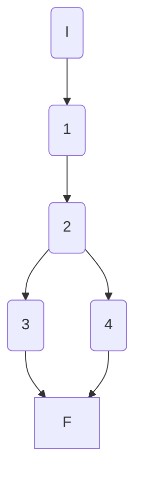
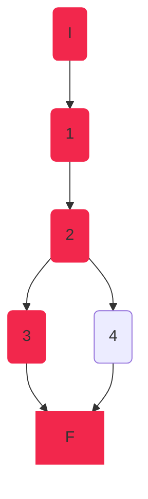
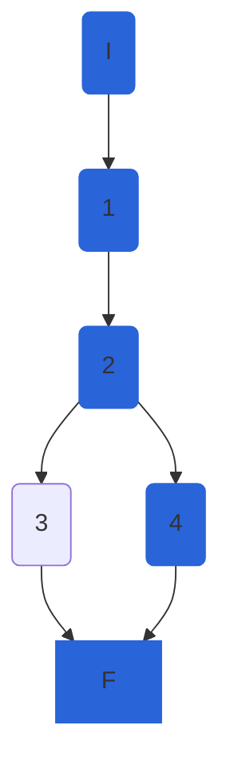

## AthleteService.CreateAthleteAsync

### Código

```csharp
public async Task<AthleteModel> CreateAthleteAsync(AthleteModel athlete, int disciplineId)
{
	//1
	await GetDisciplineAsync(disciplineId);
	athlete.DisciplineId = disciplineId;
	var athleteEntity = _mapper.Map<AthleteEntity>(athlete);
	 _athleteRepository.CreateAthlete(athleteEntity, disciplineId);
	var result = await _athleteRepository.SaveChangesAsync();
	
	if (result)//2
	{
		return map(_mapper.Map<AthleteModel>(athleteEntity));//3
	}
	throw new Exception("Database Error");//4
}
```

### Grafo



### Complejidad ciclo matica

Numero de regiones
$$ v(G) = R $$
$$v(G) = 2 $$

Numero de nodos y aristas
$$ v(G) = E - N + 2 $$
$$ v(G) = 6 - 6 + 2 $$
$$ v(G) = 2 $$
  
Numero de decisiones
$$ v(G) = P + 1 $$
$$ v(G) = 1 + 1$$
$$ v(G) = 2 $$

### Casos de prueba

| | Camino   | Entrada   | TC | Salida  |
| --- | --- | --- | --- | --- |
| 1 | I 1 2 3 4 F |  `_athleteRepository.SaveChangesAsync();` retorna `result = false`  | `result = false` | `throw new Exception("Database Error");` |
| 2 | I 1 2 5 F |  `_athleteRepository.SaveChangesAsync();` retorna `result = true`  | `result = false` | `new AthleteModel = {Id...}` |

1. Verificar que si `_athleteRepository.SaveChangesAsync();` retorna `result = false`, entonces `CreateAthleteAsync`  lanza una excepción `throw new Exception("Database Error");`.
2. Verificar que si `_athleteRepository.SaveChangesAsync();` retorna `result = true` (con `athleteId=1`, `disciplineId=1`) y athlete:
	```csharp
	{
		Id = 1,
		DisciplineId = 1,
		Name = "Juan",
		Nationality = "Boliviano",
		NumberOfCompetitions = 1,
		Gender = Gender.M,
		PersonalBest = 125,
		SeasonBest = 125,
	}
	```
	entonces `CreateAthleteAsync` retornara 
	```csharp
	AthleteModel(){
		Id = 1,
		DisciplineId = 1,
		Name = "Juan",
		Nationality = "Boliviano",
		NumberOfCompetitions = 1,
		Gender = Gender.M,
		PersonalBest = 125,
		SeasonBest = 125,
	}
	```

Camino 1


Camino 2

### Pruebas unitarias

```csharp
//CreateAthleteAsync
[Theory]
[InlineData(false)]//tc1
[InlineData(true)]//tc2
public async Task CreateAthleteAsync_UpdateDb(bool dbUpdateResult)
{
	int athleteId = 1;
	int disciplineId = 1;
	var disciplineEntity100M = new DisciplineEntity()
	{
		Id = disciplineId,
		Name = "100M"
	};
	var config = new MapperConfiguration(cfg => cfg.AddProfile<AutomapperProfile>());
	var mapper = config.CreateMapper();
	var athleteModel = new AthleteModel()
	{
		Id = athleteId,
		Name = "Juan",
		DisciplineId = disciplineId,
		Nationality = "Boliviano",
		NumberOfCompetitions = 1,
		Gender = Gender.M,
		PersonalBest = 125,
		SeasonBest = 125,
	};

	var athleteEntity = new AthleteEntity()
	{
		Id = athleteId,
		Name = "Juan",
		Nationality = "Boliviano",
		NumberOfCompetitions = 1,
		Gender = Gender.M,
		PersonalBest = 125,
		SeasonBest = 125,
	};


	var repositoryMock = new Mock<IAthleteRepository>();
	repositoryMock.Setup(r => r.GetDisciplineAsync(disciplineId, false)).ReturnsAsync(disciplineEntity100M);
	repositoryMock.Setup(r => r.CreateAthlete(athleteEntity, disciplineId));
	repositoryMock.Setup(r => r.SaveChangesAsync()).ReturnsAsync(dbUpdateResult);

	var athleteService = new AthleteService(repositoryMock.Object, mapper);

	if (!dbUpdateResult)
	{
		//tc1
		Exception exception = await Assert.ThrowsAsync<Exception>(
		() => athleteService.CreateAthleteAsync( athleteModel, disciplineId));
		Assert.Equal("Database Error", exception.Message);
	}
	if (dbUpdateResult)
	{
		//tc2
		var athleteModelActual = await athleteService.CreateAthleteAsync( athleteModel, disciplineId);
		Assert.Equal(athleteModel, athleteModelActual);
	}
}
```