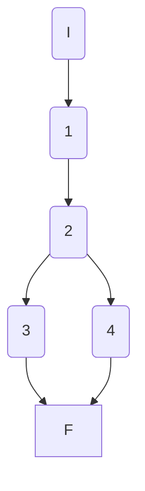
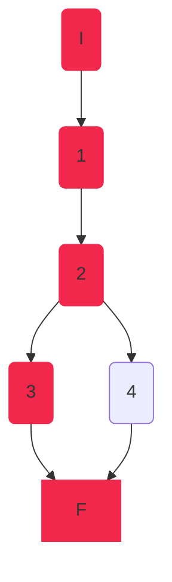
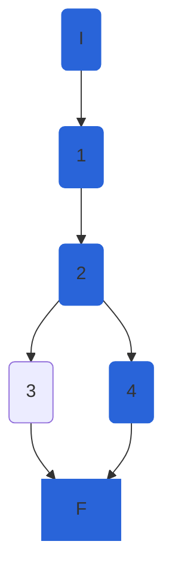

## AthleteService.GetAthleteAsync

### Código

```csharp
public async Task<AthleteModel> GetAthleteAsync(int athleteId, int disciplineId)
{
	//1
	await GetDisciplineAsync(disciplineId);
	var athleteEntity = await _athleteRepository.GetAthleteAsync(athleteId, disciplineId);
	if (athleteEntity == null)//2
		throw new NotFoundElementException($"Athlete with id {athleteId} does not exist in discipline {disciplineId}");//3

	//4
	var athleteModel = _mapper.Map<AthleteModel>(athleteEntity);
	athleteModel.DisciplineId = disciplineId;
	return athleteModel;
}
```

### Grafo



### Complejidad ciclo matica

Numero de regiones
$$ v(G) = R $$
$$v(G) = 2 $$

Numero de nodos y aristas
$$ v(G) = E - N + 2 $$
$$ v(G) = 6 - 6 + 2 $$
$$ v(G) = 2 $$
  
Numero de decisiones
$$ v(G) = P + 1 $$
$$ v(G) = 1 + 1$$
$$ v(G) = 2 $$

### Casos de prueba

| | Camino   | Entrada   | TC | Salida  |
| --- | --- | --- | --- | --- |
| 1 | I 1 2 3 F |  `athleteId` no existe  | `athleteId=87` | throw `NotFoundElementException` |
| 2 | I 1 2 4 F |  `athleteId` existe | `athleteId=1` | `{Id=1, Name="Some Name", ...}`  |

1. Verificar que si `athleteId=87`, `disciplineId=1` se lanza una excepción `NotFoundElementException` con mensaje `Athlete with id 87 does not exist in discipline 1`
2. Verificar que si `athleteId=1`, `disciplineId=1` se retorna un `AthleteModel` con `{Id=1, DisciplineId=1, ...}`

Camino 1


Camino 2


### Pruebas unitarias

```csharp
//GetAthleteAsync
//tc1
[Fact]
public async Task GetAthleteAsync_AthleteIdNotExist_ThrowsNotFoundElementException()
{
	int athleteId = 87;
	int disciplineId = 1;
	var disciplineEntity100M = new DisciplineEntity()
	{
		Id = 1,
		Name = "100M"
	};
	var config = new MapperConfiguration(cfg => cfg.AddProfile<AutomapperProfile>());
	var mapper = config.CreateMapper();
	

	var repositoryMock = new Mock<IAthleteRepository>();
	repositoryMock.Setup(r => r.GetDisciplineAsync(disciplineId, false)).ReturnsAsync(disciplineEntity100M);
	repositoryMock.Setup(r => r.GetAthleteAsync(athleteId,disciplineId));

	var athleteService = new AthleteService(repositoryMock.Object, mapper);

	NotFoundElementException exception = await Assert.ThrowsAsync<NotFoundElementException>(
		() => athleteService.GetAthleteAsync(athleteId, disciplineId));
	Assert.Equal($"Athlete with id {athleteId} does not exist in discipline {disciplineId}", exception.Message);
}
//tc2
[Fact]
public async Task GetAthleteAsync_AthleteIdExist_ReturnsAthleteModel()
{
	int athleteId = 1;
	int disciplineId = 1;
	var disciplineEntity100M = new DisciplineEntity()
	{
		Id = disciplineId,
		Name = "100M"
	};
	var athleteEntity = new AthleteEntity()
	{
		Id = athleteId,
		Name = "Juan",
		Nationality = "Boliviano",
		NumberOfCompetitions = 1,
		Gender = Gender.M,
		PersonalBest = 125,
		SeasonBest = 125,
	};
	var athleteExpected = new AthleteModel()
	{
		Id = athleteId,
		DisciplineId = disciplineId,
		Name = "Juan",
		Nationality = "Boliviano",
		NumberOfCompetitions = 1,
		Gender = Gender.M,
		PersonalBest = 125,
		SeasonBest = 125,
	};

	var config = new MapperConfiguration(cfg => cfg.AddProfile<AutomapperProfile>());
	var mapper = config.CreateMapper();


	var repositoryMock = new Mock<IAthleteRepository>();
	repositoryMock.Setup(r => r.GetDisciplineAsync(disciplineId, false)).ReturnsAsync(disciplineEntity100M);
	repositoryMock.Setup(r => r.GetAthleteAsync(athleteId, disciplineId)).ReturnsAsync(athleteEntity);

	var athleteService = new AthleteService(repositoryMock.Object, mapper);

	var athleteActual = await athleteService.GetAthleteAsync(athleteId, disciplineId);
	Assert.Equal(athleteExpected,athleteActual);
	Assert.True(athleteExpected.Equals(athleteActual));
}
```
### Peculiaridades
Para la prueba del segundo tc, para controlar que todos los campos sean iguales se sobrecargo `Equals` en la `class AthleteModel`
```csharp
public override bool Equals(object obj)
{
	if (!(obj is AthleteModel))
	{
		return false;
	}

	AthleteModel other = (AthleteModel)obj;
	return this.Id == other.Id &&
		this.Name == other.Name &&
		this.Nationality == other.Nationality &&
		this.IsActive == other.IsActive &&
		this.NumberOfCompetitions == other.NumberOfCompetitions &&
		this.DisciplineId == other.DisciplineId &&
		this.Gender == other.Gender &&
		this.PersonalBest == other.PersonalBest &&
		this.SeasonBest == other.SeasonBest &&
		this.Points == other.Points &&
		this.ImagePath == other.ImagePath;
}
```
esto permite a `Assert.Equals` hacer la comparación entre los dos objetos y no solo a nivel de memoria. Esto permite comparar mas fácilmente los objetos. Además que permite definir según nuestro criterio lo que es la igualdad de los dos objetos.