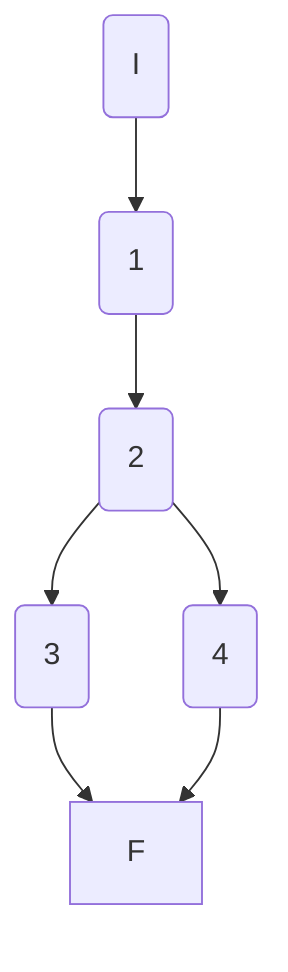
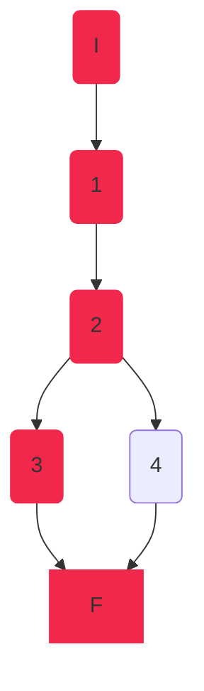
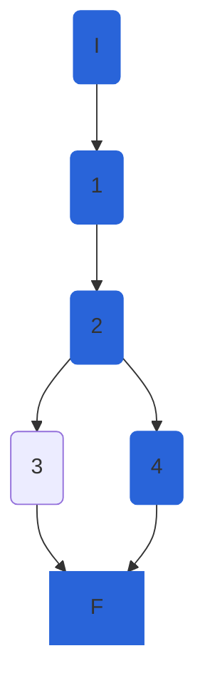

## AthleteService.GetDisciplineAsync

### Código

```csharp
private async Task<DisciplineEntity> GetDisciplineAsync(int disciplineId)
{
	var discipline = await _athleteRepository.GetDisciplineAsync(disciplineId,false);//1
	if (discipline == null)//2
		throw new NotFoundElementException($"Discipline with id {disciplineId} was not found");//3
	return discipline;//4
}
```

### Grafo



### Complejidad ciclo matica

Numero de regiones
$$ v(G) = R $$
$$v(G) = 2 $$

Numero de nodos y aristas
$$ v(G) = E - N + 2 $$
$$ v(G) = 6 - 6 + 2 $$
$$ v(G) = 2 $$
  
Numero de decisiones
$$ v(G) = P + 1 $$
$$ v(G) = 1 + 1$$
$$ v(G) = 2 $$

### Casos de prueba

| | Camino   | Entrada   | TC | Salida  |
| --- | --- | --- | --- | --- |
| 1 | I 1 2 3 F |  `disciplineId` no existe  | `disciplineId=87` | throw `NotFoundElementException` |
| 2 | I 1 2 4 F |  `disciplineId` existe | `disciplineId=1` | `{Id=1, Name="Some Name", ...}`  |

1. Verificar que si `disciplineId=87` se lanza una excepción `NotFoundElementException` con mensaje `"Discipline with id 87 was not found"`
2. Verificar que si `disciplineId=1` retorna `DisciplineEntity` con `{Id=1, Name = "Some Name", ...}`

Camino 1


Camino 2


### Pruebas unitarias

```csharp
//CreateAthleteAsync
[Theory]
[InlineData(87)]//tc1
[InlineData(1)]//tc2
public async Task GetDisciplineAsync(int disciplineId)
{
	int athleteId = 1;
	var disciplineEntity100M = new DisciplineEntity()
	{
		Id = disciplineId,
		Name = "100M"
	};
	var config = new MapperConfiguration(cfg => cfg.AddProfile<AutomapperProfile>());
	var mapper = config.CreateMapper();
	

	var repositoryMock = new Mock<IAthleteRepository>();

	bool disciplineIdExist = disciplineId == 1;

	if (!disciplineIdExist)
	{
		repositoryMock.Setup(r => r.GetDisciplineAsync(disciplineId, false));
		var athleteService = new AthleteService(repositoryMock.Object, mapper);
		//tc1
		NotFoundElementException exception = await Assert.ThrowsAsync<NotFoundElementException>(
		() => athleteService.GetDisciplineAsync(disciplineId));
		Assert.Equal($"Discipline with id {disciplineId} was not found", exception.Message);
	}
	if (disciplineIdExist)
	{
		repositoryMock.Setup(r => r.GetDisciplineAsync(disciplineId, false)).ReturnsAsync(disciplineEntity100M);
		var athleteService = new AthleteService(repositoryMock.Object, mapper);
		//tc2
		var disciplineActual = await athleteService.GetDisciplineAsync(disciplineId);
		Assert.Equal(disciplineEntity100M, disciplineActual);
	}
}
```