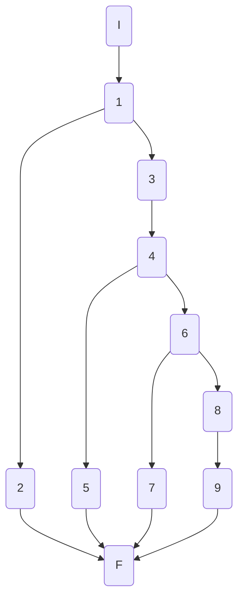
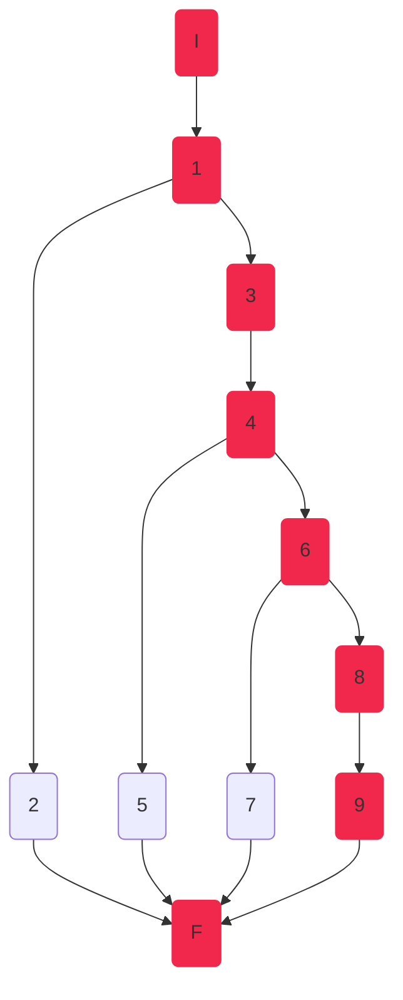
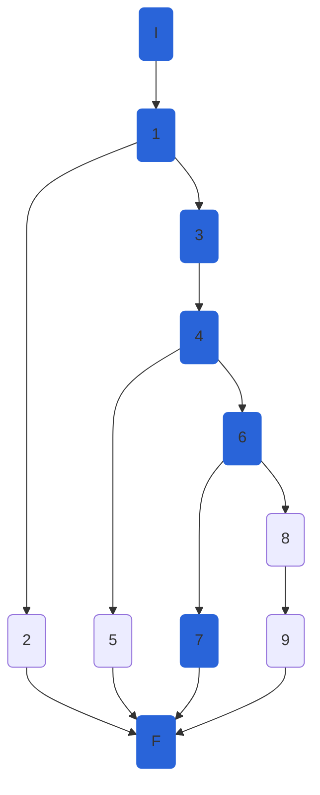
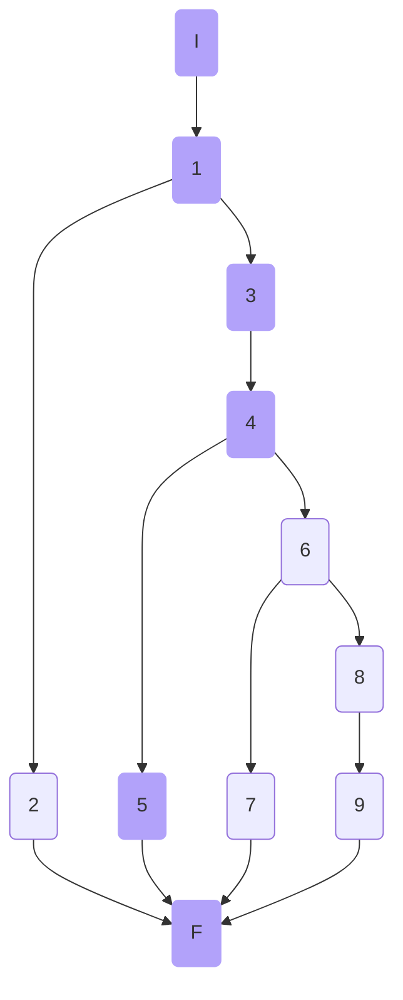
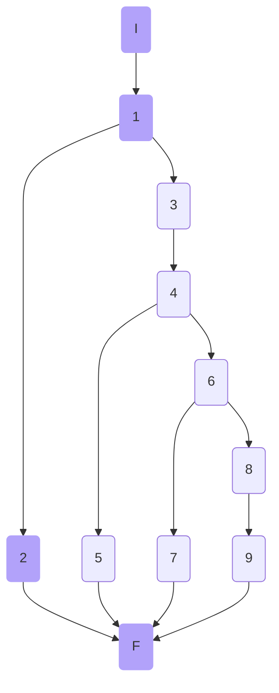

## AthletesController.CreateAthleteAsync

### Código

```csharp
[HttpPost]
public async Task<ActionResult<AthleteModel>> CreateAthleteAsync([FromBody] AthleteModel athlete,int disciplineId)
{
    try
    {
        if (!ModelState.IsValid)//1
            return BadRequest(ModelState);//2

        athlete.ImagePath = athlete.ImagePath ?? "Resources\\Images\\genericAthlete.jpg";//3
        var newAthlete = await _athleteService.CreateAthleteAsync(athlete, disciplineId);//4
        return Created($"/api/disicplines/{disciplineId}/athletes/{newAthlete.Id}", newAthlete);//5
    }
    catch (NotFoundElementException ex)//6
    {
        return NotFound(ex.Message);//7
    }
    catch (Exception)//8
    {
        return StatusCode(StatusCodes.Status500InternalServerError, "Something happened.");//9
    }
}
```

### Grafo



### Complejidad ciclo matica

Numero de regiones
$$ v(G) = R $$
$$v(G) = 4 $$

Numero de nodos y aristas
$$ v(G) = E - N + 2 $$
$$ v(G) = 13 - 11 + 2 $$
$$ v(G) = 4 $$
  
Numero de decisiones
$$ v(G) = P + 1 $$
$$ v(G) = 3 + 1$$
$$ v(G) = 4 $$

### Casos de prueba

| | Camino   | Entrada   | TC | Salida  |
| --- | --- | --- | --- | --- |
| 1 | I 1 3 4 6 8 9 F |  athlete (Model) valido, se recibe una excepcion no esperada | `_athleteService.CreateAthleteAsync(athlete, disciplineId);` lanza una `Exception` (general), `disciplineId = <any>`, `athleteModel` valido | `StatusCode:500` |
| 2 | I 1 3 4 6 7 F | athlete (Model) valido, se recibe una excepcion `NotFound` | `_athleteService.CreateAthleteAsync(athlete, disciplineId);` lanza una `NotFound`, `disciplineId = <any>`, `athleteModel` valido | `StatusCode:404` |
| 3 | I 1 3 4 5 F | athlete (Model) valido y disciplineId existe | `disciplineId = 1`, `athleteModel` valido | `StatusCode:201` |
| 4 | I 1 2 F | athlete (Model) no valido | `disciplineId = 1`, `athleteModel` no valido | `StatusCode:400` |

1. Verificar que si
	```csharp
	var athlete = new AthleteModel()
	{
		Id = 1,
		BirthDate = DateTime.Now,
		DisciplineId = 1,
		Gender = Gender.M,
		Name = "Pepe",
		NumberOfCompetitions = 1,
		PersonalBest = 125,
		SeasonBest = 150,
		Nationality = "Boliviano"
	}
	```
	 (valido) y `_athleteService.CreateAthleteAsync(...)` lanza una `Exception("Something happened.")`, entonces `CreateAthleteAsync`  devuelve el **Status Code 500**.
2. Verificar que si
	```csharp
	var athlete = new AthleteModel()
	{
		Id = 1,
		BirthDate = DateTime.Now,
		DisciplineId = 1,
		Gender = Gender.M,
		Name = "Pepe",
		NumberOfCompetitions = 1,
		PersonalBest = 125,
		SeasonBest = 150,
		Nationality = "Boliviano"
	}
	```
	y `_athleteService.CreateAthleteAsync(...)` lanza una excepción `NotFoundElementException($"Athlete with id 1 does not exist in discipline 87")`, entonces `CreateAthleteAsync`  devuelve el **Status Code 404**.
3. Verificar que si
	```csharp
	var athlete = new AthleteModel()
	{
		Id = 1,
		BirthDate = DateTime.Now,
		DisciplineId = 1,
		Gender = Gender.M,
		Name = "Pepe",
		NumberOfCompetitions = 1,
		PersonalBest = 125,
		SeasonBest = 150,
		Nationality = "Boliviano"
	}
	```
	entonces `CreateAthleteAsync`  devuelve una respuesta con **Status Code 201** y devuelve un `AthleteModel` con los mismos datos del modelo de entrada.
4. Verificar que si
	```csharp
	var athlete = new AthleteModel()
	{
		Name = null,
		BirthDate = DateTime.Now,
		NumberOfCompetitions = 1,
		PersonalBest = 125,
		SeasonBest = 150,
		Nationality = "Boliviano"
	};
	```
	entonces `CreateAthleteAsync`  devuelve un **Status Code 400**.

Camino 1


Camino 2


Camino 3


Camino 3


### Pruebas unitarias

```csharp
//CreateAthleteAsync
//tc1
[Fact]
public async Task CreateAthleteAsync_ReturnsStatusCode500()
{
	int disciplineId = 1;
	var serviceMock = new Mock<IAthleteService>();
	var athlete = new AthleteModel()
	{
		Id = 1,
		BirthDate = DateTime.Now,
		DisciplineId = disciplineId,
		Gender = Gender.M,
		Name = "Pepe",
		NumberOfCompetitions = 1,
		PersonalBest = 125,
		SeasonBest = 150,
		Nationality = "Boliviano"
	};

	serviceMock.Setup(serv => serv.CreateAthleteAsync(It.IsAny<AthleteModel>(), It.IsAny<int>()))
		.Throws(new Exception("Something happened."));

	var fileService = new FileService();
	var athletesController = new AthletesController(serviceMock.Object, fileService);

	var response = await athletesController.CreateAthleteAsync(athlete,disciplineId);
	var athleteActual = ((ObjectResult)response.Result).Value;
	var actualStatusCode = ((ObjectResult) response.Result).StatusCode;

	Assert.Equal(500, actualStatusCode);
	Assert.Equal("Something happened.", athleteActual);
}

//tc2
[Fact]
public async Task CreateAthleteAsync_ReturnsStatusCode404()
{
	int disciplineId = 87;
	var serviceMock = new Mock<IAthleteService>();
	var athlete = new AthleteModel()
	{
		Id = 1,
		BirthDate = DateTime.Now,
		DisciplineId = disciplineId,
		Gender = Gender.M,
		Name = "Pepe",
		NumberOfCompetitions = 1,
		PersonalBest = 125,
		SeasonBest = 150,
		Nationality = "Boliviano"
	};

	serviceMock.Setup(serv => serv.CreateAthleteAsync(It.IsAny<AthleteModel>(), It.IsAny<int>()))
		.Throws(new NotFoundElementException($"Athlete with id {athlete.Id} does not exist in discipline {disciplineId}"));

	var fileService = new FileService();
	var athletesController = new AthletesController(serviceMock.Object, fileService);

	var response = await athletesController.CreateAthleteAsync(athlete, disciplineId);
	var athleteActual = ((ObjectResult)response.Result).Value;
	var actualStatusCode = ((ObjectResult)response.Result).StatusCode;
	
	Assert.Equal(404, actualStatusCode);
	Assert.Equal("Athlete with id 1 does not exist in discipline 87", athleteActual);
}
//tc3
[Fact]
public async Task CreateAthleteAsync_ReturnsStatusCode201()
{
	int disciplineId = 1;
	var serviceMock = new Mock<IAthleteService>();
	var athlete = new AthleteModel()
	{
		Id = 1,
		BirthDate = DateTime.Now,
		DisciplineId = disciplineId,
		Gender = Gender.M,
		Name = "Pepe",
		NumberOfCompetitions = 1,
		PersonalBest = 125,
		SeasonBest = 150,
		Nationality = "Boliviano"
	};

	serviceMock.Setup(serv => serv.CreateAthleteAsync(It.IsAny<AthleteModel>(), It.IsAny<int>())).ReturnsAsync(athlete);

	var fileService = new FileService();
	var athletesController = new AthletesController(serviceMock.Object, fileService);

	var response = await athletesController.CreateAthleteAsync(athlete, disciplineId);
	var athleteActual = ((ObjectResult)response.Result).Value;
	var actualStatusCode = ((ObjectResult)response.Result).StatusCode;

	Assert.Equal(201, actualStatusCode);
	Assert.Equal(athlete, athleteActual);
}
//tc4
//Failing, BUG Identified Model.IsValid not working
//TO DO: try to fix the bug 
//[Fact]
//public async Task CreateAthleteAsync_ReturnsStatusCode400()
//{
//    int disciplineId = 1;
//    var serviceMock = new Mock<IAthleteService>();
//    var athlete = new AthleteModel()//no name set
//    {
//        Name = null,
//        BirthDate = DateTime.Now,
//        NumberOfCompetitions = 1,
//        PersonalBest = 125,
//        SeasonBest = 150,
//        Nationality = "Boliviano"
//    };

//    serviceMock.Setup(serv => serv.CreateAthleteAsync(It.IsAny<AthleteModel>(), It.IsAny<int>())).ReturnsAsync(athlete);

//    var fileService = new FileService();
//    var athletesController = new AthletesController(serviceMock.Object, fileService);

//    var response = await athletesController.CreateAthleteAsync(athlete, disciplineId);
//    var athleteActual = ((ObjectResult)response.Result).Value;
//    var actualStatusCode = ((ObjectResult)response.Result).StatusCode;

//    Assert.Equal(400, actualStatusCode);
//    Assert.IsType<BadRequestObjectResult>(response.Result);
//}
```