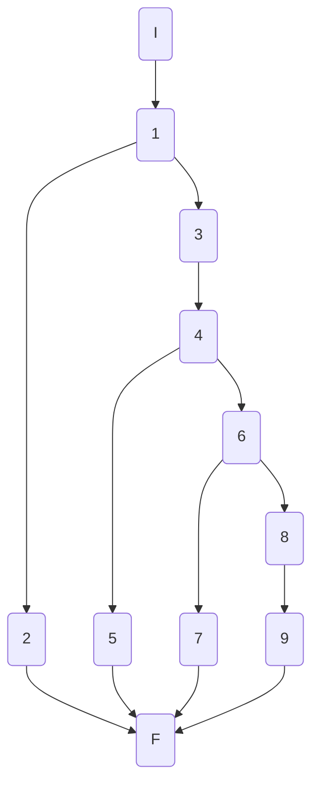
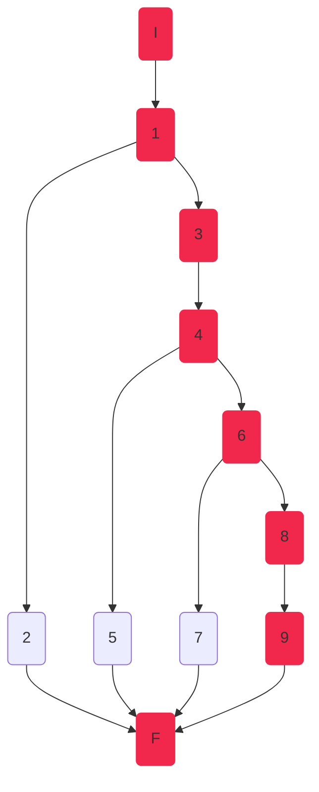
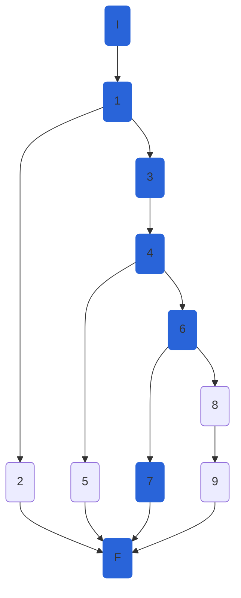
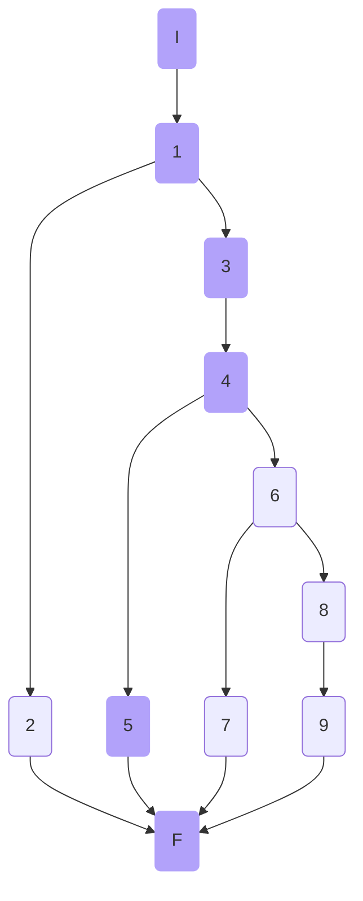
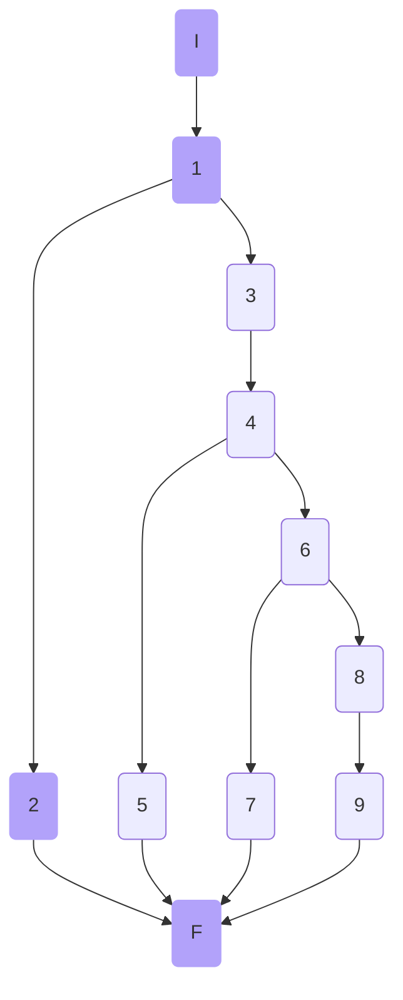

## AthletesController.CreateAthleteAsync

### Código

```csharp
[HttpPost]
public async Task<ActionResult<AthleteModel>> CreateAthleteAsync([FromBody] AthleteModel athlete,int disciplineId)
{
    try
    {
        if (!ModelState.IsValid)//1
            return BadRequest(ModelState);//2

        athlete.ImagePath = athlete.ImagePath ?? "Resources\\Images\\genericAthlete.jpg";//3
        var newAthlete = await _athleteService.CreateAthleteAsync(athlete, disciplineId);//4
        return Created($"/api/disicplines/{disciplineId}/athletes/{newAthlete.Id}", newAthlete);//5
    }
    catch (NotFoundElementException ex)//6
    {
        return NotFound(ex.Message);//7
    }
    catch (Exception)//8
    {
        return StatusCode(StatusCodes.Status500InternalServerError, "Something happened.");//9
    }
}
```

### Grafo



### Complejidad ciclo matica

Numero de regiones
$$ v(G) = R $$
$$v(G) = 4 $$

Numero de nodos y aristas
$$ v(G) = E - N + 2 $$
$$ v(G) = 13 - 11 + 2 $$
$$ v(G) = 4 $$
  
Numero de decisiones
$$ v(G) = P + 1 $$
$$ v(G) = 3 + 1$$
$$ v(G) = 4 $$

### Casos de prueba

| | Camino   | Entrada   | TC | Salida  |
| --- | --- | --- | --- | --- |
| 1 | I 1 3 4 6 8 9 F |  athlete (Model) valido, se recibe una excepcion no esperada | `_athleteService.CreateAthleteAsync(athlete, disciplineId);` lanza una `Exception` (general), `disciplineId = <any>`, `athleteModel` valido | `StatusCode:500` |
| 2 | I 1 3 4 6 7 F | athlete (Model) valido, se recibe una excepcion `NotFound` | `_athleteService.CreateAthleteAsync(athlete, disciplineId);` lanza una `NotFound`, `disciplineId = <any>`, `athleteModel` valido | `StatusCode:404` |
| 3 | I 1 3 4 5 F | athlete (Model) valido y disciplineId existe | `disciplineId = 1`, `athleteModel` valido | `StatusCode:201` |
| 4 | I 1 2 F | athlete (Model) no valido | `disciplineId = 1`, `athleteModel` no valido | `StatusCode:400` |

1. Verificar que TO DO
2. Verificar que TO DO
3. Verificar que TO DO

Camino 1


Camino 2


Camino 3


Camino 3


### Pruebas unitarias

```csharp

```