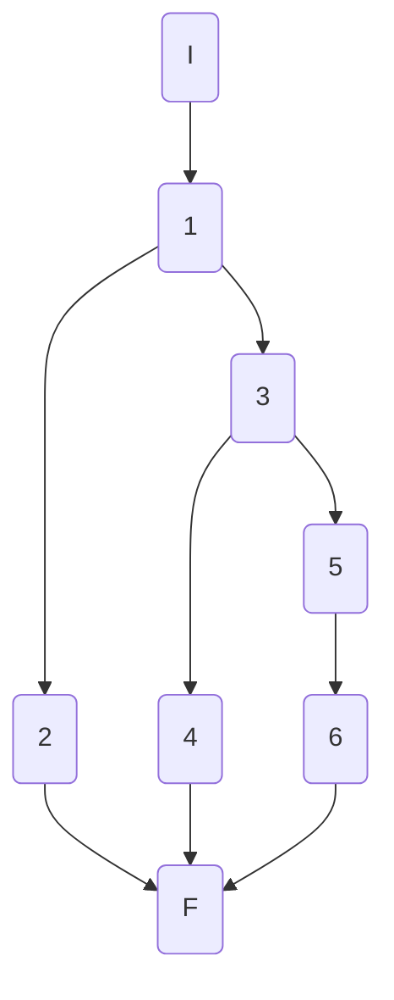
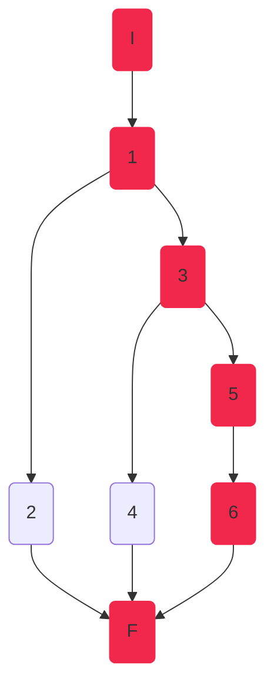
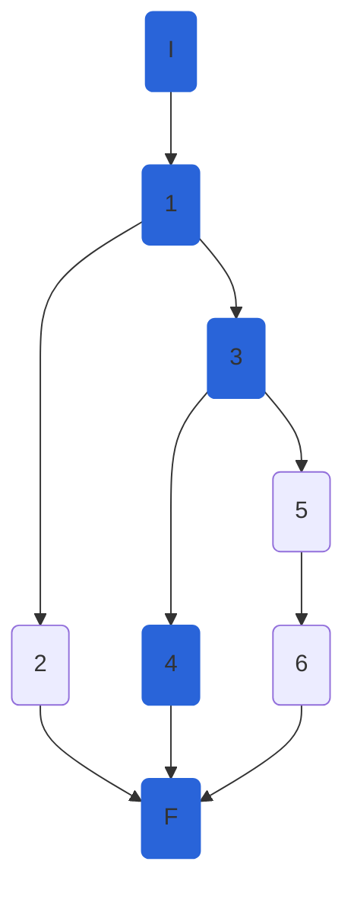
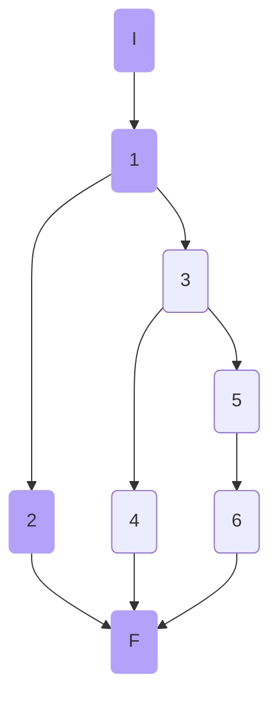

## AthletesController.DeleteAthleteAsync

### Código

```csharp
[HttpDelete("{athleteId:int}")]
public async Task<ActionResult> DeleteAthleteAsync(int athleteId,int disciplineId)
{
	try
	{
		await _athleteService.DeleteAthleteAsync(athleteId, disciplineId);//1
		return Ok();//2
	}
	catch (NotFoundElementException ex)//3
	{
		return NotFound(ex.Message);//4
	}
	catch (Exception)//5
	{
		return StatusCode(StatusCodes.Status500InternalServerError, "Something happened.");//6
	}
}
```

### Grafo



### Complejidad ciclo matica

Numero de regiones
$$ v(G) = R $$
$$v(G) = 3 $$

Numero de nodos y aristas
$$ v(G) = E - N + 2 $$
$$ v(G) = 9 - 8 + 2 $$
$$ v(G) = 3 $$
  
Numero de decisiones
$$ v(G) = P + 1 $$
$$ v(G) = 2 + 1$$
$$ v(G) = 3 $$

### Casos de prueba

| | Camino   | Entrada   | TC | Salida  |
| --- | --- | --- | --- | --- |
| 1 | I 1 3 5 6 F |  `athleteId` cualquiera, `disciplineId` cualquiera, throw `Exception`  | `athleteId=<any>` `disciplineId=<any>`, throw `Exception` | `StatusCode:500` |
| 2 | I 1 3 4 F |  `athleteId` no existe, `disciplineId` existe , throw `NotFoundElementException` | `athleteId=87` `disciplineId=1` | `StatusCode:404` |
| 3 | I 1 2 F |  `athleteId` existe, `disciplineId` existe  | `athleteId = 1`, `disciplineId = 1`| `StatusCode:200` |

1. Verificar que si `_athleteService.DeleteAthleteAsync(...)` lanza una `Exception("Something happened.")`, entonces `DeleteAthleteAsync`  devuelve el **Status Code 500**.
2. Verificar que si `_athleteService.DeleteAthleteAsync(...)` lanza una excepción `NotFoundElementException($"Athlete with id 87 does not exist in discipline 1")`, entonces `CreateAthleteAsync`  devuelve el **Status Code 404**.
3. Verificar que si `disciplineId = 1`, `athleteId = 1`  (ambos existen) entonces `CreateAthleteAsync`  devuelve una respuesta con **Status Code 200**.

Camino 1


Camino 2


Camino 3

### Pruebas unitarias

```csharp
//DeleteAthleteAsync
//tc1
[Fact]
public async Task DeleteAthleteAsync_ReturnsStatusCode500()
{
	int disciplineId = 1;
	int athleteId = 1;
	var serviceMock = new Mock<IAthleteService>();

	serviceMock.Setup(serv => serv.DeleteAthleteAsync(athleteId,disciplineId))
		.Throws(new Exception("Something happened"));

	var fileService = new FileService();
	var athletesController = new AthletesController(serviceMock.Object, fileService);

	var response = await athletesController.DeleteAthleteAsync(athleteId, disciplineId);
	var actualStatusCode = ((ObjectResult)response).StatusCode;

	Assert.Equal(500, actualStatusCode);
}
//tc2
[Fact]
public async Task DeleteAthleteAsync_ReturnsStatusCode404()
{
	int disciplineId = 1;
	int athleteId = 87;
	var serviceMock = new Mock<IAthleteService>();

	serviceMock.Setup(serv => serv.DeleteAthleteAsync(athleteId, disciplineId))
		.Throws(new NotFoundElementException($"Athlete with id {athleteId} does not exist in discipline {disciplineId}"));

	var fileService = new FileService();
	var athletesController = new AthletesController(serviceMock.Object, fileService);

	var response = await athletesController.DeleteAthleteAsync(athleteId, disciplineId);
	var actualStatusCode = ((ObjectResult)response).StatusCode;

	Assert.Equal(404, actualStatusCode);
}
//tc3
[Fact]
public async Task DeleteAthleteAsync_ReturnsStatusCode200()
{
	int disciplineId = 1;
	int athleteId = 1;
	var serviceMock = new Mock<IAthleteService>();

	serviceMock.Setup(serv => serv.DeleteAthleteAsync(athleteId, disciplineId));

	var fileService = new FileService();
	var athletesController = new AthletesController(serviceMock.Object, fileService);

	var response = await athletesController.DeleteAthleteAsync(athleteId, disciplineId);
	var actualStatusCode = ((OkResult)response).StatusCode;

	Assert.Equal(200, actualStatusCode);
}
```