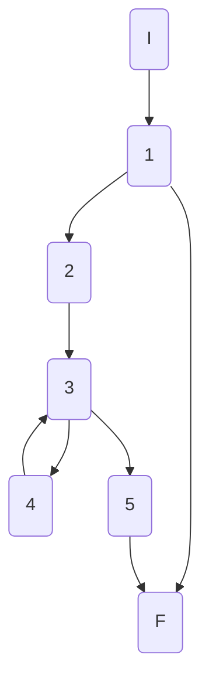
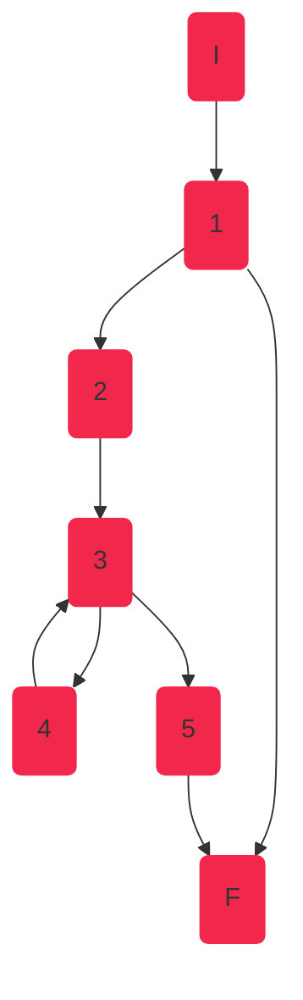
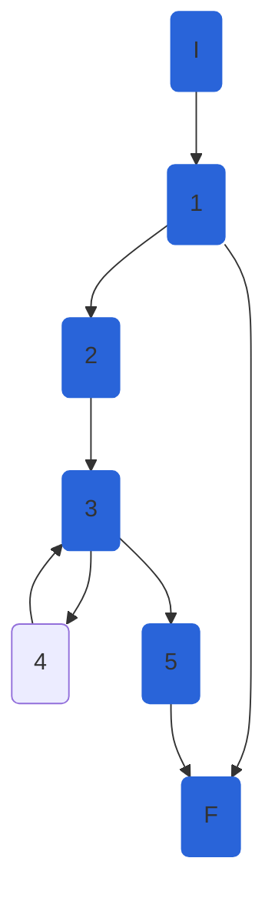
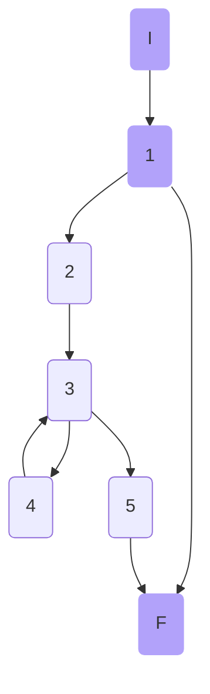

## AthleteService.GetAthletesAsync

### Código

```csharp
public async Task<IEnumerable<ShortAthleteModel>> GetAthletesAsync(int disciplineId)
{
    await GetDisciplineAsync(disciplineId);//1

    //2
    var athletesListEntity = await _athleteRepository.GetAthletesAsync(disciplineId);
    var athletes = _mapper.Map<IList<ShortAthleteModel>>(athletesListEntity);
    
    foreach(var athlete in athletes)//3
    {
        athlete.DisciplineId = disciplineId;//4
    }

    return athletes;//5
}
```

### Grafo



### Complejidad ciclo matica

Numero de regiones
$$
v(G) = R \\
v(G) = 3
$$

Numero de nodos y aristas
$$
v(G) = E - N + 2 \\
v(G) = 8 - 7 + 2
v(G) = 3
$$
  
Numero de decisiones
$$
v(G) = P + 1 \\
v(G) = 2 + 1
v(G) = 3
$$

### Casos de prueba

| | Camino   | Entrada   | TC | Salida  |
| --- | --- | --- | --- | --- |
| 1 | I 1 2 3 4 3 5 F | `disciplineId` existe y existen atletas registrados en esa disciplina | `disciplineId = 1` | `[{atObj1,athObj2}]` |
| 2 | I 1 2 3 5 F | `disciplineId` existe pero no existen atletas registrados en esa disciplina | `disciplineId = 2` | `[]` |
| 3 | I 1 F | `disciplineId` no existe | `disciplineId = 87` | `throw NotFoundElementException($"Discipline with id {disciplineId} was not found")` |

1. Verificar que cuando el `disciplineId=1` el tamaño de la lista retornada es `1`
2. Verificar que cuando el `disciplineId=2` el tamaño de la lista retornada es `0` (empty)
3. Verificar que cuando el `disciplineId=87` se lanza una excepcion de `NotFoundElementException` con el mensaje `Discipline with id 87 was not found`

Camino 1


Camino 2


Camino 3


### Peculiaridad

Al realizar las pruebas para este metodo se observo que con el test case 1 se lograba el 100% de statement coverage del metodo. Sin embargo, solo con ese tc no se esta probando los paths "ocultos" del tc2 y tc3

### Pruebas unitarias

```csharp
//GetAthletesAsync
//tc1
[Fact]
public async Task GetAthletesAsync_DisciplineIdValidAndExistAthletes_ReturnsListOfAthletes()
{
    int disciplineId = 1;

    var config = new MapperConfiguration(cfg => cfg.AddProfile<AutomapperProfile>());
    var mapper = config.CreateMapper();
    var athleteModel = new AthleteEntity()
    {
        Id = 95,
        Name = "Juan",
        Nationality = "Boliviano",
        NumberOfCompetitions = 1,
        Gender = Gender.M,
        PersonalBest = 125,
        SeasonBest = 125,
    };
    var disciplineEntity100M = new DisciplineEntity()
    {
        Id = 1,
        Name = "100M"
    };

    var athletesEntityEnumerable = new List<AthleteEntity>() { athleteModel } as IEnumerable<AthleteEntity>;
    var repositoryMock = new Mock<IAthleteRepository>();
    repositoryMock.Setup(r => r.GetDisciplineAsync(disciplineId, false)).ReturnsAsync(disciplineEntity100M);
    repositoryMock.Setup(r => r.GetAthletesAsync(disciplineId)).ReturnsAsync(athletesEntityEnumerable);

    var athleteService = new AthleteService(repositoryMock.Object, mapper);
    var athletesList = await athleteService.GetAthletesAsync(disciplineId);

    int expectedListSize = 1;

    Assert.Equal(expectedListSize, athletesList.Count());
}

//tc2
[Fact]
public async Task GetAthletesAsync_DisciplineIdValidAndNotExistAthletes_ReturnsEmptyList()
{
    int disciplineId = 2;

    var config = new MapperConfiguration(cfg => cfg.AddProfile<AutomapperProfile>());
    var mapper = config.CreateMapper();
    var disciplineEntity100M = new DisciplineEntity()
    {
        Id = 1,
        Name = "100M"
    };
    var athletesEntityEnumerable = new List<AthleteEntity>() as IEnumerable<AthleteEntity>;
    
    var repositoryMock = new Mock<IAthleteRepository>();
    repositoryMock.Setup(r => r.GetDisciplineAsync(disciplineId, false)).ReturnsAsync(disciplineEntity100M);
    repositoryMock.Setup(r => r.GetAthletesAsync(disciplineId)).ReturnsAsync(athletesEntityEnumerable);

    var athleteService = new AthleteService(repositoryMock.Object, mapper);
    var athletesList = await athleteService.GetAthletesAsync(disciplineId);

    Assert.Empty(athletesList);
}

//tc3
[Fact]
public async Task GetAthletesAsync_DisciplineIdNotExist_ThrowsNotFoundElementException()
{
    int disciplineId = 87;

    var config = new MapperConfiguration(cfg => cfg.AddProfile<AutomapperProfile>());
    var mapper = config.CreateMapper();
    var disciplineEntity100M = new DisciplineEntity()
    {
        Id = 1,
        Name = "100M"
    };
    var athletesEntityEnumerable = new List<AthleteEntity>() as IEnumerable<AthleteEntity>;

    var repositoryMock = new Mock<IAthleteRepository>();
    repositoryMock.Setup(r => r.GetDisciplineAsync(disciplineId, false)).ThrowsAsync(new NotFoundElementException($"Discipline with id {disciplineId} was not found"));
    repositoryMock.Setup(r => r.GetAthletesAsync(disciplineId)).ReturnsAsync(athletesEntityEnumerable);

    var athleteService = new AthleteService(repositoryMock.Object, mapper);


    NotFoundElementException exception = await Assert.ThrowsAsync<NotFoundElementException>(() => athleteService.GetAthletesAsync(disciplineId));
    Assert.Equal("Discipline with id 87 was not found", exception.Message);
}
```