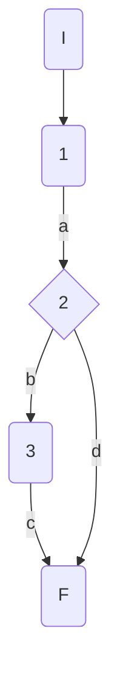
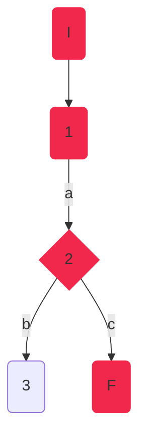
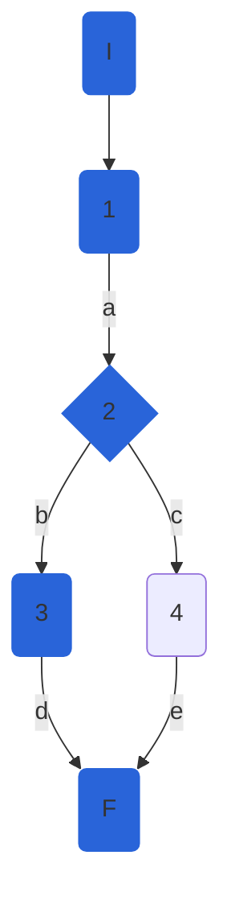

## DisciplineService.CreateDisciplineAsync

### Código

```csharp
public async Task<DisciplineModel> CreateDisciplineAsync(DisciplineModel discipline)
        {
            var disciplineEntity = _mapper.Map<DisciplineEntity> //1(discipline);
            _athleteRepository.CreateDiscipline(disciplineEntity); //1
            var result = await _athleteRepository.SaveChangesAsync(); //1
            if (result) //2
            {
               return  _mapper.Map<DisciplineModel>(disciplineEntity); //3
            }
            throw new Exception("Database Error"); //4
        }
```

### Grafo



### Complejidad ciclo matica

Numero de regiones
$$
v(G) = R \\
v(G) = 2
$$

Numero de nodos y aristas
$$
v(G) = E - N + 2 \\
v(G) = 5 - 5 + 2
$$
  
Numero de decisiones
$$
v(G) = P + 1 \\
v(G) = 1 + 1
$$

### Casos de prueba


| | Camino   | Entrada   | TC | Salida  |
| --- | --- | --- | --- | --- |
| 1 | I-1a-2b-3c-F | `discipline` new DisciplineModel() { Name = "Long Jump"}; | RepositoryMock.SaveChangesAsync returns false -> result=false  | throws exception("Database error") |
| 2 | I-1a-2d-F | `discipline` new DisciplineModel() { Name = "Long Jump"};|  RepositoryMock returns true -> result = true | return  DisciplineModel() { Id=0, Name = "Long Jump"};|

TC1: verificar que si hay error de base de datos al crear una disciplina, se lance una excepción con el mensaje "Database error".

TC2: verificar que se cree una disciplina con {Name="Long Jump"}, se cree correctamente y se agregue un id : { Id=0, Name = "Long Jump"}

Camino 1

Camino 2

### Pruebas unitarias

```csharp
//tc1
[Fact]
public void CreateDisciplineAsync_ValidId_ReuturnsDBException()
{
	var config = new MapperConfiguration(cfg => cfg.AddProfile<AutomapperProfile>());
	var mapper = config.CreateMapper();
	var longJumpDisciplineEntity = new DisciplineEntity()
	{
		Name = "Long Jump"
	};
	var longJumpDisciplineModel = new DisciplineModel()
	{
		
		Name = "Long Jump"
	};
	var repositoryMock = new Mock<IAthleteRepository>();           
	repositoryMock.Setup(r => r.SaveChangesAsync()).ReturnsAsync(false);
	repositoryMock.Setup(r => r.CreateDiscipline(longJumpDisciplineEntity));
	var disciplinesService = new DisciplineService(repositoryMock.Object, mapper);

	var exception = Assert.ThrowsAsync<Exception>(async () => await disciplinesService.CreateDisciplineAsync(longJumpDisciplineModel));
	Assert.Equal("Database Error", exception.Result.Message);
}
//tc2
[Fact]
public async Task CreateDisciplineAsync_ValidId_CreatesDiscipline()
{
	var config = new MapperConfiguration(cfg => cfg.AddProfile<AutomapperProfile>());
	var mapper = config.CreateMapper();
	var longJumpDisciplineEntity = new DisciplineEntity()
	{
		Id = 0,
		Name = "Long Jump"
	};
	var longJumpDisciplineModel = new DisciplineModel()
	{
		Name = "Long Jump"
	};
	var repositoryMock = new Mock<IAthleteRepository>();
	repositoryMock.Setup(r => r.SaveChangesAsync()).ReturnsAsync(true);
	repositoryMock.Setup(r => r.CreateDiscipline(longJumpDisciplineEntity));
	var disciplinesService = new DisciplineService(repositoryMock.Object, mapper);
	var disciplineCreated = await disciplinesService.CreateDisciplineAsync(longJumpDisciplineModel);
	Assert.NotNull(disciplineCreated);
	Assert.Equal("Long Jump", disciplineCreated.Name);
	Assert.Equal(0, disciplineCreated.Id);
	Assert.Empty(disciplineCreated.Athletes);
	Assert.Null(disciplineCreated.Rules);
	Assert.Null(disciplineCreated.CreationDate);
	Assert.Null(disciplineCreated.FemaleWorldRecord);
	Assert.Null(disciplineCreated.MaleWorldRecord);
	
}
```