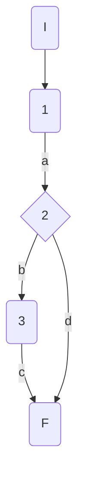
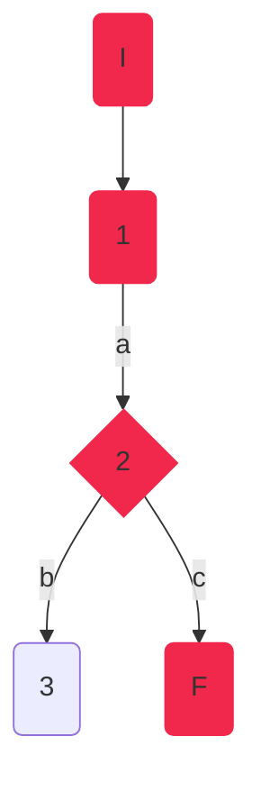
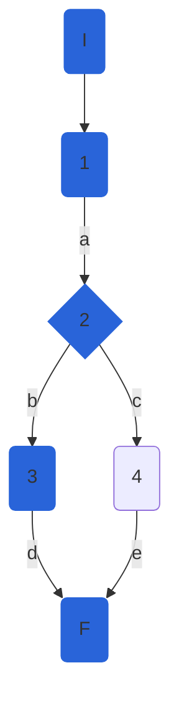

## DisciplineService.DeleteDisciplineAsync

### Código Original

```csharp
public async Task DeleteDisciplineAsync(int disciplineId)
        {
           await GetDisciplineAsync(disciplineId); //1
           await _athleteRepository.DeleteDisciplineAsync(disciplineId); //1
           var result = await _athleteRepository.SaveChangesAsync(); //1
            if (!result) //2
            {
                throw new Exception("Database Error"); //3
            }           
        }
```
    Se notó que el código original no devolvía nada. Era de tipo void, por lo tanto se refactorizó el código para poder probarlo correctamente:
#### Código Refactorizado:

```csharp
// SERVICIO
public async Task<bool> DeleteDisciplineAsync(int disciplineId)
    {
        bool deleted = false;
        await GetDisciplineAsync(disciplineId);
        deleted = await _athleteRepository.DeleteDisciplineAsync(disciplineId);
        var result = await _athleteRepository.SaveChangesAsync();
        if (!result)
        {
            throw new Exception("Database Error");
        }
        return deleted;
        
    }
```
### Grafo



### Complejidad ciclo matica

Numero de regiones
$$
v(G) = R \\
v(G) = 2
$$

Numero de nodos y aristas
$$
v(G) = E - N + 2 \\
v(G) = 5 - 5 + 2
$$
  
Numero de decisiones
$$
v(G) = P + 1 \\
v(G) = 1 + 1
$$

### Casos de prueba


| | Camino   | Entrada   | TC | Salida  |
| --- | --- | --- | --- | --- |
| 1 | I-1a-2b-3c-F | `disciplineId` valid  = 1 | RepositoryMock.SaveChangesAsync returns false -> result=false  | throws exception("Database error") |
| 2 | I-1a-2d-F | `disciplineId` valid  = 1|  RepositoryMock returns true -> result = true | return  true|

TC1: Verificar que si ocurre un error en base de datos al eliminar una disciplina, se lance la excepción con mensaje "Database error"

TC2: Verificar que al eliminar una disciplina correctamente, se devuelva true como resultado

Camino 1

Camino 2

### Pruebas unitarias

```csharp
//tc1
        [Fact]
        public void DeleteDisciplineAsync_ValidId_ReuturnsDBException()
        {
            var config = new MapperConfiguration(cfg => cfg.AddProfile<AutomapperProfile>());
            var mapper = config.CreateMapper();
            var disciplineEntity100M = new DisciplineEntity()
            {
                Id = 100,
                Name = "100M"
            };
            var repositoryMock = new Mock<IAthleteRepository>();
            
            repositoryMock.Setup(r => r.DeleteDisciplineAsync(100));
            repositoryMock.Setup(r => r.SaveChangesAsync()).ReturnsAsync(false);
            repositoryMock.Setup(r => r.GetDisciplineAsync(100, false)).ReturnsAsync(disciplineEntity100M);
            var disciplinesService = new DisciplineService(repositoryMock.Object, mapper);            

            var exception = Assert.ThrowsAsync<Exception>(async () => await disciplinesService.DeleteDisciplineAsync(100));
            Assert.Equal("Database Error", exception.Result.Message);
        }
        //tc2
        [Fact]
        public async Task DeleteDisciplineAsync_ValidId_DeletesDisicpline()
        {
            var config = new MapperConfiguration(cfg => cfg.AddProfile<AutomapperProfile>());
            var mapper = config.CreateMapper();
            var disciplineEntity100M = new DisciplineEntity()
            {
                Id = 1,
                Name = "100M"
            };
            var repositoryMock = new Mock<IAthleteRepository>();
            repositoryMock.Setup(r => r.DeleteDisciplineAsync(1)).ReturnsAsync(true);
            repositoryMock.Setup(r => r.SaveChangesAsync()).ReturnsAsync(true);
            repositoryMock.Setup(r => r.GetDisciplineAsync(1, false)).ReturnsAsync(disciplineEntity100M);
            var disciplinesService = new DisciplineService(repositoryMock.Object, mapper);
            var result = await disciplinesService.DeleteDisciplineAsync(1);      
            Assert.True(result);
        }
```