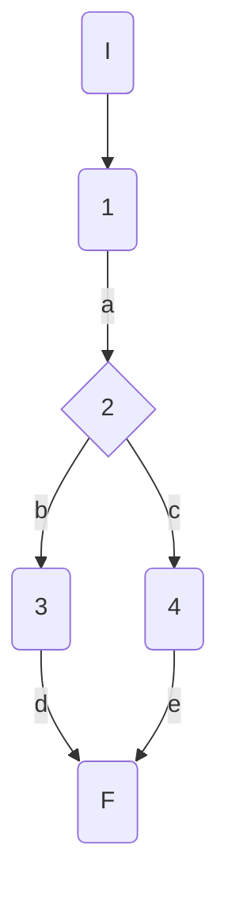
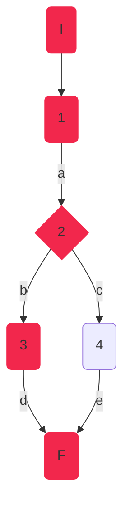
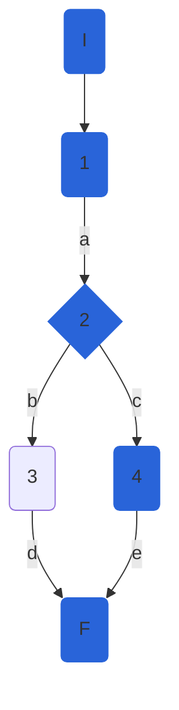

## DisciplineService.GetDisciplineAsync

### Código

```csharp
public async Task<DisciplineModel> GetDisciplineAsync(int disciplineId, bool showAthletes = false)
        {
            var disciplineEntity = await _athleteRepository.GetDisciplineAsync(disciplineId,showAthletes); //1
            
            if (disciplineEntity == null) //2
                throw new NotFoundElementException($"discipline with id {disciplineId} does not exist"); //3
            return _mapper.Map<DisciplineModel>(disciplineEntity); //4
        }
```

### Grafo



### Complejidad ciclo matica

Numero de regiones
$$
v(G) = R \\
v(G) = 2
$$

Numero de nodos y aristas
$$
v(G) = E - N + 2 \\
v(G) = 6 - 6 + 2
$$
  
Numero de decisiones
$$
v(G) = P + 1 \\
v(G) = 1 + 1
$$

### Casos de prueba


| | Camino   | Entrada   | TC | Salida  |
| --- | --- | --- | --- | --- |
| 1 | I-1a-2b-3d-F | `disciplineId` invalid  = 100| RepositoryMock returns null -> disciplineEntity = null | throw NotFoundElementException("discipline with id 100 does not exist") |
| 2 | I-1a-2c-4e-F | `disciplineId` valid  = 1|  RepositoryMock returns disicplineEntity -> disciplineEntity = {id=1, Name=100M} | return DisciplineModel({id=1, Name=100M}) |

TC1: Verificar que si se intenta recuperar datos de una disciplina con un id inválido 100 (inexistente en la bd) se devuelva la excepción NotFoundElementException con el mensaje "discipline with id 100 does not exist"

TC2: Verificar que si se intenta recuperar datos de una disciplina con un id válido 1, se devuelva la disciplina con los datos correspondientes al id 1: DisciplineModel({id=1, Name=100M})

Camino 1

Camino 2

### Pruebas unitarias

```csharp
 //tc1
        [Fact]
        public void GetDisciplineAsync_InvalidId_ThrowsNotFoundElementException()
        {
            var config = new MapperConfiguration(cfg => cfg.AddProfile<AutomapperProfile>());
            var mapper = config.CreateMapper();
            var repositoryMock = new Mock<IAthleteRepository>();
            repositoryMock.Setup(r => r.GetDisciplineAsync(100, false)).ReturnsAsync((DisciplineEntity)null);
            var disciplinesService = new DisciplineService(repositoryMock.Object, mapper);

            var exception = Assert.ThrowsAsync<NotFoundElementException>(async () => await disciplinesService.GetDisciplineAsync(100));
            Assert.Equal("discipline with id 100 does not exist", exception.Result.Message);

        }
        //tc2
        [Fact]
        public async Task GetDisciplineAsync_ValidId_ReturnsDisciplineCorrespondingToId()
        {
            var config = new MapperConfiguration(cfg => cfg.AddProfile<AutomapperProfile>());
            var mapper = config.CreateMapper();
            var disciplineEntity100M = new DisciplineEntity()
            {
                Id = 1,
                Name = "100M"
            };           
            var repositoryMock = new Mock<IAthleteRepository>();
            repositoryMock.Setup(r => r.GetDisciplineAsync(1, false)).ReturnsAsync(disciplineEntity100M);
            var disciplinesService = new DisciplineService(repositoryMock.Object, mapper);
            var disciplineFromDB = await disciplinesService.GetDisciplineAsync(1);

            Assert.NotNull(disciplineFromDB);
            Assert.IsType<DisciplineModel>(disciplineFromDB);
            Assert.True(1 == disciplineFromDB.Id);
            Assert.True("100M" == disciplineFromDB.Name);
            Assert.Empty(disciplineFromDB.Athletes);
            Assert.Null(disciplineFromDB.Rules);
            Assert.Null(disciplineFromDB.CreationDate);
            Assert.Null(disciplineFromDB.FemaleWorldRecord);
            Assert.Null(disciplineFromDB.MaleWorldRecord);
        }
```