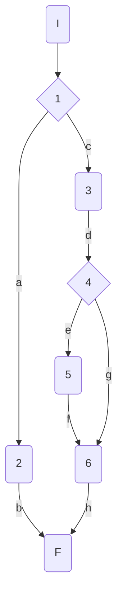
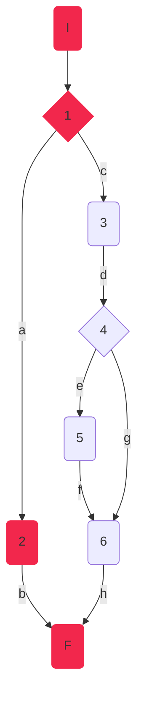
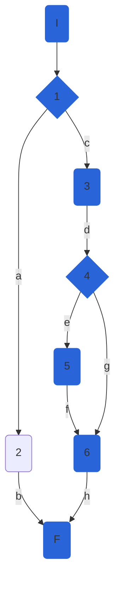
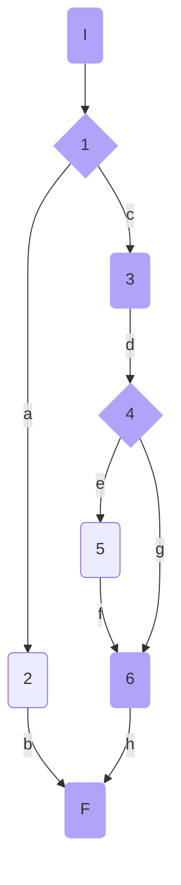

## DisciplineService.GetWorldRankingsAsync

### Código

```csharp
public async Task<IEnumerable<AthleteModel>> GetWorldRankingsAsync(int disciplineId, string gender = "all")
    {
        
        if (!_allowedGenderValues.Contains(gender.ToLower())) //1
            throw new InvalidElementOperationException($"invalid gender value : {gender}. The allowed values for param are: {string.Join(',', _allowedGenderValues)}"); //2
        var discipline = await _athleteRepository.GetDisciplineAsync(disciplineId, true);
        var athletes = _mapper.Map < IList < AthleteModel >> (discipline.Athletes.ToList());
        athletes = athletes.OrderByDescending(a => a.Points).ToList(); //3
        if (gender != "all") //4
        {
            athletes =  athletes.Where(a => a.Gender.ToString() == gender).ToList(); //5
        }
        //var listAthletes = _mapper.Map<IList<AthleteModel>>(athletes);
        return athletes; //6
        
    }
```

### Grafo



### Complejidad ciclo matica

Numero de regiones
$$
v(G) = R \\
v(G) = 3
$$

Numero de nodos y aristas
$$
v(G) = E - N + 2 \\
v(G) = 9 - 8 + 2
$$
  
Numero de decisiones
$$
v(G) = P + 1 \\
v(G) = 3 + 1
$$

### Casos de prueba


| | Camino   | Entrada   | TC | Salida  |
| --- | --- | --- | --- | --- |
| 1 | I-1a-2b-F | `disciplineId`=1 `gender`='k' | !allowed_genders.Contains(gender.to_lower()) = true | throws exception("throw new InvalidElementOperationException($"invalid gender value : k. The allowed values for param are: f,m,all") |
| 2 | I-1c-3d-4e-5f-6h-F | `disciplineId`=1 `gender`='f' | !allowed_genders.Contains(gender.to_lower()) = false ==> gender != "all" == true repositoryMock.GetDisciplineAsync returns {id=1, Name='400M', FemaleWorldRecord=7.52, Athletes = [{Id=1,Nationality='USA', Name='Sydney Maclaughlin', Gender='f', Points=1000}, {Id=2,Nationality='USA', Name='Allyson Felix', Gender='f', Points=1500}, , {Id=3,Nationality='Jamaica', Name='Usain Bolt', Gender='m'}]}| return [{Id=2,Nationality='USA', Name='Allyson Felix', Gender='f', Points=1500},{Id=1,Nationality='USA', Name='Sydney Maclaughlin', Gender='f', Points=1000}]|
| 3 | I-1c-3d-4g-6h-F | `disciplineId`=1 `gender`='all' | !allowed_genders.Contains(gender.to_lower()) = false ==> gender != "all" == false repositoryMock.GetDisciplineAsync returns {id=1, Name='400M', FemaleWorldRecord=7.52, Athletes = [{Id=1,Nationality='USA', Name='Sydney Maclaughlin', Gender='f', Points=1000}, {Id=2,Nationality='USA', Name='Allyson Felix', Gender='f', Points=1500}, , {Id=3,Nationality='Jamaica', Name='Usain Bolt', Gender='m', Points = 2000}]}| return [{Id=3,Nationality='Jamaica', Name='Usain Bolt', Gender='m', Points = 2000}, {Id=2,Nationality='USA', Name='Allyson Felix', Gender='f', Points=1500},{Id=1,Nationality='USA', Name='Sydney Maclaughlin', Gender='f', Points=1000}]|

TC1: Verificar que si el id de la disciplina es 1 y el género es k, se lance una excepción InvalidElementOperationException con el mensaje: "invalid gender value : k. The allowed values for param are: f,m,all"

TC2: Verificar que si el id de la disciplina es 1 y el género es f y la lista de atletas para la disciplina con id 1 es: [{Id=1,Nationality='USA', Name='Sydney Maclaughlin', Gender='f', Points=1000}, {Id=2,Nationality='USA', Name='Allyson Felix', Gender='f', Points=1500}, , {Id=3,Nationality='Jamaica', Name='Usain Bolt', Gender='m'}], devuelva la lista filtrada por género f y ordenada por puntos: [{Id=2,Nationality='USA', Name='Allyson Felix', Gender='f', Points=1500},{Id=1,Nationality='USA', Name='Sydney Maclaughlin', Gender='f', Points=1000}]

TC3: Verificar que si el id de la disciplina es 1 y el género es all y la lista de atletas para la disciplina con id 1 es: [{Id=1,Nationality='USA', Name='Sydney Maclaughlin', Gender='f', Points=1000}, {Id=2,Nationality='USA', Name='Allyson Felix', Gender='f', Points=1500}, , {Id=3,Nationality='Jamaica', Name='Usain Bolt', Gender='m', Points = 2000}], devuelve la lista de atletas ordenada por puntos de forma descendente:  [{Id=3,Nationality='Jamaica', Name='Usain Bolt', Gender='m', Points = 2000}, {Id=2,Nationality='USA', Name='Allyson Felix', Gender='f', Points=1500},{Id=1,Nationality='USA', Name='Sydney Maclaughlin', Gender='f', Points=1000}]

Camino 1

Camino 2

Camino 3

### Pruebas unitarias

```csharp
//tc1
        [Fact]
        public void GetWorldRankingAsync_InvalidGender_ReturnsInvalidElementOperationException()
        {
            var config = new MapperConfiguration(cfg => cfg.AddProfile<AutomapperProfile>());
            var mapper = config.CreateMapper();
            var disciplineId = 1;
            var gender = "k";
            var repositoryMock = new Mock<IAthleteRepository>();
            //repositoryMock.Setup(d=>d.GetDisciplineAsync(1,true)).ReturnsAsync()
            var disciplinesService = new DisciplineService(repositoryMock.Object, mapper);

            var exception = Assert.ThrowsAsync<InvalidElementOperationException>(async () => await disciplinesService.GetWorldRankingsAsync(disciplineId, gender));
            Assert.Equal("invalid gender value : k. The allowed values for param are: f,m,all", exception.Result.Message);
        }

        //tc2
        [Fact]
        public async Task GetWorldRankingAsync_ReturnsDisciplineWorldRankings()
        {
            var config = new MapperConfiguration(cfg => cfg.AddProfile<AutomapperProfile>());
            var mapper = config.CreateMapper();
            var disciplineId = 1;
            var gender = "f";
            var repositoryMock = new Mock<IAthleteRepository>();
            repositoryMock.Setup(d => d.GetDisciplineAsync(1, true)).ReturnsAsync(
                new DisciplineEntity()
                {
                    Id = 1,
                    Name = "400M",
                    FemaleWorldRecord = 7.52m,
                    Athletes = new List<AthleteEntity>(){
                        new AthleteEntity(){ Id = 1,Nationality = "USA", Name = "Sydney Maclaughlin", Gender = Gender.F, Points = 1000},
                        new AthleteEntity(){ Id = 2,Nationality = "USA", Name = "Allyson Felix", Gender = Gender.F, Points = 1500},
                        new AthleteEntity(){ Id = 3,Nationality = "Jamaica", Name = "Usain Bolt", Gender = Gender.M}
                    }
                });
            var disciplinesService = new DisciplineService(repositoryMock.Object, mapper);
            
            var worldRankings = await disciplinesService.GetWorldRankingsAsync(disciplineId, gender);
            Assert.NotNull(worldRankings);
            Assert.NotEmpty(worldRankings);
            Assert.Equal(2,worldRankings.Count());
            Assert.Contains(worldRankings, athlete => athlete.Id == 1);
            Assert.Contains(worldRankings, athlete => athlete.Id == 2);
            Assert.DoesNotContain(worldRankings, athlete => athlete.Id == 3);
            Assert.All(worldRankings, athlete => Assert.Equal(Gender.F,athlete.Gender));
            
        }
        //tc3
        [Fact]
        public async Task GetWorldRankingAsync_GenderAll_ReturnsDisciplineWorldRankings()
        {
            var config = new MapperConfiguration(cfg => cfg.AddProfile<AutomapperProfile>());
            var mapper = config.CreateMapper();
            var disciplineId = 1;
            var gender = "all";
            var repositoryMock = new Mock<IAthleteRepository>();
            repositoryMock.Setup(d => d.GetDisciplineAsync(1, true)).ReturnsAsync(
                new DisciplineEntity()
                {
                    Id = 1,
                    Name = "400M",
                    FemaleWorldRecord = 7.52m,
                    Athletes = new List<AthleteEntity>(){
                        new AthleteEntity(){ Id = 1,Nationality = "USA", Name = "Sydney Maclaughlin", Gender = Gender.F, Points = 1000},
                        new AthleteEntity(){ Id = 2,Nationality = "USA", Name = "Allyson Felix", Gender = Gender.F, Points = 1500},
                        new AthleteEntity(){ Id = 3,Nationality = "Jamaica", Name = "Usain Bolt", Gender = Gender.M, Points = 2000}
                    }
                });
            var disciplinesService = new DisciplineService(repositoryMock.Object, mapper);

            var worldRankings = await disciplinesService.GetWorldRankingsAsync(disciplineId, gender);
            Assert.NotNull(worldRankings);
            Assert.NotEmpty(worldRankings);
            Assert.Equal(3, worldRankings.Count());
            Assert.Contains(worldRankings, athlete => athlete.Id == 1);
            Assert.Contains(worldRankings, athlete => athlete.Id == 2);
            Assert.Contains(worldRankings, athlete => athlete.Id == 3);
            Assert.Equal("Usain Bolt",worldRankings.First().Name);
            Assert.Equal("Sydney Maclaughlin", worldRankings.Last().Name);            
        }
```