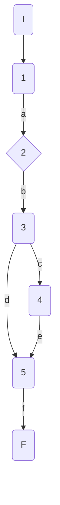
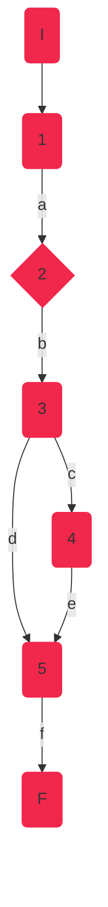

## DisciplineService.Mark

### Código

```csharp
public Decimal Mark(AthleteModel athlete)
    {
        Decimal mark;//1
        if (athlete.SeasonBest != null)//2
        {
            mark = GetRandomMark(athlete.SeasonBest - 0.2m, athlete.SeasonBest + 0.2m);//3
        }
        else
        {
            mark = GetRandomMark(athlete.PersonalBest - 0.2m, athlete.PersonalBest + 0.5m);//4
        }
        return mark;//5
    }
```

### Grafo



### Complejidad ciclo matica

Numero de regiones
$$
v(G) = R \\
v(G) = 2
$$

Numero de nodos y aristas
$$
v(G) = E - N + 2 \\
v(G) = 7 - 7 + 2
$$
  
Numero de decisiones
$$
v(G) = P + 1 \\
v(G) = 1 + 1
$$

### Casos de prueba

| | Camino   | Entrada   | TC | Salida  |
| --- | --- | --- | --- | --- |
| 1 | I-1a-2b-3h-4d-5f-6g-F | `athlete`={Id=1,Nationality="USA", Name="Sydney Maclaughlin", Gender="f", Points=1000, PersonalBest=52.75m, SeasonBest=52.75m} | athlete.SeasonBest!=null = false| {52.55-52.95}|
| 2 | I-1a-2c-4d-5f-6g-F | `athlete`={Id=1,Nationality="USA", Name="Sydney Maclaughlin", Gender="f", Points=1000, PersonalBest=52.75m, SeasonBest=null} | athlete.SeasonBest!=null -> true | {52.55-53.25}|

TC1: Verificar que si la atleta {Id=1,Nationality="USA", Name="Sydney Maclaughlin", Gender="f", Points=1000, PersonalBest=52.75m, SeasonBest=52.75m}, contiene marca de temporada, la marca devuelta esté en el rango 52.55-52.95

TC2: Verificar que si la atleta {Id=1,Nationality="USA", Name="Sydney Maclaughlin", Gender="f", Points=1000, PersonalBest=52.75m, SeasonBest=null}, NO TIENE marca de temporada, la marca devuelta esté en el rango 52.55-53.25

Camino 1

Camino 2

### Pruebas unitarias

```csharp
//tc1
[Fact]
public void Mark_ReturnsAthleteMark_SeasonBestIncluded()
{
	var config = new MapperConfiguration(cfg => cfg.AddProfile<AutomapperProfile>());
	var mapper = config.CreateMapper();
	var sydney = new AthleteModel()
	{
		Id = 1,
		Nationality = "USA",
		Name = "Sydney Maclaughlin",
		Gender = Gender.F,
		Points = 1000,
		PersonalBest = 52.75m,
		SeasonBest = 52.75m
	};
	var repositoryMock = new Mock<IAthleteRepository>();
	var disciplinesService = new DisciplineService(repositoryMock.Object, mapper);

	var result = disciplinesService.Mark(sydney);
	Assert.InRange(result, 52.55m, 52.94m);// Random.Next(inclusivo, exclusivo) - InRange(inclusivo, inclusivo)
}

//tc2
[Fact]
public void Mark_ReturnsAthleteMark_NoSeasonBest()
{
	var config = new MapperConfiguration(cfg => cfg.AddProfile<AutomapperProfile>());
	var mapper = config.CreateMapper();
	var sydney = new AthleteModel()
	{
		Id = 1,
		Nationality = "USA",
		Name = "Sydney Maclaughlin",
		Gender = Gender.F,
		Points = 1000,
		PersonalBest = 52.75m,
		SeasonBest = null
	};
	var repositoryMock = new Mock<IAthleteRepository>();
	var disciplinesService = new DisciplineService(repositoryMock.Object, mapper);

	var result = disciplinesService.Mark(sydney);
	Assert.InRange(result, 52.55m, 53.24m);
}
```