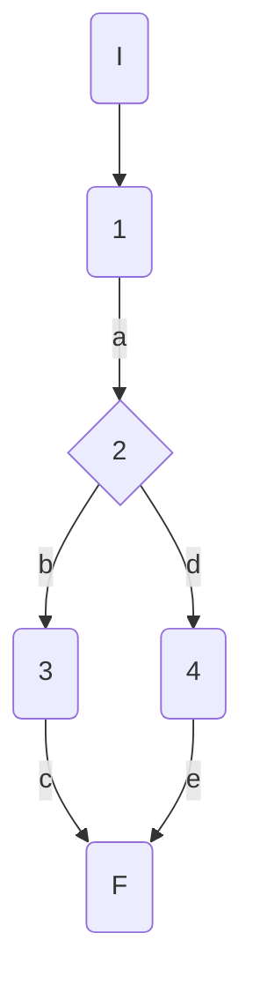
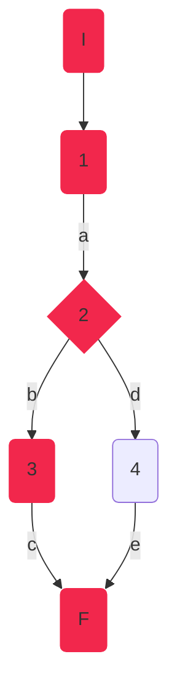
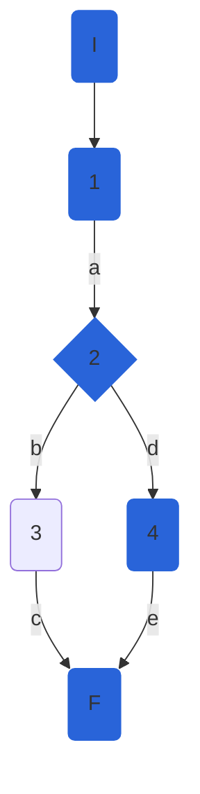

## DisciplineService.UpdateDisciplineAsync

### Código

```csharp
public async Task<DisciplineModel> UpdateDisciplineAsync(int disciplineId, DisciplineModel discipline)
        {
            await GetDisciplineAsync(disciplineId);
            var disciplineEntity = _mapper.Map<DisciplineEntity>(discipline);           
            await _athleteRepository.UpdateDisciplineAsync(disciplineId, disciplineEntity);

            var result = await _athleteRepository.SaveChangesAsync();//1
            if (result)//2
            {
                disciplineEntity.Id = disciplineId;
                return _mapper.Map<DisciplineModel>(disciplineEntity);//3
            }
            throw new Exception("Database Error");//4
        }
```

### Grafo



### Complejidad ciclo matica

Numero de regiones
$$
v(G) = R \\
v(G) = 2
$$

Numero de nodos y aristas
$$
v(G) = E - N + 2 \\
v(G) = 6 - 6 + 2
$$
  
Numero de decisiones
$$
v(G) = P + 1 \\
v(G) = 1 + 1
$$

### Casos de prueba


| | Camino   | Entrada   | TC | Salida  |
| --- | --- | --- | --- | --- |
| 1 | I-1a-2b-3c-F | `disciplineId`=1 `discipline` new DisciplineModel() { Id = 1, Name = "Triple Jump", MaleWorldRecord = 15.95m }; | RepositoryMock.UpdateDisciplineAsync(1,discipline)->returns true, RepositoryMock.GetDiscipline(1) -> returns { Id = 1, Name = "Long Jump", MaleWorldRecord = 8.95m }, RepositoryMock.SaveChangesAsync returns true -> result=true  | new DisciplineModel() { Id = 1, Name = "Triple Jump", MaleWorldRecord = 15.95m } |

| 2 | I-1a-2b-4e-F | `disciplineId`=1 `discipline` new DisciplineModel() { Id = 1, Name = "Triple Jump", MaleWorldRecord = 15.95m }; | RepositoryMock.UpdateDisciplineAsync(1,discipline)->returns true, RepositoryMock.GetDiscipline(1) -> returns { Id = 1, Name = "Long Jump", MaleWorldRecord = 8.95m }, RepositoryMock.SaveChangesAsync returns false -> result=false  | throws Exception("Database Error") |

TC1: verificar que si hay error de base de datos al crear una disciplina, se lance una excepción con el mensaje "Database error".

TC2: verificar que se cree una disciplina con {Name="Long Jump"}, se cree correctamente y se agregue un id : { Id=0, Name = "Long Jump"}

Camino 1

Camino 2

### Pruebas unitarias

```csharp
//DisciplineService.UpdateDisciplineAsync
        //tc1
        [Fact]
        public async Task UpdateDisciplineAsync_ReturnsTrue()
        {
            var config = new MapperConfiguration(cfg => cfg.AddProfile<AutomapperProfile>());
            var mapper = config.CreateMapper();
            var disciplineId = 1;
            var disciplineEntityBeforeChanges = new DisciplineEntity() { Id = 1, Name = "Long Jump", MaleWorldRecord = 8.95m };
            var disciplineEntity = new DisciplineEntity() { Id = 1, Name = "Triple Jump", MaleWorldRecord = 15.95m };
            var disciplineModel = new DisciplineModel() { Id = 1, Name = "Triple Jump", MaleWorldRecord = 15.95m };
            var repositoryMock = new Mock<IAthleteRepository>();
            repositoryMock.Setup(r => r.UpdateDisciplineAsync(1, disciplineEntity)).ReturnsAsync(true);
            repositoryMock.Setup(r => r.SaveChangesAsync()).ReturnsAsync(true);
            repositoryMock.Setup(r => r.GetDisciplineAsync(1, false)).ReturnsAsync(disciplineEntityBeforeChanges);

            var disciplinesService = new DisciplineService(repositoryMock.Object, mapper);
            var updatedDiscipline = await disciplinesService.UpdateDisciplineAsync(disciplineId, disciplineModel);

            Assert.NotNull(updatedDiscipline);
            Assert.Equal("Triple Jump", updatedDiscipline.Name);
            Assert.Equal(15.95m, updatedDiscipline.MaleWorldRecord);
        }
        //tc2
        [Fact]
        public void UpdateDisciplineAsync_FailSaveChangesInRepository_ThrowsException()
        {
            var config = new MapperConfiguration(cfg => cfg.AddProfile<AutomapperProfile>());
            var mapper = config.CreateMapper();
            var disciplineId = 1;
            var disciplineEntityBeforeChanges = new DisciplineEntity() { Id = 1, Name = "Long Jump", MaleWorldRecord = 8.95m };
            var disciplineEntity = new DisciplineEntity() { Id = 1, Name = "Triple Jump", MaleWorldRecord = 8.95m };
            var disciplineModel = new DisciplineModel() { Id = 1, Name = "Triple Jump", MaleWorldRecord = 8.95m };
            var repositoryMock = new Mock<IAthleteRepository>();
            repositoryMock.Setup(r => r.UpdateDisciplineAsync(1, disciplineEntity)).ReturnsAsync(true);
            repositoryMock.Setup(r => r.SaveChangesAsync()).ReturnsAsync(false);
            repositoryMock.Setup(r => r.GetDisciplineAsync(1, false)).ReturnsAsync(disciplineEntityBeforeChanges);

            var disciplinesService = new DisciplineService(repositoryMock.Object, mapper);            
            var exception = Assert.ThrowsAsync<Exception>(async () => await disciplinesService.UpdateDisciplineAsync(disciplineId, disciplineModel));
            Assert.Equal("Database Error", exception.Result.Message);
        }
```