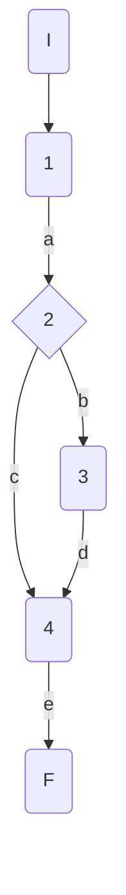
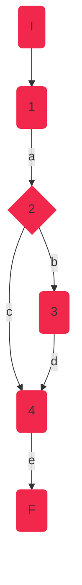

## DisciplineService.CheckPersonalBest
### Código

```csharp
public bool CheckPersonalBest(AthleteModel athlete, Decimal mark, string discipline)
    {
        Console.WriteLine(_markComparer);
        var f = _markComparer[discipline];
        bool personalBest = f(athlete.PersonalBest, mark);//1
        if (personalBest)//2
        {
            athlete.PersonalBest = mark;//3
        }
        return personalBest;//4
    }
  
```

### Grafo



### Complejidad ciclo matica

Numero de regiones
$$
v(G) = R \\
v(G) = 2
$$

Numero de nodos y aristas
$$
v(G) = E - N + 2 \\
v(G) = 6 - 6 + 2
$$
  
Numero de decisiones
$$
v(G) = P + 1 \\
v(G) = 1 + 1
$$

### Casos de prueba

athlete, mark, discipline

| | Camino   | Entrada   | TC | Salida  |
| --- | --- | --- | --- | --- |
| 1 | I-1a-2c-4e-F | `athlete`= {Id=1,Nationality="USA", Name="Sydney Maclaughlin", Gender="f", Points=1000, PB=52.75m} `mark`=53.05m `discipline`="400MH"| personalBest = false| false|
| 2 | I-1a-2b-3d-4e-F | `athlete`={Id=1,Nationality="USA", Name="Sydney Maclaughlin", Gender="f", Points=1000, PB=52.75m}`mark`=51.79m `discipline`="400MH"| personalBest = true| true|

TC1: Verificar que si la atleta {Id=1,Nationality="USA", Name="Sydney Maclaughlin", Gender="f", Points=1000, PB=52.75m} tiene una marca = 53.05, sin superar su marca personal, devuelva false

TC2: Verificar que si la atleta {Id=1,Nationality="USA", Name="Sydney Maclaughlin", Gender="f", Points=1000, PB=52.75m} tiene una marca = 51.79, superando su mejor marca personal, devuelva true

Camino 1

Camino 2
```mermaid
graph TD
    I(I):::c2 --> 1(1):::c2
    1 --a--> 2{2}:::c2
    2 --b--> 3(3)
    2 --c--> 4(4):::c2
    3 --d--> 4(4)
    4 --e--> F(F):::c2
classDef c2 fill:#2964D9, stroke:#2964D9;

### Pruebas unitarias

```csharp
//tc1
        [Fact]
        public void CheckPersonalBest_NoPersonalBest()
        {
            var config = new MapperConfiguration(cfg => cfg.AddProfile<AutomapperProfile>());
            var mapper = config.CreateMapper();
            var sydney = new AthleteModel()
            {
                Id=1,Nationality="USA", Name="Sydney Maclaughlin", Gender=Gender.F, Points=1000, PersonalBest=52.75m
            };
            var mark = 53.05m;
            string discipline = "400MH";
            var repositoryMock = new Mock<IAthleteRepository>();
            var disciplinesService = new DisciplineService(repositoryMock.Object, mapper);

            var result = disciplinesService.CheckPersonalBest(sydney,mark, discipline);
            Assert.False(result);            
        }

        //tc2
        [Fact]
        public void CheckPersonalBest_PersonalBest()
        {
            var config = new MapperConfiguration(cfg => cfg.AddProfile<AutomapperProfile>());
            var mapper = config.CreateMapper();
            var sydney = new AthleteModel()
            {
                Id = 1,
                Nationality = "USA",
                Name = "Sydney Maclaughlin",
                Gender = Gender.F,
                Points = 1000,
                PersonalBest = 52.75m
            };
            var mark = 51.79m;
            string discipline = "400MH";
            var repositoryMock = new Mock<IAthleteRepository>();
            var disciplinesService = new DisciplineService(repositoryMock.Object, mapper);

            var result = disciplinesService.CheckPersonalBest(sydney, mark, discipline);
            Assert.True(result);
        }
```