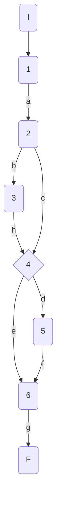
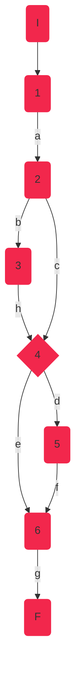
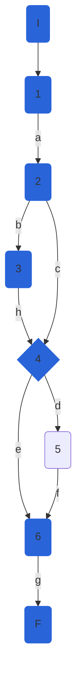
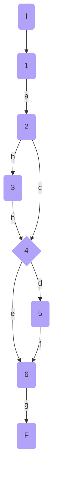

## DisciplineService.CheckSeasonBest

### Código

```csharp
public bool CheckSeasonBest(AthleteModel athlete, Decimal mark, string discipline)
    {
        bool seasonBest = _markComparer[discipline](athlete.SeasonBest, mark);//1
        if (athlete.SeasonBest == null)//2
        {
            seasonBest = true;//3
        }
        if (seasonBest)//4
        {
            athlete.SeasonBest = mark;//5
        }
        return seasonBest;//6
    }
  
```

### Grafo



### Complejidad ciclo matica

Numero de regiones
$$
v(G) = R \\
v(G) = 3
$$

Numero de nodos y aristas
$$
v(G) = E - N + 2 \\
v(G) = 9 - 8 + 2
$$
  
Numero de decisiones
$$
v(G) = P + 1 \\
v(G) = 2 + 1
$$

### Casos de prueba

athlete, mark, discipline

| | Camino   | Entrada   | TC | Salida  |
| --- | --- | --- | --- | --- |
| 1 | I-1a-2b-3h-4d-5f-6g-F | `athlete`={Id=1,Nationality='USA', Name='Sydney Maclaughlin', Gender='f', Points=1000, PersonalBest=52.75, SeasonBest=null}`mark`=51.79 `discipline`='400MH'| athlete.SeasonBest=null -> seasonBest = true| true |
| 2 | I-1a-2c-4d-5f-6g-F | `athlete`={Id=1,Nationality='USA', Name='Sydney Maclaughlin', Gender='f', Points=1000, PersonalBest=52.75, SeasonBest=52}`mark`=51.79 `discipline`='400MH'| athlete.SeasonBest!=null -> seasonBet = true| true |
| 3 | I-1a-2c-4e-6g-F | `athlete`={Id=1,Nationality='USA', Name='Sydney Maclaughlin', Gender='f', Points=1000, PersonalBest=52.75, SeasonBest=52}`mark`=52.79 `discipline`='400MH'| athlete.SeasonBest!=null -> seasonBet = false| false |

TC1: Verificar que si la atleta {Id=1,Nationality='USA', Name='Sydney Maclaughlin', Gender='f', Points=1000, PersonalBest=52.75, SeasonBest=null}, inicialmente sin mejor marca de temporada, realiza una marca de 51.79 en la disciplina 400MH, devuelva true

TC2: Verificar que si la atleta {Id=1,Nationality='USA', Name='Sydney Maclaughlin', Gender='f', Points=1000, PersonalBest=52.75, SeasonBest=52}, con mejor marca de temporada 52, realiza una marca de 51.79 en la disciplina 400MH, mejor a su mejor marca de temporada previa, devuelva true

TC3: Verificar que si la atleta {Id=1,Nationality='USA', Name='Sydney Maclaughlin', Gender='f', Points=1000, PersonalBest=52.75, SeasonBest=52}, con mejor marca de temporada 52, realiza una marca de 52.79 en la disciplina 400MH, peor a su mejor marca de temporada previa, devuelva false

Camino 1

Camino 2

Camino 3

### Pruebas unitarias

```csharp
//tc1
        [Fact]
        public void CheckSesasonBest_SeasonBestNull_ReturnsTrue()
        {
            var config = new MapperConfiguration(cfg => cfg.AddProfile<AutomapperProfile>());
            var mapper = config.CreateMapper();
            var sydney = new AthleteModel()
            {
                Id = 1,
                Nationality = "USA",
                Name = "Sydney Maclaughlin",
                Gender = Gender.F,
                Points = 1000,
                PersonalBest = 52.75m,
                SeasonBest = null
            };
            var disciplineName = "400MH";
            var mark = 51.76m;
            var repositoryMock = new Mock<IAthleteRepository>();
            var disciplinesService = new DisciplineService(repositoryMock.Object, mapper);

            var result = disciplinesService.CheckSeasonBest(sydney,mark,disciplineName);
            Assert.True(result);
        }
        //tc2
        [Fact]
        public void CheckSesasonBest_SeasonBestImproved_ReturnsTrue()
        {
            var config = new MapperConfiguration(cfg => cfg.AddProfile<AutomapperProfile>());
            var mapper = config.CreateMapper();
            var sydney = new AthleteModel()
            {
                Id = 1,
                Nationality = "USA",
                Name = "Sydney Maclaughlin",
                Gender = Gender.F,
                Points = 1000,
                PersonalBest = 52m,
                SeasonBest = 51.79m
            };
            var disciplineName = "400MH";
            var mark = 51.76m;
            var repositoryMock = new Mock<IAthleteRepository>();
            var disciplinesService = new DisciplineService(repositoryMock.Object, mapper);

            var result = disciplinesService.CheckSeasonBest(sydney, mark, disciplineName);
            Assert.True(result);
        }

        //tc3
        [Fact]
        public void CheckSesasonBest_SeasonBestNotImproved_ReturnsFalse()
        {
            var config = new MapperConfiguration(cfg => cfg.AddProfile<AutomapperProfile>());
            var mapper = config.CreateMapper();
            var sydney = new AthleteModel()
            {
                Id = 1,
                Nationality = "USA",
                Name = "Sydney Maclaughlin",
                Gender = Gender.F,
                Points = 1000,
                PersonalBest = 52.75m,
                SeasonBest = 52m
            };
            var disciplineName = "400MH";
            var mark = 52.79m;
            var repositoryMock = new Mock<IAthleteRepository>();
            var disciplinesService = new DisciplineService(repositoryMock.Object, mapper);

            var result = disciplinesService.CheckSeasonBest(sydney, mark, disciplineName);
            Assert.False(result);
        }
```