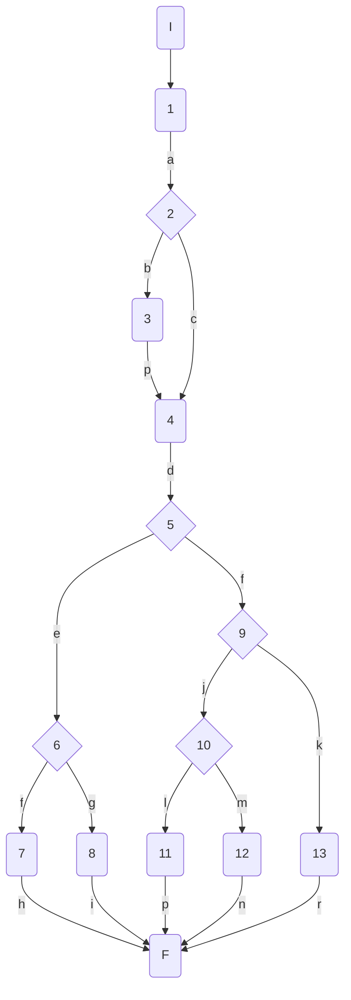
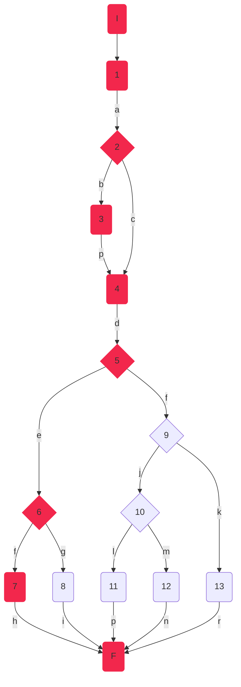
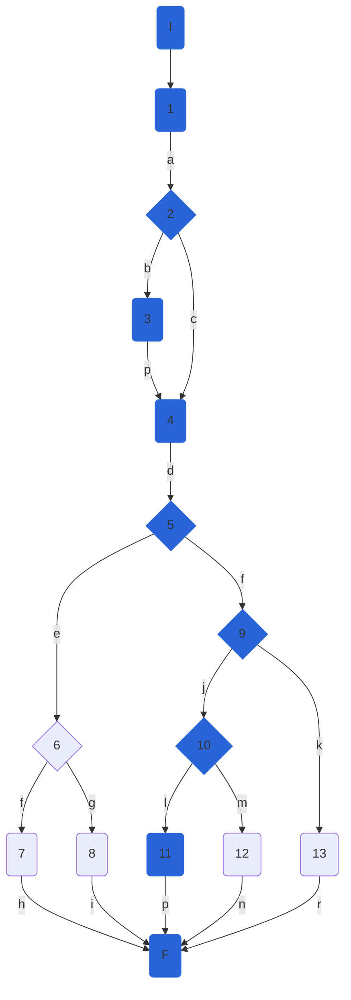
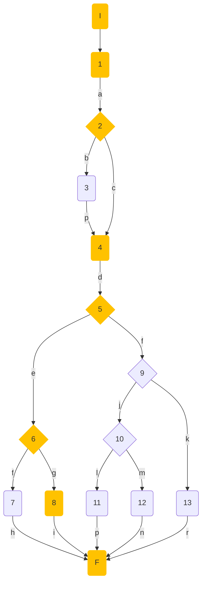
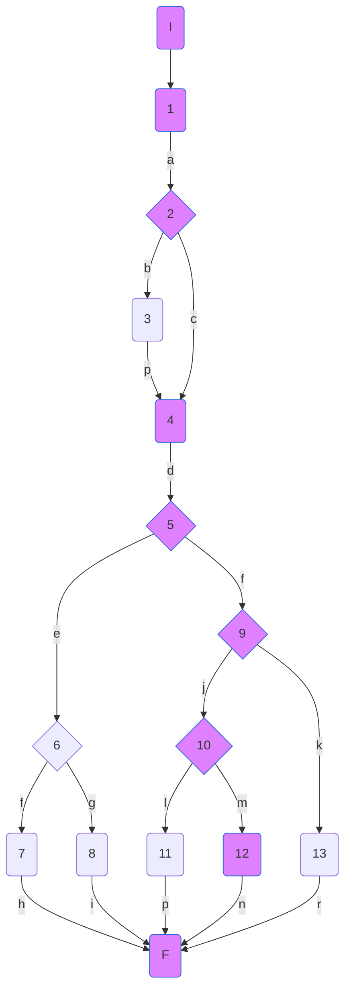
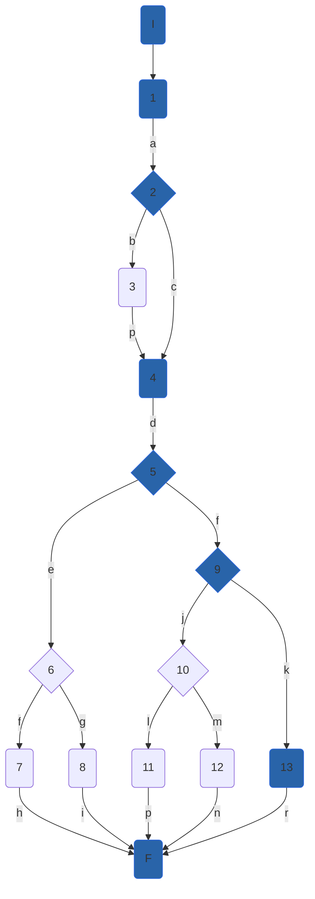

## DisciplineService.checkWorldRecord

### Código

```csharp
bool checkWorldRecord(string gender,DisciplineModel discipline, RaceInfoModel competingResults,out decimal worldRecord)
        {
            var bestMark = competingResults.GetHighestMark();//1
            if (_best3MarksFilter[discipline.Name])//2
            {
                bestMark = competingResults.GetLowestMark();//3
            }
            worldRecord = bestMark;//4
            if (gender.ToLower() == "f")//5
            {
                if (_best3MarksFilter[discipline.Name])//6
                {
                    return discipline.FemaleWorldRecord > bestMark;//7
                }
                return discipline.FemaleWorldRecord < bestMark;//8
            }

            if (gender.ToLower() == "m")//9
            {
                if (_best3MarksFilter[discipline.Name])//10
                {
                    return discipline.MaleWorldRecord > bestMark;//11
                }
                return discipline.MaleWorldRecord < bestMark;//12
            }
            return false;//13

        }
```

### Grafo



### Complejidad ciclo matica

Numero de regiones
$$
v(G) = R \\
v(G) = 6
$$

Numero de nodos y aristas
$$
v(G) = E - N + 2 \\
v(G) = 19 - 15 + 2
$$
  
Numero de decisiones
$$
v(G) = P + 1 \\
v(G) = 5 + 1
$$

### Casos de prueba

| | Camino   | Entrada   | TC | Salida  |
| --- | --- | --- | --- | --- |
| 1 | I-1a-2b-3p-4d-5e-6f-7h-F | `discipline`= {Id=1, Name="400MH", FemaleWorldRecord=51.9m}, `gender`="f", `competingResults` = new List<RaceAthleteModel>(){
                        new RaceAthleteModel(){ Id = 1,Country = "USA", Name = "Sydney Maclaughlin", Mark=51.8m, PB=true, SB=true},
                        new RaceAthleteModel(){ Id = 2,Country = "USA", Name = "Allyson Felix", Mark=52.98m, PB=false, SB=true},
                        new RaceAthleteModel(){ Id = 3,Country = "Netherlands", Name = "Femke Bol", Mark=53.8m, PB=false, SB=false}
                    } | _best3MarksFilter["400MH"]==true -> true, gender.ToLower=="f"->true, _best3MarksFilter["400MH"]==true -> true | return 51.9>51.8 = true |  
| 2 | I-1a-2b-3p-4d-5f-9j-10l-11p-F |  `discipline`= {Id=1, Name="100M", MaleWorldRecord= 9.19m}, `gender`="m", `competingResults` = new List<RaceAthleteModel>(){
                        new RaceAthleteModel(){ Id = 1,Country = "Jamaica", Name = "Usain Bolt", Mark=9.5m, PB=false, SB=true},
                        new RaceAthleteModel(){ Id = 2,Country = "Jamaica", Name = "Johann Blake", Mark=10.2m, PB=false, SB=true},
                        new RaceAthleteModel(){ Id = 3,Country = "Italy", Name = "Lamont Marcell Jacobs", Mark=9.9m, PB=true, SB=false}
                    } | _best3MarksFilter["100M"]==true -> true, gender.ToLower=="f"->false,gender.ToLower=="m"->true, _best3MarksFilter["100M"]==true ->true | return 9.19>9.5 = false | 
| 3 | I-1a-2c-4d-5e-6g-8i-F |  `discipline`= {Id=1, Name="Long Jump", FemaleWorldRecord = 7.52m}, `gender`="f", `competingResults` new List<RaceAthleteModel>(){
                        new RaceAthleteModel(){ Id = 1,Country = "USA", Name = "Tara Davis", Mark=7.44m, PB=true, SB=true},
                        new RaceAthleteModel(){ Id = 2,Country = "USA", Name = "Brittney Reese", Mark=7.35m, PB=false, SB=true},
                        new RaceAthleteModel(){ Id = 3,Country = "Netherlands", Name = "Jackie Joyner-Kersee", Mark=7.28m, PB=false, SB=false}
                    } | _best3MarksFilter["Long Jump"]==true -> false, gender.ToLower=="f"->false,gender.ToLower=="m"->true, _best3MarksFilter["100M"]==true -> false | return 7.52<7.44 = false |  
| 4 | I-1a-2c-4d-5e-6g-8i-F |  `discipline`= {Id=1, Name="Long Jump", MaleWorldRecord="8.95"}, `gender`="m", `competingResults` new List<RaceAthleteModel>(){
                        new RaceAthleteModel(){ Id = 1,Country = "Greece", Name = "Tentoglou Miltiadis", Mark=8.98m, PB=true, SB=true},
                        new RaceAthleteModel(){ Id = 2,Country = "Cuba", Name = "Juan Miguel Echevarria", Mark=9.76m, PB=false, SB=true},
                        new RaceAthleteModel(){ Id = 3,Country = "Spain", Name = "Eusebio Cáceres", Mark=8.46m, PB=false, SB=false}
                    }|_best3MarksFilter["Long Jump"]==true -> false, gender.ToLower=="f"->false,gender.ToLower=="m"->true, _best3MarksFilter["Long Jump"]==true -> false | return 7.95<8.98= true |  
                                   
| 5 | I-1a-2d-4e-5f-9r-13r-F |  `discipline`= {Id=1, Name="Long Jump", MaleWorldRecord="m"}, `gender`="all", `competingResults` new List<RaceAthleteModel>(){};{ |_best3MarksFilter["Long Jump"]==true -> false, gender.ToLower=="f"->false,gender.ToLower=="m"->false| return false | 

TC1: Verificar que si los resultados de la competencia son: new List<RaceAthleteModel>(){
    new RaceAthleteModel(){ Id = 1,Country = "USA", Name = "Sydney Maclaughlin", Mark=51.8m, PB=true, SB=true},
    new RaceAthleteModel(){ Id = 2,Country = "USA", Name = "Allyson Felix", Mark=52.98m, PB=false, SB=true},
    new RaceAthleteModel(){ Id = 3,Country = "Netherlands", Name = "Femke Bol", Mark=53.8m, PB=false, SB=false}
} para la disciplina  {Id=1, Name="400MH", FemaleWorldRecord=51.9m}, con la mejor marca de 51.8 superando al record mundial femenino de 51.9, devuelva true.

TC2: Verificar que si los resultados de la competencia son: new List<RaceAthleteModel>(){
    new RaceAthleteModel(){ Id = 1,Country = "Jamaica", Name = "Usain Bolt", Mark=9.5m, PB=false, SB=true},
    new RaceAthleteModel(){ Id = 2,Country = "Jamaica", Name = "Johann Blake", Mark=10.2m, PB=false, SB=true},
    new RaceAthleteModel(){ Id = 3,Country = "Italy", Name = "Lamont Marcell Jacobs", Mark=9.9m, PB=true, SB=false}
} para la disciplina  {Id=1, Name="100M", MaleWorldRecord= 9.19m}, con la mejor marca de 9.5 sin superar al record mundial masculino de 9.19, devuelva false.

TC3: Verificar que si los resultados de la competencia son: new List<RaceAthleteModel>(){
    new RaceAthleteModel(){ Id = 1,Country = "USA", Name = "Tara Davis", Mark=7.44m, PB=true, SB=true},
    new RaceAthleteModel(){ Id = 2,Country = "USA", Name = "Brittney Reese", Mark=7.35m, PB=false, SB=true},
    new RaceAthleteModel(){ Id = 3,Country = "Netherlands", Name = "Jackie Joyner-Kersee", Mark=7.28m, PB=false, SB=false}
} para la disciplina  {Id=1, Name="Long Jump", FemaleWorldRecord = 7.52m}, con la mejor marca de 7.44, sin superar al record mundial femenino de 7.52, devuelva false.

TC4: Verificar que si los resultados de la competencia son: new List<RaceAthleteModel>(){
    new RaceAthleteModel(){ Id = 1,Country = "Greece", Name = "Tentoglou Miltiadis", Mark=8.98m, PB=true, SB=true},
    new RaceAthleteModel(){ Id = 2,Country = "Cuba", Name = "Juan Miguel Echevarria", Mark=9.76m, PB=false, SB=true},
    new RaceAthleteModel(){ Id = 3,Country = "Spain", Name = "Eusebio Cáceres", Mark=8.46m, PB=false, SB=false}
} para la disciplina {Id=1, Name="Long Jump", MaleWorldRecord="8.95"}, con la mejor marca de 9.76, devuelva true

TC5: Verificar que si el género es all, la disciplina es {Id=1, Name="400MH", FemaleWorldRecord=51.9m} y los resultados de competencia están vacíos (new List<RaceAthleteModel>()), se devuelva false

Camino 1

Camino 2

Camino 3

Camino 4

Camino 5

### Pruebas unitarias

```csharp
//CheckWorldRecord
        //tc1
        [Fact]
        public void CheckWorldRecord_400MHW_ReturnsTrue()
        {
            var config = new MapperConfiguration(cfg => cfg.AddProfile<AutomapperProfile>());
            var mapper = config.CreateMapper();
            var discipline = new DisciplineModel() { Id = 1, Name = "400MH", FemaleWorldRecord = 51.9m };
            var gender = "f";
            var competingResults = new RaceInfoModel(new List<RaceAthleteModel>(){
                        new RaceAthleteModel(){ Id = 1,Country = "USA", Name = "Sydney Maclaughlin", Mark=51.8m, PB=true, SB=true},
                        new RaceAthleteModel(){ Id = 2,Country = "USA", Name = "Allyson Felix", Mark=52.98m, PB=false, SB=true},
                        new RaceAthleteModel(){ Id = 3,Country = "Netherlands", Name = "Femke Bol", Mark=53.8m, PB=false, SB=false} }
                        );
            var repositoryMock = new Mock<IAthleteRepository>();
            var disciplinesService = new DisciplineService(repositoryMock.Object, mapper);
            var worldRecord = -1m;
            var result = disciplinesService.checkWorldRecord(gender, discipline, competingResults, out worldRecord);

            Assert.True(result);
            Assert.NotEqual(-1, worldRecord);
            Assert.Equal(51.8m, worldRecord);            
        }

        //tc2
        [Fact]
        public void CheckWorldRecord_100MM_ReturnsFalse()
        {
            var config = new MapperConfiguration(cfg => cfg.AddProfile<AutomapperProfile>());
            var mapper = config.CreateMapper();
            var discipline = new DisciplineModel() { Id = 1, Name = "100M", MaleWorldRecord = 9.19m };
            var gender = "m";
            var competingResults = new RaceInfoModel(new List<RaceAthleteModel>(){
                        new RaceAthleteModel(){ Id = 1,Country = "Jamaica", Name = "Usain Bolt", Mark=9.5m, PB=false, SB=true},
                        new RaceAthleteModel(){ Id = 2,Country = "Jamaica", Name = "Johann Blake", Mark=10.2m, PB=false, SB=true},
                        new RaceAthleteModel(){ Id = 3,Country = "Italy", Name = "Lamont Marcell Jacobs", Mark=9.9m, PB=true, SB=false}
                    });
            var repositoryMock = new Mock<IAthleteRepository>();
            var disciplinesService = new DisciplineService(repositoryMock.Object, mapper);
            var bestMark = -1m;
            var result = disciplinesService.checkWorldRecord(gender, discipline, competingResults, out bestMark);

            Assert.False(result);
            Assert.NotEqual(-1, bestMark);
            Assert.Equal(9.5m, bestMark);
        }

        //tc3
        [Fact]
        public void CheckWorldRecord_LongJumpW_ReturnsFalse()
        {
            var config = new MapperConfiguration(cfg => cfg.AddProfile<AutomapperProfile>());
            var mapper = config.CreateMapper();
            var discipline = new DisciplineModel() { Id = 1, Name = "Long Jump", FemaleWorldRecord = 7.52m };
            var gender = "f";
            var competingResults = new RaceInfoModel(new List<RaceAthleteModel>(){
                        new RaceAthleteModel(){ Id = 1,Country = "USA", Name = "Tara Davis", Mark=7.44m, PB=true, SB=true},
                        new RaceAthleteModel(){ Id = 2,Country = "USA", Name = "Brittney Reese", Mark=7.35m, PB=false, SB=true},
                        new RaceAthleteModel(){ Id = 3,Country = "Netherlands", Name = "Jackie Joyner-Kersee", Mark=7.28m, PB=false, SB=false}
                    });
            var repositoryMock = new Mock<IAthleteRepository>();
            var disciplinesService = new DisciplineService(repositoryMock.Object, mapper);
            var bestMark = -1m;
            var result = disciplinesService.checkWorldRecord(gender, discipline, competingResults, out bestMark);

            Assert.False(result);
            Assert.NotEqual(-1, bestMark);
            Assert.Equal(7.44m, bestMark);
        }

        //tc4
        [Fact]
        public void CheckWorldRecord_LongJumpM_ReturnsFalse()
        {
            var config = new MapperConfiguration(cfg => cfg.AddProfile<AutomapperProfile>());
            var mapper = config.CreateMapper();
            var discipline = new DisciplineModel() { Id = 1, Name = "Long Jump", MaleWorldRecord = 8.95m };
            var gender = "m";
            var competingResults = new RaceInfoModel(new List<RaceAthleteModel>(){
                        new RaceAthleteModel(){ Id = 1,Country = "Greece", Name = "Tentoglou Miltiadis", Mark=8.98m, PB=true, SB=true},
                        new RaceAthleteModel(){ Id = 2,Country = "Cuba", Name = "Juan Miguel Echevarria", Mark=8.76m, PB=false, SB=true},
                        new RaceAthleteModel(){ Id = 3,Country = "Spain", Name = "Eusebio Cáceres", Mark=8.46m, PB=false, SB=false}
                    });
            var repositoryMock = new Mock<IAthleteRepository>();
            var disciplinesService = new DisciplineService(repositoryMock.Object, mapper);
            var bestMark = -1m;
            var result = disciplinesService.checkWorldRecord(gender, discipline, competingResults, out bestMark);

            Assert.True(result);
            Assert.NotEqual(-1, bestMark);
            Assert.Equal(8.98m, bestMark);
        }

        //tc4
        [Fact]
        public void CheckWorldRecord_InvalidGender_ReturnsFalse()
        {
            var config = new MapperConfiguration(cfg => cfg.AddProfile<AutomapperProfile>());
            var mapper = config.CreateMapper();
            var discipline = new DisciplineModel() { Id = 1, Name = "Long Jump", MaleWorldRecord = 8.95m };
            var gender = "all";
            var competingResults = new RaceInfoModel(new List<RaceAthleteModel>(){
                        new RaceAthleteModel(){ Id = 1,Country = "Greece", Name = "Tentoglou Miltiadis", Mark=8.98m, PB=true, SB=true},
                        new RaceAthleteModel(){ Id = 2,Country = "Cuba", Name = "Juan Miguel Echevarria", Mark=8.76m, PB=false, SB=true},
                        new RaceAthleteModel(){ Id = 3,Country = "Spain", Name = "Eusebio Cáceres", Mark=8.46m, PB=false, SB=false}
                    });
            var repositoryMock = new Mock<IAthleteRepository>();
            var disciplinesService = new DisciplineService(repositoryMock.Object, mapper);
            var bestMark = -1m;
            var result = disciplinesService.checkWorldRecord(gender, discipline, competingResults, out bestMark);

            Assert.False(result);            
        }
```