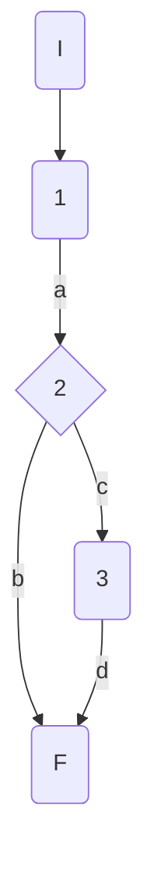
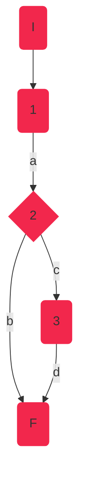
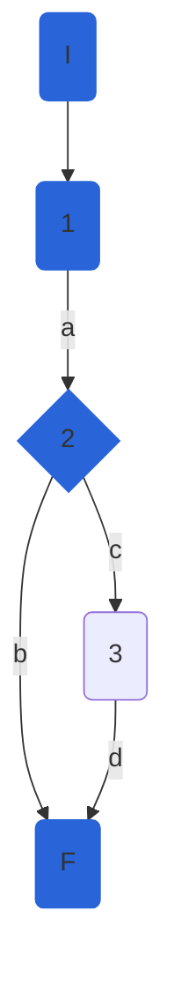

## DisciplineService.updateWorldRecord

### Código incial

```csharp
 async Task updateWorldRecord(int disciplineId,decimal worldRecord, string gender)
    {
        if (gender.ToLower() == "f")//1
        {
            await _athleteRepository.UpdateDisciplineAsync(disciplineId, new DisciplineEntity()
            {
                FemaleWorldRecord = worldRecord
            });//2
        }
        else
        {
            await _athleteRepository.UpdateDisciplineAsync(disciplineId, new DisciplineEntity()
            {
                MaleWorldRecord = worldRecord
            });//3
        }
    }
```
## NOTA: 
    Este método no devolvía ningún valor, por lo tanto, para poder probarlo y garantizar que funcione correctamente, se convirtió este método a bool. Para poder realizar este cambio, se realizó el cambio correspondiente en el repositorio, ya que el resultado dependía del mismo y este también era de tipo void. Los cambios realizados se muestran a continuación:

## REPOSITORIO:
```csharp
public async Task<bool> UpdateDisciplineAsync(int disciplineId, DisciplineEntity discipline)
        {
            //_dbContext.Entry(discipline).State = EntityState.Modified;
            bool updated = true;
            var disciplineToUpdate = await _dbContext.Disciplines.FirstOrDefaultAsync(d => d.Id == disciplineId);
            if (disciplineToUpdate == null) updated = false;
            
            disciplineToUpdate.Name = discipline.Name ?? disciplineToUpdate.Name;
            disciplineToUpdate.Rules = discipline.Rules ?? disciplineToUpdate.Rules;
            disciplineToUpdate.CreationDate = discipline.CreationDate ?? disciplineToUpdate.CreationDate;
            disciplineToUpdate.FemaleWorldRecord = discipline.FemaleWorldRecord ?? disciplineToUpdate.FemaleWorldRecord;
            disciplineToUpdate.MaleWorldRecord = discipline.MaleWorldRecord ?? disciplineToUpdate.MaleWorldRecord;
             
            return updated;
           
        }
    
```

## SERVICIO (MÉTODO CORREGIDO):
```csharp
async Task<bool> updateWorldRecord(int disciplineId,decimal worldRecord, string gender)
        {
            bool updated = false;
            if (gender.ToLower() == "f")
            {
                updated = await _athleteRepository.UpdateDisciplineAsync(disciplineId, new DisciplineEntity()
                {
                    FemaleWorldRecord = worldRecord
                });

            }
            else
            {
                updated = await _athleteRepository.UpdateDisciplineAsync(disciplineId, new DisciplineEntity()
                {
                    MaleWorldRecord = worldRecord
                });
            }
            return updated;

        }
    
```

### Grafo



### Complejidad ciclo matica

Numero de regiones
$$
v(G) = R \\
v(G) = 2
$$

Numero de nodos y aristas
$$
v(G) = E - N + 2 \\
v(G) = 5 - 5 + 2
$$
  
Numero de decisiones
$$
v(G) = P + 1 \\
v(G) = 1 + 1
$$

### Casos de prueba

| | Camino   | Entrada   | TC | Salida  |
| --- | --- | --- | --- | --- |
| 1 | I-1a-2c-3d-F | `disciplineId`=1 `worldRecord`=51.7 `gender`='f' | gender.ToLower() == "f" = true| true |
| 2 | I-1a-2b-F | `disciplineId`=1 `worldRecord`=51.7 `gender`='m' | gender.ToLower() == "f" = false| true |

TC1: Verificar que si se actualiza el record mundial de género femenino, y no se actualiza correctamente en la base de datos, devuelva false

TC2: Verificar que si se actualiza el record mundial de género masculino, y no se actualiza correctamente en la base de datos, devuelva false

Camino 1

Camino 2

### Pruebas unitarias
Primero se realizaron 2 pruebas unitarias para esta parte:
```csharp
//tc1
        [Fact]
        public async Task UpdateWorldRecord_ReturnsTrue()
        {
            var config = new MapperConfiguration(cfg => cfg.AddProfile<AutomapperProfile>());
            var mapper = config.CreateMapper();
            var disciplineId = 1;
            var worldRecord = 51.7m;
            var gender = "f";
            var repositoryMock = new Mock<IAthleteRepository>();
            var disciplinesService = new DisciplineService(repositoryMock.Object, mapper);

            var result = await disciplinesService.updateWorldRecord(disciplineId, worldRecord, gender);
            Assert.False(result);
        }

        //tc2
        [Fact]
        public async Task UpdateWorldRecord_ReturnsFalse()
        {
            var config = new MapperConfiguration(cfg => cfg.AddProfile<AutomapperProfile>());
            var mapper = config.CreateMapper();
            var disciplineId = 1;
            var worldRecord = 51.7m;
            var gender = "m";
            var repositoryMock = new Mock<IAthleteRepository>();
            var disciplinesService = new DisciplineService(repositoryMock.Object, mapper);

            var result = await disciplinesService.updateWorldRecord(disciplineId, worldRecord, gender);
            Assert.False(result);
        }
```
Sin embargo, después de investigar y descubrir el poder de XUnit, se combinaron estas pruebas utilizando el decorador "Theory" en vez de "Fact", que permite agregar entradas a los tests:
```csharp
[Theory]
        [InlineData(1,51.7,"f")] //tc1
        [InlineData(1, 51.7, "m")] //tc2    
        public async Task UpdateWorldRecord_ReturnsTrue(int disciplineId, Decimal worldRecord, string gender)
        {
            var config = new MapperConfiguration(cfg => cfg.AddProfile<AutomapperProfile>());
            var mapper = config.CreateMapper();
            var repositoryMock = new Mock<IAthleteRepository>();
            var disciplinesService = new DisciplineService(repositoryMock.Object, mapper);

            var result = await disciplinesService.updateWorldRecord(disciplineId, worldRecord, gender);
            Assert.False(result);
        } 
```      